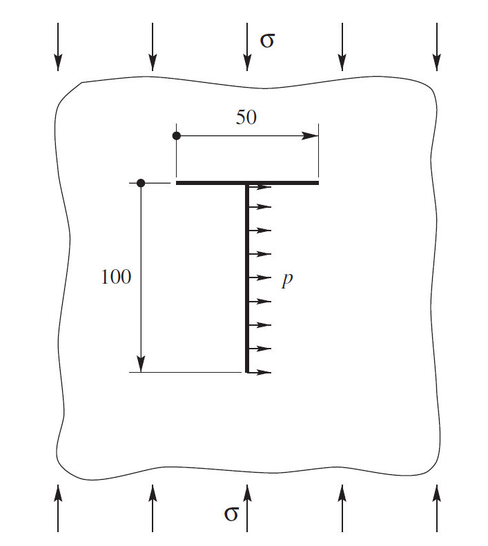
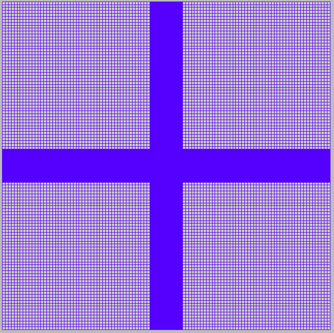
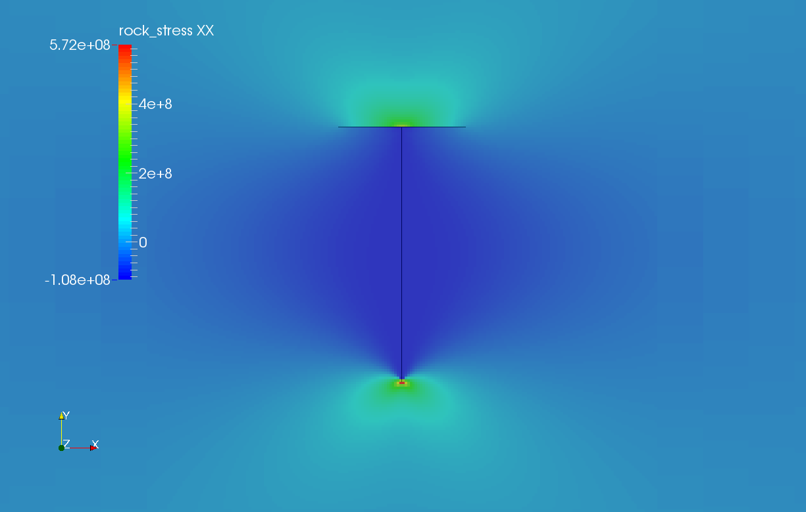
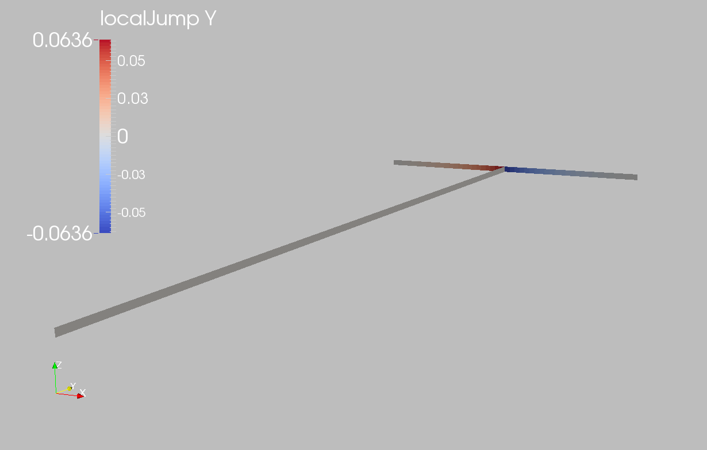

.. _ExampleTFrac:

####################################################
Fracture Intersection Problem
####################################################

**Context**

In this example, two fractures intersecting at a right angle are simulated using a Lagrange contact model in a 2D infinite domain and subjected to a constant uniaxial compressive remote stress. Numerical solutions based on the symmetric-Galerkin boundary element
method `(Phan et al., 2003)  <https://onlinelibrary.wiley.com/doi/10.1002/nme.707>`__ is used to verify the accuracy of the GEOSX results for the normal traction, normal opening, and shear slippage on the fracture surfaces, considering frictional contact and fracture-fracture interaction. In this example, the ``TimeHistory`` function and a Python script are used to output and post-process multi-dimensional data (traction and displacement on the fracture surfaces).

**Input file**

Everything required is contained within two xml files located at:

.. code-block:: console

  inputFiles/lagrangianContactMechanics/ContactMechanics_TFrac_base.xml

.. code-block:: console

  inputFiles/lagrangianContactMechanics/ContactMechanics_TFrac_benchmark.xml

------------------------------------------------------------------
Description of the case
------------------------------------------------------------------

We simulate two intersecting fractures under a remote compressive stress constraint, as shown below. The two fractures sit in an infinite, homogeneous, isotropic, and elastic medium. The vertical fracture is internally pressurized and perpendicularly intersects the middle of the horizontal fracture. A combination of uniaxial compression, frictional contact, and opening of the vertical fracture causes mechanical deformations of the surrounding rock, thus leads to sliding of the horizontal fracture. For verification purposes, a plane strain deformation and Coulomb failure criterion are considered in this numerical model.

.. _problemSketchFig:

   Sketch of the problem `(Phan et al., 2003)  <https://onlinelibrary.wiley.com/doi/10.1002/nme.707>`__

To simulate this problem, we use a Lagrange contact model. Displacement and stress fields on the fracture plane are calculated numerically. Predictions of the normal traction and slip along the sliding fracture and mechanical aperture of the pressurized fracture are compared with the corresponding literature work `(Phan et al., 2003)  <https://onlinelibrary.wiley.com/doi/10.1002/nme.707>`__. 

For this example, we focus on the ``Mesh``,
the ``Constitutive``, and the ``FieldSpecifications`` tags.

------------------------------------------------------------------
Mesh
------------------------------------------------------------------

The following figure shows the mesh used in this problem.

.. _problemSketchFig:

   Generated mesh

This mesh was created using the internal mesh generator as parametrized in the ``InternalMesh`` XML tag. 
The mesh contains 300 x 300 x 1 eight-node brick elements in the x, y, and z directions respectively. 
Such eight-node hexahedral elements are defined as ``C3D8`` elementTypes, and their collection forms a mesh
with one group of cell blocks named here ``cb1``. 

.. literalinclude:: ../../../../../../inputFiles/lagrangianContactMechanics/ContactMechanics_TFrac_benchmark.xml
    :language: xml
    :start-after: <!-- SPHINX_MESH -->
    :end-before: <!-- SPHINX_MESH_END -->

Refinement is necessary to conform with the fracture geometry specified in the ``Geometry`` section.

.. literalinclude:: ../../../../../../inputFiles/lagrangianContactMechanics/ContactMechanics_TFrac_base.xml
    :language: xml
    :start-after: <!-- SPHINX_GEOMETRY -->
    :end-before: <!-- SPHINX_GEOMETRY_END -->

------------------------
Solid mechanics solver
------------------------

GEOSX is a multiphysics simulation platform.
Different combinations of
physics solvers can be applied
in different regions of the domain at different stages of the simulation.
The ``Solvers`` tag in the XML file is used to list and parameterize these solvers.

To specify a coupling between two different solvers, we define and characterize each single-physics solver separately.
Then, we customize a *coupling solver* between these single-physics solvers as an additional solver.
This approach allows for generality and flexibility in constructing multiphysics solvers.
Each single-physics solver should be given a meaningful and distinct name, because GEOSX recognizes these single-physics solvers
by their given names to create the coupling.

To setup a coupling between rock and fracture deformations, we define three different solvers:

- For solving the frictional contact, we define a Lagrangian contact solver, called here ``lagrangiancontact``. In this solver, we specify ``targetRegions`` that include both the continuum region ``Region`` and the discontinuum region ``Fracture``  where the solver is applied to couple rock and fracture deformations. The contact constitutive law used for the fracture elements is named ``fractureMaterial``,  and is defined later in the ``Constitutive`` section. 

- Rock deformations are handled by a solid mechanics solver ``SolidMechanics_LagrangianFEM``. This solid mechanics solver (see :ref:`SolidMechanics_LagrangianFEM`) is based on the Lagrangian finite element formulation. The problem runs in ``QuasiStatic`` mode without inertial effects. The computational domain is discretized by ``FE1``, which is defined in the ``NumericalMethods`` section. The solid material is named ``rock`` and its mechanical properties are specified later in the ``Constitutive`` section.

- The solver ``SurfaceGenerator`` defines the fracture region and rock toughness.

.. literalinclude:: ../../../../../../inputFiles/lagrangianContactMechanics/ContactMechanics_TFrac_base.xml
  :language: xml
  :start-after: <!-- SPHINX_SOLVER -->
  :end-before: <!-- SPHINX_SOLVER_END -->

------------------------------
Constitutive laws
------------------------------

For this problem, we simulate the elastic deformation and fracture slippage caused by the uniaxial compression.
A homogeneous and isotropic domain with one solid material is assumed, and its mechanical properties are specified in the ``Constitutive`` section. 

Fracture surface slippage is assumed to be governed by the Coulomb failure criterion. The contact constitutive behavior is named ``fractureMaterial`` in the ``Coulomb`` block, where cohesion ``cohesion="0.0"`` and friction angle ``frictionAngle="0.523598776"`` are specified. 

.. literalinclude:: ../../../../../../inputFiles/lagrangianContactMechanics/ContactMechanics_TFrac_base.xml
    :language: xml
    :start-after: <!-- SPHINX_MATERIAL -->
    :end-before: <!-- SPHINX_MATERIAL_END -->

Recall that in the ``SolidMechanics_LagrangianFEM`` section, 
``rock`` is the material of the computational domain. 
Here, the isotropic elastic model ``ElasticIsotropic`` is used to simulate the mechanical behavior of ``rock``.

All constitutive parameters such as density, bulk modulus, and shear modulus are specified in the International System of Units.

------------------------------
Time history function
------------------------------

In the ``Tasks`` section, ``PackCollection`` tasks are defined to collect time history information from fields. 
Either the entire field or specified named sets of indices in the field can be collected. 
In this example, ``tractionCollection`` and ``displacementJumpCollection`` tasks are specified to output the local traction ``fieldName="traction"`` and relative displacement ``fieldName="localJump"`` on the fracture surface.

.. literalinclude:: ../../../../../../inputFiles/lagrangianContactMechanics/ContactMechanics_TFrac_base.xml
    :language: xml
    :start-after: <!-- SPHINX_TASKS -->
    :end-before: <!-- SPHINX_TASKS_END -->

These two tasks are triggered using the ``Event`` manager with a ``PeriodicEvent`` defined for these recurring tasks. 
GEOSX writes two files named after the string defined in the ``filename`` keyword and formatted as HDF5 files (displacementJump_history.hdf5 and traction_history.hdf5). The TimeHistory file contains the collected time history information from each specified time history collector.
This information includes datasets for the simulation time, element center defined in the local coordinate system, and the time history information.
A Python script is used to read and plot any specified subset of the time history data for verification and visualization. 

-----------------------------------------------------------
Initial and boundary conditions
-----------------------------------------------------------

The next step is to specify fields, including:

  - The initial value (the remote compressive stress needs to be initialized),
  - The boundary conditions (traction loaded on the vertical fracture and the constraints of the outer boundaries have to be set).

In this tutorial, we specify an uniaxial vertical stress ``SigmaY`` (:math:`\sigma_y` = -1.0e8 Pa). 
A compressive traction ``NormalTraction`` (:math:`P_in` = -1.0e8 Pa) is applied at the surface of vertical fracture.
The remaining parts of the outer boundaries are subjected to roller constraints.  
These boundary conditions are set up through the ``FieldSpecifications`` section.

.. literalinclude:: ../../../../../../inputFiles/lagrangianContactMechanics/ContactMechanics_TFrac_base.xml
    :language: xml
    :start-after: <!-- SPHINX_BC -->
    :end-before: <!-- SPHINX_BC_END -->

Note that the remote stress and internal fracture pressure has a negative value, due to the negative sign convention for compressive stresses in GEOSX. 

 
The parameters used in the simulation are summarized in the following table.

+------------------+-------------------------+------------------+--------------------+
| Symbol           | Parameter               | Unit             | Value              |
+==================+=========================+==================+====================+
| :math:`K`        | Bulk Modulus            | [GPa]            | 38.89              |
+------------------+-------------------------+------------------+--------------------+
| :math:`G`        | Shear Modulus           | [GPa]            | 29.17              |
+------------------+-------------------------+------------------+--------------------+
| :math:`\sigma_y` | Remote Stress           | [MPa]            | -100.0             |
+------------------+-------------------------+------------------+--------------------+
| :math:`P_in`     | Internal Pressure       | [MPa]            | -100.0             |
+------------------+-------------------------+------------------+--------------------+
| :math:`\theta`   | Friction Angle          | [Degree]         | 30.0               |
+------------------+-------------------------+------------------+--------------------+
| :math:`L_h`      | Horizontal Frac Length  | [m]              | 50.0               |
+------------------+-------------------------+------------------+--------------------+
| :math:`L_v`      | Vertical Frac Length    | [m]              | 100.0              |
+------------------+-------------------------+------------------+--------------------+

---------------------------------
Inspecting results
---------------------------------

We request VTK-format output files and use Paraview to visualize the results.
The following figure shows the distribution of :math:`\sigma_{xx}` in the computational domain.

.. _problemVerificationFig1:

   Simulation result of :math:`\sigma_{xx}`

The next figure shows the distribution of relative shear displacement values along the surface of two intersected fractures.

.. _problemVerificationFig1:

   Simulation result of fracture slip 

The figure below compares the results from GEOSX (marks) and the corresponding literature reference solution (solid curves) for the normal traction and slip distributions along the horizontal fracture and opening of the vertical fracture. GEOSX reliably captures the mechanical interactions between two intersected fractures and shows excellent agreement with the reference solution. Due to sliding of the horizontal fracture, GEOSX prediction as well as the reference solution on the normal opening of pressurized vertical fracture deviates away from Sneddon's analytical solution, especially near the intersection point. 

.. plot::

    import matplotlib
    import matplotlib.pyplot as plt
    import numpy as np
    import h5py
    import xml.etree.ElementTree as ElementTree
    from mpmath import *
    import math
    from math import sin,cos,tan,exp,atan,asin
    from mpl_toolkits.mplot3d import axes3d 

    class Sneddon:

        def __init__(self, mechanicalParameters, length, pressure):
            K = mechanicalParameters["bulkModulus"]
            G = mechanicalParameters["shearModulus"]
            E = (9 * K * G) / (3*K+G)
            nu = E / (2 * G) - 1

            self.scaling = ( 4 * (1 - nu**2) ) * pressure / E;
            self.halfLength = length;

        def computeAperture(self, x):
            return self.scaling * ( self.halfLength**2  - x**2 )**0.5;

    def getMechanicalParametersFromXML( xmlFilePath ):
        tree = ElementTree.parse(xmlFilePath)

        param = tree.find('Constitutive/ElasticIsotropic')

        mechanicalParameters = dict.fromkeys(["bulkModulus", "shearModulus", "frictionAngle"])
        mechanicalParameters["bulkModulus"] = float(param.get("defaultBulkModulus"))
        mechanicalParameters["shearModulus"] = float(param.get("defaultShearModulus"))

        param = tree.find('Constitutive/Coulomb')
        mechanicalParameters["frictionAngle"] = float(param.get("frictionAngle"))
        return mechanicalParameters

    def getCompressiveStressFromXML( xmlFilePath ):
        tree = ElementTree.parse(xmlFilePath)

        param = tree.findall('FieldSpecifications/FieldSpecification')

        found_stress = False
        for elem in param:
            if elem.get("fieldName") == "rock_stress" and elem.get("component") == "1":
                stress = float(elem.get("scale"))*(-1)
                found_stress = True
            if found_stress: break

        return stress

    def getFracturePressureFromXML( xmlFilePath ):
        tree = ElementTree.parse(xmlFilePath)

        param = tree.findall('FieldSpecifications/Traction')

        found_pressure = False
        for elem in param:
            if elem.get("name") == "NormalTraction" and elem.get("tractionType") == "normal":
                pressure = float(elem.get("scale"))*(-1)
                found_pressure = True
            if found_pressure: break

        return pressure

    def getFractureGeometryFromXML(xmlFilePath):
        tree = ElementTree.parse(xmlFilePath)

        param = tree.findall('Geometry/BoundedPlane')

        for elem in param:
            if elem.get("name") == "fracture1":
                dimensions = elem.get("dimensions")
                dimensions = [float(i) for i in dimensions[1:-1].split(",")]
                length1 = dimensions[0] / 2            
            elif elem.get("name") == "fracture2":
                  dimensions = elem.get("dimensions")
                  dimensions = [float(i) for i in dimensions[1:-1].split(",")]
                  length2 = dimensions[0] / 2

        return length1, length2

    def main():
        # File path
        hdf5File1Path = "traction_history.hdf5"
        hdf5File2Path = "displacementJump_history.hdf5"
        xmlFilePath = "../../../../../../inputFiles/lagrangianContactMechanics/ContactMechanics_TFrac_base.xml"

        # Read HDF5
        # Global Coordinate of Fracture Element Center
        hf = h5py.File(hdf5File1Path, 'r')
        xl = hf.get('traction elementCenter')
        xl = np.array(xl)
        xcord = xl[0,:,0]
        ycord = xl[0,:,1]
        zcord = xl[0,:,2]

        # Local Normal Traction
        trac = hf.get('traction')
        trac = np.array(trac)
        normalTraction = trac[-1,:,0]

        # Local Shear Displacement
        hf = h5py.File(hdf5File2Path, 'r')
        jump = hf.get('localJump')
        jump = np.array(jump)
        displacementJump = jump[-1,:,1]
        aperture = jump[-1,:,0]
 
        # Extract Local Inform for The Horizontal Fracture
        xlist = []    
        tnlist = []
        gtlist = []
        for i in range(0,len(zcord)):
            if abs(ycord[i]/50.0-1.) < 0.01:
               xlist.append(xcord[i])
               tnlist.append(-normalTraction[i]*1.0e-6)
               gtlist.append(displacementJump[i]*1.e3)

        # Extract Local Inform for The Vertical Fracture
        ylist = []
        apertlist = []
        for i in range(0,len(zcord)):
            if abs(xcord[i]-0.) < 0.01:
               ylist.append(ycord[i])
               apertlist.append(aperture[i]*1.e3)    

        # Load numerical solutions from literature work
        r1, tn_literature = np.loadtxt('NormalTraction.txt', skiprows=0, unpack=True)
        r2, gt_literature = np.loadtxt('Slip.txt', skiprows=0, unpack=True)
        r3, ap_literature = np.loadtxt('Aperture.txt', skiprows=0, unpack=True)

        # Extract Mechanical Properties and Fracture Geometry from XML
        mechanicalParameters = getMechanicalParametersFromXML(xmlFilePath)
        compressiveStress = getCompressiveStressFromXML(xmlFilePath)
        length1, length2 = getFractureGeometryFromXML(xmlFilePath)
        appliedPressure = getFracturePressureFromXML(xmlFilePath) 

        # Initialize Sneddon's analytical solution
        sneddonAnalyticalSolution = Sneddon(mechanicalParameters, length1, appliedPressure)

        # Plot analytical (continuous line) and numerical (markers) aperture solution
        x_analytical = np.linspace(-length1, length1, 101, endpoint=True)
        aperture_analytical = np.empty(len(x_analytical))
        i=0
        for xCell in x_analytical:
            aperture_analytical[i] = sneddonAnalyticalSolution.computeAperture( xCell )
            i += 1
    
   
        fsize = 30
        msize = 12
        lw=6
        fig, ax = plt.subplots(2,2,figsize=(32, 18))
        cmap = plt.get_cmap("tab10")
    
        ax[0,0].plot(r1-length2, tn_literature, color=cmap(-1), label='Phan et al.(2003)', lw=lw)
        ax[0,0].plot(xlist, tnlist, 'o', alpha=0.6, color=cmap(2), mec = 'k', label='GEOSX Results', markersize=msize)    
        ax[0,0].grid()    
        ax[0,0].set_xlabel('Horizontal Frac Length [m]', size=fsize, weight="bold")
        ax[0,0].set_ylabel('Normal Traction [MPa]', size=fsize, weight="bold")
        ax[0,0].legend(loc='lower left',fontsize=fsize*0.8)
        ax[0,0].xaxis.set_tick_params(labelsize=fsize)
        ax[0,0].yaxis.set_tick_params(labelsize=fsize)

        ax[0,1].plot(r2-length2, gt_literature, color=cmap(-1), label='Phan et al.(2003)', lw=lw)
        ax[0,1].plot(xlist, gtlist, 'o', alpha=0.6, color=cmap(2), mec = 'k', label='GEOSX Results', markersize=msize)
        ax[0,1].grid()    
        ax[0,1].set_xlabel('Horizontal Frac Length [m]', size=fsize, weight="bold")
        ax[0,1].set_ylabel('Slip [mm]', size=fsize, weight="bold")
        ax[0,1].legend(loc='lower left',fontsize=fsize*0.8)
        ax[0,1].xaxis.set_tick_params(labelsize=fsize)
        ax[0,1].yaxis.set_tick_params(labelsize=fsize)

        N1=2
        ax[1,0].plot(-r3+length1, ap_literature, color=cmap(-1), label='Phan et al.(2003)', lw=lw)
        ax[1,0].plot(ylist[0::N1], apertlist[0::N1], 'o', alpha=0.6, color=cmap(2), mec = 'k', label='GEOSX Results', markersize=msize)
        ax[1,0].plot(x_analytical, aperture_analytical*1.0e3, '--', color=cmap(1), label='Sneddon Solution', lw=lw)
        ax[1,0].grid()
        ax[1,0].set_xlabel('Vertical Frac Length [m]', size=fsize, weight="bold")
        ax[1,0].set_ylabel('Aperture [mm]', size=fsize, weight="bold")
        ax[1,0].legend(loc='lower right',fontsize=fsize*0.8)
        ax[1,0].xaxis.set_tick_params(labelsize=fsize)
        ax[1,0].yaxis.set_tick_params(labelsize=fsize)
   
        ax[1,1].axis('off')    
        
        plt.show()

    if __name__ == "__main__":
        main()

------------------------------------------------------------------
To go further
------------------------------------------------------------------

**Feedback on this example**

For any feedback on this example, please submit a `GitHub issue on the project's GitHub page <https://github.com/GEOSX/GEOSX/issues>`_.

