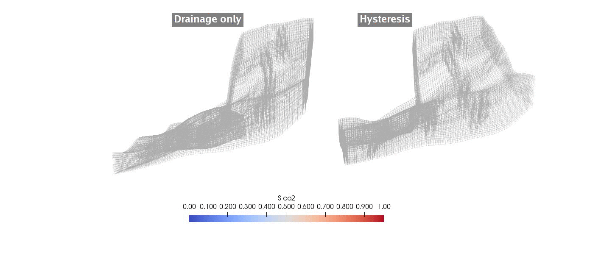
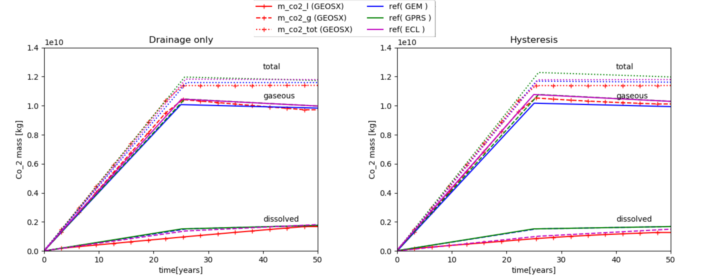

.. _ExampleIsothermalLeakyWell:

##########################################################
CO2 plume evolution modeling hysteresis effect on relative permeability
##########################################################

**Context**

We consider a benchmark problem used in `(Class et al., 2009) <https://link.springer.com/article/10.1007/s10596-009-9146-x>`__
to compare a number of numerical models applied to CO2 storage in geological formations.
Using a simplified isothermal and miscible two-phase setup, this test case addresses the
simulation of the modeling of solubility trapping (with modeled CO2 dissolution in brine) and residual trapping
(with hysteresis modeled on the gas phase's relative permeability).

Our goal is to review the different sections of the XML file reproducing the benchmark configuration
and to demonstrate that the GEOSX results (i.e., mass of CO2 dissolved and mobile for both configuration, using
only drainage relative permeabilities and modeling hysteresis on the gas phase) are in agreement with the reference
results published in `(Class et al., 2009) <https://link.springer.com/article/10.1007/s10596-009-9146-x>`__ Problems 3.1 and 3.2.

**Input file**

This benchmark test is based on the XML file located below:

.. code-block:: console

  ../../../../../../inputFiles/compositionalMultiphaseFlow/benchmarks/Class09Pb3/class09_pb3_smoke.xml
  ../../../../../../inputFiles/compositionalMultiphaseFlow/benchmarks/Class09Pb3/class09_pb3_drainageOnly_iterative_base.xml

------------------------------------------------------------------------
Problem description
------------------------------------------------------------------------

The following text is adapted from the detailed description of the benchmark test case
presented in
`(Class et al., 2009) <https://link.springer.com/article/10.1007/s10596-009-9146-x>`__.

The setup is illustrated in the figure below.
The mesh can be found in `GEOSXDATA <https://github.com/GEOSX/GEOSXDATA>`__ and
was provided for the benchmark. It discretizes the widely-used `Johansen` reservoir,
which consists in a tilted reservoir with a main fault. Both porosity and permeability are
heterogeneous an given at vertices.

A single CO2 injection well is completed with perforations only in the bottom 50 m
of the reservoir.

The model domain has the following dimensions: 9600 x 8900 x [90-140] m.
It has a single well located at (5440,3300) m. The injection takes place for 25 years over 50 years
simulated at the constant rate of 15 kg/s. An hydrostatic pressure gradient is imposed on the boundary cells
as well as a constant geothermal gradient of 0.03 K/m. The reservoir is initially at 100 C.

   .. _JohansenScenario: .. figure:: problem3.png
      :align: center
      :width: 500
      :figclass: align-center

The authors have used the following simplifying assumptions:

- The formation is isotropic.
- All processes are isothermal.
- The pressure conditions at the lateral boundaries are constant over time, and equal to the initial hydrostatic condition.

------------------------------------------------------------------
Mesh and element regions
------------------------------------------------------------------

The proposed conform discretization is
fully hexahedral. Cells on the border have been flagged by VTK a new *attribute* in order to apply specific
boundary condition on them.
<xml extract>

The wellbore is discretized as X element segments with N perforations, as below,
<xml extract>

A VTK filter ``PointToCell`` is used to map properties from vertices to cells, which by default build an uniform average of
values over the cell.

The structured mesh is generated using some helpers python script from the formatted Point/Cells list provided.
It contains ``ncells`` cells. It is then imported using ``meshImport``

.. literalinclude:: ../../../../../../inputFiles/compositionalMultiphaseFlow/benchmarks/Class09Pb3/class09_pb3_smoke.xml
    :language: xml
    :start-after: <!-- SPHINX_MESH -->
    :end-before: <!-- SPHINX_MESH_END -->

The central wellbore is discretized as well thanks to internal tools (see :ref:`co2_TutorialCO2FieldCase`).
It counts five segment with a perforation in each. It has its own region ``wellRegion`` and control labeled ``wellControls``
defined and detailed respectively in **ElementRegions** and **Solvers** (see below).

In the **ElementRegions** block,

.. literalinclude:: ../../../../../../inputFiles/compositionalMultiphaseFlow/benchmarks/Class09Pb3/class09_pb3_smoke.xml
    :language: xml
    :start-after: <!-- SPHINX_ER -->
    :end-before: <!-- SPHINX_ER_END -->

two reservoir region are labeled, ``reservoir`` and ``boundaries``, associated with ``1_hexahedra`` and `2_hexahedara`
as we defined in building the mesh a scalar value *attribute* in order to flag either the interior of the domain or the one-cell wide region at the boundaries
 (this can be checked inspecting the input mesh with Paraview).
This preprocessing is done in order to apply specific condition on the ``boundaries``. A third region ``welllRegion`` is associated with the well.
All those region defines materials to be specified inside the **Constitutives** block.

------------------------
Coupled solver
------------------------

The isothermal immiscible simulation is performed by the GEOSX coupled solver for multiphase
flow and well defined in the XML block **CompositionalMultiphaseReservoir**:

.. literalinclude:: ../../../../../../inputFiles/compositionalMultiphaseFlow/benchmarks/Class09Pb3/class09_pb3_drainageOnly_iterative_base.xml
    :language: xml
    :start-after: <!-- SPHINX_SOLVER_MP -->
    :end-before: <!-- SPHINX_SOLVER_MP_END -->

It references the two coupled solvers under the tags **flowSolverName** and **wellSolverName**. These are definied inside the same **Solvers** block
following this coupled solver. It also defined non-linear, **NonlinearSolverParameters** and
and linear, **LinearSolverParameters**, strategies. Noticeably, direct solver shouldn't be used for large problem and

The next two blocks are used to defined our two coupled physics solvers ``compositionalMultiphaseFlow`` (of type **CompositionalMultiphaseFVM**)
and ``compositionalMultiphaseWell`` (of type **CompositionalMultiphaseWell**).

Flow Solver
-------------

We use the ``targetRegions`` attribute to define the regions where the flow solver is applied.
Here, during mesh construction we isolated a one-cell layer of external cell to defined boundary conditions on
and the remaining of the domain. These have been labeled as ``reservoir`` and ``boundaries`` in the **ElementRegions** block.

.. literalinclude:: ../../../../../../inputFiles/compositionalMultiphaseFlow/benchmarks/Class09Pb3/class09_pb3_drainageOnly_iterative_base.xml
    :language: xml
    :start-after: <!-- SPHINX_SOLVER_MPWELL -->
    :end-before: <!-- SPHINX_SOLVER_MPWELL_END -->

The FV scheme discretization used is TPFA (which definition can be found nested in **NumericalMethods**/**FiniteVolume**)
and some parameter values.

Well Solver
--------------

The well solver is applied on its own region ``wellRegion`` which consist of the five discretized segments.
It also is the place where the **WellControls** are set thanks to ``type``, ``control``, ``injectionStream`` ,
``injectionTemperature``, ``targetTotalRateTableName`` and, ``targetBHP`` for instance if we consider an injection well.

For more details on the wellbore modelling please refer to :ref:`CompositionalMultiphaseWell`.

.. literalinclude:: ../../../../../../inputFiles/compositionalMultiphaseFlow/benchmarks/Class09Pb3/class09_pb3_drainageOnly_iterative_base.xml
    :language: xml
    :start-after: <!-- SPHINX_SOLVER_WELL -->
    :end-before: <!-- SPHINX_SOLVER_WELL_END -->

------------------------------
Constitutive laws
------------------------------

This benchmark test involves a compositional mixture that defines two phase (vapor and liquid) labeled as
``gas`` and ``water`` which contains two component ``co2`` and ``water``. The miscibility of co2 results in
presence of co2 in the liquid phase. The vaporization of ``water`` is not considered here

.. literalinclude:: ../../../../../../inputFiles/compositionalMultiphaseFlow/benchmarks/Class09Pb3/class09_pb3_drainageOnly_iterative_base.xml
    :language: xml
    :start-after: <!-- SPHINX_FLUID -->
    :end-before: <!-- SPHINX_FLUID_END -->

The brine properties are modeled using Ezrokhi correlation, hence the block name **CO2BrineEzrokhiFluid**.
The external pvt files *tables/pvtgas.txt* and *tables/pvtliquid_ex.txt* gives access to the model considered
respectively for the computation of gas density and viscosity and the brine density and viscosity, along with pressure, temperature, salinity
discretization of the parameter space. The external *tables/co2flash.txt* gives the same type of information for the `CO2Solubility`
model. (see :ref:`CO2-EOS` for details).

The rock model defines a slightly compressible porous medium with a reference porosity equal to 0.1.

.. literalinclude:: ../../../../../../inputFiles/compositionalMultiphaseFlow/benchmarks/Class09Pb3/class09_pb3_drainageOnly_iterative_base.xml
    :language: xml
    :start-after: <!-- SPHINX_ROCK -->
    :end-before: <!-- SPHINX_ROCK_END -->

.. note::
    comment on NullSolid

The relative permeability model is input through tables thanks to **TableRelativePermeability** block.

.. literalinclude:: ../../../../../../inputFiles/compositionalMultiphaseFlow/benchmarks/Class09Pb3/class09_pb3_drainageOnly_iterative_base.xml
    :language: xml
    :start-after: <!-- SPHINX_FLUID -->
    :end-before: <!-- SPHINX_FLUID_END -->

As this benchmark is testing the sensitivity of the plume dynamics to the relative permeability hysteresis modeling,
in commented block the **TableRelativePermeabilityHysteresis** block sets up bounding curves for imbibition and drainage
under `imbibitionNonWettingRelPermTableName`, `imbibitionWettingRelPermTableName` and, `drainageWettingNonWettingRelPermTableNames`
compared to the `wettingNonWettingRelPermTableNames` label of the drainage only **TableRelativePermeability** blocks.
Those link to **TableFunction** blocks in **Functions**, which define sample points for piecewise linear interpolation.
This feature is used and explained in more details in the following section dedicated to *Initial and Boundary conditions*.

See,

.. code-block:: console

  ../../../../../../inputFiles/compositionalMultiphaseFlow/benchmarks/Class09Pb3/class09_pb3_hysteresis_iterative_base.xml

for the input base with hysteresis set up.

.. note::
    `wettingNonWettingRelPermTableNames` in **TableRelativePermeability** and `drainageWettingNonWettingRelPermTableNames` in
    **TableRelativePermeabilityHysteresis** usage are identical.

Capillary pressure is also tabulated and defined in **TableCapillaryPressure**. No hysteresis is modeled yet on the capillary pressure.

.. literalinclude:: ../../../../../../inputFiles/compositionalMultiphaseFlow/benchmarks/Class09Pb3/class09_pb3_drainageOnly_iterative_base.xml
    :language: xml
    :start-after: <!-- SPHINX_FLUID -->
    :end-before: <!-- SPHINX_FLUID_END -->

-----------------------------------------------------------
Initial and boundary conditions
-----------------------------------------------------------

The domain is initially saturated with brine with a hydrostatic pressure field.
This is specified using the **HydrostaticEquilibrium** XML tag in the **FieldSpecifications** block.
The datum pressure and elevation used below are defined in
`(Class et al., 2009) <https://link.springer.com/article/10.1007/s10596-009-9146-x>`__).

.. literalinclude:: ../../../../../../inputFiles/compositionalMultiphaseFlow/benchmarks/Class09Pb3/class09_pb3_drainageOnly_iterative_base.xml
    :language: xml
    :start-after: <!-- SPHINX_HYDROSTATIC -->
    :end-before: <!-- SPHINX_HYDROSTATIC_END -->

In the **Functions** block, the **TableFunction** s named ``initOilCompFracTable`` and ``initWaterCompFracTable``
define the brine-saturated initial state, while the **TableFunction** named ``initTempTable`` defines the
homogeneous temperature field (temperature is not used in this benchmark).   
		 
Since the fluid densities are constant for this simple incompressible fluid model, the same result
could have been achieved using a simpler table in a **FieldSpecification** tag, as explained
in :ref:`EquilibriumInitialCondition`.

The boundaries are set to have a constant 0.03 K/m temperature gradient as well as the hydrostatic pressure gradient.
We supplement that with water dominant content. Each block is linking a `fieldName` to a **TableFunction** tagged as
the value of `functionName`. The `objectPath` assigned to *ElementRegions/boundaries* allows us to define those
boundary values only on the boundary region.

.. literalinclude:: ../../../../../../inputFiles/compositionalMultiphaseFlow/benchmarks/Class09Pb3/class09_pb3_drainageOnly_iterative_base.xml
    :language: xml
    :start-after: <!-- SPHINX_BC -->
    :end-before: <!-- SPHINX_BC_END -->

---------------------------------
Inspecting results
---------------------------------

We request VTK-format output files and use Paraview to visualize the results under the **Outputs** block.

The following figure shows the distribution of CO2 saturation thresholded above a significant value (here 0.001).
The displayed cells are colored with respect to the co2 mass they contain. If the relative permeability for the gas phase
drops below 10e-7, the cell is change into black

.. _pb3_drainOnly_CO2saturation:

   Plume of CO2 saturation for significant value where immobile co2 is colored in black.

We observe the importance of hysteresis modeling in co2 plume migration. Indeed, during the migration phase, the cells in
the tail of the plume are reverting from drainage to imbibition and remaining co2 is trapped. This results in a lot slower migration
and expansion of the plume.

To validate the GEOSX results, we consider the metrics used in
`(Class et al., 2009) <https://link.springer.com/article/10.1007/s10596-009-9146-x>`__.
The reporting values are the dissolved and gaseous co2 with respect to time using only drainage relative permeability
and hysteretical relative permeabilities.

.. _pb3_dissolvedMobile:

   CO2 dissolved, gaseous and total mass with respect to time for (left) drainage only and (right) hysteresis relative permeabilities

We can see that at the end of the injection period the mass of co2 in the gaseous phase stop increasing and start
decreasing under dissolution.

These curves confirm the agreement between GEOSX and the results of `(Class et al., 2009) <https://link.springer.com/article/10.1007/s10596-009-9146-x>`__.

------------------------------------------------------------------
To go further
------------------------------------------------------------------

**Feedback on this example**

For any feedback on this example, please submit a `GitHub issue on the project's GitHub page <https://github.com/GEOSX/GEOSX/issues>`_.

..
    todo : change for face bc cdt
           script for curves
           use statistics to get timehistory

