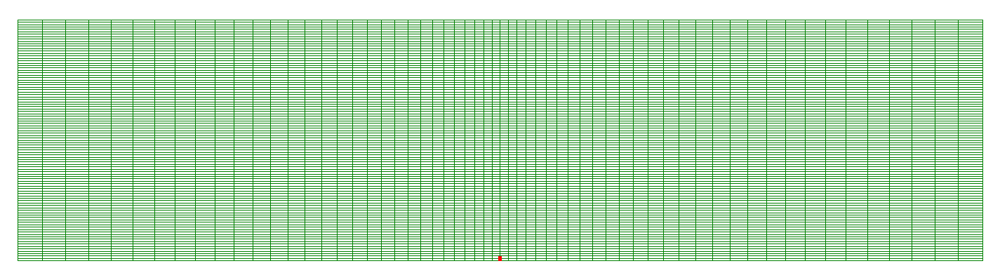

.. _kgdToughnessDominated:

#######################################################
Toughness dominated KGD problem
#######################################################

------------------------------------------------------------------
Description of the case
------------------------------------------------------------------

We consider a plane-strain hydraulic fracture propagating in an infinite homogeneous medium due to the injection of a fluid into the fracture with a rate :math:`Q_0` in a period from 0 to :math:`t_{max}`. The injected fluid flows in the fracture with respect to the lubrication equation resulting from the mass conservation and the Poiseuille law. It relates the fracture aperture to the fluid pressure via the fluid viscosity :math:`\mu`. On the other side, the fluid pressure is linked to the fracture aperture through the mechanical deformation of the solid matrix that is characterized by rock elastic properties: the Young modulus :math:`E` and Poisson ratio :math:`\nu` or the anisotropic elastic stiffnesses. The fracture growth is controlled by comparing the stress intensity factor and rock toughness :math:`K_{Ic}`.

Analytical results exist for some cases. We consider for example the toughness dominated regime and isotropic homogeneous impermeable rock, the exact analytical result of the fracture length :math:`\ell`, the net pressure :math:`p_0` and the fracture aperture :math:`w_0` at the injection point can be obtained by following closed-form solutions: 

.. math::
   \ell = 0.9324 X^{ -1/6 } (\frac{ E_p Q_0^3 }{ 12\mu })^{ 1/6 } t^{ 2/3 }

   w_0^2 = 0.5 X^{ 1/2 } (\frac{ 12\mu Q_0 }{ E_p })^{ 1/2 } \ell

   w_0 p_0 = 0.125 X^{ 1/2 } (12\mu Q_0 E_p)^{ 1/2 }

where the plane modulus `E_p` is defined by

.. math:: E_p = frac{ E }{ 1-\nu^2 }

We noted also:

.. math:: X = frac{ 256 }{ 3 \pi^2 } \frac{ K_{Ic}^4 }{ \mu Q_0 {E_p}^3 }

**Input file**

The xml input files for this test case are located at:

.. code-block:: console

  inputFiles/multiphysics/kgdToughnessDominated_Base.xml

and

.. code-block:: console

  inputFiles/multiphysics/kgdToughnessDominated_Example.xml

the corresponding integrated test with coarser mesh and smaller injection time is defined by the xml:

.. code-block:: console

  inputFiles/multiphysics/kgdToughnessDominated_Smoke.xml

-----------------------------------------------------------
The solvers
-----------------------------------------------------------

The solver ``SurfaceGenerator`` define rock toughness :math:`K_{Ic}` as: 

.. literalinclude:: ../../../../../../inputFiles/multiphysics/kgdToughnessDominated_Base.xml
  :language: xml
  :start-after: <!-- Sphinx_Solvers_SurfaceGenerator -->
  :end-before:  <!-- Sphinx_Solvers_SurfaceGenerator_End -->

Rock and fracture deformation are modeled by the solid mechanics solver ``SolidMechanicsLagrangianSSLE``. In this solver we define a ``targetRegions`` that includes both the continuum region and the fracture region. The name of the contact constitutive behavior is also declared in this solver by the ``contactRelationName`` beside the ``solidMaterialNames``.

.. literalinclude:: ../../../../../../inputFiles/multiphysics/kgdToughnessDominated_Base.xml
  :language: xml
  :start-after: <!-- Sphinx_Solvers_SolidMechanicsLagrangianSSLE -->
  :end-before:  <!-- Sphinx_Solvers_SolidMechanicsLagrangianSSLE_End -->

The single phase fluid flow inside the fracture is modeled by the finite volume method implemented in the solver ``SinglePhaseFVM`` as:   

.. literalinclude:: ../../../../../../inputFiles/multiphysics/kgdToughnessDominated_Base.xml
  :language: xml
  :start-after: <!-- Sphinx_Solvers_SinglePhaseFVM -->
  :end-before:  <!-- Sphinx_Solvers_SinglePhaseFVM_End -->

All these elementary solvers are wrapped up in the solver ``Hydrofracture`` to model the coupling between fluid flow inside the fracture, rock deformation and fracture opening/closer and propagation. A fully coupled scheme is defined by setting a flag ``FIM`` for ``couplingTypeOption``.  

.. literalinclude:: ../../../../../../inputFiles/multiphysics/kgdToughnessDominated_Base.xml
  :language: xml
  :start-after: <!-- Sphinx_Solvers_Hydrofracture -->
  :end-before:  <!-- Sphinx_Solvers_Hydrofracture_End -->

The parameters used in the simulation are summarized in the following table.

  +----------------+-----------------------+------------------+-------------------+
  | Symbol         | Parameter             | Units            | Value             |
  +================+=======================+==================+===================+
  | :math:`E`      | Young's modulus       | [Pa]             | 10\ :sup:`9`      |
  +----------------+-----------------------+------------------+-------------------+

---------------------------------
Inspecting results
---------------------------------

This plot .

.. plot::

  

------------------------------------------------------------------
To go further
------------------------------------------------------------------

**Feedback on this example**

This concludes the toughness dominated KGD example.
For any feedback on this example, please submit a `GitHub issue on the project's GitHub page <https://github.com/GEOSX/GEOSX/issues>`_.
