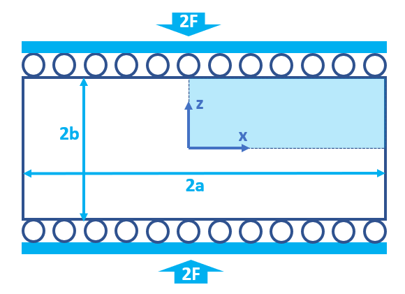
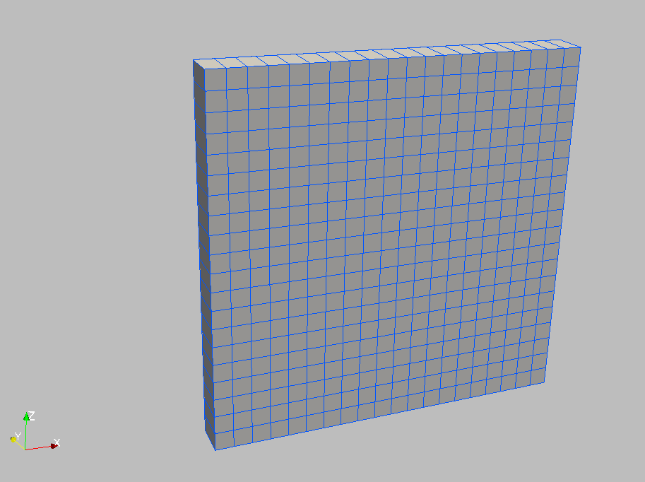
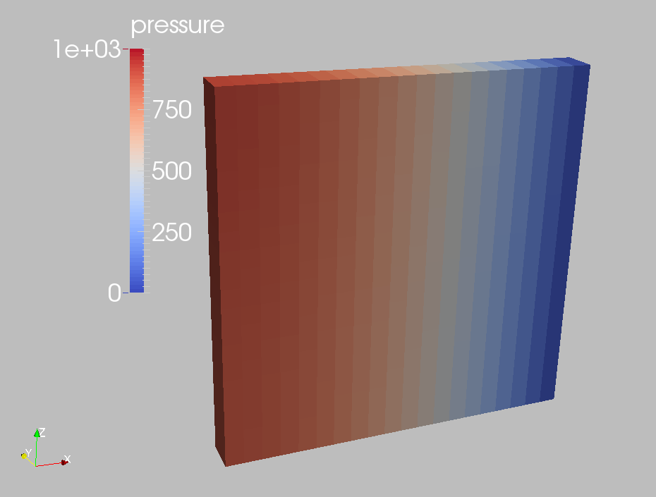
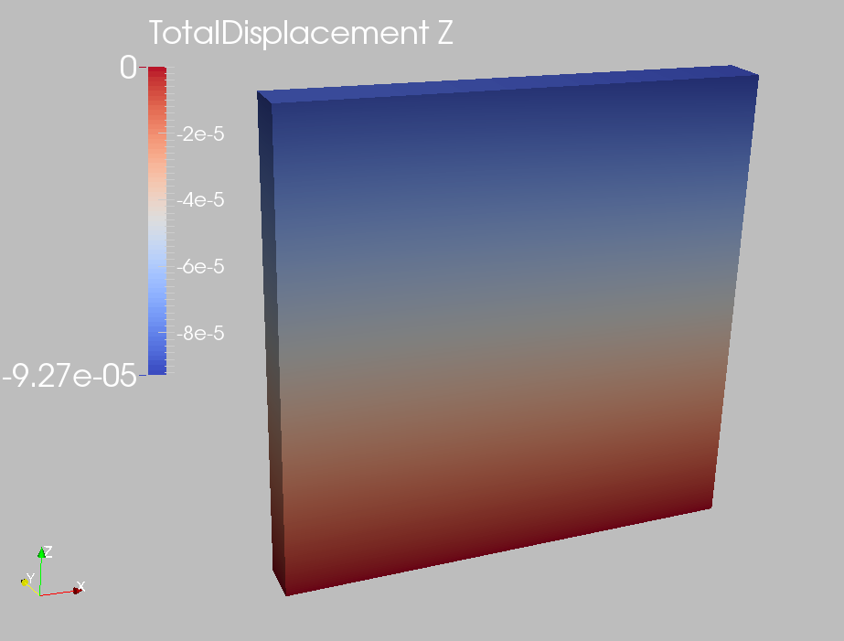
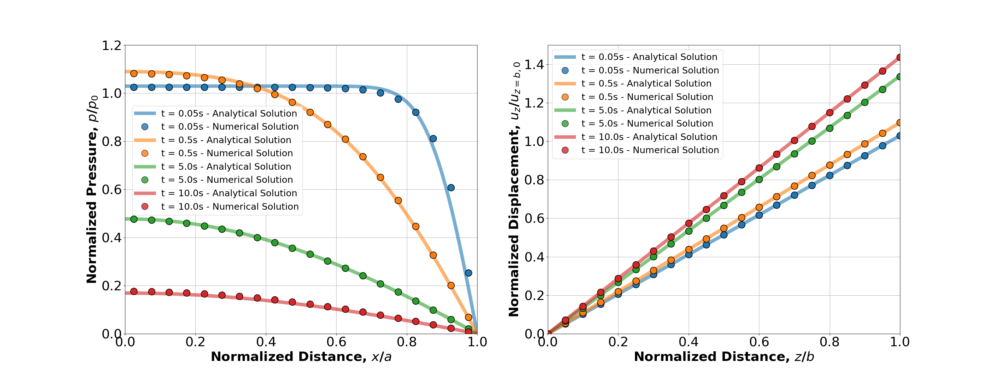

.. _ExampleMandel:

####################################################
Mandel's Problem
####################################################

**Context**

In this example, we use the coupled solvers in GEOSX to solve Mandel's 2D consolidation problem, a classic benchmark in poroelasticity. The analytical solution `(Cheng and Detournay, 1988)  <https://onlinelibrary.wiley.com/doi/abs/10.1002/nag.1610120508>`__ is employed to verify the accuracy of the modeling predictions on induced pore pressure and the corresponding settlement. In this example, the ``TimeHistory`` function and a Python script are used to output and post-process multi-dimensional data (pore pressure and displacement field).

**Input file**

This example uses no external input files and everything required is contained within two GEOSX input files located at:

.. code-block:: console

  inputFiles/poromechanics/PoroElastic_Mandel_base.xml

.. code-block:: console

  inputFiles/poromechanics/PoroElastic_Mandel_benchmark.xml

------------------------------------------------------------------
Description of the case
------------------------------------------------------------------

We simulate the consolidation of a poroelastic slab between two rigid and impermeable plates subjected to a constant normal force. The slab is assumed to be fully saturated, homogeneous, isotropic, and infinitely long in the y-direction. We apply a uniform compressive load in the vertical direction. This force leads to a change of pore pressure and mechanical deformations of the sample, evolving with time due to fluid diffusion and coupling effects. The numerical model represents a plane strain deformation and lateral drainage without confinement, showing only a quarter of the computational domain in the x-z plane (the rest follows by symmetry).

.. _problemSketchFig:

   Sketch of the problem

In this example, we set up and solve a poroelastic model to obtain the temporal and spatial solutions of pore pressure (:math:`p(x,z,t)`) and displacement field (:math:`u_z(x,z,t)`) for Mandel's problem. These modeling predictions are validated against corresponding analytical solution `(Cheng and Detournay, 1988)  <https://onlinelibrary.wiley.com/doi/abs/10.1002/nag.1610120508>`__. 

.. math::
   p(x,z,t) = 2 p_0 \sum_{n=1}^{\infty}
            \frac{ \text{sin} \alpha_{n} } { \alpha_{n} - {\text{sin} \alpha_{n}} {\text{cos} \alpha_{n}} } \left( \text{cos} {\frac{\alpha_{n} x}{a}} - \text{cos} \alpha_{n} \right)  
            \text{exp} \left( -\frac{ {\alpha_{n}}^2 c t}{a^2} \right)

.. math::
   u_z(x,z,t) = \left[ -\frac{F \left( 1 - \nu \right)}{2Ga} + frac{F \left( 1 - \nu_{u} \right)}{Ga} \sum_{n=1}^{\infty} \frac{  {\text{sin} \alpha_{n}} {\text{cos} \alpha_{n}} } { \alpha_{n} - {\text{sin} \alpha_{n}} {\text{cos} \alpha_{n}} } \text{exp} \left( -\frac{{\alpha_{n}}^2 c t}{a^2} \right) \right] z

with :math:`\alpha_{n}` denoting the positive roots of the following equation:

.. math::
   \text{tan} \alpha_{n} = \frac{1- \nu}{\nu_{u}-\nu} \alpha_{n}

Upon sudden application of the verical load, the instantaneous overpressure (:math:`p_0(x,z)`) and settlement (:math:`u_{z,0}(x,z)` and :math:`u_{x,0}(x,z)`) across the sample are derived from the Skempton effect:
            
.. math::
   p_0(x,z) = \frac{1}{3a} B \left( 1 + \nu_{u} \right) F

.. math::
   u_{z,0}(x,z) = -\frac{F \left( 1 - \nu_{u} \right)}{2G} \frac{z}{a}

.. math::
   u_{x,0}(x,z) = \frac{F \nu_{u} }{2G} \frac{x}{a}

where :math:`\nu` and :math:`\nu_{u}` are the drained and undrained Poisson's ratio respectively, :math:`c` is the consolidation coefficient, :math:`B` is Skempton's coefficient, :math:`G` is the shear modulus, and :math:`F` is the applied force.

For this example, we focus on the ``Mesh``,
the ``Constitutive``, and the ``FieldSpecifications`` tags.

------------------------------------------------------------------
Mesh
------------------------------------------------------------------

The following figure shows the mesh used in this problem.

.. _problemSketchFig:

   Generated mesh

This mesh was created using the internal mesh generator as parametrized in the ``InternalMesh`` XML tag. 
The structured mesh contains 20 x 1 x 20 eight-node brick elements in the x, y, and z directions respectively. 
Such eight-node hexahedral elements are defined as ``C3D8`` elementTypes, and their collection forms a mesh
with one group of cell blocks named here ``cb1``. 

.. literalinclude:: ../../../../../../inputFiles/poromechanics/PoroElastic_Mandel_benchmark.xml
    :language: xml
    :start-after: <!-- SPHINX_MESH -->
    :end-before: <!-- SPHINX_MESH_END -->

------------------------
Solid mechanics solver
------------------------

GEOSX is a multi-physics platform. Different combinations of
physics solvers available in the code can be applied
in different regions of the domain and be functional at different stages of the simulation.
The ``Solvers`` tag in the XML file is used to list and parameterize these solvers.

To specify a coupling between two different solvers, we define and characterize each single-physics solver separately.
Then, we customize a *coupling solver* between these single-physics
solvers as an additional solver.
This approach allows for generality and flexibility in constructing multi-physics solvers.
The order of specifying these solvers is not restricted in GEOSX.
Note that end-users should give each single-physics solver a meaningful and distinct name, as GEOSX will recognize these single-physics solvers based on their customized names and create user-expected coupling.

As demonstrated in this example, to setup a poromechanical coupling, we need to define three different solvers in the XML file:

- the mechanics solver, a solver of type ``SolidMechanicsLagrangianSSLE`` called here ``lagsolve`` (more information here: :ref:`SolidMechanicsLagrangianFEM`),

.. literalinclude:: ../../../../../../inputFiles/poromechanics/PoroElastic_Mandel_base.xml
  :language: xml
  :start-after: <!-- SPHINX_WELLBORE_MECHANICALSOLVER -->
  :end-before: <!-- SPHINX_WELLBORE_MECHANICALSOLVER_END -->

- the single-phase flow solver, a solver of type ``SinglePhaseFVM`` called here ``SinglePhaseFlow`` (more information on these solvers at :ref:`SinglePhaseFlow`),

.. literalinclude:: ../../../../../../inputFiles/poromechanics/PoroElastic_Mandel_base.xml
  :language: xml
  :start-after: <!-- SPHINX_WELLBORE_SINGLEPHASEFVM -->
  :end-before: <!-- SPHINX_WELLBORE_SINGLEPHASEFVM_END -->

- the coupling solver (``SinglePhasePoromechanics``) that will bind the two single-physics solvers above, which is named as ``poroSolve`` (more information at :ref:`PoroelasticSolver`).

.. literalinclude:: ../../../../../../inputFiles/poromechanics/PoroElastic_Mandel_base.xml
  :language: xml
  :start-after: <!-- SPHINX_WELLBORE_POROMECHANICSSOLVER -->
  :end-before: <!-- SPHINX_WELLBORE_POROMECHANICSSOLVER_END -->

The two single-physics solvers are parameterized as explained
in their corresponding documentataion pages. 
We focus on the coupling solver in this example.
The solver ``poroSolve`` uses a set of attributes that specifically describe the coupling process within a poromechanical framework.
For instance, we must point this solver to the designated fluid solver (here: ``SinglePhaseFlow``) and solid solver (here: ``lagsolve``).
These solvers interact through the ``porousMaterialNames="{ shale }"`` with all the constitutive models. We specify the discretization method (``FE1``, defined in the ``NumericalMethods`` section), and the target regions (here, we only have one, ``Domain``).
More parameters are required to characterize a coupling procedure (more information at :ref:`PoroelasticSolver`). In this way, the two single-physics solvers will be simultaneously called and executed for solving Mandel's problem here.

------------------------------
Constitutive laws
------------------------------

For this problem, we simulate the poroelastic deformation of a slab under uniaxial compression. 
A homogeneous and isotropic domain with one solid material is assumed, and its mechanical properties and associated fluid rheology are specified in the ``Constitutive`` section. 
``PorousElasticIsotropic`` model is used to describe the mechanical behavior of ``shaleSolid`` when subjected to loading. The single-phase fluid model ``CompressibleSinglePhaseFluid`` is selected to simulate the response of ``water`` upon consolidation.

.. literalinclude:: ../../../../../../inputFiles/poromechanics/PoroElastic_Mandel_base.xml
    :language: xml
    :start-after: <!-- SPHINX_MATERIAL -->
    :end-before: <!-- SPHINX_MATERIAL_END -->

All constitutive parameters such as density, viscosity, bulk modulus, and shear modulus are specified in the International System of Units.

------------------------------
Time history function
------------------------------

In the ``Tasks`` section, ``PackCollection`` tasks are defined to collect time history information from fields. 
Either the entire field or specified named sets of indices in the field can be collected. 
In this example, ``pressureCollection`` and ``displacementCollection`` tasks are specified to output the time history of pore pressure ``fieldName="pressure"`` and displacement field ``fieldName="TotalDisplacement"`` across the computational domain.

.. literalinclude:: ../../../../../../inputFiles/poromechanics/PoroElastic_Mandel_base.xml
    :language: xml
    :start-after: <!-- SPHINX_TASKS -->
    :end-before: <!-- SPHINX_TASKS_END -->

These two tasks are triggered using the ``Event`` manager with a ``PeriodicEvent`` defined for these recurring tasks. 
GEOSX writes two files named after the string defined in the ``filename`` keyword and formatted as HDF5 files (displacement_history.hdf5 and pressure_history.hdf5). The TimeHistory file contains the collected time history information from each specified time history collector.
This information includes datasets for the simulation time, element center, and the time history information.
A Python script is prepared to read and plot any specified subset of the time history data for verification and visualization. 

-----------------------------------------------------------
Initial and boundary conditions
-----------------------------------------------------------

Next, we specify two fields:

  - The initial value (the displacements and pore pressure have to be initialized, corresponding to the undrained response),
  - The boundary conditions (the vertical displacement applied at the loaded boundary and the constraints of the outer boundaries have to be set).

In this example, the analytical z-displacement is applied at the top surface (``zpos``) of computational domain to enforce the rigid plate condition.
The lateral surface (``xpos``) is traction-free and allows drainage. 
The remaining parts of the outer boundaries are subjected to roller constraints.  
These boundary conditions are set up through the ``FieldSpecifications`` section.

.. literalinclude:: ../../../../../../inputFiles/poromechanics/PoroElastic_Mandel_base.xml
    :language: xml
    :start-after: <!-- SPHINX_BC -->
    :end-before: <!-- SPHINX_BC_END -->

 
The parameters used in the simulation are summarized in the following table. Note that traction has a negative value, due to the negative sign convention for compressive stresses in GEOSX. 

+------------------+-------------------------+------------------+--------------------+
| Symbol           | Parameter               | Unit             | Value              |
+==================+=========================+==================+====================+
| :math:`K`        | Bulk Modulus            | [MPa]            | 66.667             |
+------------------+-------------------------+------------------+--------------------+
| :math:`G`        | Shear Modulus           | [MPa]            | 40.0               |
+------------------+-------------------------+------------------+--------------------+
| :math:`F`        | Force per Unit Length   | [N/m]            | -10\ :sup:`4`      |
+------------------+-------------------------+------------------+--------------------+
| :math:`\phi`     | Porosity                | [-]              | 0.375              |
+------------------+-------------------------+------------------+--------------------+
| :math:`K_s`      | Grain Bulk Modulus      | [Pa]             | 10\ :sup:`27`      |
+------------------+-------------------------+------------------+--------------------+
| :math:`\rho_f`   | Fluid density           | [kg/m\ :sup:`3`] | 10\ :sup:`3`       |
+------------------+-------------------------+------------------+--------------------+
| :math:`c_f`      | Fluid compressibility   | [Pa\ :sup:`-1`]  | 4.4x10\ :sup:`-10` |
+------------------+-------------------------+------------------+--------------------+
| :math:`\kappa`   | Permeability            | [m\ :sup:`2`]    | 10\ :sup:`-12`     |
+------------------+-------------------------+------------------+--------------------+
| :math:`\mu`      | Fluid viscosity         | [Pa s]           | 10\ :sup:`-3`      |
+------------------+-------------------------+------------------+--------------------+
| :math:`2a`       | Slab Length             | [m]              | 2.0                |
+------------------+-------------------------+------------------+--------------------+
| :math:`2b`       | Slab Height             | [m]              | 2.0                |
+------------------+-------------------------+------------------+--------------------+

---------------------------------
Inspecting results
---------------------------------

We request VTK-format output files and use Paraview to visualize the results.
The following figure shows the distribution of pore pressure (:math:`p(x,z,t)`) at :math:`t=10 s` within the computational domain.

.. _problemVerificationFig1:

   Simulation result of pore pressure at :math:`t=10 s`

The next figure shows the distribution of vertical displacement (:math:`u_z(x,z,t)`) at :math:`t=10 s`.

.. _problemVerificationFig2:

   Simulation result of vertical displacement at :math:`t=10 s` 

The figure below compares the results from GEOSX (marks) and the corresponding analytical solution (lines) for the pore pressure along the x-direction and vertical displacement along the z-direction. GEOSX reliably captures the short-term Mandel-Cryer effect and shows excellent agreement with the analytical solution at various times. 

.. _problemVerificationFig3:

    Comparing GEOSX results with analytical solutions 

.. plot::

    import matplotlib
    import matplotlib.pyplot as plt
    import numpy as np
    import h5py
    import xml.etree.ElementTree as ElementTree
    from mpmath import *
    import math
    from math import sin,cos,tan,exp,atan,asin
    from scipy.optimize import newton

    class Mandel:

        def __init__(self, hydromechanicalParameters, alen, blen, appliedTraction):
            F = appliedTraction
            B = hydromechanicalParameters["skemptonCoefficient"]
            nu = hydromechanicalParameters["poissonRatio"]            
            nuu = hydromechanicalParameters["undrainedPoissonRatio"]          
            p0 = 1./3./alen*B*(1.+nuu)*F
            
            alpha_n = []
            eps = np.finfo( np.float ).eps
            coef = (1- nu)/(nuu-nu)

            n = 1
            while True:
              root = newton(func=lambda xi:tan(xi)-coef*xi , 
                            x0=-math.pi/2 + n*math.pi-100*eps,
                            fprime=lambda xi: 1 + pow(tan(xi),2) - coef,
                            tol=eps)
              if root < 50: 
                alpha_n.append( root )
                n += 1
              else:
                break
            self.alpha_n = alpha_n
      
            self.consolidationCoefficient = hydromechanicalParameters["consolidationCoefficient"];
            self.xlength = alen;
            self.p0 = p0;  
            
            G = hydromechanicalParameters["shearModulus"]
            self.scaling1 = -F*(1.0-nu)/2.0/G/alen
            self.scaling2 = F*(1.0-nuu)/G/alen

        def computePressure(self, x, t):
            cc = self.consolidationCoefficient
            Lx = self.xlength
            alpha_n = self.alpha_n
            p0 = self.p0
            solution = 0
            for k in range(len(alpha_n)):
                    an = alpha_n[k]
                    solution = solution + 2.*sin(an)/(an-sin(an)*cos(an))*(cos(an*x/Lx)-cos(an))*exp(-an**2*cc*t/Lx**2)               

            return p0*solution;

        def computeVerticalDisplacement(self, z, t):
            cc = self.consolidationCoefficient
            Lx = self.xlength
            alpha_n = self.alpha_n
            scaling1 = self.scaling1
            scaling2 = self.scaling2
            solution = 0
            for k in range(len(alpha_n)):
                    an = alpha_n[k]
                    solution = solution + sin(an)*cos(an)/(an-sin(an)*cos(an))*exp(-an**2*cc*t/Lx**2)               

            return (scaling1+scaling2*solution)*z;
        

    def getHydromechanicalParametersFromXML( xmlFilePath ):
        tree = ElementTree.parse(xmlFilePath)

        param1 = tree.find('Constitutive/ElasticIsotropic')
        param2 = tree.find('Constitutive/BiotPorosity')
        param3 = tree.find('Constitutive/CompressibleSinglePhaseFluid')
        param4 = tree.find('Constitutive/ConstantPermeability')

        hydromechanicalParameters = dict.fromkeys(["bulkModulus",
                                                   "shearModulus",
                                                   "biotCoefficient",
                                                   "fluidViscosity",
                                                   "fluidCompressibility",
                                                   "porosity",
                                                   "permeability",
                                                   "skemptonCoefficient",
                                                   "poissonRatio",
                                                   "undrainedPoissonRatio",
                                                   "consolidationCoefficient"])

        hydromechanicalParameters["bulkModulus"] = float(param1.get("defaultBulkModulus"))
        hydromechanicalParameters["shearModulus"] = float(param1.get("defaultShearModulus"))

        K = hydromechanicalParameters["bulkModulus"]
        G = hydromechanicalParameters["shearModulus"]
        E = (9.0 * K * G) / (3.0 * K + G)
        nu = E / (2.0 * G) - 1.0
        Ks = float(param2.get("grainBulkModulus"))

        hydromechanicalParameters["biotCoefficient"] = 1.0 - K / Ks
        hydromechanicalParameters["porosity"] = float(param2.get("defaultReferencePorosity"))
        hydromechanicalParameters["fluidViscosity"] = float(param3.get("defaultViscosity"))
        hydromechanicalParameters["fluidCompressibility"] = float(param3.get("compressibility"))

        perm = param4.get("permeabilityComponents")
        perm = np.array(perm[1:-1].split(','),float)
        hydromechanicalParameters["permeability"] = perm[0]

        phi = hydromechanicalParameters["porosity"]
        cf = hydromechanicalParameters["fluidCompressibility"]
        bBiot = hydromechanicalParameters["biotCoefficient"]
        kp = hydromechanicalParameters["permeability"]
        mu = hydromechanicalParameters["fluidViscosity"]
        M = 1./(phi*cf + (bBiot - phi)/Ks)
        Ku = K + bBiot**2*M
        B = bBiot*M/Ku
        nuu = (3.*nu + bBiot* B* (1-2.*nu))/(3.-bBiot*B*(1-2.*nu))
        cc = 2.*kp/mu*B**2*G*(1.-nu)*(1.+nuu)**2/9./(1.-nuu)/(nuu-nu)
        hydromechanicalParameters["skemptonCoefficient"] = B
        hydromechanicalParameters["poissonRatio"] = nu
        hydromechanicalParameters["undrainedPoissonRatio"] = nuu
        hydromechanicalParameters["consolidationCoefficient"] = cc 

        return hydromechanicalParameters

    def getGeometryFromXML(xmlFilePath):
        tree = ElementTree.parse(xmlFilePath)

        meshElement = tree.find('Mesh/InternalMesh')
        dimensions = meshElement.get("xCoords")
        dimensions = [float(i) for i in dimensions[1:-1].split(",")]
        alen = dimensions[1]
        dimensions = meshElement.get("zCoords")
        dimensions = [float(i) for i in dimensions[1:-1].split(",")]
        blen = dimensions[1]
        dimensions = meshElement.get("nx")
        dimensions = [float(i) for i in dimensions[1:-1].split(",")]
        nx = dimensions[0]
        dimensions = meshElement.get("nz")
        dimensions = [float(i) for i in dimensions[1:-1].split(",")]
        nz = dimensions[0]

        return alen, blen, nx, nz

    def main():
        # File path
        hdf5File1Path = "pressure_history.hdf5"
        hdf5File2Path = "displacement_history.hdf5"
        xmlFile1Path = "../../../../../../inputFiles/poromechanics/PoroElastic_Mandel_base.xml"
        xmlFile2Path = "../../../../../../inputFiles/poromechanics/PoroElastic_Mandel_benchmark.xml"
        
        # Read HDF5
        # Global Coordinate of Element Center
        hf = h5py.File(hdf5File1Path, 'r')
        xl = hf.get('pressure elementCenter')        
        xcord = xl[0,:,0]
        ycord = xl[0,:,1]
        zcord = xl[0,:,2]        
        pl = hf.get('pressure')       
        tl = hf.get('pressure Time')  

        # Global Coordinate of Nodal Point
        hf = h5py.File(hdf5File2Path, 'r')
        xl_node = hf.get('TotalDisplacement ReferencePosition')        
        xcord_node = xl_node[0,:,0]
        ycord_node = xl_node[0,:,1]
        zcord_node = xl_node[0,:,2]
        # Load Displacement Components
        disp = hf.get('TotalDisplacement')       
           
        # Extract Mechanical Properties and Fracture Geometry from XML
        hydromechanicalParameters = getHydromechanicalParametersFromXML(xmlFile1Path)
        F = 1.0e4
        La, Lb, na, nb = getGeometryFromXML(xmlFile2Path)
        B = hydromechanicalParameters["skemptonCoefficient"]
        nuu = hydromechanicalParameters["undrainedPoissonRatio"]
        G = hydromechanicalParameters["shearModulus"]
        p0 = 1./3./La*B*(1.+nuu)*F
        u0 = -F*Lb*(1.0-nuu)/2./G/La
        
        xd_numerical = xcord/La     
        zd_numerical = zcord_node/Lb         
        t = [0.05, 0.5, 5.0, 10.0]     
        pressure_numerical = np.zeros([len(t), len(xd_numerical)])
        displacement_numerical = np.zeros([len(t), len(zd_numerical)])  
        for i in range(len(t)):
            for j in range(1, len(tl)):
                if tl[j]<=t[i]:
                   pressure_numerical[i,:] = pl[j-1,:]/p0
                   displacement_numerical[i,:] = disp[j-1,:,2]/u0

        # Initialize Mandel's analytical solution
        mandelAnalyticalSolution = Mandel(hydromechanicalParameters, La, Lb, F)        
 
        x = np.linspace(0, La, 101, endpoint=True)
        xd_analytical = x/La 
        pressure_analytical = np.zeros([len(t), len(x)])
        displacement_analytical = np.zeros([len(t), len(x)])
        for i in range(len(t)):
            for j in range(len(x)):
                pressure_analytical[i][j] =  mandelAnalyticalSolution.computePressure(x[j], t[i])/p0 
                displacement_analytical[i][j] =  mandelAnalyticalSolution.computeVerticalDisplacement(x[j], t[i])/u0             
                

        fsize = 30
        msize = 15
        lw=8
        fig, ax = plt.subplots(1,2,figsize=(32, 12))
        cmap = plt.get_cmap("tab10")

        for i in range(len(t)):
            ax[0].plot(xd_analytical, pressure_analytical[i][:], color=cmap(i), alpha=0.6, label= 't = '+str(t[i])+'s - Analytical Solution', lw=lw)
            ax[0].plot(xd_numerical, pressure_numerical[i][:], 'o', alpha=0.8, color=cmap(i), mec = 'k', label='t = '+str(t[i])+'s - Numerical Solution', markersize=msize)
        ax[0].set_xlim(0, 1)
        ax[0].set_ylim(0, 1.2)
        ax[0].set_xlabel('Normalized Distance, 'r'$x$/$a$', size=fsize, weight="bold")
        ax[0].set_ylabel('Normalized Pressure, 'r'$p$/$p_{0}$', size=fsize, weight="bold")
        ax[0].legend(bbox_to_anchor=(0.02, 0.6), loc='center left', borderaxespad=0., fontsize=fsize*0.7)
        ax[0].grid(True)
        ax[0].xaxis.set_tick_params(labelsize=fsize)
        ax[0].yaxis.set_tick_params(labelsize=fsize)

        for i in range(len(t)):
            ax[1].plot(xd_analytical, displacement_analytical[i][:], color=cmap(i), alpha=0.6, label= 't = '+str(t[i])+'s - Analytical Solution', lw=lw)
            ax[1].plot(zd_numerical, displacement_numerical[i][:], 'o', alpha=0.8, color=cmap(i), mec = 'k', label='t = '+str(t[i])+'s - Numerical Solution', markersize=msize)
        ax[1].set_xlim(0, 1)
        ax[1].set_ylim(0, 1.5)
        ax[1].set_xlabel('Normalized Distance, 'r'$z$/$b$', size=fsize, weight="bold")
        ax[1].set_ylabel('Normalized Displacement, 'r'$u_{z}$/$u_{z=b,0}$', size=fsize, weight="bold")
        ax[1].legend(loc='upper left',fontsize=fsize*0.7)
        ax[1].grid(True)        
        ax[1].xaxis.set_tick_params(labelsize=fsize)
        ax[1].yaxis.set_tick_params(labelsize=fsize)
 
        plt.show() 

   if __name__ == "__main__":
        main()

------------------------------------------------------------------
To go further
------------------------------------------------------------------

**Feedback on this example**

For any feedback on this example, please submit a `GitHub issue on the project's GitHub page <https://github.com/GEOSX/GEOSX/issues>`_.

