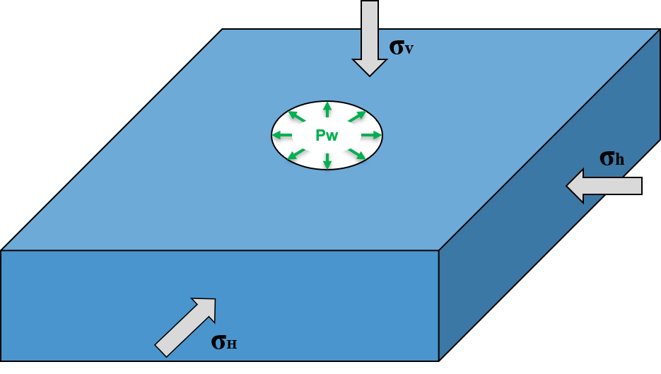
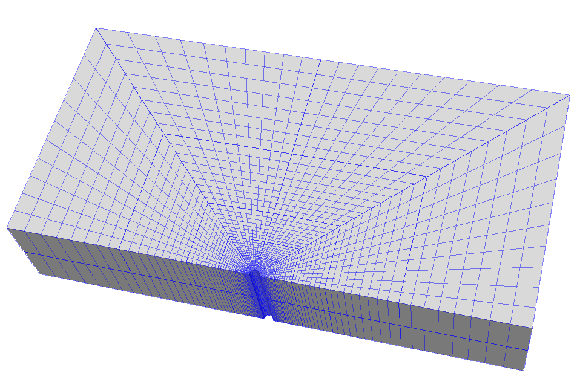
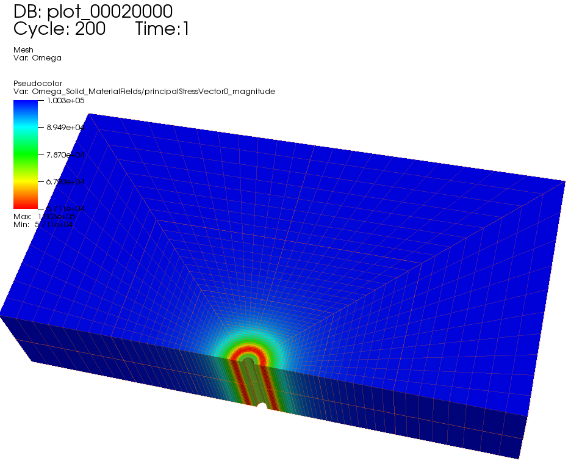

.. _ExampleMCCWellbore:

####################################################
Modified Cam-Clay Model for Wellbore Problems
####################################################

**Context**

In this benchmark example, the Modified Cam-Clay model (see :ref:`ModifiedCamClay`) is applied to solve for elastoplastic deformation within the vicinity of a vertical wellbore. For the presented example, an analytical solution is employed to verify the accuracy of the numerical results. The resulting model can be used as a base for more complex analysis (e.g., wellbore drilling, fluid injection and storage scenarios). 

**Input file**

Everything required is contained within two GEOSX input files located at:

.. code-block:: console

  inputFiles/solidMechanics/ModifiedCamClayWellbore_base.xml

.. code-block:: console

  inputFiles/solidMechanics/ModifiedCamClayWellbore_benchmark.xml

------------------------------------------------------------------
Description of the case
------------------------------------------------------------------

We simulate a drained wellbore problem subjected to isotropic horizontal stress (:math:`\sigma_h`) and vertical stress (:math:`\sigma_v`), as shown below. By increasing the wellbore supporting pressure (:math:`P_w`), the wellbore expands, and the formation rock experiences elastoplastic deformation. A plastic zone develops in the near wellbore region.

.. _problemSketchFig:

   Sketch of the wellbore problem 

To simulate this phenomenon, the Modified Cam-Clay model is used in this example. Displacement and stress fields around the wellbore are numerically calculated. These numerical predictions are then compared with the corresponding analytical solutions `(Chen and Abousleiman, 2013)  <https://www.icevirtuallibrary.com/doi/10.1680/geot.11.P.088>`__ from the literature. 

In this example, we focus our attention on the ``Mesh`` tags,
the ``Constitutive`` tags, and the ``FieldSpecifications`` tags.

------------------------------------------------------------------
Mesh
------------------------------------------------------------------

Following figure shows the generated mesh that is used for solving this wellbore problem.

.. _problemSketchFig:

   Generated mesh for a vertical wellbore problem

Let us take a closer look at the geometry of this wellbore problem.
We use the internal wellbore mesh generator ``InternalWellbore`` to create a rock domain
(:math:`10\, m \, \times 5 \,  m \, \times 2 \, m`), with a wellbore of
initial radius equal to :math:`0.1` m.
Coordinates of ``trajectory`` defines the wellbore trajectory, which represents a vertical well in this example. 
By turning on ``autoSpaceRadialElems="{ 1 }"``, the internal mesh generator automatically sets number and spacing of elements in the radial direction, which overrides the values of ``nr``. 
With ``useCartesianOuterBoundary="0"``, a Cartesian aligned outer boundary on the outer block is enforced.
In this way, a structured three-dimensional mesh is created with 50 x 40 x 2 elements in the radial, tangential and z directions, respectively. All the elements are eight-node hexahedral elements (``C3D8``) and refinement is performed
to conform with the wellbore geometry. This mesh is defined as a cell block with the name
``cb1``.

.. literalinclude:: ../../../../../../inputFiles/solidMechanics/ModifiedCamClayWellbore_benchmark.xml
    :language: xml
    :start-after: <!-- SPHINX_WELLBORE_MESH -->
    :end-before: <!-- SPHINX_WELLBORE_MESH_END -->

------------------------
Solid mechanics solver
------------------------

For the drained wellbore problem, the pore pressure variation is omitted. Therefore, we just need to define a solid mechanics solver, which is called ``mechanicsSolver``. 
This solid mechanics solver (see :ref:`SolidMechanicsLagrangianFEM`) is based on the Lagrangian finite element formulation. 
The problem is run as ``QuasiStatic`` without considering inertial effects. 
The computational domain is discretized by ``FE1``, which is defined in the ``NumericalMethods`` section. 
The material is named as ``rock``, whose mechanical properties are specified in the ``Constitutive`` section.

.. literalinclude:: ../../../../../../inputFiles/solidMechanics/ModifiedCamClayWellbore_base.xml
  :language: xml
  :start-after: <!-- SPHINX_WELLBORE_SOLVER -->
  :end-before: <!-- SPHINX_WELLBORE_SOLVER_END -->

------------------------------
Constitutive laws
------------------------------

For this drained wellbore problem, we simulate the elastoplastic deformation caused by wellbore expansion.
A homogeneous domain with one solid material is assumed, whose mechanical properties are specified in the ``Constitutive`` section: 

.. literalinclude:: ../../../../../../inputFiles/solidMechanics/ModifiedCamClayWellbore_base.xml
    :language: xml
    :start-after: <!-- SPHINX_WELLBORE_MATERIAL -->
    :end-before: <!-- SPHINX_WELLBORE_MATERIAL_END -->

Recall that in the ``SolidMechanics_LagrangianFEM`` section, 
``rock`` is designated as the material in the computational domain. 
Here, Modified Cam-Clay ``ModifiedCamClay`` is used to simulate the elastoplastic behavior of ``rock``.

The following material parameters should be defined properly to reproduce the analytical example:

.. include:: ../../../../../../src/coreComponents/schema/docs/ModifiedCamClay.rst

The constitutive parameters such as the density, the bulk modulus, and the shear modulus are specified in the International System of Units.

-----------------------------------------------------------
Initial and boundary conditions
-----------------------------------------------------------

The next step is to specify fields, including:

  - The initial value (the in-situ stresses and traction at the wellbore wall have to be initialized)
  - The boundary conditions (the reduction of wellbore pressure and constraints of the outer boundaries have to be set)

In this tutorial, we need to specify isotropic horizontal stress (:math:`\sigma_h` = -100 kPa) and vertical stress (:math:`\sigma_v` = -160 kPa). 
To reach equilibrium, a compressive traction :math:`P_w` = -100 kPa is instantaneously applied at the wellbore wall ``rneg`` at time :math:`t` = 0 s, which will then be gradually increased to a higher value (-300 kPa) to let wellbore expand.
The remaining parts of the outer boundaries are subjected to roller constraints.  
These boundary conditions are set up through the ``FieldSpecifications`` section.

.. literalinclude:: ../../../../../../inputFiles/solidMechanics/ModifiedCamClayWellbore_base.xml
    :language: xml
    :start-after: <!-- SPHINX_WELLBORE_BC -->
    :end-before: <!-- SPHINX_WELLBORE_BC_END -->

With ``tractionType="normal"``, traction is applied to the wellbore wall ``rneg`` as a pressure specified from the product of scale ``scale="-1.0e5"`` and the outward face normal. 
A table function ``timeFunction`` is used to define the time-dependent traction ``ExternalLoad``. 
The ``coordinates`` and ``values`` form a time-magnitude
pair for the loading time history. In this case, the loading magnitude increases linearly as the time evolves. 

.. literalinclude:: ../../../../../../inputFiles/solidMechanics/ModifiedCamClayWellbore_base.xml
    :language: xml
    :start-after: <!-- SPHINX_WELLBORE_TABLE -->
    :end-before: <!-- SPHINX_WELLBORE_TABLE_END -->

You may note :

 - All initial value fields must have ``initialCondition`` field set to ``1``;
 - The ``setName`` field points to the previously defined set to apply the fields;
 - ``nodeManager`` and ``faceManager`` in the ``objectPath`` indicate that the boundary conditions are applied to the element nodes and faces, respectively;
 - ``fieldName`` is the name of the field registered in GEOSX;
 - Component ``0``, ``1``, and ``2`` refer to the x, y, and z direction, respectively;
 - And the non-zero values given by ``scale`` indicate the magnitude of the loading; 
 - Some shorthand, such as ``xneg`` and ``xpos``, are used as the locations where the boundary conditions are applied in the computational domain. For instance, ``xneg`` means the face of the computational domain located at the left-most extent in the x-axis, while ``xpos`` refers to the face located at the right-most extent in the x-axis. Similar shorthands include ``ypos``, ``yneg``, ``zpos``, and ``zneg``;
 - The mud pressure loading has a negative value due to the negative sign convention for compressive stress in GEOSX. 

 
The parameters used in the simulation are summarized in the following table.

+------------------+---------------------------+------------------+---------------+
| Symbol           | Parameter                 | Units            | Value         |
+==================+===========================+==================+===============+
| :math:`P_r`      | Reference Pressure        | [kPa]            | 120           |
+------------------+---------------------------+------------------+---------------+
| :math:`G`        | Shear Modulus             | [kPa]            | 4302          |
+------------------+---------------------------+------------------+---------------+
| :math:`P_c`      | PreConsolidation Pressure | [kPa]            | 169           |
+------------------+---------------------------+------------------+---------------+
| :math:`M`        | Slope of CSL              | [-]              | 1.2           |
+------------------+---------------------------+------------------+---------------+
| :math:`c_c`      | Virgin Compression Index  | [-]              | 0.072676      |
+------------------+---------------------------+------------------+---------------+
| :math:`c_r`      | Recompression Index       | [-]              | 0.014535      |
+------------------+---------------------------+------------------+---------------+
| :math:`\sigma_h` | Horizontal Stress         | [kPa]            | -100          |
+------------------+---------------------------+------------------+---------------+
| :math:`\sigma_v` | Vertical Stress           | [kPa]            | -160          |
+------------------+---------------------------+------------------+---------------+
| :math:`a_0`      | Initial Well Radius       | [m]              | 0.1           |
+------------------+---------------------------+------------------+---------------+
| :math:`P_w`      | Mud Pressure              | [kPa]            | -300          |
+------------------+---------------------------+------------------+---------------+

---------------------------------
Inspecting results
---------------------------------

In the above example, we requested silo-format output files. We can therefore import these into VisIt and use python scripts to visualize the outcome. The following figure shows the distribution of :math:`\sigma_{\theta\theta}` in the near wellbore region.

.. _problemVerificationFig1:

   Simulation result of :math:`\sigma_{\theta\theta}`

The figure below shows the comparisons between the numerical predictions (marks) and the corresponding analytical solutions (solid curves) with respect to the distributions of normal stress components, stress path, the supporting wellbore pressure and wellbore size. It is evident that the predictions well match the analytical results.  

.. plot::

   import sys
   import matplotlib
   import numpy as np
   import math
   import matplotlib.pyplot as plt
   from math import sin,cos,tan,exp

   def solution(sr,s0,sz,M,lamda,keppa,G,xd,dx,v0,v):
        p=(sr+s0+sz)/3.0
        q=pow(((sr-s0)**2+(sr-sz)**2+(s0-sz)**2)/2.0,1.0/2.0)
        #G=3.0*(1.0-2.0*mu)*v0*p/2.0/(1.0+mu)/keppa
        mu=(3.0*v*p-2.0*G*keppa)/2.0/(3.0*v*p+G*keppa)
        E=G*2.0*(1.0+mu)

        ar=p/3.0*(M**2-(q/p)**2)+3.0*(sr-p)
        a0=p/3.0*(M**2-(q/p)**2)+3.0*(s0-p)
        az=p/3.0*(M**2-(q/p)**2)+3.0*(sz-p)
        y=(lamda-keppa)/v/p**3/(M**4-(q/p)**4)      
        b11=1.0/pow(E,2.0)*(1.0-pow(mu,2.0)+E*a0*a0*y+2.0*E*mu*a0*az*y+E*az*az*y)
        b12=1.0/pow(E,2.0)*(-E*ar*(a0+mu*az)*y+mu*(1.0+mu-E*a0*az*y+E*az*az*y))
        b13=1.0/pow(E,2.0)*(-E*ar*(mu*a0+az)*y+mu*(1.0+mu+E*a0*a0*y-E*a0*az*y))
        b22=1.0/pow(E,2.0)*(1.0-pow(mu,2.0)+E*ar*ar*y+2.0*E*mu*ar*az*y+E*az*az*y)
        b23=1.0/pow(E,2.0)*(mu+mu*mu+E*mu*ar*ar*y-E*a0*az*y-E*mu*ar*(a0+az)*y)
        b33=1.0/pow(E,2.0)*(1.0-pow(mu,2.0)+E*ar*ar*y+2.0*E*mu*ar*a0*y+E*a0*a0*y)
        b21=b12
        b31=b13
        b32=b23
        delta=-1.0*(1.0+mu)/pow(E,3.0)*((-1.0+mu+2.0*pow(mu,2.0))+E*(-1.0+mu)*ar*ar*y+E*(-1.0+mu)*a0*a0*y-2.0*E*mu*a0*az*y-E*az*az*y+E*mu*az*az*y-2.0*E*mu*ar*(a0+az)*y)
        DrDx=-(sr-s0)/(1-xd-v0/(v*(1-xd)))
        sr1=DrDx*dx+sr
        D0Dx=-b21/b11*((sr-s0)/(1-xd-v0/(v*(1-xd)))+(b11-b12)/delta/(1-xd))-(b22-b21)/delta/(1-xd)
        s01=D0Dx*dx+s0
        DzDx=-b31/b11*((sr-s0)/(1-xd-v0/(v*(1-xd)))+(b11-b12)/delta/(1-xd))-(b32-b31)/delta/(1-xd)
        sz1=DzDx*dx+sz
        DvDx=v*delta/b11*((sr-s0)/(1-xd-v0/(v*(1-xd)))+(b11-b12)/delta/(1-xd))
        v1=DvDx*dx+v
        return sr1,s01,sz1,v1

   def main():
        M=1.2
        lamda=0.15
        keppa=0.03
        mu=0.278
        vcs=2.74
        R=1.2

        sh=100
        sv=160
        p0=(2.0*sh+sv)/3.0
        q0=sv-sh
        K0=sh/sv
        pc0=p0*R*(1.0+1.0/M**2*(q0/p0)**2)
        v0=vcs+(lamda-keppa)*np.log(2.0)+(keppa-lamda)*np.log(pc0)-keppa*np.log(p0)
        G0=3.0*(1.0-2.0*mu)*v0*p0/2.0/(1.0+mu)/keppa

        a_a0=1.08293
        nd=2000

        # Analytical Solution (Chen & Abousleiman, 2013) 
        # Plastic zone
        qp0=M*p0*pow(R*(1.0+1.0/M**2*(q0/p0)**2)-1.0,1.0/2.0)
        sr0=sh+pow(sh**2-(4.0*sh**2+sv**2-2*sh*sv-qp0**2)/3.0, 1.0/2.0)
        s00=sh-pow(sh**2-(4.0*sh**2+sv**2-2*sh*sv-qp0**2)/3.0, 1.0/2.0)
        sz0=sv
        vp0=v0
        xd0=(sr0-sh)/2.0/G0
        pp0=(sr0+s00+sz0)/3.0

        sr = []
        s0 = []
        sz = []
        v = []
        xd = []
        p = []
        q = []
        sr.append(np.empty([0]))
        s0.append(np.empty([0]))
        sz.append(np.empty([0]))
        v.append(np.empty([0]))
        xd.append(np.empty([0]))
        p.append(np.empty([0]))
        q.append(np.empty([0]))
        sr[0]=sr0
        s0[0]=s00
        sz[0]=sz0
        v[0]=v0
        xd[0]=xd0
        p[0]=pp0
        q[0]=qp0

        xd_well=1.0-1.0/a_a0
        dx=(xd_well-xd0)/(nd-1)
        for i in range(1,nd):
            sr.append(np.empty([0]))
            s0.append(np.empty([0]))
            sz.append(np.empty([0]))
            v.append(np.empty([0]))
            xd.append(np.empty([0]))
            p.append(np.empty([0]))
            q.append(np.empty([0]))
            sr[i],s0[i],sz[i],v[i]=solution(sr[i-1],s0[i-1],sz[i-1],M,lamda,keppa,G0,xd[i-1],dx,v0,v[i-1])
            xd[i]=xd[i-1]+dx
            p[i]=(sr[i]+s0[i]+sz[i])/3.0
            q[i]=pow(((sr[i]-s0[i])**2+(sr[i]-sz[i])**2+(s0[i]-sz[i])**2)/2.0,1.0/2.0)

        Pw=sr[-1]
        temp=0.0
        xd_x=np.zeros(len(xd))
        xd_x[nd-1]=1.0
        for i in range(nd-1,0,-1):
            temp=temp+(1.0/(1-xd[i-1]-v0/(v[i-1]*(1-xd[i-1]))))*(-dx)
            xd_x[i-1]=exp(temp)

        # Elastic zone
        rp_d=xd_x[0]
        xd_e=np.linspace(rp_d, 100, 100)
        sr_e=sh+(sr0-sh)*pow(rp_d/xd_e, 2.0)
        s0_e=sh-(sr0-sh)*pow(rp_d/xd_e, 2.0)
        sz_e=sz0*pow(rp_d/xd_e, 0.0)
        v_e=v0*pow(rp_d/xd_e, 0.0)
        p_re=(sr_e+s0_e+sz_e)/3.0
        q_re=pow(((sr_e-s0_e)**2+(sr_e-sz_e)**2+(s0_e-sz_e)**2)/2.0,1.0/2.0) 

        p_e=np.linspace(p0, pp0, 10)
        q_e=np.linspace(q0, qp0, 10)

        nda=200
        ad_p=np.linspace(1.0, 3.0, nda)
        pw_p=np.zeros(nda)
        rp_p=np.zeros(nda)
        sr2 = np.linspace(sr0, 1000.0, nd)
        s02 = np.linspace(s00, 1000.0, nd)
        sz2 = np.linspace(sz0, 1000.0, nd)
        v2 = np.linspace(v0, 1000.0, nd)
        xd2 = np.linspace(xd0, 1000.0, nd)
        for j in range(0, nda):
            xd_well=1.0-1.0/ad_p[j]
            dx=(xd_well-xd0)/(nd-1)
            for i in range(1,nd):
                sr2[i],s02[i],sz2[i],v2[i]=solution(sr2[i-1],s02[i-1],sz2[i-1],M,lamda,keppa,G0,xd2[i-1],dx,v0,v2[i-1])
                xd2[i]=xd2[i-1]+dx
    
            temp=0.0
            xd_x2=np.zeros(len(xd))
            xd_x2[nd-1]=1.0
            for i in range(nd-1,0,-1):
                temp=temp+(1.0/(1-xd2[i-1]-v0/(v2[i-1]*(1-xd2[i-1]))))*(-dx)
                xd_x2[i-1]=exp(temp)

            pw_p[j]=sr2[-1]
            rp_p[j]=xd_x2[0]

            if abs(ad_p[j] - a_a0)<=1.0e-2:
                ind=j

        
        # Load GEOSX results
        r, s1 = np.loadtxt("plot_s1.curve", skiprows=0, unpack=True)
        r, s2 = np.loadtxt("plot_s2.curve", skiprows=0, unpack=True)
        r, s3 = np.loadtxt("plot_s3.curve", skiprows=0, unpack=True)
        p_xd = -(s1+s2+s3)/1.0e6/3.0
        q_xd=pow(((s1-s2)**2+(s1-s3)**2+(s2-s3)**2)/2.0,1.0/2.0)/1.0e6
        v_xd = v0 + lamda*np.log(p0/(p_xd*1000))
        r_num = r/r[0]
        time, p_num, q_num, disp = np.loadtxt("plot_timehist.txt", skiprows=1, unpack=True)

        Pw=300
        p_start = sh
        beta = Pw/p_start
        pw_num = p_start*(beta+(1-time)*(1-beta));
        ad_num = (0.1+disp)/0.1
        v_num = v0 + lamda*np.log(p0/(p_num*1000))

        #Visulization
        N1 = 1
        fsize = 24
        msize = 8
        lw=8
        malpha = 1.0
        lablelist = [u"\u03C3"r'$_{r}$-Analytical',u"\u03C3"r'$_{r}$-GEOSX',u"\u03C3"r'$_{o}$-Analytical',u"\u03C3"r'$_{o}$-GEOSX',u"\u03C3"r'$_{z}$-Analytical',u"\u03C3"r'$_{z}$-GEOSX']
        fig, ax = plt.subplots(2,2,figsize=(32, 18))

        rlist=[rp_d, rp_d]
        ylist=[0, 500]
        ax[0,0].semilogx(xd_x, sr, lw=lw, alpha=0.5, color='b',label=lablelist[0])
        ax[0,0].semilogx(xd_e, sr_e, lw=lw, alpha=0.5, color='b')
        ax[0,0].semilogx(r_num[0::N1], -s1[0::N1]/1.0e3, 'bo',fillstyle='full', markersize=msize, label=lablelist[1])
        ax[0,0].semilogx(xd_x, s0, lw=lw, alpha=0.5, color='g',label=lablelist[2])
        ax[0,0].semilogx(xd_e, s0_e, lw=lw, alpha=0.5, color='g')
        ax[0,0].semilogx(r_num[0::N1], -s2[0::N1]/1.0e3, 'go',fillstyle='full', markersize=msize, label=lablelist[3])
        ax[0,0].semilogx(xd_x, sz, lw=lw, alpha=0.8, color='y',label=lablelist[4])
        ax[0,0].semilogx(xd_e, sz_e, lw=lw, alpha=0.8, color='y')
        ax[0,0].semilogx(r_num[0::N1], -s3[0::N1]/1.0e3, 'yo',fillstyle='full', markersize=msize, label=lablelist[5])
        ax[0,0].semilogx(rlist, ylist, lw=lw, alpha=0.8, color='r', linestyle= '--')
        ax[0,0].set_xlim([1, 100])
        ax[0,0].set_ylim(0, 500)
        ax[0,0].set_xlabel(r'rd', size=fsize, weight="bold")
        ax[0,0].set_ylabel(u"\u03C3"r' (kPa)', size=fsize, weight="bold")

        ax[0,0].legend(loc='upper right',fontsize=fsize*0.7)
        ax[0,0].grid(True, which="both", ls="-")
        ax[0,0].xaxis.set_tick_params(labelsize=fsize)
        ax[0,0].yaxis.set_tick_params(labelsize=fsize)

        ax[0,1].semilogx(xd_x, p, lw=lw, alpha=0.5, color='lime', label='p_Analytical')
        ax[0,1].semilogx(xd_e, p_re, lw=lw, alpha=0.5, color='lime')
        ax[0,1].semilogx(r_num[0::N1], p_xd[0::N1]*1000, marker='o', markerfacecolor='lime',linestyle = 'none', markersize=msize, label='p_GEOSX')
        ax[0,1].semilogx(xd_x, q, lw=lw, alpha=0.5, color='orangered', label='q_Analytical')
        ax[0,1].semilogx(xd_e, q_re, lw=lw, alpha=0.5, color='orangered')
        ax[0,1].semilogx(r_num[0::N1], q_xd[0::N1]*1000, marker='o', markerfacecolor='orangered',linestyle = 'none', markersize=msize, label='q_GEOSX')
        ax[0,1].semilogx(rlist, ylist, lw=lw, alpha=0.8, color='r', linestyle= '--')
        ax[0,1].set_xlim([1, 100])
        ax[0,1].set_ylim([0, 500])
        ax[0,1].set_xlabel(r'rd', size=fsize, weight="bold")
        ax[0,1].set_ylabel(r'Distribution of p and q (kPa)', size=fsize, weight="bold")
        ax[0,1].legend(loc='upper right',fontsize=fsize*0.7)
        ax[0,1].grid(True, which="both", ls="-")
        ax[0,1].xaxis.set_tick_params(labelsize=fsize)
        ax[0,1].yaxis.set_tick_params(labelsize=fsize)

        N1=5
        ax[1,0].plot(p_e, q_e, lw=lw, alpha=0.5, color='b', label='Analytical')
        ax[1,0].plot(p, q, lw=lw, alpha=0.5, color='b')
        ax[1,0].plot(p_num[0::N1]*1000, q_num[0::N1]*1000, 'yo', fillstyle='full', markersize=msize*0.8, label='GEOSX')
        ax[1,0].plot(p_e[0], q_e[0], 'ko',fillstyle='full', markersize=msize*1.5)
        ax[1,0].plot(p_e[-1], q_e[-1], 'ro',fillstyle='full', markersize=msize*1.5)
        ax[1,0].set_xlim([0, 400])
        ax[1,0].set_ylim([0, 400])
        ax[1,0].set_xlabel(r'p (kPa)', size=fsize, weight="bold")
        ax[1,0].set_ylabel(r'q (kPa)', size=fsize, weight="bold")
        ax[1,0].legend(loc='upper left',fontsize=fsize*0.7)
        ax[1,0].grid(True, which="both", ls="-")
        ax[1,0].xaxis.set_tick_params(labelsize=fsize)
        ax[1,0].yaxis.set_tick_params(labelsize=fsize)

        plist=np.linspace(0, 400, 100)
        qlist=M*plist
        ax[1,0].plot(plist, qlist, lw=lw, alpha=0.5, color='g', linestyle= '--')
        plist=np.linspace(0, pc0, 1000)
        qlist=M*pow(plist*(pc0-plist),0.5)
        ax[1,0].plot(plist, qlist, lw=lw, alpha=0.5, color='r')

        ax[1,1].plot(ad_p, pw_p, lw=lw, alpha=0.5, color='b', label='Analytical')
        ax[1,1].plot(ad_num[0::N1], pw_num[0::N1], 'yo',fillstyle='full', markersize=msize*1.0, label='GEOSX')
        ax[1,1].set_xlim([0.9, 1.5])
        ax[1,1].set_ylim([0, 1000])
        ax[1,1].set_xlabel(r'a/a0', size=fsize, weight="bold")
        ax[1,1].set_ylabel(r'Pw (kPa)', size=fsize, weight="bold")

        ax[1,1].legend(loc='upper right',fontsize=fsize*0.7)
        ax[1,1].grid(True, which="both", ls="-")
        ax[1,1].xaxis.set_tick_params(labelsize=fsize)
        ax[1,1].yaxis.set_tick_params(labelsize=fsize)

        plt.show()

   if __name__ == "__main__":
                main()

------------------------------------------------------------------
To go further
------------------------------------------------------------------

**Feedback on this example**

For any feedback on this example, please submit a `GitHub issue on the project's GitHub page <https://github.com/GEOSX/GEOSX/issues>`_.

