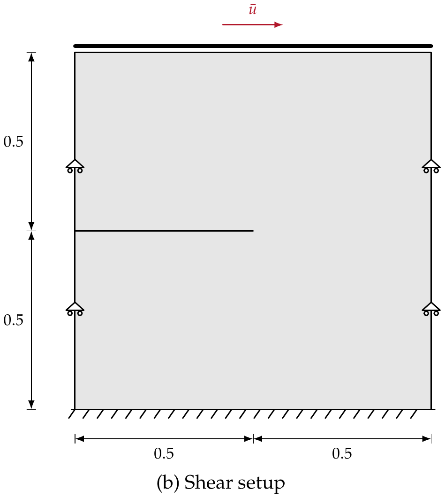
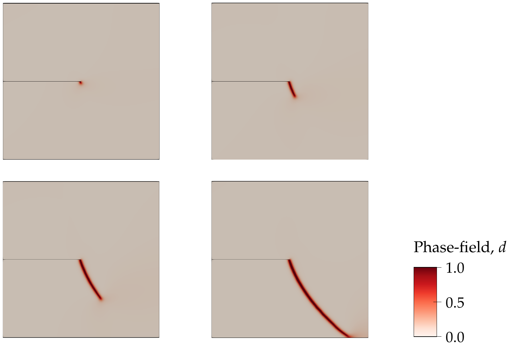
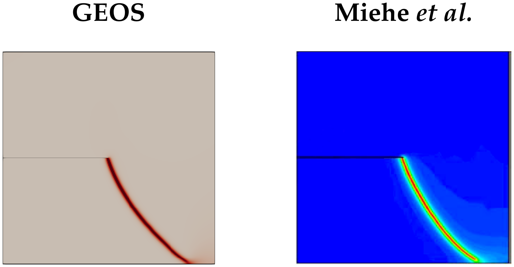
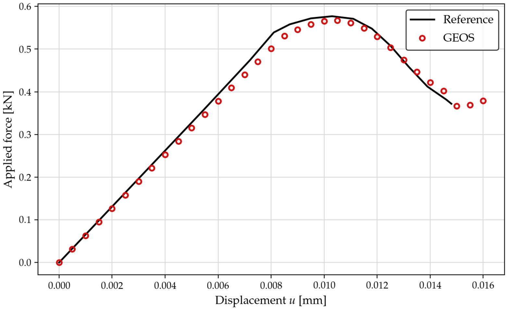

.. _ExampleSingleEdgeNotchShear:

##############################################################################
Single-edge Notched Block: Shear
##############################################################################

**Context**

In this example, we use the phase-field fracture solver of GEOS to simulate the propagation of
a crack in a single-edge notched square block subjected to shear. Together with its mode-I
counterpart (:ref:`ExampleSingleEdgeNotchTension`), this configuration is one of the reference
benchmarks introduced by
`Miehe, Hofacker and Welschinger (2010) <https://doi.org/10.1016/j.cma.2010.04.011>`__. The
loading generates a mixed-mode response, so that the crack follows a curved path: the case
verifies that the model predicts not only the load-carrying capacity but also the direction of
crack propagation.

**Input files**

This example uses no external input file. It shares its base file with the tension case,

.. code-block:: console

  inputFiles/phaseField/benchmark/singleEdgeNotch/PhaseFieldFracture_SingleEdgeNotch_base_iterative.xml

and adds a case file:

.. code-block:: console

  inputFiles/phaseField/benchmark/singleEdgeNotch/PhaseFieldFracture_SingleEdgeNotchShear_benchmark.xml

A reduced version of the same problem, used as a smoke test in the integrated test suite, is
available at:

.. code-block:: console

  inputFiles/phaseField/benchmark/singleEdgeNotch/PhaseFieldFracture_SingleEdgeNotchShear_smoke.xml

A Python script used to extract and post-process the reaction force on the loaded boundary is
provided at:

.. code-block:: console

  src/docs/sphinx/advancedExamples/validationStudies/phaseField/SingleEdgeNotch-Shear/extractForce_shear.py

------------------------------------------------------------------
Description of the case
------------------------------------------------------------------

The specimen is the same unit square with a horizontal notch extending from the left edge to
the center of the sample. The loading differs: a horizontal displacement is imposed on the top
edge, while the vertical displacement is restrained on the four edges, which provides the side
supports preventing rigid-body rotation. The resulting stress state at the notch tip is mixed,
and the crack initiates at an angle before curving down towards the bottom-right corner of the
specimen.

.. _singleEdgeNotchShearSketchFig:

   Sketch of the problem (dimensions in mm)

As in the tension case, the model is one element thick and the out-of-plane displacement is
restrained, which enforces plane-strain conditions. The phase-field formulation and the model
options available in GEOS are described in :ref:`PhaseFieldFractureSolver`, and the
constitutive parameters in :ref:`ExampleSingleEdgeNotchTension`: this case uses the same brittle
model with the quadratic (AT2) dissipation and the spectral split, with
:math:`G_c` = 2.7 N/mm and :math:`L` = 7.5x10\ :sup:`-3` mm.

------------------------------------------------------------------
Mesh
------------------------------------------------------------------

The crack path is not known a priori and covers a much larger region than in the tension case.
The refined blocks therefore extend over the whole lower-right quadrant of the specimen, with an
element size of 2x10\ :sup:`-3` mm, that is about one quarter of the regularization length,
for a total of about 99,000 eight-node hexahedra (``C3D8``).

.. literalinclude:: ../../../../../../../inputFiles/phaseField/benchmark/singleEdgeNotch/PhaseFieldFracture_SingleEdgeNotchShear_benchmark.xml
    :language: xml
    :start-after: <!-- SPHINX_MESH -->
    :end-before: <!-- SPHINX_MESH_END -->

------------------------------------------------------------------
Solvers
------------------------------------------------------------------

The solver stack is identical to the tension case: a ``PhaseFieldFracture`` coupling solver
driving a ``SolidMechanicsLagrangianFEM`` solver and a ``PhaseFieldDamageFEM`` solver in a
staggered fashion, all defined in the shared base file. See
:ref:`ExampleSingleEdgeNotchTension` for a detailed description.

-----------------------------------------------------------
Initial notch
-----------------------------------------------------------

The notch is a geometric discontinuity created before the first load increment by the
``SurfaceGenerator`` solver, triggered by the ``preFracture`` ``SoloEvent``. The faces to be
split are selected by a thin box covering the notch plane:

.. literalinclude:: ../../../../../../../inputFiles/phaseField/benchmark/singleEdgeNotch/PhaseFieldFracture_SingleEdgeNotchShear_benchmark.xml
    :language: xml
    :start-after: <!-- SPHINX_GEOMETRY -->
    :end-before: <!-- SPHINX_GEOMETRY_END -->

-----------------------------------------------------------
Boundary conditions
-----------------------------------------------------------

A horizontal displacement growing linearly with time, :math:`u_x = \dot{u} \, t` with
:math:`\dot{u}` = 10\ :sup:`-5` mm/s, is imposed on the top edge (``ypos``). The vertical
displacement is restrained on the four lateral boundaries (``ypos``, ``yneg``, ``xneg`` and
``xpos``), the bottom edge is also restrained horizontally, and the out-of-plane displacement
is set to zero everywhere.

.. literalinclude:: ../../../../../../../inputFiles/phaseField/benchmark/singleEdgeNotch/PhaseFieldFracture_SingleEdgeNotchShear_benchmark.xml
    :language: xml
    :start-after: <!-- SPHINX_BC -->
    :end-before: <!-- SPHINX_BC_END -->

-----------------------------------------------------------
Time stepping
-----------------------------------------------------------

The run stops at :math:`t` = 1600 s, that is a prescribed displacement of
1.6x10\ :sup:`-2` mm. Unlike the tension case, the post-peak response is gradual, so a uniform
time step of 1 s is used throughout:

.. literalinclude:: ../../../../../../../inputFiles/phaseField/benchmark/singleEdgeNotch/PhaseFieldFracture_SingleEdgeNotchShear_benchmark.xml
    :language: xml
    :start-after: <!-- SPHINX_EVENTS -->
    :end-before: <!-- SPHINX_EVENTS_END -->

---------------------------------
Inspecting results
---------------------------------

The figure below shows the damage field at four instants of the loading history. Damage
nucleates at the notch tip, propagates at an angle of about 60 degrees from the notch plane, and
then curves progressively towards the bottom-right corner of the specimen.

.. _singleEdgeNotchShearDamageFig:

   Phase-field damage evolution

The final crack path is compared with the reference solution below. The curved trajectory
predicted by GEOS matches the reference, which is the discriminating result for this benchmark.

.. _singleEdgeNotchShearComparisonFig:

   Final damage field: GEOS (left) and reference solution (right)

The horizontal reaction force on the loaded boundary is obtained by integrating the
``averageStress`` field over the faces lying on the top edge and rescaling to the 1 mm thick
specimen of the reference. GEOS follows the reference along the loading branch and reproduces
the gradual softening that follows the onset of mixed-mode crack growth.

.. _singleEdgeNotchShearForceFig:

   Force applied on the top boundary versus imposed displacement

.. note::
   The figure above is produced by ``extractForce_shear.py``. The script accepts several
   ``.pvd`` files, which allows a run restarted from a checkpoint to be post-processed as a
   single time series, and takes the force component to plot through the ``--component``
   argument (``x`` by default for this case). It requires the ``vtk`` Python module.

------------------------------------------------------------------
To go further
------------------------------------------------------------------

**Related examples**

- :ref:`ExampleSingleEdgeNotchTension`, the mode-I counterpart of this benchmark, which
  describes the phase-field formulation and the constitutive parameters in detail.
- :ref:`ExampleThreePointsBendingWithHoles`, where the crack path is driven by the interaction
  between bending and geometric features.

**Feedback on this example**

For any feedback on this example, please submit a
`GitHub issue on the project's GitHub page <https://github.com/GEOS-DEV/GEOS/issues>`_.
