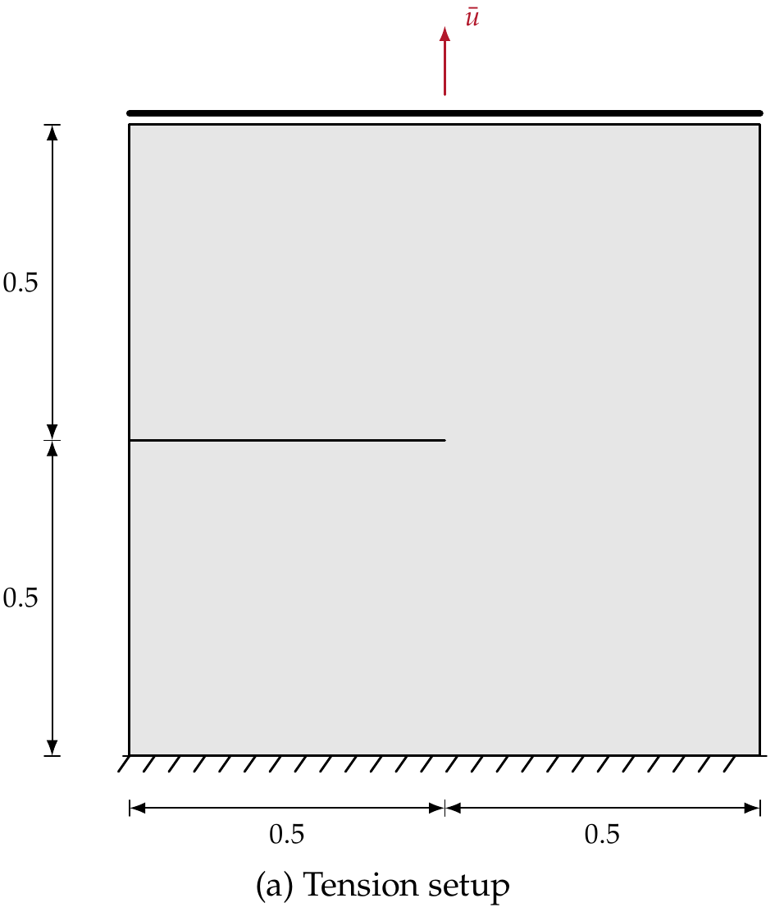
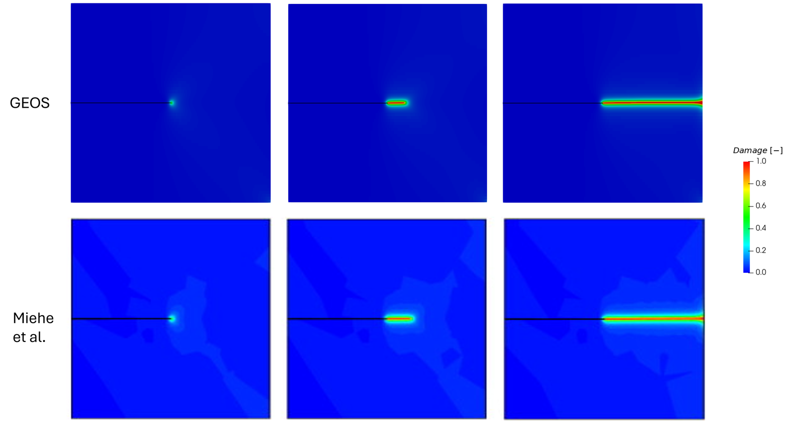
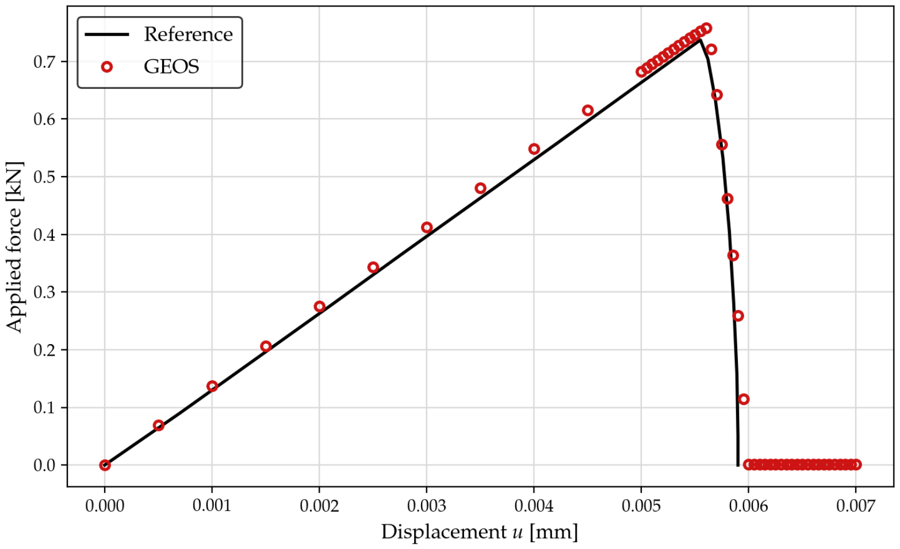

.. _ExampleSingleEdgeNotchTension:

##############################################################################
Single-edge Notched Block: Tension
##############################################################################

**Context**

In this example, we use the phase-field fracture solver of GEOS to simulate the propagation
of a crack in a single-edge notched square block subjected to tension. This configuration is
the mode-I reference benchmark introduced by
`Miehe, Hofacker and Welschinger (2010) <https://doi.org/10.1016/j.cma.2010.04.011>`__ and is
used here to verify both the predicted crack path and the load-displacement response of the
GEOS implementation. The companion mode-II configuration is documented in
:ref:`ExampleSingleEdgeNotchShear`.

**Input files**

This example uses no external input file. Everything required is contained within two GEOS
input files, a base file shared with the shear case:

.. code-block:: console

  inputFiles/phaseField/benchmark/singleEdgeNotch/PhaseFieldFracture_SingleEdgeNotch_base_iterative.xml

and a case file:

.. code-block:: console

  inputFiles/phaseField/benchmark/singleEdgeNotch/PhaseFieldFracture_SingleEdgeNotchTension_benchmark.xml

A reduced version of the same problem, used as a smoke test in the integrated test suite, is
available at:

.. code-block:: console

  inputFiles/phaseField/benchmark/singleEdgeNotch/PhaseFieldFracture_SingleEdgeNotchTension_smoke.xml

A Python script used to extract and post-process the reaction force on the loaded boundary is
provided at:

.. code-block:: console

  src/docs/sphinx/advancedExamples/validationStudies/phaseField/SingleEdgeNotch-Tension/extractForce_tension.py

------------------------------------------------------------------
Description of the case
------------------------------------------------------------------

We consider a square specimen of unit side length containing a horizontal notch that extends
from the left edge to the center of the sample, at mid-height. The bottom edge is fully
restrained, and a uniform vertical displacement is imposed on the top edge. The loading
produces a predominantly mode-I response: damage localizes at the notch tip and the crack
propagates nearly straight through the remaining ligament, until the specimen loses its
load-carrying capacity.

.. _singleEdgeNotchTensionSketchFig:

   Sketch of the problem (dimensions in mm)

The model is a single element thick in the out-of-plane direction and the out-of-plane
displacement is restrained on both faces, which enforces plane-strain conditions.

------------------------------------------------------------------
Phase-field fracture model
------------------------------------------------------------------

The formulation solved here, the model options available in GEOS and their valid combinations
are described in :ref:`PhaseFieldFractureSolver`. In short, the sharp crack surface is replaced
by a damage field :math:`d`, ranging from 0 in the intact material to 1 in the fully broken
material, whose growth is driven by the crack-driving part :math:`\psi^{+}` of the strain energy
density and opposed by the fracture dissipation :math:`G_c`, regularized over a length
:math:`L`.

This benchmark uses the combination of the reference solution: the brittle fracture model
(``fractureModelType="Brittle"``), the quadratic AT2 local dissipation
(``localDissipationOption="Quadratic"``) and the spectral split of the strain energy
(``DamageSpectralElasticIsotropic``), which prevents the crack from growing in compression.

------------------------------------------------------------------
Mesh
------------------------------------------------------------------

The mesh is generated internally, with graded blocks that refine the region where the crack is
expected to propagate. The element size is 10\ :sup:`-3` mm in the process zone, i.e. one
seventh of the regularization length :math:`L`, and coarsens to 1.5x10\ :sup:`-2` mm away from
the crack path, for a total of 96,000 eight-node hexahedra (``C3D8``).

.. literalinclude:: ../../../../../../../inputFiles/phaseField/benchmark/singleEdgeNotch/PhaseFieldFracture_SingleEdgeNotchTension_benchmark.xml
    :language: xml
    :start-after: <!-- SPHINX_MESH -->
    :end-before: <!-- SPHINX_MESH_END -->

.. note::
   Resolving a phase-field crack requires several elements across the regularization length
   :math:`L`. A mesh that is too coarse with respect to :math:`L` overestimates the dissipated
   energy and therefore the peak load.

------------------------------------------------------------------
Solvers
------------------------------------------------------------------

The phase-field fracture problem is solved with a staggered (sequential) scheme, in which the
mechanical equilibrium and the damage evolution are solved in turn at each load increment. This
requires three solvers.

The coupling solver, of type ``PhaseFieldFracture`` (see :ref:`XML_PhaseFieldFracture`), points
to the two single-physics solvers. The attribute ``subcycling="0"`` requests a single staggered
pass per time step, which is the operator-split algorithm of the reference solution.

.. literalinclude:: ../../../../../../../inputFiles/phaseField/benchmark/singleEdgeNotch/PhaseFieldFracture_SingleEdgeNotch_base_iterative.xml
    :language: xml
    :start-after: <!-- SPHINX_PHASEFIELD_SOLVER -->
    :end-before: <!-- SPHINX_PHASEFIELD_SOLVER_END -->

The mechanics solver, of type ``SolidMechanicsLagrangianFEM`` (see
:ref:`SolidMechanicsLagrangianFEM`), solves the quasi-static momentum balance with the degraded
stiffness:

.. literalinclude:: ../../../../../../../inputFiles/phaseField/benchmark/singleEdgeNotch/PhaseFieldFracture_SingleEdgeNotch_base_iterative.xml
    :language: xml
    :start-after: <!-- SPHINX_SOLID_SOLVER -->
    :end-before: <!-- SPHINX_SOLID_SOLVER_END -->

The damage solver, of type ``PhaseFieldDamageFEM`` (see :ref:`XML_PhaseFieldDamageFEM`), solves
the phase-field equation. ``irreversibilityFlag="1"`` prevents healing, and
``damageUpperBound="0.95"`` keeps the degraded stiffness away from zero, which improves the
robustness of the mechanical solve once the crack is fully formed:

.. literalinclude:: ../../../../../../../inputFiles/phaseField/benchmark/singleEdgeNotch/PhaseFieldFracture_SingleEdgeNotch_base_iterative.xml
    :language: xml
    :start-after: <!-- SPHINX_DAMAGE_SOLVER -->
    :end-before: <!-- SPHINX_DAMAGE_SOLVER_END -->

Both single-physics solvers use a GMRES solver preconditioned by algebraic multigrid. A variant
of the base file relying on a direct solver is also provided
(``PhaseFieldFracture_SingleEdgeNotch_base_direct.xml``) and is used by the smoke test.

------------------------------
Constitutive laws
------------------------------

The material is described by a ``DamageSpectralElasticIsotropic`` model, which combines linear
isotropic elasticity with the spectral split of the strain energy. The elastic parameters are
those of the reference solution, :math:`\lambda` = 121.15 kN/mm\ :sup:`2` and :math:`\mu` =
80.77 kN/mm\ :sup:`2`, expressed here as a bulk and a shear modulus:

.. literalinclude:: ../../../../../../../inputFiles/phaseField/benchmark/singleEdgeNotch/PhaseFieldFracture_SingleEdgeNotch_base_iterative.xml
    :language: xml
    :start-after: <!-- SPHINX_MATERIAL -->
    :end-before: <!-- SPHINX_MATERIAL_END -->

With ``fractureModelType="Brittle"`` and ``localDissipationOption="Quadratic"`` the energy
threshold :math:`\psi_c` vanishes, so ``criticalStrainEnergy`` is not used. The parameters of
the simulation are summarized in the following table.

+------------------+---------------------------------+------------------+--------------------+
| Symbol           | Parameter                       | Unit             | Value              |
+==================+=================================+==================+====================+
| :math:`K`        | Bulk modulus                    | [MPa]            | 1.75x10\ :sup:`5`  |
+------------------+---------------------------------+------------------+--------------------+
| :math:`G`        | Shear modulus                   | [MPa]            | 8.077x10\ :sup:`4` |
+------------------+---------------------------------+------------------+--------------------+
| :math:`E`        | Young's modulus                 | [MPa]            | 2.10x10\ :sup:`5`  |
+------------------+---------------------------------+------------------+--------------------+
| :math:`\nu`      | Poisson's ratio                 | [-]              | 0.30               |
+------------------+---------------------------------+------------------+--------------------+
| :math:`G_c`      | Critical fracture energy        | [N/mm]           | 2.7                |
+------------------+---------------------------------+------------------+--------------------+
| :math:`L`        | Regularization length           | [mm]             | 7.5x10\ :sup:`-3`  |
+------------------+---------------------------------+------------------+--------------------+
| :math:`h`        | Element size in the crack band  | [mm]             | 1.0x10\ :sup:`-3`  |
+------------------+---------------------------------+------------------+--------------------+
| :math:`a`        | Specimen side length            | [mm]             | 1.0                |
+------------------+---------------------------------+------------------+--------------------+
| :math:`t`        | Specimen thickness              | [mm]             | 1.0x10\ :sup:`-2`  |
+------------------+---------------------------------+------------------+--------------------+
| :math:`\dot{u}`  | Loading rate                    | [mm/s]           | 1.0x10\ :sup:`-5`  |
+------------------+---------------------------------+------------------+--------------------+

-----------------------------------------------------------
Initial notch
-----------------------------------------------------------

The notch is not smeared through the damage field: it is an actual geometric discontinuity,
obtained by splitting the mesh along the notch faces before the first load increment. The faces
to be split are tagged in the ``Geometry`` block,

.. literalinclude:: ../../../../../../../inputFiles/phaseField/benchmark/singleEdgeNotch/PhaseFieldFracture_SingleEdgeNotchTension_benchmark.xml
    :language: xml
    :start-after: <!-- SPHINX_GEOMETRY -->
    :end-before: <!-- SPHINX_GEOMETRY_END -->

and are flagged as separable and already ruptured through the ``isFaceSeparable`` and
``ruptureState`` fields (see the ``FieldSpecifications`` block below). The ``SurfaceGenerator``
solver is then triggered once, through a ``SoloEvent`` named ``preFracture``, which performs the
topological split.

-----------------------------------------------------------
Boundary conditions
-----------------------------------------------------------

A vertical displacement growing linearly with time, :math:`u_y = \dot{u} \, t` with
:math:`\dot{u}` = 10\ :sup:`-5` mm/s, is imposed on the top edge (``ypos``) through the
``loadRamp`` table function. The bottom edge (``yneg``) is restrained both horizontally and
vertically, and the out-of-plane displacement is set to zero everywhere.

.. literalinclude:: ../../../../../../../inputFiles/phaseField/benchmark/singleEdgeNotch/PhaseFieldFracture_SingleEdgeNotchTension_benchmark.xml
    :language: xml
    :start-after: <!-- SPHINX_BC -->
    :end-before: <!-- SPHINX_BC_END -->

-----------------------------------------------------------
Time stepping
-----------------------------------------------------------

The simulated time is the loading parameter: the run stops at :math:`t` = 700 s, that is a
prescribed displacement of 7x10\ :sup:`-3` mm. Because the crack propagates abruptly once the
peak load is reached, the time step is reduced by a factor of ten beyond :math:`t` = 500 s:

.. literalinclude:: ../../../../../../../inputFiles/phaseField/benchmark/singleEdgeNotch/PhaseFieldFracture_SingleEdgeNotchTension_benchmark.xml
    :language: xml
    :start-after: <!-- SPHINX_EVENTS -->
    :end-before: <!-- SPHINX_EVENTS_END -->

---------------------------------
Inspecting results
---------------------------------

We request VTK-format output files and use Paraview to visualize the results. The figure below
compares the damage field predicted by GEOS (top row) with the reference solution of Miehe et al.
(bottom row), at three successive stages of the loading history. Damage nucleates at the notch
tip and the crack propagates horizontally across the remaining ligament: GEOS reproduces the
straight mode-I path, and the width of the damage band, which is controlled by the regularization
length :math:`L`, is consistent with the reference.

.. _singleEdgeNotchTensionDamageFig:

   Phase-field damage evolution: GEOS (top row) and reference solution (bottom row)

The reaction force on the loaded boundary is obtained by integrating the ``averageStress`` field
over the faces lying on the top edge, and is rescaled to the 1 mm thick specimen of the
reference. The GEOS response follows the reference through the elastic branch and the peak load,
and captures the sharp post-peak drop associated with the rapid crack growth.

.. _singleEdgeNotchTensionForceFig:

   Force applied on the top boundary versus imposed displacement

.. note::
   The figure above is produced by ``extractForce_tension.py``, which reads the ``.pvd`` time
   series written by GEOS. Run it from the directory containing the simulation output, or pass
   the path to the ``.pvd`` file as an argument. The script requires the ``vtk`` Python module.

------------------------------------------------------------------
To go further
------------------------------------------------------------------

**Related examples**

- :ref:`ExampleSingleEdgeNotchShear`, the mode-II counterpart of this benchmark, which shares
  the same specimen and base input file.
- :ref:`ExampleThreePointsBendingWithHoles`, where the crack path is driven by the interaction
  between bending and geometric features.

**Feedback on this example**

For any feedback on this example, please submit a
`GitHub issue on the project's GitHub page <https://github.com/GEOS-DEV/GEOS/issues>`_.
