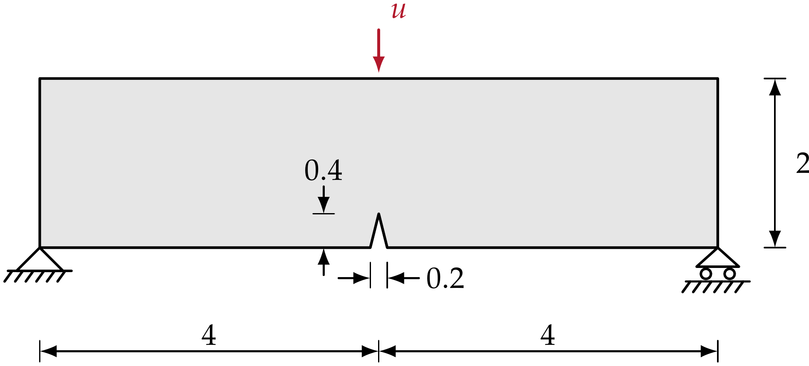
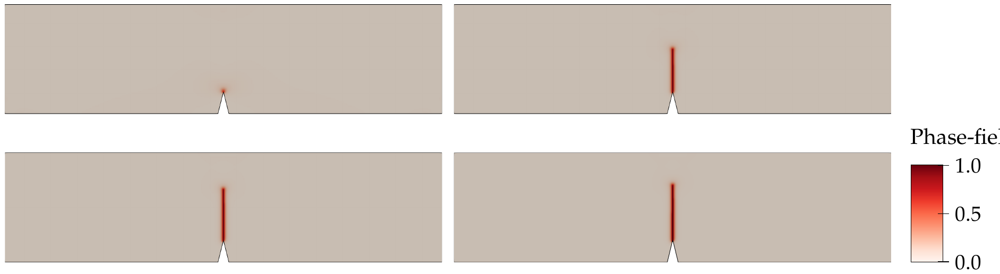
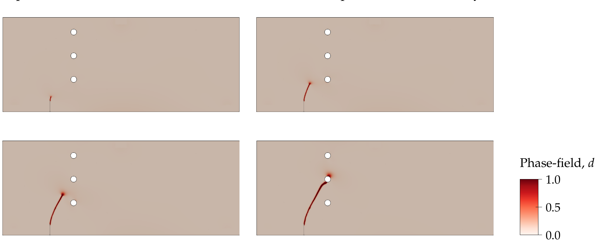
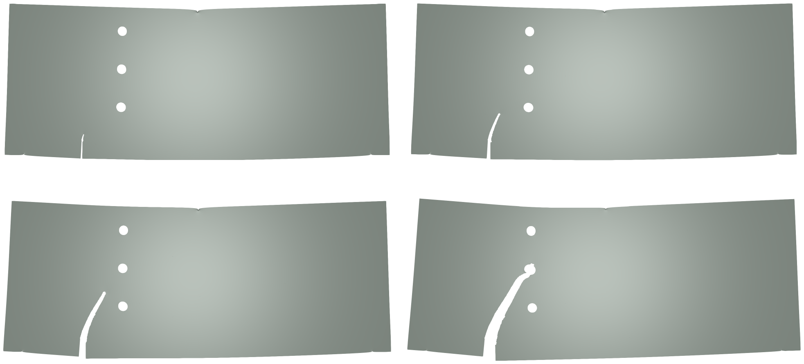
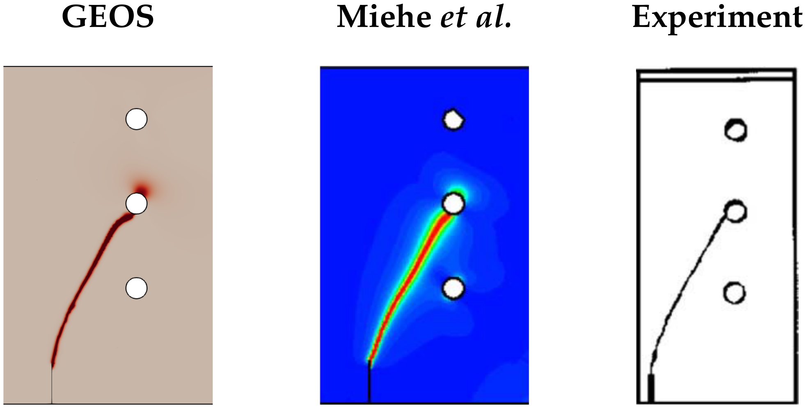

.. _ExampleThreePointsBendingWithHoles:

##############################################################################
Three-point Bending of a Notched Beam with Holes
##############################################################################

**Context**

In this example, we use the phase-field fracture solver of GEOS to simulate crack propagation
in a notched beam loaded in three-point bending. Two configurations are considered: a plain
notched beam, which produces a straight mode-I crack and serves as an introduction, and the same
beam perforated by three circular holes, which perturb the bending-induced stress field and
deflect the crack. The second configuration is a classical benchmark for which both a reference
phase-field solution
(`Miehe, Hofacker and Welschinger, 2010 <https://doi.org/10.1016/j.cma.2010.04.011>`__) and
experimental crack paths are available, and it verifies the ability of the model to capture the
interaction between a propagating crack and geometric features.

**Input files**

The plain notched beam uses a base file and a case file:

.. code-block:: console

  inputFiles/phaseField/benchmark/threePointsBending/PhaseFieldFracture_ThreePointsBending_base.xml

.. code-block:: console

  inputFiles/phaseField/benchmark/threePointsBending/PhaseFieldFracture_ThreePointsBending_benchmark.xml

and the beam with holes follows the same structure:

.. code-block:: console

  inputFiles/phaseField/benchmark/threePointsBendingWithHoles/PhaseFieldFracture_ThreePointsBendWithHoles_base.xml

.. code-block:: console

  inputFiles/phaseField/benchmark/threePointsBendingWithHoles/PhaseFieldFracture_ThreePointsBendWithHoles_benchmark.xml

Unlike the single-edge notched benchmarks, these two cases rely on external meshes, because of
the notch and of the holes. The benchmark files point to the refined meshes hosted in the
``GEOSDATA`` repository, while coarser versions, used by the smoke tests of the integrated test
suite, are distributed with the input files:

.. code-block:: console

  inputFiles/phaseField/benchmark/threePointsBending/mesh/threePointsBendingSingleNotchCoarse.vtu
  inputFiles/phaseField/benchmark/threePointsBendingWithHoles/mesh/threePointsBendingWithHolesCoarse.vtu

------------------------------------------------------------------
Introduction: the plain notched beam
------------------------------------------------------------------

The reference configuration is a beam of length 8 and height 2, simply supported at its two
lower corners and loaded by a prescribed vertical displacement applied at the top mid-span. A
V-shaped notch, 0.2 wide and 0.4 deep, is machined at the center of the lower edge.

.. _threePointsBendingSketchFig:

   Plain notched beam: problem setup

The response is bending-dominated and essentially mode-I: damage nucleates at the notch tip and
the crack propagates vertically towards the loading point.

.. _threePointsBendingDamageFig:

   Plain notched beam: phase-field damage evolution

The material is described by a ``DamageSpectralElasticIsotropic`` model, with the brittle
fracture model and the quadratic (AT2) local dissipation. The phase-field formulation and the
model options available in GEOS are described in :ref:`PhaseFieldFractureSolver`.

.. literalinclude:: ../../../../../../../inputFiles/phaseField/benchmark/threePointsBending/PhaseFieldFracture_ThreePointsBending_base.xml
    :language: xml
    :start-after: <!-- SPHINX_MATERIAL -->
    :end-before: <!-- SPHINX_MATERIAL_END -->

The boundary conditions differ from the single-edge notched cases in two respects. First, the
supports and the loading point are node sets carried by the mesh
(``support_left_line``, ``support_right_line`` and ``load_line_full_thickness``) rather than
boundaries of a structured grid: the left support is pinned, the right one acts as a roller, and
the imposed displacement is applied on the top mid-span line. Second, an additional condition
named ``contactDamageGuard`` prescribes a zero damage in the immediate vicinity of the supports
and of the loading point, which prevents the stress concentration due to these point
constraints from nucleating spurious cracks.

.. literalinclude:: ../../../../../../../inputFiles/phaseField/benchmark/threePointsBending/PhaseFieldFracture_ThreePointsBending_base.xml
    :language: xml
    :start-after: <!-- SPHINX_BC -->
    :end-before: <!-- SPHINX_BC_END -->

The boxes defining the damage-free pads are given in the ``Geometry`` block, together with the
mid-plane on which the out-of-plane displacement is restrained:

.. literalinclude:: ../../../../../../../inputFiles/phaseField/benchmark/threePointsBending/PhaseFieldFracture_ThreePointsBending_base.xml
    :language: xml
    :start-after: <!-- SPHINX_GEOMETRY -->
    :end-before: <!-- SPHINX_GEOMETRY_END -->

------------------------------------------------------------------
Description of the case: bending with holes
------------------------------------------------------------------

The perforated specimen is a beam of length 20 and height 8, supported 1 unit away from each end
and loaded at mid-span. A starter notch is located 3 units to the right of the left support, and
three holes of diameter 0.5 are aligned vertically 4 units to the left of the loading axis, at
heights 2.75, 4.75 and 6.75 above the lower edge.

.. _threePointsBendingHolesSketchFig:
.. figure:: sketch.png
   :align: center
   :width: 700
   :figclass: align-center

   Three-point bending with holes: problem setup

The holes perturb the bending-induced stress field, so the crack does not propagate straight
towards the loading point: depending on the distance between the crack tip and the hole
boundaries, it can be attracted, deflected, or temporarily arrested. This makes the predicted
crack path a sensitive measure of the quality of the model.

------------------------------------------------------------------
Mesh
------------------------------------------------------------------

The mesh is imported with the ``VTKMesh`` block. The ``nodesetNames`` attribute requests the
import of the node sets defined in the file, which are used later to apply the supports, the
loading and the starter notch.

.. literalinclude:: ../../../../../../../inputFiles/phaseField/benchmark/threePointsBendingWithHoles/PhaseFieldFracture_ThreePointsBendWithHoles_benchmark.xml
    :language: xml
    :start-after: <!-- SPHINX_MESH -->
    :end-before: <!-- SPHINX_MESH_END -->

.. note::
   The path above is relative to the input file and assumes that the ``GEOSDATA`` repository has
   been cloned next to the GEOS repository. To run the case with the coarse mesh distributed
   with GEOS, replace the ``file`` attribute by
   ``mesh/threePointsBendingWithHolesCoarse.vtu``, as done in the smoke input file. Note that
   the coarse mesh is too coarse with respect to the regularization length to reproduce the
   reference crack path: it is only intended to exercise the code path.

------------------------------
Constitutive laws
------------------------------

The elastic properties are the same as for the plain beam. The critical fracture energy is
:math:`G_c` = 1.0 and the regularization length is :math:`L` = 0.025.

.. literalinclude:: ../../../../../../../inputFiles/phaseField/benchmark/threePointsBendingWithHoles/PhaseFieldFracture_ThreePointsBendWithHoles_base.xml
    :language: xml
    :start-after: <!-- SPHINX_MATERIAL -->
    :end-before: <!-- SPHINX_MATERIAL_END -->

The parameters of the two configurations are summarized below.

+-----------------+---------------------------------+--------------------+--------------------+
| Symbol          | Parameter                       | Plain beam         | Beam with holes    |
+=================+=================================+====================+====================+
| :math:`K`       | Bulk modulus [MPa]              | 1.733x10\ :sup:`4` | 1.733x10\ :sup:`4` |
+-----------------+---------------------------------+--------------------+--------------------+
| :math:`G`       | Shear modulus [MPa]             | 8.0x10\ :sup:`3`   | 8.0x10\ :sup:`3`   |
+-----------------+---------------------------------+--------------------+--------------------+
| :math:`E`       | Young's modulus [MPa]           | 2.08x10\ :sup:`4`  | 2.08x10\ :sup:`4`  |
+-----------------+---------------------------------+--------------------+--------------------+
| :math:`\nu`     | Poisson's ratio [-]             | 0.30               | 0.30               |
+-----------------+---------------------------------+--------------------+--------------------+
| :math:`G_c`     | Critical fracture energy [N/mm] | 0.5                | 1.0                |
+-----------------+---------------------------------+--------------------+--------------------+
| :math:`L`       | Regularization length [mm]      | 0.03               | 0.025              |
+-----------------+---------------------------------+--------------------+--------------------+
| :math:`\dot{u}` | Loading rate [mm/s]             | 1.0x10\ :sup:`-4`  | 4.0x10\ :sup:`-3`  |
+-----------------+---------------------------------+--------------------+--------------------+

-----------------------------------------------------------
Initial notch and boundary conditions
-----------------------------------------------------------

The starter notch of the perforated beam is turned into a geometric discontinuity: the node set
``starter_notch_shared_face_nodes`` imported from the mesh is used to flag the corresponding
faces as separable and already ruptured, and the ``SurfaceGenerator`` solver, triggered by the
``preFracture`` ``SoloEvent``, performs the topological split before the first load increment.
The supports, the loading and the damage-free pads follow the same pattern as for the plain
beam.

.. literalinclude:: ../../../../../../../inputFiles/phaseField/benchmark/threePointsBendingWithHoles/PhaseFieldFracture_ThreePointsBendWithHoles_base.xml
    :language: xml
    :start-after: <!-- SPHINX_BC -->
    :end-before: <!-- SPHINX_BC_END -->

-----------------------------------------------------------
Time stepping
-----------------------------------------------------------

The imposed deflection grows linearly with time at a rate of 4x10\ :sup:`-3` per unit time, and
the run stops shortly after the crack has crossed the ligament between the lower holes. As the
propagation is unstable, the time step is reduced by two orders of magnitude once the crack
starts to grow, and the output frequency is increased accordingly:

.. literalinclude:: ../../../../../../../inputFiles/phaseField/benchmark/threePointsBendingWithHoles/PhaseFieldFracture_ThreePointsBendWithHoles_benchmark.xml
    :language: xml
    :start-after: <!-- SPHINX_EVENTS -->
    :end-before: <!-- SPHINX_EVENTS_END -->

---------------------------------
Inspecting results
---------------------------------

We request VTK-format output files and use Paraview to visualize the results. The figure below
shows the damage field at four instants of the loading history: the crack initiates at the
starter notch, propagates upwards while being attracted by the lower hole, and finally reaches
the middle hole.

.. _threePointsBendingHolesDamageFig:

   Three-point bending with holes: phase-field damage evolution

The same sequence is shown below on the deformed configuration, which illustrates the bending
mode of the specimen and the opening of the crack.

.. _threePointsBendingHolesDeformedFig:

   Three-point bending with holes: deformed geometry evolution

Finally, the crack path predicted by GEOS is compared with the reference phase-field solution
and with the experimental crack path. The three trajectories agree: the crack leaves the notch,
curves towards the lower hole, passes between the lower and the middle hole, and ends at the
middle hole.

.. _threePointsBendingHolesComparisonFig:

   Three-point bending with holes: final crack path compared with the reference solution and
   with the experiment

------------------------------------------------------------------
To go further
------------------------------------------------------------------

**Related examples**

- :ref:`ExampleSingleEdgeNotchTension`, which describes the phase-field formulation, the model
  options available in GEOS and the solver setup in detail.
- :ref:`ExampleSingleEdgeNotchShear`, a mixed-mode benchmark on a structured mesh.

**Feedback on this example**

For any feedback on this example, please submit a
`GitHub issue on the project's GitHub page <https://github.com/GEOS-DEV/GEOS/issues>`_.
