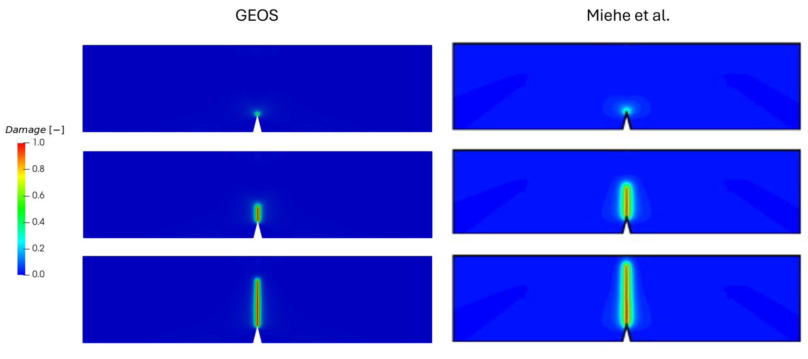

.. _ExampleThreePointsBending:

##############################################################################
Symmetric Three-point Bending of a Notched Beam
##############################################################################

**Context**

In this example, we use the phase-field fracture solver of GEOS to simulate the propagation of
a crack in a notched beam loaded in symmetric three-point bending. This is the bending
benchmark of
`Miehe, Hofacker and Welschinger (2010) <https://doi.org/10.1016/j.cma.2010.04.011>`__: the
configuration produces a bending-dominated mode-I response in which the crack initiates at the
notch tip and propagates vertically towards the loading point. It complements the single-edge
notched benchmarks (:ref:`ExampleSingleEdgeNotchTension`,
:ref:`ExampleSingleEdgeNotchShear`) by exercising the model on a structural specimen, with an
imported mesh and point supports. The perforated variant of the same beam, where the crack path
is deflected by circular holes, is documented in :ref:`ExampleThreePointsBendingWithHoles`.

**Input files**

This example uses a base file and a case file:

.. code-block:: console

  inputFiles/phaseField/benchmark/threePointsBending/PhaseFieldFracture_ThreePointsBending_base.xml

.. code-block:: console

  inputFiles/phaseField/benchmark/threePointsBending/PhaseFieldFracture_ThreePointsBending_benchmark.xml

A reduced version, used as a smoke test in the integrated test suite, is available at:

.. code-block:: console

  inputFiles/phaseField/benchmark/threePointsBending/PhaseFieldFracture_ThreePointsBending_smoke.xml

Unlike the single-edge notched benchmarks, this case relies on an external mesh, because of the
notch and of the node sets carrying the supports and the loading. The benchmark file points to
the refined mesh hosted in the ``GEOSDATA`` repository, while a coarser version, used by the
smoke test, is distributed with the input files:

.. code-block:: console

  inputFiles/phaseField/benchmark/threePointsBending/mesh/threePointsBendingSingleNotchCoarse.vtu

------------------------------------------------------------------
Description of the case
------------------------------------------------------------------

The specimen is a beam of length 8 and height 2, simply supported at its two lower corners and
loaded by a prescribed vertical displacement applied at the top mid-span. A V-shaped notch,
0.2 wide and 0.4 deep, is machined at the center of the lower edge.

.. _threePointsBendingSketchFig:
.. figure:: sketch.png
   :align: center
   :width: 600
   :figclass: align-center

   Sketch of the problem

The phase-field formulation and the model options available in GEOS are described in
:ref:`PhaseFieldFractureSolver`. This benchmark uses the brittle fracture model
(``fractureModelType="Brittle"``), the quadratic AT2 local dissipation
(``localDissipationOption="Quadratic"``) and the spectral split of the strain energy
(``DamageSpectralElasticIsotropic``). With :math:`L` = 0.03 mm and a vanishing viscosity, it
corresponds to the length scale :math:`l_2` and to the curve :math:`\eta` = 0 of the reference
load-deflection figure.

------------------------------------------------------------------
Mesh
------------------------------------------------------------------

The mesh is imported with the ``VTKMesh`` block. The ``nodesetNames`` attribute requests the
import of the node sets defined in the file, which are used later to apply the supports, the
loading and the starter notch.

.. literalinclude:: ../../../../../../../inputFiles/phaseField/benchmark/threePointsBending/PhaseFieldFracture_ThreePointsBending_benchmark.xml
    :language: xml
    :start-after: <!-- SPHINX_MESH -->
    :end-before: <!-- SPHINX_MESH_END -->

.. note::
   The path above is relative to the input file and assumes that the ``GEOSDATA`` repository has
   been cloned next to the GEOS repository. To run the case with the coarse mesh distributed
   with GEOS, replace the ``file`` attribute by ``mesh/threePointsBendingSingleNotchCoarse.vtu``,
   as done in the smoke input file. That mesh is too coarse with respect to the regularization
   length to reproduce the reference response: it only exercises the code path.

------------------------------------------------------------------
Solvers
------------------------------------------------------------------

The solver stack is the one described in :ref:`PhaseFieldFractureSolver`: a
``PhaseFieldFracture`` coupling solver driving a ``SolidMechanicsLagrangianFEM`` solver and a
``PhaseFieldDamageFEM`` solver in a staggered fashion, with a single pass per time step
(``subcycling="0"``).

.. literalinclude:: ../../../../../../../inputFiles/phaseField/benchmark/threePointsBending/PhaseFieldFracture_ThreePointsBending_benchmark.xml
    :language: xml
    :start-after: <!-- SPHINX_PHASEFIELD_SOLVER -->
    :end-before: <!-- SPHINX_PHASEFIELD_SOLVER_END -->

------------------------------
Constitutive laws
------------------------------

The material is described by a ``DamageSpectralElasticIsotropic`` model. The elastic parameters
correspond to :math:`\lambda` = 12 kN/mm\ :sup:`2` and :math:`\mu` = 8 kN/mm\ :sup:`2`, that is
a concrete-like stiffness, expressed here as a bulk and a shear modulus.

.. literalinclude:: ../../../../../../../inputFiles/phaseField/benchmark/threePointsBending/PhaseFieldFracture_ThreePointsBending_base.xml
    :language: xml
    :start-after: <!-- SPHINX_MATERIAL -->
    :end-before: <!-- SPHINX_MATERIAL_END -->

+-----------------+---------------------------------+---------------------+
| Symbol          | Parameter                       | Value               |
+=================+=================================+=====================+
| :math:`K`       | Bulk modulus [MPa]              | 1.733x10\ :sup:`4`  |
+-----------------+---------------------------------+---------------------+
| :math:`G`       | Shear modulus [MPa]             | 8.0x10\ :sup:`3`    |
+-----------------+---------------------------------+---------------------+
| :math:`E`       | Young's modulus [MPa]           | 2.08x10\ :sup:`4`   |
+-----------------+---------------------------------+---------------------+
| :math:`\nu`     | Poisson's ratio [-]             | 0.30                |
+-----------------+---------------------------------+---------------------+
| :math:`G_c`     | Critical fracture energy [N/mm] | 0.5                 |
+-----------------+---------------------------------+---------------------+
| :math:`L`       | Regularization length [mm]      | 0.03                |
+-----------------+---------------------------------+---------------------+
| :math:`\dot{u}` | Loading rate [mm/s]             | 1.0x10\ :sup:`-4`   |
+-----------------+---------------------------------+---------------------+

-----------------------------------------------------------
Boundary conditions
-----------------------------------------------------------

The boundary conditions differ from the single-edge notched cases in two respects. First, the
supports and the loading point are node sets carried by the mesh (``support_left_line``,
``support_right_line`` and ``load_line_full_thickness``) rather than boundaries of a structured
grid: the left support is pinned, the right one acts as a roller, and the prescribed
displacement is applied on the top mid-span line. Second, an additional condition named
``contactDamageGuard`` prescribes a zero damage in the immediate vicinity of the supports and of
the loading point, which prevents the stress concentration due to these point constraints from
nucleating spurious cracks.

.. literalinclude:: ../../../../../../../inputFiles/phaseField/benchmark/threePointsBending/PhaseFieldFracture_ThreePointsBending_base.xml
    :language: xml
    :start-after: <!-- SPHINX_BC -->
    :end-before: <!-- SPHINX_BC_END -->

The boxes defining the damage-free pads are given in the ``Geometry`` block, together with the
mid-plane on which the out-of-plane displacement is restrained:

.. literalinclude:: ../../../../../../../inputFiles/phaseField/benchmark/threePointsBending/PhaseFieldFracture_ThreePointsBending_base.xml
    :language: xml
    :start-after: <!-- SPHINX_GEOMETRY -->
    :end-before: <!-- SPHINX_GEOMETRY_END -->

-----------------------------------------------------------
Time stepping
-----------------------------------------------------------

The prescribed deflection grows linearly with time at a rate of 10\ :sup:`-4` per unit time.
Because the propagation is unstable once the crack leaves the notch, the time step is reduced by
two orders of magnitude beyond :math:`t` = 360:

.. literalinclude:: ../../../../../../../inputFiles/phaseField/benchmark/threePointsBending/PhaseFieldFracture_ThreePointsBending_benchmark.xml
    :language: xml
    :start-after: <!-- SPHINX_EVENTS -->
    :end-before: <!-- SPHINX_EVENTS_END -->

.. warning::
   With these settings the run takes about 24,000 time steps, most of them after the specimen
   has failed. Restricting the refined window to the propagation phase, or lowering ``maxTime``,
   cuts the cost by a large factor without changing the part of the response that is compared
   with the reference.

-----------------------------------------------------------
Collecting the load-deflection response
-----------------------------------------------------------

The load is applied on a line of nodes, so it cannot be recovered by integrating the traction
over a boundary face, as is done for the single-edge notched benchmarks. It is obtained instead
from the shear force on a vertical cut between the left support and the load line, where the
shear force of a simply supported beam under a central load equals half of the applied load. The
``Tasks`` block therefore collects the deflection at the load line, together with the stress and
the volume of the cells of that cut:

.. literalinclude:: ../../../../../../../inputFiles/phaseField/benchmark/threePointsBending/PhaseFieldFracture_ThreePointsBending_benchmark.xml
    :language: xml
    :start-after: <!-- SPHINX_TASKS -->
    :end-before: <!-- SPHINX_TASKS_END -->

The post-processing is split in two steps, each with its own script sitting next to this case.
The first one reads the ``TimeHistory`` output of the run and reduces it to a two-column load
curve of a few kilobytes. It takes no argument:

.. code-block:: console

  cd src/docs/sphinx/advancedExamples/validationStudies/phaseField/ThreePointsBending
  python3 extractLoadCurveThreePointsBending.py

The second one draws the figure from that curve, and needs only numpy and matplotlib:

.. code-block:: console

  src/docs/sphinx/advancedExamples/validationStudies/phaseField/ThreePointsBending/plotLoadCurve.py

---------------------------------
Inspecting results
---------------------------------

We request VTK-format output files and use Paraview to visualize the results. The figure below
compares the damage field predicted by GEOS (left column) with the reference solution of Miehe
et al. (right column), at three successive stages of the loading history. Damage nucleates at
the notch tip and the crack propagates vertically towards the loading point: GEOS reproduces
the straight mode-I path of the reference, and the width of the damage band, which is
controlled by the regularization length :math:`L`, is consistent with it.

.. _threePointsBendingDamageFig:

   Phase-field damage evolution: GEOS (left column) and reference solution (right column)

------------------------------------------------------------------
To go further
------------------------------------------------------------------

**Related examples**

- :ref:`ExampleThreePointsBendingWithHoles`, the same beam perforated by three holes, where the
  crack path is deflected by the geometric features.
- :ref:`ExampleSingleEdgeNotchTension` and :ref:`ExampleSingleEdgeNotchShear`, the mode-I and
  mixed-mode benchmarks on a structured mesh.

**Feedback on this example**

For any feedback on this example, please submit a
`GitHub issue on the project's GitHub page <https://github.com/GEOS-DEV/GEOS/issues>`_.
