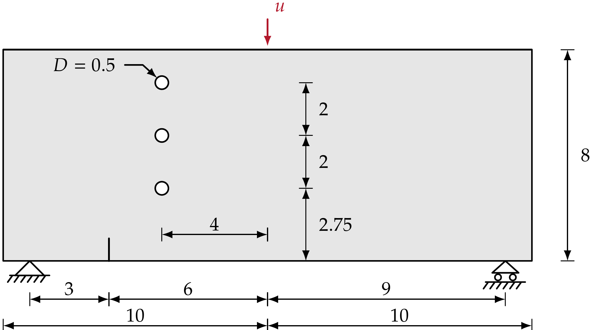
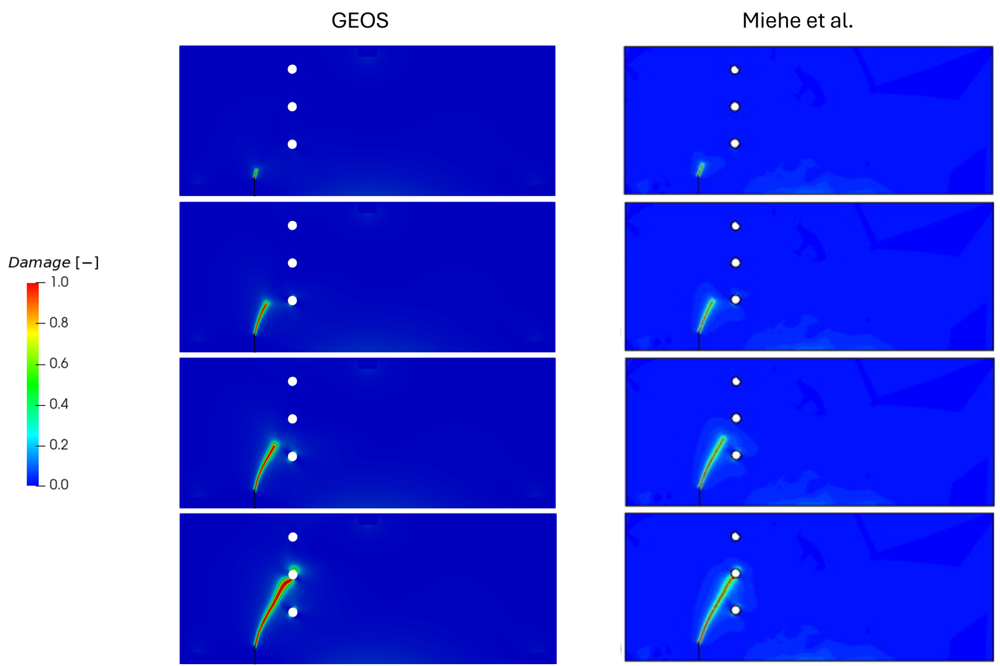
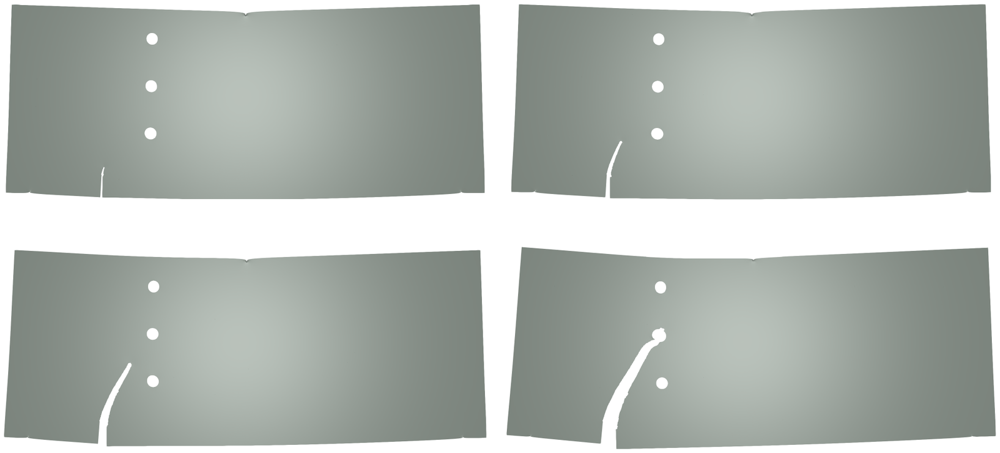

.. _ExampleThreePointsBendingWithHoles:

##############################################################################
Three-point Bending of a Notched Beam with Holes
##############################################################################

**Context**

In this example, we use the phase-field fracture solver of GEOS to simulate crack propagation in
a notched beam perforated by three circular holes and loaded in three-point bending. The holes
perturb the bending-induced stress field, so the crack does not propagate straight towards the
loading point: depending on the distance between the crack tip and the hole boundaries, it can be
attracted, deflected, or temporarily arrested. This makes the predicted crack path a sensitive
measure of the quality of the model, and both a reference phase-field solution
(`Miehe, Hofacker and Welschinger, 2010 <https://doi.org/10.1016/j.cma.2010.04.011>`__) and an
experimental crack path are available for comparison. The unperforated beam, which produces a
straight mode-I crack, is documented in :ref:`ExampleThreePointsBending`.

**Input files**

This example uses a base file and a case file:

.. code-block:: console

  inputFiles/phaseField/benchmark/threePointsBendingWithHoles/PhaseFieldFracture_ThreePointsBendWithHoles_base.xml

.. code-block:: console

  inputFiles/phaseField/benchmark/threePointsBendingWithHoles/PhaseFieldFracture_ThreePointsBendWithHoles_benchmark.xml

A reduced version, used as a smoke test in the integrated test suite, is available at:

.. code-block:: console

  inputFiles/phaseField/benchmark/threePointsBendingWithHoles/PhaseFieldFracture_ThreePointsBendWithHoles_smoke.xml

The case relies on an external mesh, because of the notch and of the holes. The benchmark file
points to the refined mesh hosted in the ``GEOSDATA`` repository, while a coarser version, used
by the smoke test, is distributed with the input files:

.. code-block:: console

  inputFiles/phaseField/benchmark/threePointsBendingWithHoles/mesh/threePointsBendingWithHolesCoarse.vtu

------------------------------------------------------------------
Description of the case
------------------------------------------------------------------

The specimen is a beam of length 20 and height 8, supported 1 unit away from each end and loaded
at mid-span. A starter notch is located 3 units to the right of the left support, and three holes
of diameter 0.5 are aligned vertically 4 units to the left of the loading axis, at heights 2.75,
4.75 and 6.75 above the lower edge.

.. _threePointsBendingHolesSketchFig:

   Sketch of the problem

The phase-field formulation and the model options available in GEOS are described in
:ref:`PhaseFieldFractureSolver`. As for the unperforated beam, this case uses the brittle
fracture model with the quadratic AT2 local dissipation and the spectral split of the strain
energy, here with :math:`G_c` = 1.0 and :math:`L` = 0.025.

------------------------------------------------------------------
Mesh
------------------------------------------------------------------

The mesh is imported with the ``VTKMesh`` block, together with the node sets carrying the
supports, the loading and the starter notch.

.. literalinclude:: ../../../../../../../inputFiles/phaseField/benchmark/threePointsBendingWithHoles/PhaseFieldFracture_ThreePointsBendWithHoles_benchmark.xml
    :language: xml
    :start-after: <!-- SPHINX_MESH -->
    :end-before: <!-- SPHINX_MESH_END -->

.. note::
   The path above is relative to the input file and assumes that the ``GEOSDATA`` repository has
   been cloned next to the GEOS repository. To run the case with the coarse mesh distributed with
   GEOS, replace the ``file`` attribute by ``mesh/threePointsBendingWithHolesCoarse.vtu``, as
   done in the smoke input file. That mesh is too coarse with respect to the regularization
   length to reproduce the reference crack path.

------------------------------
Constitutive laws
------------------------------

The elastic properties are those of the unperforated beam; the critical fracture energy and the
regularization length differ.

.. literalinclude:: ../../../../../../../inputFiles/phaseField/benchmark/threePointsBendingWithHoles/PhaseFieldFracture_ThreePointsBendWithHoles_base.xml
    :language: xml
    :start-after: <!-- SPHINX_MATERIAL -->
    :end-before: <!-- SPHINX_MATERIAL_END -->

+-----------------+---------------------------------+---------------------+
| Symbol          | Parameter                       | Value               |
+=================+=================================+=====================+
| :math:`K`       | Bulk modulus [MPa]              | 1.733x10\ :sup:`4`  |
+-----------------+---------------------------------+---------------------+
| :math:`G`       | Shear modulus [MPa]             | 8.0x10\ :sup:`3`    |
+-----------------+---------------------------------+---------------------+
| :math:`E`       | Young's modulus [MPa]           | 2.08x10\ :sup:`4`   |
+-----------------+---------------------------------+---------------------+
| :math:`\nu`     | Poisson's ratio [-]             | 0.30                |
+-----------------+---------------------------------+---------------------+
| :math:`G_c`     | Critical fracture energy [N/mm] | 1.0                 |
+-----------------+---------------------------------+---------------------+
| :math:`L`       | Regularization length [mm]      | 0.025               |
+-----------------+---------------------------------+---------------------+
| :math:`D`       | Hole diameter [mm]              | 0.5                 |
+-----------------+---------------------------------+---------------------+
| :math:`\dot{u}` | Loading rate [mm/s]             | 4.0x10\ :sup:`-3`   |
+-----------------+---------------------------------+---------------------+

-----------------------------------------------------------
Initial notch and boundary conditions
-----------------------------------------------------------

The starter notch is turned into a geometric discontinuity: the node set
``starter_notch_shared_face_nodes`` imported from the mesh is used to flag the corresponding
faces as separable and already ruptured, and the ``SurfaceGenerator`` solver, triggered once by
the ``preFracture`` ``SoloEvent``, performs the topological split before the first load
increment. The supports, the loading and the damage-free pads follow the same pattern as for the
unperforated beam.

.. literalinclude:: ../../../../../../../inputFiles/phaseField/benchmark/threePointsBendingWithHoles/PhaseFieldFracture_ThreePointsBendWithHoles_base.xml
    :language: xml
    :start-after: <!-- SPHINX_BC -->
    :end-before: <!-- SPHINX_BC_END -->

-----------------------------------------------------------
Time stepping
-----------------------------------------------------------

The prescribed deflection grows linearly with time at a rate of 4x10\ :sup:`-3` per unit time,
and the run stops shortly after the crack has crossed the ligament between the lower holes. As
the propagation is unstable, the time step is reduced by two orders of magnitude once the crack
starts to grow, and the output frequency is increased accordingly:

.. literalinclude:: ../../../../../../../inputFiles/phaseField/benchmark/threePointsBendingWithHoles/PhaseFieldFracture_ThreePointsBendWithHoles_benchmark.xml
    :language: xml
    :start-after: <!-- SPHINX_EVENTS -->
    :end-before: <!-- SPHINX_EVENTS_END -->

-----------------------------------------------------------
Collecting the load-deflection response
-----------------------------------------------------------

As for the unperforated beam, the load is applied on a line of nodes, so it is recovered from the
shear force on a vertical cut between the left support and the notch, where the shear force
equals half of the applied load. The cut is placed away from both the notch and the holes, so
that the damage never reaches it.

.. literalinclude:: ../../../../../../../inputFiles/phaseField/benchmark/threePointsBendingWithHoles/PhaseFieldFracture_ThreePointsBendWithHoles_benchmark.xml
    :language: xml
    :start-after: <!-- SPHINX_TASKS -->
    :end-before: <!-- SPHINX_TASKS_END -->

The history collected above can be reduced to a two-column load curve with the script provided
next to this case, which takes no argument:

.. code-block:: console

  cd src/docs/sphinx/advancedExamples/validationStudies/phaseField/ThreePointsBendingWithHoles
  python3 extractLoadCurveThreePointsBendingWithHoles.py

---------------------------------
Inspecting results
---------------------------------

We request VTK-format output files and use Paraview to visualize the results. The figure below
compares the damage field predicted by GEOS (left column) with the reference solution of Miehe
et al. (right column), at four successive stages of the loading history. The crack initiates at
the starter notch, propagates upwards while being attracted by the lower hole, passes between
the lower and the middle hole, and ends at the middle hole. GEOS reproduces that trajectory,
which is the discriminating result for this benchmark: the crack path is not imposed anywhere,
it follows from the interaction between the bending-induced stress field and the holes.

.. _threePointsBendingHolesDamageFig:

   Phase-field damage evolution: GEOS (left column) and reference solution (right column)

The same sequence is shown below on the deformed configuration, which illustrates the bending
mode of the specimen and the opening of the crack.

.. _threePointsBendingHolesDeformedFig:

   Deformed geometry evolution

------------------------------------------------------------------
To go further
------------------------------------------------------------------

**Related examples**

- :ref:`ExampleThreePointsBending`, the same beam without holes, whose crack propagates straight
  towards the loading point.
- :ref:`ExampleSingleEdgeNotchTension` and :ref:`ExampleSingleEdgeNotchShear`, the mode-I and
  mixed-mode benchmarks on a structured mesh.

**Feedback on this example**

For any feedback on this example, please submit a
`GitHub issue on the project's GitHub page <https://github.com/GEOS-DEV/GEOS/issues>`_.
