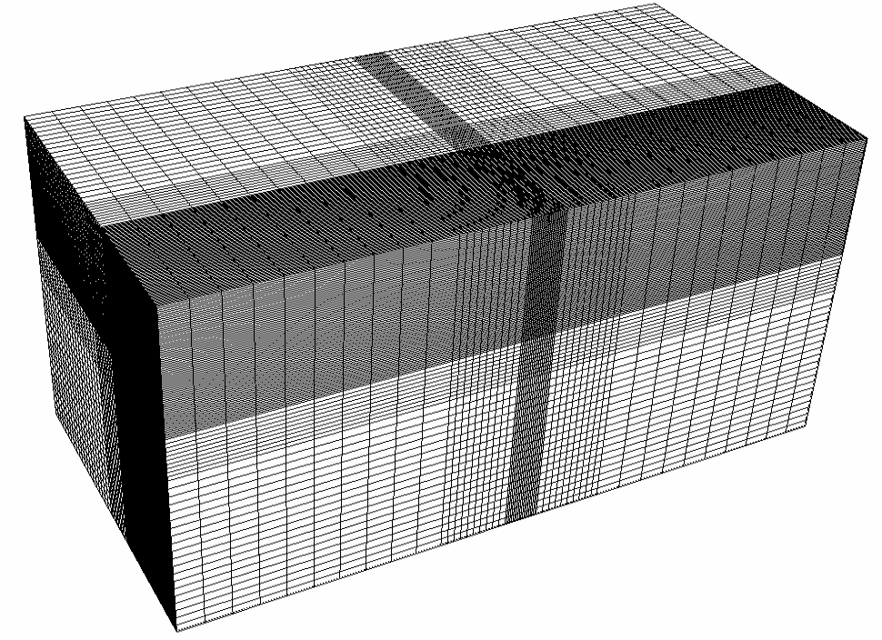
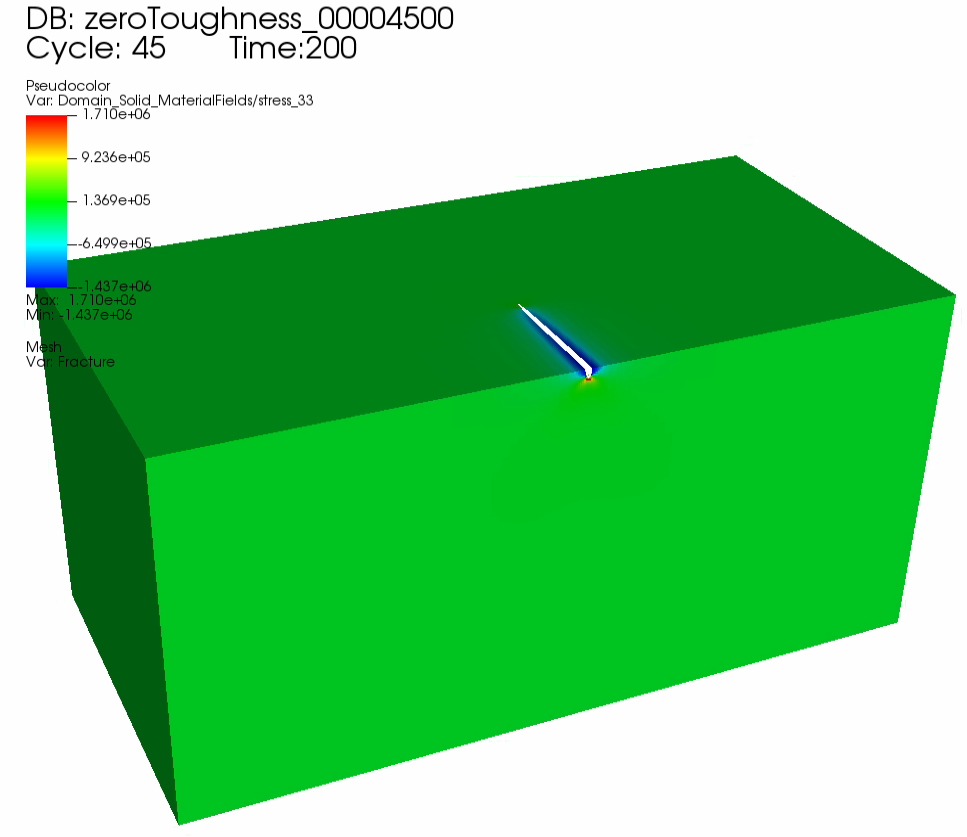

.. _pknViscosityDominated:

###########################################################
Viscosity-Storage-Dominated PKN Hydraulic Fracture
###########################################################

**Context**

In this example, we simulate the propagation of a Perkins–Kern–Nordgren (PKN) fracture in viscosity-storage-dominated regime, a classic benchmark in hydraulic fracturing. The developed planar fracture displays elliptical vertical cross-section. Unlike KGD and penny shaped fractures, height growth of a PKN fracture is constrained by mechanical barriers (such as bedding layers, sedimentary laminations, or weak interfaces), which promotes lateral propagation. This problem is solved using the hydrofracture solver in GEOSX to obtain the temporal evolutions of the fracture characteristics (length, aperture, and pressure), which are verified against the existing analytical solutions `(Kovalyshen and Detournay, 2010;  <https://link.springer.com/article/10.1007/s11242-009-9403-4>`__ `Economides and Nolte, 2000)  <https://books.google.com/books/about/Reservoir_Stimulation.html?id=rDlQAQAAIAAJ>`__. 

**Input file**

This example uses no external input files. Everything we need is contained within two GEOSX input files:

.. code-block:: console

  inputFiles/hydraulicFracturing/pknViscosityDominated_base.xml

.. code-block:: console

  inputFiles/hydraulicFracturing/pknViscosityDominated_benchmark.xml

A python script for post-processing the simulation results is also prepared:

.. code-block:: console

  src/docs/sphinx/advancedExamples/validationStudies/pknViscosityDominated/pknViscosityDominatedFigure.py

------------------------------------------------------------------
Description of the case
------------------------------------------------------------------

In this example, a hydraulic fracture initiates and propagates from the center of a 20 m thick target layer, which is
homogeneous and bounded by neighboring (both upper and lower) layers. For viscosity-dominated fractures, more work is applied to move the fracturing fluid than to split the intact rock. If neglecting fluid leakoff, storage-dominated propagation occurs with most of the injected fluid confined within the open surfaces. To meet the requirements of the viscosity-storage dominated assumptions, impermeable domain (no fluid leakoff), incompressible fluid with constant viscosity (:math:`1.0 cp`) and ultra-low rock toughness (:math:`0.1 MPa { \sqrt{m} }`) are chosen in the GEOSX simulation. This way, the fracture is well contained within the target layer, keeps extending in the horizontal direction and eventually reaches the conditions of developing a PKN fracture in viscosity-storage dominated regime.

In this model, the injected fluid within the fracture follows the lubrication equation resulting from mass conservation and Poiseuille's law. The fracture propagates by creating new surfaces if the stress intensity factor exceeds the local rock toughness :math:`K_{IC}`. As the geometry of the PKN fracture exhibits symmetry, the simulation is reduced to quarter-scale. For verification purposes, a plane strain deformation is considered in the numerical model. 

In this example, we set up and solve a hydraulic fracture model to obtain the temporal solutions of the fracture half length :math:`l`, the net pressure :math:`p_0` and the fracture aperture :math:`w_0` at the fluid inlet for the PKN fracture propagating in viscosity-storage-dominated regime. ` Kovalyshen and Detournay (2010)  <https://link.springer.com/article/10.1007/s11242-009-9403-4>`__  and `Economides and Nolte (2000)  <https://books.google.com/books/about/Reservoir_Stimulation.html?id=rDlQAQAAIAAJ>`__ derived the analytical solutions for this classic hydraulic fracture problem, which are used to verify the GEOSX simulations:

.. math:: l(t) = 0.3817 (\frac{ E_p Q_0^3 t^4 }{ \mu h^4 })^{ 1/5 }

.. math:: w_0(t) = 3 (\frac{ \mu Q_0 l }{ E_p })^{ 1/4 } 

.. math:: p_0(t) = (\frac{ 16 \mu Q_0 E_p^3 l }{ \pi h^4 })^{ 1/4 } 

where the plane modulus :math:`E_p` is related to Young's modulus :math:`E` and Poisson's ratio :math:`\nu`:

.. math:: E_p = \frac{ E }{ 1-\nu^2 }

For this example, we focus on the ``Mesh``,
the ``Constitutive``, and the ``FieldSpecifications`` tags.

------------------------------------------------------------------
Mesh
------------------------------------------------------------------

The following figure shows the mesh used in this problem.

.. _problemSketchFig:

   Generated mesh

We use the internal mesh generator to create a computational domain
(:math:`400\, m \, \times 400 \,  m \, \times 800 \, m`), as parametrized in the ``InternalMesh`` XML tag. 
The structured mesh contains 105 x 105 x 60 eight-node brick elements in the x, y, and z directions respectively. 
Such eight-node hexahedral elements are defined as ``C3D8`` elementTypes, and their collection forms a mesh
with one group of cell blocks named here ``cb1``. Local refinement is performed for the elements in the vicinity of the fracture plane. 

.. literalinclude:: ../../../../../../inputFiles/hydraulicFracturing/pknViscosityDominated_benchmark.xml
    :language: xml
    :start-after: <!-- SPHINX_MESH -->
    :end-before: <!-- SPHINX_MESH_END -->

The fracture plane is defined by a nodeset occupying a small region within the computation domain, where the fracture tends to open and propagate upon fluid injection:

.. literalinclude:: ../../../../../../inputFiles/hydraulicFracturing/pknViscosityDominated_benchmark.xml
  :language: xml
  :start-after: <!-- SPHINX_FRACPLANE -->
  :end-before: <!-- SPHINX_FRACPLANE_END -->

------------------------
Solid mechanics solver
------------------------

GEOSX is a multi-physics platform. Different combinations of
physics solvers available in the code can be applied
in different regions of the domain and be functional at different stages of the simulation.
The ``Solvers`` tag in the XML file is used to list and parameterize these solvers.

Three elementary solvers are combined in the solver ``hydrofracture`` to model the coupling between fluid flow within the fracture, rock deformation, fracture deformation and propagation:

.. literalinclude:: ../../../../../../inputFiles/hydraulicFracturing/pknViscosityDominated_benchmark.xml
  :language: xml
  :start-after: <!-- SPHINX_HYDROFRACSOLVER -->
  :end-before: <!-- SPHINX_HYDROFRACSOLVER_END -->

- Rock and fracture deformation are modeled by the solid mechanics solver ``SolidMechanicsLagrangianSSLE``. In this solver, we define ``targetRegions`` that includes both the continuum region and the fracture region. The name of the contact constitutive behavior is specified in this solver by the ``contactRelationName``.

.. literalinclude:: ../../../../../../inputFiles/hydraulicFracturing/pknViscosityDominated_benchmark.xml
  :language: xml
  :start-after: <!-- SPHINX_MECHANICALSOLVER -->
  :end-before: <!-- SPHINX_MECHANICALSOLVER_END -->

- The single-phase fluid flow inside the fracture is solved by the finite volume method in the solver ``SinglePhaseFVM``.

.. literalinclude:: ../../../../../../inputFiles/hydraulicFracturing/pknViscosityDominated_benchmark.xml
  :language: xml
  :start-after: <!-- SPHINX_SINGLEPHASEFVM -->
  :end-before: <!-- SPHINX_SINGLEPHASEFVM_END -->

- The solver ``SurfaceGenerator`` defines the fracture region and rock toughness ``rockToughness="0.1e6"``. With ``nodeBasedSIF="1"``, a node-based Stress Intensity Factor (SIF) calculation is chosen for the fracture propagation criterion. 

.. literalinclude:: ../../../../../../inputFiles/hydraulicFracturing/pknViscosityDominated_benchmark.xml
  :language: xml
  :start-after: <!-- SPHINX_SURFACEGENERATOR -->
  :end-before: <!-- SPHINX_SURFACEGENERATOR_END -->

------------------------------
Constitutive laws
------------------------------

For this problem, a homogeneous and isotropic domain with one solid material is assumed. Its mechanical properties and associated fluid rheology are specified in the ``Constitutive`` section. 
``ElasticIsotropic`` model is used to describe the mechanical behavior of ``rock`` when subjected to fluid injection.
The single-phase fluid model ``CompressibleSinglePhaseFluid`` is selected to simulate the response of ``water`` upon fracture propagation.

.. literalinclude:: ../../../../../../inputFiles/hydraulicFracturing/pknViscosityDominated_base.xml
    :language: xml
    :start-after: <!-- SPHINX_MATERIAL -->
    :end-before: <!-- SPHINX_MATERIAL_END -->

All constitutive parameters such as density, viscosity, bulk modulus, and shear modulus are specified in the International System of Units.

-----------------------------------------------------------
Initial and boundary conditions
-----------------------------------------------------------

The next step is to specify fields, including:

  - The initial values: the ``waterDensity``, ``separableFace`` and the ``ruptureState`` of the propagating fracture have to be initialized,
  - The boundary conditions: fluid injection rates and the constraints of the outer boundaries have to be set.

In this example, a mass injection rate ``SourceFlux`` (``scale="-6.625"``) is applied at the surfaces of the initial fracture. Only one fourth of the total injection rate is defined in this boundary condition because only a quarter of the fracture is modeled (the problem is symmetric). The value given for ``scale`` is :math:`Q_0 \rho_f/4` (not :math:`Q_0 /4`). 
All the outer boundaries are subject to roller constraints. 
These boundary conditions are set through the ``FieldSpecifications`` section.

.. literalinclude:: ../../../../../../inputFiles/hydraulicFracturing/pknViscosityDominated_base.xml
    :language: xml
    :start-after: <!-- SPHINX_BC -->
    :end-before: <!-- SPHINX_BC_END -->

The parameters used in the simulation are summarized in the following table.

+------------------+-------------------------+--------------------+--------------------+
| Symbol           | Parameter               | Unit               | Value              |
+==================+=========================+====================+====================+
| :math:`K`        | Bulk Modulus            | [GPa]              | 20.0               |
+------------------+-------------------------+--------------------+--------------------+
| :math:`G`        | Shear Modulus           | [GPa]              | 12.0               |
+------------------+-------------------------+--------------------+--------------------+
| :math:`K_{IC}`   | Rock Toughness          | [MPa.m\ :sup:`1/2`]| 0.1                |
+------------------+-------------------------+--------------------+--------------------+
| :math:`\mu`      | Fluid Viscosity         | [Pa.s]             | 1.0x10\ :sup:`-3`  |
+------------------+-------------------------+--------------------+--------------------+
| :math:`Q_0`      | Injection Rate          | [m\ :sup:`3`/s]    | 0.0265             |
+------------------+-------------------------+--------------------+--------------------+
| :math:`t_{inj}`  | Injection Time          | [s]                | 200                |
+------------------+-------------------------+--------------------+--------------------+
| :math:`h_f`      | Fracture Height         | [m]                | 20                 |
+------------------+-------------------------+--------------------+--------------------+

---------------------------------
Inspecting results
---------------------------------

The following figure shows the distribution of :math:`\sigma_{zz}` at :math:`t=200 s` within the computational domain..

.. _problemVerificationFig1:

   Simulation result of :math:`\sigma_{zz}` at :math:`t=200 s`

 
Figure below shows the comparisons between the results from GEOSX simulations (markers) and the corresponding
analytical solutions (curves) for the testing example with viscosity-storage dominated assumptions. As seen, the time
history of fracture half length, near wellbore fracture aperture and fluid pressure correlate well with the analytical
solutions.  

.. plot:: docs/sphinx/advancedExamples/validationStudies/pknFracViscosityDominated/pknViscosityDominatedFigure.py

------------------------------------------------------------------
To go further
------------------------------------------------------------------

**Feedback on this example**

For any feedback on this example, please submit a `GitHub issue on the project's GitHub page <https://github.com/GEOSX/GEOSX/issues>`_.
