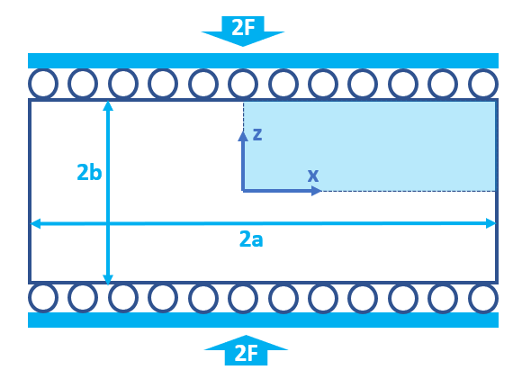
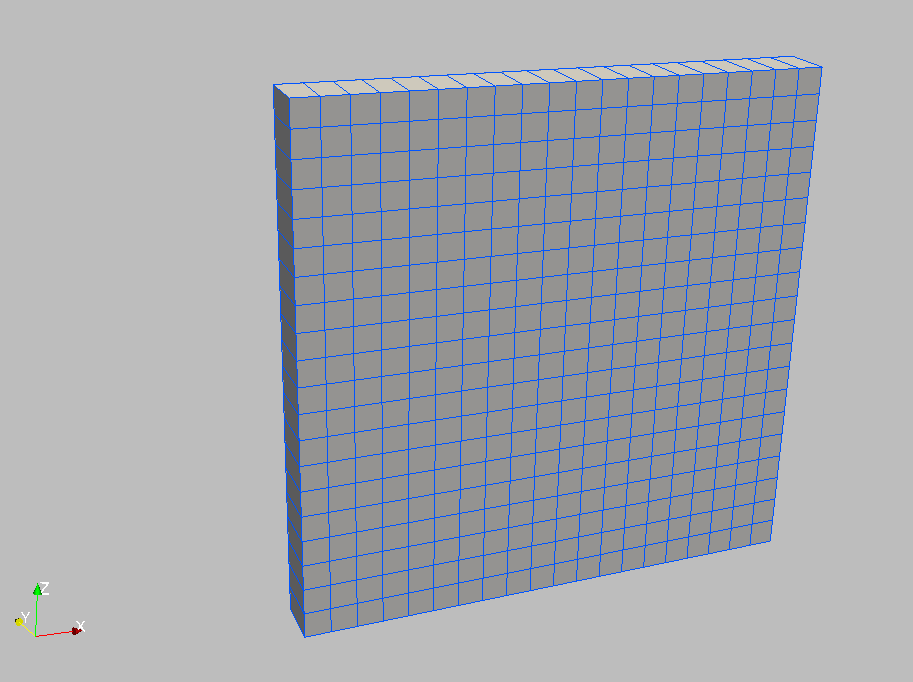
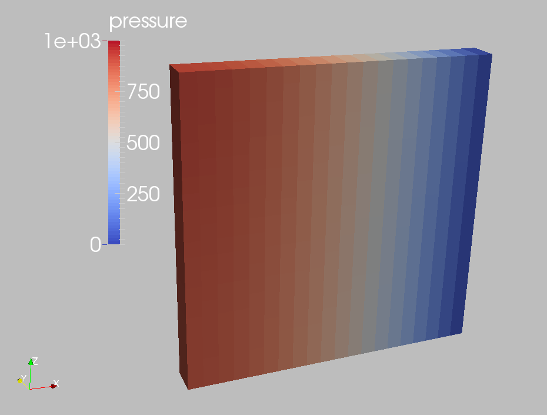
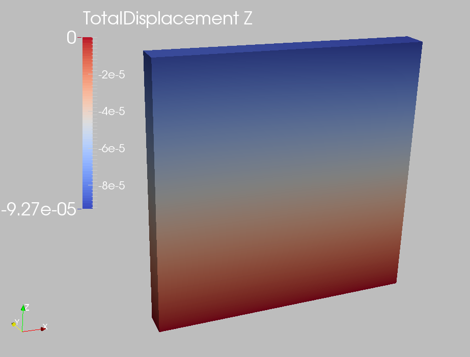

.. _ExampleMandel:

####################################################
Mandel's Problem
####################################################

**Context**

In this example, we use the coupled solvers in GEOS to solve Mandel's 2D consolidation problem, a classic benchmark in poroelasticity. The analytical solution `(Cheng and Detournay, 1988)  <https://onlinelibrary.wiley.com/doi/abs/10.1002/nag.1610120508>`__ is employed to verify the accuracy of the modeling predictions on induced pore pressure and the corresponding settlement. In this example, the ``TimeHistory`` function and a Python script are used to output and post-process multi-dimensional data (pore pressure and displacement field).

**Input file**

This example uses no external input files and everything required is contained within two GEOS input files located at:

.. code-block:: console

  inputFiles/poromechanics/PoroElastic_Mandel_base.xml

.. code-block:: console

  inputFiles/poromechanics/PoroElastic_Mandel_benchmark_fim.xml

------------------------------------------------------------------
Description of the case
------------------------------------------------------------------

We simulate the consolidation of a poroelastic slab between two rigid and impermeable plates subjected to a constant normal force. The slab is assumed to be fully saturated, homogeneous, isotropic, and infinitely long in the y-direction. We apply a uniform compressive load in the vertical direction. This force leads to a change of pore pressure and mechanical deformations of the sample, evolving with time due to fluid diffusion and coupling effects. The numerical model represents a plane strain deformation and lateral drainage without confinement, showing only a quarter of the computational domain in the x-z plane (the rest follows by symmetry).

.. _mandelProblemSketchFig:

   Sketch of the problem

In this example, we set up and solve a poroelastic model to obtain the temporal and spatial solutions of pore pressure (:math:`p(x,z,t)`) and displacement field (:math:`u_z(x,z,t)`) for Mandel's problem. These modeling predictions are validated against corresponding analytical solution `(Cheng and Detournay, 1988)  <https://onlinelibrary.wiley.com/doi/abs/10.1002/nag.1610120508>`__. 

.. math::
   p(x,z,t) = 2 p_0 \sum_{n=1}^{\infty}
            \frac{ \text{sin} \alpha_{n} } { \alpha_{n} - {\text{sin} \alpha_{n}} {\text{cos} \alpha_{n}} } \left( \text{cos} {\frac{\alpha_{n} x}{a}} - \text{cos} \alpha_{n} \right)  
            \text{exp} \left( -\frac{ {\alpha_{n}}^2 c t}{a^2} \right)

.. math::
   u_z(x,z,t) = \left[ -\frac{F \left( 1 - \nu \right)}{2Ga} + \frac{F \left( 1 - \nu_{u} \right)}{Ga} \sum_{n=1}^{\infty} \frac{  {\text{sin} \alpha_{n}} {\text{cos} \alpha_{n}} } { \alpha_{n} - {\text{sin} \alpha_{n}} {\text{cos} \alpha_{n}} } \text{exp} \left( -\frac{{\alpha_{n}}^2 c t}{a^2} \right) \right] z

with :math:`\alpha_{n}` denoting the positive roots of the following equation:

.. math::
   \text{tan} \alpha_{n} = \frac{1- \nu}{\nu_{u}-\nu} \alpha_{n}

Upon sudden application of the vertical load, the instantaneous overpressure (:math:`p_0(x,z)`) and settlement (:math:`u_{z,0}(x,z)` and :math:`u_{x,0}(x,z)`) across the sample are derived from the Skempton effect:
            
.. math::
   p_0(x,z) = \frac{1}{3a} B \left( 1 + \nu_{u} \right) F

.. math::
   u_{z,0}(x,z) = -\frac{F \left( 1 - \nu_{u} \right)}{2G} \frac{z}{a}

.. math::
   u_{x,0}(x,z) = \frac{F \nu_{u} }{2G} \frac{x}{a}

where :math:`\nu` and :math:`\nu_{u}` are the drained and undrained Poisson's ratio respectively, :math:`c` is the consolidation coefficient, :math:`B` is Skempton's coefficient, :math:`G` is the shear modulus, and :math:`F` is the applied force.

For this example, we focus on the ``Mesh``,
the ``Constitutive``, and the ``FieldSpecifications`` tags.

------------------------------------------------------------------
Mesh
------------------------------------------------------------------

The following figure shows the mesh used in this problem.

.. _problemMeshMandelFig:

   Generated mesh

This mesh was created using the internal mesh generator as parametrized in the ``InternalMesh`` XML tag. 
The structured mesh contains 20 x 1 x 20 eight-node brick elements in the x, y, and z directions respectively. 
Such eight-node hexahedral elements are defined as ``C3D8`` elementTypes, and their collection forms a mesh
with one group of cell blocks named here ``cb1``. 

.. literalinclude:: ../../../../../../../inputFiles/poromechanics/PoroElastic_Mandel_benchmark_fim.xml
    :language: xml
    :start-after: <!-- SPHINX_MESH -->
    :end-before: <!-- SPHINX_MESH_END -->

------------------------
Solid mechanics solver
------------------------

GEOS is a multi-physics platform. Different combinations of
physics solvers available in the code can be applied
in different regions of the domain and be functional at different stages of the simulation.
The ``Solvers`` tag in the XML file is used to list and parameterize these solvers.

To specify a coupling between two different solvers, we define and characterize each single-physics solver separately.
Then, we customize a *coupling solver* between these single-physics
solvers as an additional solver.
This approach allows for generality and flexibility in constructing multi-physics solvers.
The order of specifying these solvers is not restricted in GEOS.
Note that end-users should give each single-physics solver a meaningful and distinct name, as GEOS will recognize these single-physics solvers based on their customized names and create user-expected coupling.

As demonstrated in this example, to setup a poromechanical coupling, we need to define three different solvers in the XML file:

- the mechanics solver, a solver of type ``SolidMechanicsLagrangianSSLE`` called here ``lagsolve`` (more information here: :ref:`SolidMechanicsLagrangianFEM`),

.. literalinclude:: ../../../../../../../inputFiles/poromechanics/PoroElastic_Mandel_smoke_sequential.xml
  :language: xml
  :start-after: <!-- SPHINX_MECHANICALSOLVER -->
  :end-before: <!-- SPHINX_MECHANICALSOLVER_END -->

- the single-phase flow solver, a solver of type ``SinglePhaseFVM`` called here ``SinglePhaseFlow`` (more information on these solvers at :ref:`SinglePhaseFlow`),

.. literalinclude:: ../../../../../../../inputFiles/poromechanics/PoroElastic_Mandel_smoke_sequential.xml
  :language: xml
  :start-after: <!-- SPHINX_SINGLEPHASEFVM -->
  :end-before: <!-- SPHINX_SINGLEPHASEFVM_END -->

- the coupling solver (``SinglePhasePoromechanics``) that will bind the two single-physics solvers above, which is named as ``poroSolve`` (more information at :ref:`PoroelasticSolver`).

.. literalinclude:: ../../../../../../../inputFiles/poromechanics/PoroElastic_Mandel_smoke_sequential.xml
  :language: xml
  :start-after: <!-- SPHINX_POROMECHANICSSOLVER -->
  :end-before: <!-- SPHINX_POROMECHANICSSOLVER_END -->

The two single-physics solvers are parameterized as explained
in their corresponding documentation pages. 
We focus on the coupling solver in this example.
The solver ``poroSolve`` uses a set of attributes that specifically describe the coupling process within a poromechanical framework.
For instance, we must point this solver to the designated fluid solver (here: ``SinglePhaseFlow``) and solid solver (here: ``lagsolve``).
These solvers interact through the ``porousMaterialNames="{ shale }"`` with all the constitutive models. We specify the discretization method (``FE1``, defined in the ``NumericalMethods`` section), and the target regions (here, we only have one, ``Domain``).
More parameters are required to characterize a coupling procedure (more information at :ref:`PoroelasticSolver`). In this way, the two single-physics solvers will be simultaneously called and executed for solving Mandel's problem here.

------------------------------
Constitutive laws
------------------------------

For this problem, we simulate the poroelastic deformation of a slab under uniaxial compression. 
A homogeneous and isotropic domain with one solid material is assumed, and its mechanical properties and associated fluid rheology are specified in the ``Constitutive`` section. 
``PorousElasticIsotropic`` model is used to describe the mechanical behavior of ``shaleSolid`` when subjected to loading. The single-phase fluid model ``CompressibleSinglePhaseFluid`` is selected to simulate the response of ``water`` upon consolidation.

.. literalinclude:: ../../../../../../../inputFiles/poromechanics/PoroElastic_Mandel_base.xml
    :language: xml
    :start-after: <!-- SPHINX_MATERIAL -->
    :end-before: <!-- SPHINX_MATERIAL_END -->

All constitutive parameters such as density, viscosity, bulk modulus, and shear modulus are specified in the International System of Units.

------------------------------
Time history function
------------------------------

In the ``Tasks`` section, ``PackCollection`` tasks are defined to collect time history information from fields. 
Either the entire field or specified named sets of indices in the field can be collected. 
In this example, ``pressureCollection`` and ``displacementCollection`` tasks are specified to output the time history of pore pressure ``fieldName="pressure"`` and displacement field ``fieldName="totalDisplacement"`` across the computational domain.

.. literalinclude:: ../../../../../../../inputFiles/poromechanics/PoroElastic_Mandel_base.xml
    :language: xml
    :start-after: <!-- SPHINX_TASKS -->
    :end-before: <!-- SPHINX_TASKS_END -->

These two tasks are triggered using the ``Event`` manager with a ``PeriodicEvent`` defined for these recurring tasks. 
GEOS writes two files named after the string defined in the ``filename`` keyword and formatted as HDF5 files (displacement_history.hdf5 and pressure_history.hdf5). The TimeHistory file contains the collected time history information from each specified time history collector.
This information includes datasets for the simulation time, element center, and the time history information.
A Python script is prepared to read and plot any specified subset of the time history data for verification and visualization. 

-----------------------------------------------------------
Initial and boundary conditions
-----------------------------------------------------------

Next, we specify two fields:

  - The initial value (the displacements, effective stress, and pore pressure have to be initialized, corresponding to the undrained response),
  - The boundary conditions (the vertical displacement applied at the loaded boundary and the constraints of the outer boundaries have to be set).

In this example, the analytical z-displacement is applied at the top surface (``zpos``) of computational domain to enforce the rigid plate condition.
The lateral surface (``xpos``) is traction-free and allows drainage. 
The remaining parts of the outer boundaries are subjected to roller constraints.  
These boundary conditions are set up through the ``FieldSpecifications`` section.

.. literalinclude:: ../../../../../../../inputFiles/poromechanics/PoroElastic_Mandel_base.xml
    :language: xml
    :start-after: <!-- SPHINX_BC -->
    :end-before: <!-- SPHINX_BC_END -->

 
The parameters used in the simulation are summarized in the following table. Note that traction has a negative value, due to the negative sign convention for compressive stresses in GEOS. 

+------------------+-------------------------+------------------+--------------------+
| Symbol           | Parameter               | Unit             | Value              |
+==================+=========================+==================+====================+
| :math:`K`        | Bulk Modulus            | [MPa]            | 66.667             |
+------------------+-------------------------+------------------+--------------------+
| :math:`G`        | Shear Modulus           | [MPa]            | 40.0               |
+------------------+-------------------------+------------------+--------------------+
| :math:`F`        | Force per Unit Length   | [N/m]            | -10\ :sup:`4`      |
+------------------+-------------------------+------------------+--------------------+
| :math:`\phi`     | Porosity                | [-]              | 0.375              |
+------------------+-------------------------+------------------+--------------------+
| :math:`K_s`      | Grain Bulk Modulus      | [Pa]             | 10\ :sup:`27`      |
+------------------+-------------------------+------------------+--------------------+
| :math:`\rho_f`   | Fluid density           | [kg/m\ :sup:`3`] | 10\ :sup:`3`       |
+------------------+-------------------------+------------------+--------------------+
| :math:`c_f`      | Fluid compressibility   | [Pa\ :sup:`-1`]  | 4.4x10\ :sup:`-10` |
+------------------+-------------------------+------------------+--------------------+
| :math:`\kappa`   | Permeability            | [m\ :sup:`2`]    | 10\ :sup:`-12`     |
+------------------+-------------------------+------------------+--------------------+
| :math:`\mu`      | Fluid viscosity         | [Pa s]           | 10\ :sup:`-3`      |
+------------------+-------------------------+------------------+--------------------+
| :math:`2a`       | Slab Length             | [m]              | 2.0                |
+------------------+-------------------------+------------------+--------------------+
| :math:`2b`       | Slab Height             | [m]              | 2.0                |
+------------------+-------------------------+------------------+--------------------+

---------------------------------
Inspecting results
---------------------------------

We request VTK-format output files and use Paraview to visualize the results.
The following figure shows the distribution of pore pressure (:math:`p(x,z,t)`) at :math:`t=10 s` within the computational domain.

.. _problemVerificationMandelFig1:

   Simulation result of pore pressure at :math:`t=10 s`

The next figure shows the distribution of vertical displacement (:math:`u_z(x,z,t)`) at :math:`t=10 s`.

.. _problemVerificationMandelFig2:

   Simulation result of vertical displacement at :math:`t=10 s` 

The figure below compares the results from GEOS (marks) and the corresponding analytical solution (lines) for the pore pressure along the x-direction and vertical displacement along the z-direction. GEOS reliably captures the short-term Mandel-Cryer effect and shows excellent agreement with the analytical solution at various times. 

.. plot:: docs/sphinx/advancedExamples/validationStudies/poromechanics/mandel/mandelFigure.py

.. note:: The python script included above is used to generate the figure shown here. If you want to run this script to verify your results, you will need to run the script from your output directory, and modify the path to the variables `xmlFile1Path` and `xmlFile1Path` in the script to point to the location of the input files on your system. 

------------------------------------------------------------------
To go further
------------------------------------------------------------------

**Feedback on this example**

For any feedback on this example, please submit a `GitHub issue on the project's GitHub page <https://github.com/GEOS-DEV/GEOS/issues>`_.

