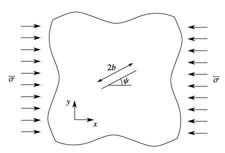
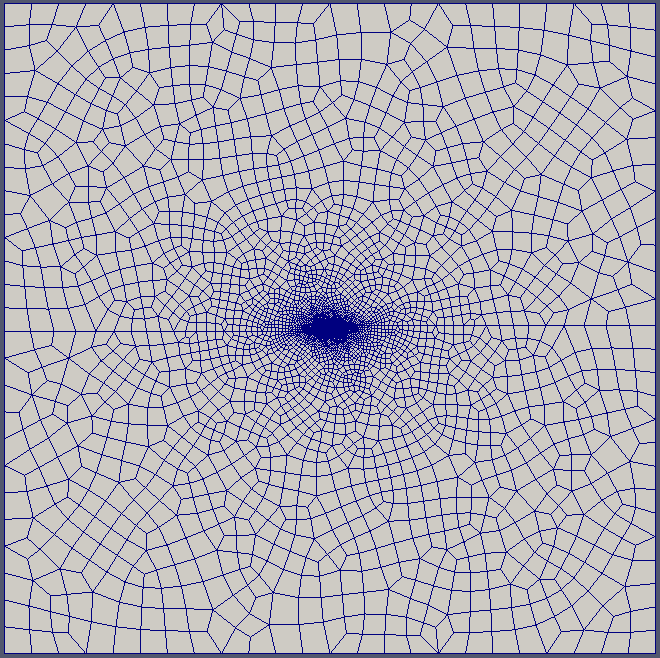
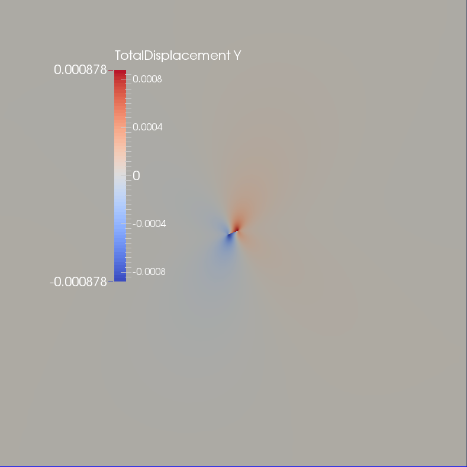
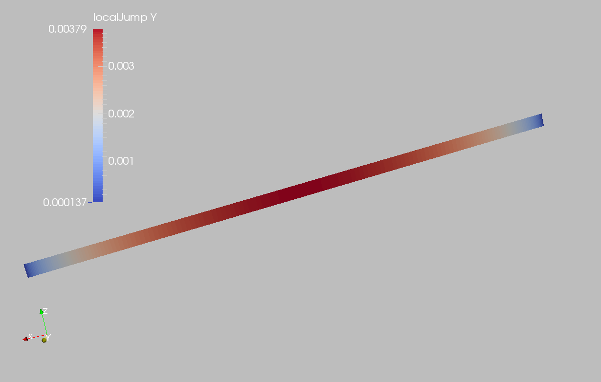

.. _ExamplesingleFracCompression:

####################################################
Single Fracture Under Shear Compression
####################################################

**Context**

In this example, a single fracture in a 2D infinite domain and subjected to a constant uniaxial compressive remote stress is simulated with Lagrange contact model `(Franceschini et al., 2020)  <https://www.sciencedirect.com/science/article/pii/S0045782520303467>`__. An analytical solution `(Phan et al., 2003)  <https://onlinelibrary.wiley.com/doi/10.1002/nme.707>`__ is available for verifying the accuracy of the numerical results, which provides the normal traction and slip on the fracture surface due to frictional contact. For the presented example, ``TimeHistory`` function and Python script are employed to output and postprocess multi-dimensional data (e.g., traction and displacement on the fracture surface).

**Input file**

Everything required is contained within two GEOSX input files and one mesh file located at:

.. code-block:: console

  inputFiles/multiphysics/ContactMechanics_SingleFracCompression_Base.xml

.. code-block:: console

  inputFiles/multiphysics/ContactMechanics_SingleFracCompression_Example.xml

.. code-block:: console

  inputFiles/multiphysics/crackInPlane_ref.msh

------------------------------------------------------------------
Description of the case
------------------------------------------------------------------

We simulate an inclined fracture under a compressive horizontal stress (:math:`\sigma`), as shown below. This fracture is placed in an infinite, homogeneous, isotropic and elastic medium. Uniaxial compression and frictional contact on the fracture surface cause the mechanical deformation of the surrounding rock and sliding along the fracture plane. For verification purpose, plane strain deformation and Coulomb failure criterion is considered for the presented numerical model.

.. _problemSketchFig:

   Sketch of the problem 

To simulate this phenomenon, the Lagrange contact model is used in this example. Displacement and stress fields on the fracture plane are numerically calculated. The numerical predictions of the normal traction (:math:`t_N`) and slip (:math:`g_T`) on the fracture surface are then compared with the corresponding analytical solution `(Phan et al., 2003)  <https://onlinelibrary.wiley.com/doi/10.1002/nme.707>`__. 

.. math::
   t_N = - \sigma {\text{sin} \left( {\psi} \right)}^{ 2 }

.. math::
   g_T = \frac{ 4 { 1- {\nu}^{ 2 }} }{ E } { \sigma \text{sin} \left( {\psi} \right) { \text{cos} \left( {\psi} \right) - \text{sin} \left( {\psi} \right) \text{tan} \left( {\theta} \right)} } { { b }^{ 2 } - { b - \xi  }^{ 2 } }^{ 1/2 }

where :math:`\psi` is the inclination angle, :math:`\nu` is the Poisson's ratio, :math:`E` is the Young's modulus, :math:`\theta` is the friction angle, :math:`b` is the fracture half length, :math:`\psi` is a local coordinate on the fracture and varies in the range [0, :math:`2b`].

In this example, we focus our attention on the ``Mesh`` tags,
the ``Constitutive`` tags, and the ``FieldSpecifications`` tags.

------------------------------------------------------------------
Mesh
------------------------------------------------------------------

Following figure shows the mesh that is used for solving this problem.

.. _problemSketchFig:

   Imported mesh

Here, we use the ``PAMELAMeshGenerator`` to load the mesh (see :ref:`ImportingExternalMesh`).
The syntax to import external meshes is simple : in the XML file,
the mesh file ``crackInPlane_ref.msh`` is included with its relative or absolute path to the location of the GEOSX XML file and a user-specified label (e.g., ``CubeHex``) for the mesh object. This unstructured mesh contains quadrilaterals elements and interface elements. Refinement is performed to conform with the fracture geometry, which is specified in the ``Geometry`` section.

.. literalinclude:: ../../../../../../inputFiles/multiphysics/ContactMechanics_SingleFracCompression_Example.xml
    :language: xml
    :start-after: <!-- SPHINX_MESH -->
    :end-before: <!-- SPHINX_MESH_END -->

------------------------
Solid mechanics solver
------------------------

GEOSX is a multi-physics platform. Different combinations of
physics solvers available in the code can be applied
in different regions of the domain and be functional at different stages of the simulation.
The ``Solvers`` tag in the XML file is used to list and parameterize these solvers.

To specify a coupling between two different solvers, we define and characterize each single-physics solver separately.
Then, we customize a *coupling solver* between these single-physics
solvers as an additional solver.
This approach allows for generality and flexibility in constructing multi-physics solvers.
The order of specifying these solvers is not restricted in GEOSX.
Note that end-users should give each single-physics solver a meaningful and distinct name, as GEOSX will recognize these single-physics solvers based on their customized names and create user-expected coupling.

As demonstrated in this example, to setup a coupling between rock and fracture deformation, we need to define three different solvers in the XML file:

- For solving the frictional contact, we need to define a Lagrangian contact solver, which is called ``lagrangiancontact``. In this solver, we specify ``targetRegions`` that includes both the continuum region ``Region`` and the discontinuum region ``Fracture``,  where this solver is applied to couple rock and fracture deformation. The contact constitutive law used for the fracture elements is named as ``fractureMaterial``,  which is defined in the ``Constitutive`` section. 

- Rock deformation is handled by the solid mechanics solver ``SolidMechanics_LagrangianFEM``. This solid mechanics solver (see :ref:`SolidMechanics_LagrangianFEM`) is based on the Lagrangian finite element formulation. The problem is run as ``QuasiStatic`` without considering inertial effects. The computational domain is discretized by ``FE1``, which is defined in the ``NumericalMethods`` section. The solid material is named as ``rock``, whose mechanical properties are specified in the ``Constitutive`` section. 

- The solver ``SurfaceGenerator`` defines fracture region and rock toughness.

.. literalinclude:: ../../../../../../inputFiles/multiphysics/ContactMechanics_SingleFracCompression_Base.xml
  :language: xml
  :start-after: <!-- SPHINX_SOLVER -->
  :end-before: <!-- SPHINX_SOLVER_END -->

------------------------------
Constitutive laws
------------------------------

For this specific problem, we simulate the elastic deformation and fracture slippage caused by uniaxial compression. A homogeneous and isotropic domain with one solid material is assumed, whose mechanical properties are specified in the ``Constitutive`` section. 

Fracture surface slippage is assumed to be governed by the Coulomb failure criterion. The contact constitutive behavior is named as ``fractureMaterial`` in the ``Coulomb`` block, where cohesion ``cohesion="0.0"`` and friction angle ``frictionAngle="0.523598776"`` are specified. 

.. literalinclude:: ../../../../../../inputFiles/multiphysics/ContactMechanics_SingleFracCompression_Base.xml
    :language: xml
    :start-after: <!-- SPHINX_MATERIAL -->
    :end-before: <!-- SPHINX_MATERIAL_END -->

Recall that in the ``SolidMechanics_LagrangianFEM`` section, 
``rock`` is designated as the material in the computational domain. 
Here, the isotropic elastic model ``ElasticIsotropic`` is used to simulate the mechanical behavior of ``rock``.

The constitutive parameters such as the density, the bulk modulus, and the shear modulus are specified in the International System of Units.

------------------------------
Time history function
------------------------------

In the ``Tasks`` section, ``PackCollection`` tasks can be defined to collect time history information from fields. 
Either the entire field or specified named sets of indices in the field can be collected. 
In this example, ``tractionCollection`` and ``displacementJumpCollection`` tasks are specified to output the local traction ``fieldName="traction"`` and relative displacement ``fieldName="localJump"`` on the fracture surface respectively.

.. literalinclude:: ../../../../../../inputFiles/multiphysics/ContactMechanics_SingleFracCompression_Base.xml
    :language: xml
    :start-after: <!-- SPHINX_TASKS -->
    :end-before: <!-- SPHINX_TASKS_END -->

These two tasks are triggered using the ``Event`` management, where ``PeriodicEvent`` are defined for these recurring tasks. 
GEOSX writes two files named after the string defined in the ``filename`` keyword and formatted as HDF5 files (displacementJump_history.hdf5 and traction_history.hdf5). The TimeHistory file contains the collected time history information from each specified time history collector. This information includes datasets for the simulation time, element center defined in the local coordinate system, and the time history information. Then, python script is prepared to access and easily plot any specified subset of the time history data for verification and visualization. 

-----------------------------------------------------------
Initial and boundary conditions
-----------------------------------------------------------

The next step is to specify fields, including:

  - The initial value (the remote compressive stress needs to be initialized)
  - The boundary conditions (the constraints of the outer boundaries have to be set)

In this tutorial, we need to specify an uniaxial horizontal stress (:math:`\sigma_x` = -1.0e8 Pa). The remaining parts of the outer boundaries are subjected to roller constraints.  
These boundary conditions are set up through the ``FieldSpecifications`` section.

.. literalinclude:: ../../../../../../inputFiles/multiphysics/ContactMechanics_SingleFracCompression_Base.xml
    :language: xml
    :start-after: <!-- SPHINX_BC -->
    :end-before: <!-- SPHINX_BC_END -->

Please note that the remote stress has a negative value, due to the negative sign convention for compressive stress in GEOSX. 

 
The parameters used in the simulation are summarized in the following table.

+------------------+-------------------------+------------------+--------------------+
| Symbol           | Parameter               | Unit             | Value              |
+==================+=========================+==================+====================+
| :math:`K`        | Bulk Modulus            | [GPa]            | 16.67              |
+------------------+-------------------------+------------------+--------------------+
| :math:`G`        | Shear Modulus           | [GPa]            | 10.0               |
+------------------+-------------------------+------------------+--------------------+
| :math:`\sigma`   | Compressive Stress      | [MPa]            | -100.0             |
+------------------+-------------------------+------------------+--------------------+
| :math:`\theta`   | Friction Angle          | [Degree]         | 30.0               |
+------------------+-------------------------+------------------+--------------------+
| :math:`\psi`     | Inclination Angle       | [Degree]         | 20.0               |
+------------------+-------------------------+------------------+--------------------+
| :math:`b`        | Fracture Half Length    | [m]              | 1.0                |
+------------------+-------------------------+------------------+--------------------+

---------------------------------
Inspecting results
---------------------------------

In the above examples, we request vtk-format output files. We can therefore import these into Paraview to visualize the outcome. The following figure shows the distribution of :math:`\u_{yy}` in the computational domain.

.. _problemVerificationFig1:

   Simulation result of :math:`\u_{yy}`

Next figure shows the distribution of the relative shear displacement on the fracture surface.

.. _problemVerificationFig1:

   Simulation result of fracture slip 

The figure below shows the comparisons between the numerical predictions (marks) and the corresponding analytical solutions (solid curves) with respect to the distributions of normal traction (:math:`t_N`) and slip (:math:`g_T`) on the fracture surface. One can observe that the numerical results and analytical solutions are nearly identical.  

.. plot::

    import matplotlib
    import matplotlib.pyplot as plt
    import numpy as np
    import h5py
    import xml.etree.ElementTree as ElementTree
    from mpmath import *
    import math
    from math import sin,cos,tan,exp,atan,asin
    from mpl_toolkits.mplot3d import axes3d 

    class Analytical:

        def __init__(self, mechanicalParameters, length, inclination, stress):
            K = mechanicalParameters["bulkModulus"]
            G = mechanicalParameters["shearModulus"]
            E = (9 * K * G) / (3*K+G)
            nu = E / (2 * G) - 1
      
            self.halfLength = length;
            self.inc = inclination;
            self.stress = stress;
            self.scaling = ( 4 * (1 - nu**2) ) / E;
            self.frictionAngle = mechanicalParameters["frictionAngle"]

        def computeNormalTraction(self, x):
            return -self.stress*pow(sin(self.inc),2);

        def computeShearDisplacement(self, x):
            return self.scaling*(self.stress*sin(self.inc)*(cos(self.inc)-sin(self.inc)*tan(self.frictionAngle)))*pow((self.halfLength**2-(self.halfLength-x-1.)**2),0.5);

    def getMechanicalParametersFromXML( xmlFilePath ):
        tree = ElementTree.parse(xmlFilePath)

        param = tree.find('Constitutive/ElasticIsotropic')

        mechanicalParameters = dict.fromkeys(["bulkModulus", "shearModulus", "frictionAngle"])
        mechanicalParameters["bulkModulus"] = float(param.get("defaultBulkModulus"))
        mechanicalParameters["shearModulus"] = float(param.get("defaultShearModulus"))

        param = tree.find('Constitutive/Coulomb')
        mechanicalParameters["frictionAngle"] = float(param.get("frictionAngle"))
        return mechanicalParameters

    def getCompressiveStressFromXML( xmlFilePath ):
        tree = ElementTree.parse(xmlFilePath)

        param = tree.findall('FieldSpecifications/FieldSpecification')

        found_stress = False
        for elem in param:
            if elem.get("fieldName") == "rock_stress" and elem.get("component") == "0":
                stress = float(elem.get("scale"))*(-1)
                found_stress = True
            if found_stress: break

        return stress

    def getFractureGeometryFromXML(xmlFilePath):
        tree = ElementTree.parse(xmlFilePath)

        boundedPlane = tree.find('Geometry/BoundedPlane')
        dimensions = boundedPlane.get("dimensions")
        dimensions = [float(i) for i in dimensions[1:-1].split(",")]
        length = dimensions[0] / 2
        origin = boundedPlane.get("origin")
        origin = [float(i) for i in origin[1:-1].split(",")]
        direction = boundedPlane.get("lengthVector")
        direction = [float(i) for i in direction[1:-1].split(",")]
        inclination = atan(direction[1]/direction[0])

        return length, origin[0], inclination

    def main():
        # File path
        hdf5File1Path = "traction_history.hdf5"
        hdf5File2Path = "displacementJump_history.hdf5"
        xmlFile1Path = "ContactMechanics_SingleFracCompression_Base.xml"
        xmlFile2Path = "ContactMechanics_SingleFracCompression_Example.xml"

        # Read HDF5
        # Global Coordinate of Fracture Element Center
        hf = h5py.File(hdf5File1Path, 'r')
        xl = hf.get('traction elementCenter')
        xl = np.array(xl)
        xcord = xl[0,:,0]
        ycord = xl[0,:,1]
        zcord = xl[0,:,2]

        # Local Normal Traction
        hf = h5py.File(hdf5File1Path, 'r')
        trac = hf.get('traction')
        trac = np.array(trac)
        normalTraction = trac[0,:,0]

        # Local Shear Displacement
        hf = h5py.File(hdf5File2Path, 'r')
        jump = hf.get('localJump')
        jump = np.array(jump)
        displacementJump = jump[0,:,1]
 
        # Extract Local Inform for The Middle Layer
        xlist = []
        ylist = []
        xloc = []
        tnlist = []
        gtlist = []
        for i in range(0,len(zcord)):
            if abs(zcord[i]/0.025-1.) < 0.01:
               xlist.append(xcord[i])
               ylist.append(ycord[i])
               xloc.append(pow(xcord[i]**2+ycord[i]**2, 0.5)*xcord[i]/abs(xcord[i]))
               tnlist.append(normalTraction[i]/1.0e6)
               gtlist.append(displacementJump[i]*1.e3)

        # Extract Mechanical Properties and Fracture Geometry from XML
        mechanicalParameters = getMechanicalParametersFromXML(xmlFile1Path)
        compressiveStress = getCompressiveStressFromXML(xmlFile1Path)
        length, origin, inclination = getFractureGeometryFromXML(xmlFile2Path)
 
        # Initialize analytical solution
        AnalyticalSolution = Analytical(mechanicalParameters, length, inclination, compressiveStress)

        # Plot Analytical (continuous line) and Numerical (markers) Solution
        x_analytical = np.linspace(-length, length, 101, endpoint=True)
        tn_analytical = np.empty(len(x_analytical))
        gt_analytical = np.empty(len(x_analytical))  
        i=0
        for xCell in x_analytical:
            tn_analytical[i] = AnalyticalSolution.computeNormalTraction( xCell )/1.0e6
            gt_analytical[i]= AnalyticalSolution.computeShearDisplacement( xCell )*1.e3
            i += 1
   
        fsize = 30
        msize = 10
        lw=8
        fig, ax = plt.subplots(1,2,figsize=(32, 12))
        cmap = plt.get_cmap("tab10")
    
        ax[0].plot(x_analytical, tn_analytical, color=cmap(-1), label='Analytical Solution', lw=lw)
        ax[0].plot(xloc, tnlist, 'o', alpha=0.6, color=cmap(2), mec = 'k', label='Numerical Solution', markersize=msize)    
        ax[0].grid()
        ax[0].set_xlim(-1, 1)
        ax[0].set_ylim(-18, 2)
        ax[0].set_xlabel('Length [m]', size=fsize, weight="bold")
        ax[0].set_ylabel('Normal Traction [MPa]', size=fsize, weight="bold")
        ax[0].legend(bbox_to_anchor=(0.5, 0.2), loc='center', borderaxespad=0., fontsize=fsize)
        ax[0].xaxis.set_tick_params(labelsize=fsize)
        ax[0].yaxis.set_tick_params(labelsize=fsize)

        ax[1].plot(x_analytical, gt_analytical, color=cmap(-1), label='Analytical Solution', lw=lw)
        ax[1].plot(xloc, gtlist, 'o', alpha=0.6, color=cmap(2), mec = 'k', label='Numerical Solution', markersize=msize)
        ax[1].grid()
        ax[1].set_xlim(-1, 1)
        ax[1].set_ylim(0, 4)
        ax[1].set_xlabel('Length [m]', size=fsize, weight="bold")
        ax[1].set_ylabel('Relative Shear Displacement [mm]', size=fsize, weight="bold")
        ax[1].legend(bbox_to_anchor=(0.5, 0.2), loc='center', borderaxespad=0., fontsize=fsize)
        ax[1].xaxis.set_tick_params(labelsize=fsize)
        ax[1].yaxis.set_tick_params(labelsize=fsize)

        plt.show()

    if __name__ == "__main__":
        main()

------------------------------------------------------------------
To go further
------------------------------------------------------------------

**Feedback on this example**

For any feedback on this example, please submit a `GitHub issue on the project's GitHub page <https://github.com/GEOSX/GEOSX/issues>`_.

