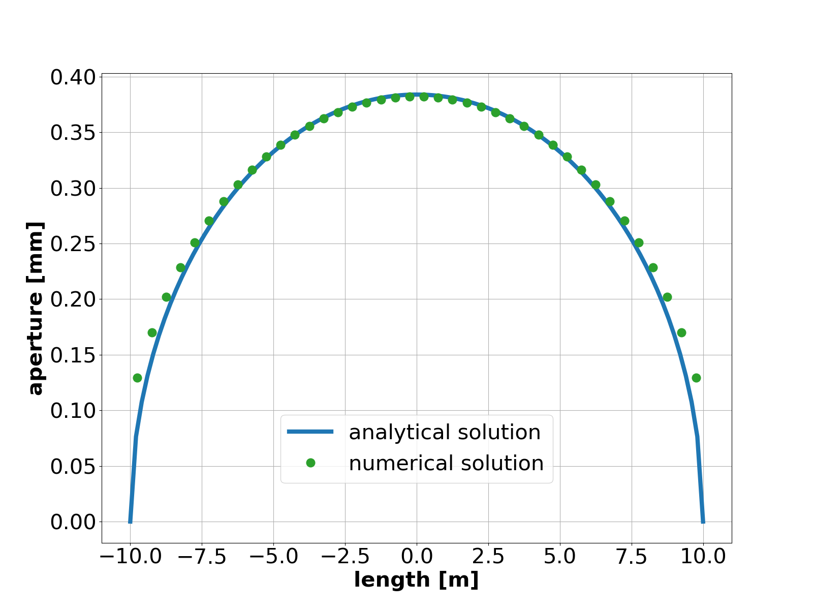

.. _TutorialSneddon:

#######################################################
Sneddon's Problem
#######################################################

**Objectives**

At the end of this example you will know:

  - how to define embedded fractures in the porous domain,
  - how to use the SolidMechanicsEmbeddedFractures solver to solve mechanics problems with embedded fractures.

**Input file**

This example uses no external input files and everything required is
contained within a single GEOSX input file.
The xml input file for this test case is located at:

.. code-block:: console

  inputFiles/efemFractureMechanics/Sneddon_benchmark3.xml

------------------------------------------------------------------
Description of the case
------------------------------------------------------------------

We compute the displacement field induced by the presence of a pressurized fracture,
of length :math:`L_f`, in a porous medium.

GEOSX will calculate the displacement field in the porous matrix and the displacement
jump at the fracture surface.
We will use the analytical solution for the fracture aperture, :math:`w_n` (normal component of the
jump) to, i.e.

.. math::
   w_n (s) = \frac{4(1 - \nu^2)p_f}{E} \, \sqrt{ \frac{L_f^2}{4} - s^2 }

where
- :math:`E` is the Young's modulus
- :math:`\nu` is the Poisson's ratio
- :math:`p_f` is the fracture pressure
- :math:`s` is the local fracture coordinate in :math:`[-\frac{L_f}{2}, \frac{L_f}{2}]`

All inputs for this case are contained inside a single XML file.
In this example, we focus our attention on the ``Solvers`` tags,
the ``ElementRegions`` tags and the Geometry tags.

-----------------------------------------------------------
Embedded fractures mechanics solver
-----------------------------------------------------------
To define a mechanics solver capable of including embedded fractures, we will
define two solvers:

 - a ``SolidMechanicsEmbeddedFractures`` solver, called ``mechSolve``
 - a small-strain Lagrangian mechanics solver, of type ``SolidMechanicsLagrangianSSLE`` called here ``matrixSolver`` (see: :ref:`SolidMechanicsLagrangianFEM`)

Note that the ``name`` attribute of these solvers is
chosen by the user and is not imposed by GEOSX. It is important to make sure that the
``solidSolverName`` specified in the embedded fractures solver corresponds to the
small-strain Lagrangian solver used in the matrix.

The two single-physics solvers are parameterized as explained
in their respective documentation, each with their own tolerances,
verbosity levels, target regions,
and other solver-specific attributes.

Additionally, we need to specify another solver of type, ``EmbeddedSurfaceGenerator``,
which is used to discretize the fracture planes.

.. literalinclude:: ../../../../../../inputFiles/efemFractureMechanics/Sneddon_base.xml
  :language: xml
  :start-after: <!-- SPHINX_SNEDDON_SOLVER -->
  :end-before: <!-- SPHINX_SNEDDON_SOLVER_END -->

-------------------------------------------------------------------
Events
-------------------------------------------------------------------
For this problem we will add two events defining solver applications:

- an event specifying the execution of the ``EmbeddedSurfaceGenerator`` to generate the fracture elements.
- a periodic even specifying the execution of the embedded fractures solver.

.. literalinclude:: ../../../../../../inputFiles/efemFractureMechanics/Sneddon_benchmark3.xml
  :language: xml
  :start-after: <!-- SPHINX_SNEDDON_EVENTS -->
  :end-before: <!-- SPHINX_SNEDDON_EVENTS_END -->

--------------------------------------------------------------------
Mesh, material properties, and boundary conditions
--------------------------------------------------------------------

Last, let us take a closer look at the geometry of this simple problem.
We use the internal mesh generator to create a large domain
(:math:`1000\, m \, \times 1001 \,  m \, \times 1 \, m`), with one single element
along the Z axes, 420 elements along the X axis and 121 elements along the Y axis.
All the elements are hexahedral elements (C3D8) and that refinement is performed
around the fracture.

.. literalinclude:: ../../../../../../inputFiles/efemFractureMechanics/Sneddon_benchmark3.xml
    :language: xml
    :start-after: <!-- SPHINX_SNEDDON_MESH -->
    :end-before: <!-- SPHINX_SNEDDON_MESH_END -->

The parameters used in the simulation are summarized in the following table.

  +----------------+-----------------------+------------------+-------------------+
  | Symbol         | Parameter             | Units            | Value             |
  +================+=======================+==================+===================+
  | :math:`E`      | Young's modulus       | [Pa]             | 10\ :sup:`4`      |
  +----------------+-----------------------+------------------+-------------------+
  | :math:`\nu`    | Poisson's ratio       | [-]              | 0.2               |
  +----------------+-----------------------+------------------+-------------------+
  | :math:`L_f`    | Fracture length       | [m]              | 20                |
  +----------------+-----------------------+------------------+-------------------+
  | :math:`p_f`    | Fracture pressure     | [Pa]             | 10\ :sup:`5`      |
  +----------------+-----------------------+------------------+-------------------+

Material properties and boundary conditions are specified in the
``Constitutive`` and ``FieldSpecifications`` sections.

---------------------------------
Adding an embedded fracture
---------------------------------

.. literalinclude:: ../../../../../../inputFiles/efemFractureMechanics/Sneddon_benchmark3.xml
  :language: xml
  :start-after: <!-- SPHINX_SNEDDON_GEOMETRY -->
  :end-before: <!-- SPHINX_SNEDDON_GEOMETRY_END -->

---------------------------------
Running GEOSX
---------------------------------

To run the case, use the following command:

``path/to/geosx -i inputFiles/efemFractureMechanics/Sneddon_benchmark3.xml``

---------------------------------
Inspecting results
---------------------------------

This plot compares the analytical pressure solution (continuous lines) at selected
times with the numerical solution (markers).

   Comparing GEOSX results with analytical solution

.. plot::

   import matplotlib
   import matplotlib.pyplot as plt
   import numpy as np
   import h5py
   import xml.etree.ElementTree as ElementTree
   from mpmath import *
   import math

   class Sneddon:

       def __init__(self, mechanicalParameters, length, pressure):
           K = mechanicalParameters["bulkModulus"]
           G = mechanicalParameters["shearModulus"]
           E = (9 * K * G) / (3*K+G)
           nu = E / (2 * G) - 1

           self.scaling = ( 4 * (1 - nu**2) ) * pressure / E;
           self.halfLength = length;

       def computeAperture(self, x):
           return self.scaling * ( self.halfLength**2  - x**2 )**0.5;

   def getMechanicalParametersFromXML( xmlFilePath ):
       tree = ElementTree.parse(xmlFilePath)

       param = tree.find('Constitutive/ElasticIsotropic')

       mechanicalParameters = dict.fromkeys(["bulkModulus", "shearModulus"])
       mechanicalParameters["bulkModulus"] = float(param.get("defaultBulkModulus"))
       mechanicalParameters["shearModulus"] = float(param.get("defaultShearModulus"))
       return mechanicalParameters

   def getFracturePressureFromXML( xmlFilePath ):
       tree = ElementTree.parse(xmlFilePath)

       param = tree.findall('FieldSpecifications/FieldSpecification')

       found_traction = False
       for elem in param:
           if elem.get("fieldName") == "fractureTraction" and elem.get("component") == "0":
               pressure = float(elem.get("scale"))*(-1)
               found_traction = True
           if found_traction: break

       return pressure

   def getFractureLengthFromXML(xmlFilePath):
       tree = ElementTree.parse(xmlFilePath)

       boundedPlane = tree.find('Geometry/BoundedPlane')
       dimensions = boundedPlane.get("dimensions")
       dimensions = [float(i) for i in dimensions[1:-1].split(",")]
       length = dimensions[0] / 2
       origin = boundedPlane.get("origin")
       origin = [float(i) for i in origin.split(",")]

       return length, origin[0]

   def main():
       # File path
       hdf5File1Path = "displacementJump_history.hdf5"
       hdf5File2Path = "cell_centers.hdf5"
       xmlFilePath = "../../../../../../inputFiles/efemFractureMechanics/Sneddon_benchmark3.xml"

       # Read HDF5
       hf = h5py.File(hdf5File1Path, 'r')
       jump = hf.get('displacementJump')
       jump = np.array(jump)
       aperture = jump[0,:,0]

       hf = h5py.File(hdf5File2Path, 'r')
       x = hf.get('elementCenter')
       x = x[0,:,0]

       # Filter out extra entries in the hdf5 file. It is just to make the plot look nicer
       voidIndexes = np.asarray( np.where(x == 0) )
       if voidIndexes.size !=0:
         lastValue = voidIndexes[0][0]
         aperture = aperture[0:lastValue]
         x = x[0:lastValue]

       # Extract info from XML
       mechanicalParameters = getMechanicalParametersFromXML(xmlFilePath)
       appliedPressure = getFracturePressureFromXML(xmlFilePath)

       # Get length of the fracture
       length, origin = getFractureLengthFromXML(xmlFilePath)

       x = x - origin
       # Initialize Sneddon's analytical solution
       sneddonAnalyticalSolution = Sneddon(mechanicalParameters, length, appliedPressure)

       # Plot analytical (continuous line) and numerical (markers) aperture solution
       x_analytical = np.linspace(-length, length, 101, endpoint=True)
       aperture_analytical = np.empty(len(x_analytical))

       cmap = plt.get_cmap("tab10")
       i=0
       for xCell in x_analytical:
           aperture_analytical[i] = sneddonAnalyticalSolution.computeAperture( xCell )
           i += 1
       plt.plot(x_analytical, aperture_analytical, color=cmap(-1), label='analytical solution')
       plt.plot(x, aperture, 'o', color=cmap(2), label='numerical solution')

       plt.grid()
       plt.xlabel('length [m]')
       plt.ylabel('aperture [m]')
       plt.legend(bbox_to_anchor=(0.5, 0.2), loc='center', borderaxespad=0.)
       plt.show()

   if __name__ == "__main__":
       main()

------------------------------------------------------------------
To go further
------------------------------------------------------------------

**Feedback on this example**

This concludes the Sneddon example.
For any feedback on this example, please submit a `GitHub issue on the project's GitHub page <https://github.com/GEOSX/GEOSX/issues>`_.
