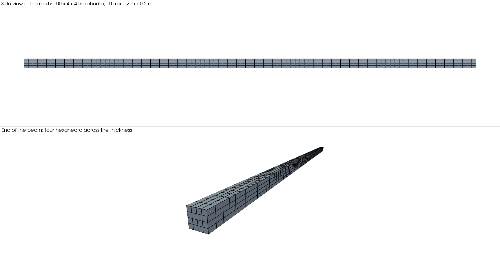
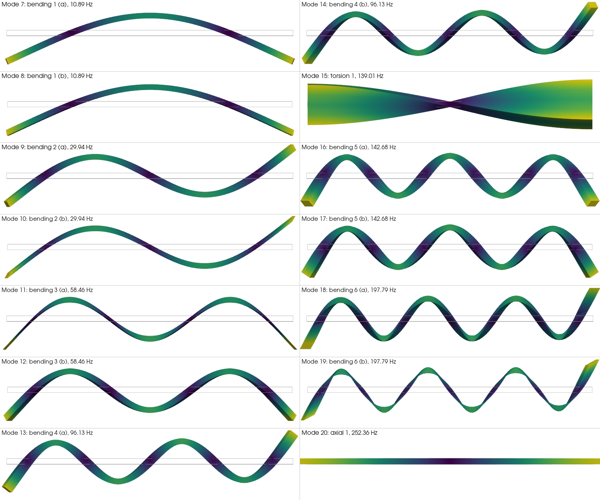

.. _AdvancedExampleFreeFreeBeamModes:

#####################################################################
Free-Free Beam: Modal Analysis versus Euler-Bernoulli Beam Theory
#####################################################################

------------------------------------------------------------------
Problem description
------------------------------------------------------------------

This example computes the vibration modes of a free-free steel beam with the ``Modal`` time integration option of the :ref:`SolidMechanicsLagrangianFEM` solver, and compares them with the beam theory.
The beam is 10 m long and has a square cross-section of 0.2 m by 0.2 m.
It is slender: the length is 50 times the side.
No displacement boundary condition is applied, so the beam is a free body.
Its stiffness matrix :math:`\mathbf{K}` is singular, and the first six modes are the rigid-body modes at zero frequency.
They are followed by the elastic modes of the beam: bending, torsion and axial modes.

**Beam theory**

The Euler-Bernoulli theory gives the frequencies of the bending modes [Blevins2001]_ as

.. math::
   f_n = \frac{(\beta_n L)^2}{2 \pi L^2} \sqrt{\frac{E I}{\rho A}},

where :math:`L` is the length, :math:`E` the Young modulus, :math:`\rho` the density, :math:`A` the area of the cross-section and :math:`I` its second moment of area.
The numbers :math:`\beta_n L = 4.7300, 7.8532, 10.9956, 14.1372, \dots` are the roots of :math:`\cos(x)\cosh(x) = 1`.
The cross-section is square, so every bending frequency is double: the beam bends in two perpendicular planes with the same frequency.
The mode shape is

.. math::
   \phi_n(x) = \cosh(\beta_n x) + \cos(\beta_n x) - \sigma_n \left( \sinh(\beta_n x) + \sin(\beta_n x) \right),
   \qquad \sigma_n = \frac{\cosh(\beta_n L) - \cos(\beta_n L)}{\sinh(\beta_n L) - \sin(\beta_n L)},

with :math:`\beta_n = (\beta_n L) / L` and :math:`\int_0^L \phi_n^2 \, dx = L`.
GEOS normalizes its modes with :math:`\boldsymbol{\phi}^T \mathbf{M} \boldsymbol{\phi} = 1`.
For the beam, this means :math:`\rho A \int_0^L u^2 \, dx = 1`, so the mass-normalized displacement is :math:`u_n(x) = \phi_n(x) / \sqrt{\rho A L}`.

The Euler-Bernoulli theory ignores the shear deformation and the rotary inertia.
Both lower the frequencies.
The Rayleigh-Timoshenko estimate [Han1999]_ gives

.. math::
   f_n^{T} = \frac{f_n}{\sqrt{1 + (\beta_n r)^2 \left( 1 + \dfrac{E}{\kappa G} \right)}},

where :math:`r = \sqrt{I/A}` is the radius of gyration, :math:`G = E / (2(1+\nu))` the shear modulus and :math:`\kappa = 10(1+\nu)/(12+11\nu)` the shear coefficient of a rectangular section [Cowper1966]_.
It is first-order accurate for a free-free beam.
The correction is 0.15 % for the first mode and 2.7 % for the sixth.

The first axial frequency of a free-free rod is :math:`f = \frac{1}{2L} \sqrt{E/\rho}`.
The first torsion frequency is :math:`f = \frac{1}{2L} \sqrt{G J / (\rho I_p)}`, with the Saint-Venant constant :math:`J = 0.1406\,a^4` of a square section of side :math:`a` [TimoshenkoGoodier1970]_ and the polar moment :math:`I_p = a^4/6`.

**Input files**

This example uses three GEOS xml files:

.. code-block:: console

  inputFiles/solidMechanics/modalFreeFreeBeam_base.xml
  inputFiles/solidMechanics/modalFreeFreeBeam_arnoldi_smoke.xml
  inputFiles/solidMechanics/modalFreeFreeBeam_block_smoke.xml

The base file has the mesh, the material and the outputs.
The two other files differ by the eigensolver settings.
A Python script that gives the beam theory solutions and plots the comparison is provided at:

.. code-block:: console

  src/docs/sphinx/advancedExamples/validationStudies/solidMechanics/FreeFreeBeamModes/FreeFreeBeamModes_vs_EulerBernoulli.py

The script ``make_beam_assets.py`` in the same folder generates the images and the table of this page from a GEOS run.

------------------------------------------------------------------
Mesh
------------------------------------------------------------------

The internal mesh generator builds the beam with 100 by 4 by 4 trilinear hexahedra, that is 7 575 unknowns:

.. literalinclude:: ../../../../../../../inputFiles/solidMechanics/modalFreeFreeBeam_base.xml
    :language: xml
    :start-after: <!-- SPHINX_MODAL_BEAM_MESH -->
    :end-before: <!-- SPHINX_MODAL_BEAM_MESH_END -->

------------------------------------------------------------------
Material
------------------------------------------------------------------

The material is an isotropic elastic steel, in the International System of Units:

.. literalinclude:: ../../../../../../../inputFiles/solidMechanics/modalFreeFreeBeam_base.xml
    :language: xml
    :start-after: <!-- SPHINX_MODAL_BEAM_MATERIAL -->
    :end-before: <!-- SPHINX_MODAL_BEAM_MATERIAL_END -->

------------------------------------------------------------------
Solver
------------------------------------------------------------------

The solver block selects the ``Modal`` option:

.. literalinclude:: ../../../../../../../inputFiles/solidMechanics/modalFreeFreeBeam_arnoldi_smoke.xml
    :language: xml
    :start-after: <!-- SPHINX_MODAL_BEAM_SOLVER -->
    :end-before: <!-- SPHINX_MODAL_BEAM_SOLVER_END -->

The solver computes ``modalNumModes`` modes, the six rigid-body modes included.
The shift ``modalShiftFrequency`` is a negative frequency.
The shifted matrix :math:`\mathbf{K} + \alpha \mathbf{M}`, with :math:`\alpha = (2 \pi f)^2`, is then positive definite although the beam is a free body.
The ``arnoldi`` eigensolver solves one linear system with this matrix for each Krylov vector.
The linear solver tolerance ``krylovTol`` is two orders of magnitude smaller than ``modalTolerance``.
The default ``modalCompletenessCheck`` verifies that no copy of a repeated eigenvalue is missed.
The second input file uses ``modalBlockSize="6"``, which is the multiplicity of the rigid-body modes, instead of this check.
The attribute ``modalDeflateRigidBodyModes="1"`` removes the rigid-body modes from the eigensolve, which lowers the cost of a free body.
The theory of the eigensolvers is in :ref:`SolidMechanicsLagrangianFEM`.

The solver runs once.
It prints a table with the frequency, the residual and the participation factors of each mode in the log.
It saves the mode shapes in the nodal fields ``modeShape1``, ``modeShape2``, and so on.
A ``VTK`` output writes them.

------------------------------------------------------------------
Collecting the mode shapes
------------------------------------------------------------------

The integrated test collects the first and the second bending mode along the axis of the beam with ``PackCollection`` tasks.
The modes 7 and 8 are the two polarizations of the first bending mode.
The modes 9 and 10 are the two polarizations of the second one.

.. literalinclude:: ../../../../../../../inputFiles/solidMechanics/modalFreeFreeBeam_base.xml
    :language: xml
    :start-after: <!-- SPHINX_MODAL_BEAM_TASKS -->
    :end-before: <!-- SPHINX_MODAL_BEAM_TASKS_END -->

------------------------------------------------------------------
A comparison between GEOS results and beam theory
------------------------------------------------------------------

The results use a run with ``modalNumModes="20"``.
They are in the files ``FreeFreeBeamFrequencies.txt`` and ``FreeFreeBeamModeShapes.txt``.
The left plot compares the frequencies of the bending modes, the first torsion mode and the first axial mode.
Each GEOS bending value is the mean of a pair of modes.
The two other plots compare the mass-normalized shapes of the first four bending modes.
The polarization of a bending mode in the plane of the cross-section is arbitrary.
The script projects each computed mode on the beam theory shape.

.. plot:: docs/sphinx/advancedExamples/validationStudies/solidMechanics/FreeFreeBeamModes/FreeFreeBeamModes_vs_EulerBernoulli.py

The table gives the 20 modes.
The letters (a) and (b) label the two members of a pair.
The difference is relative to the beam theory frequency.

.. csv-table:: Modes of the free-free beam
   :file: FreeFreeBeamModeTable.csv
   :header-rows: 1
   :widths: 8, 18, 14, 16, 12, 16, 16

The six rigid-body modes are zero up to rounding errors: their frequencies are below 0.001 Hz.
The next fourteen modes are the elastic modes.
The images below show them, scaled so that the largest displacement is 1 m.
The grey rectangle is the undeformed beam.
The color is the displacement magnitude.
The bending modes of a pair have the same shape in two perpendicular planes.
The image shows each of them rotated into the plane of the view.

**Discussion**

The shapes agree with the beam theory.
The ratio of the frequencies of the second and the first bending mode is 2.749 in GEOS and 2.756 in the Euler-Bernoulli theory.
The axial frequency agrees with the closed form to :math:`10^{-4}`.
The torsion frequency is 3.3 % lower than the Saint-Venant estimate.
The row-sum lumped mass places the mass of a section at its nodes, which raises the polar moment of this mesh by 12.5 %, and lowers the torsion frequency by 5.7 %.
The stiffness of the element partly compensates.

The bending frequencies of GEOS are higher than the Euler-Bernoulli values by 5.0 % for the first mode and 2.3 % for the sixth.
The difference to the Timoshenko estimate is 5.1 % for the six bending orders.
This constant offset is a stiffening of the discretization.
It is the shear locking of the standard trilinear hexahedron, which has four elements across the thickness.
It does not depend on the mode.
The difference with the Euler-Bernoulli values decreases with the mode order only because the shear and rotary inertia effects increase with it.
The locking falls with the mesh: with 4 elements across the thickness, the first mode is 12.7 %, 7.5 % and 5.0 % high with 60, 80 and 100 elements along the beam.

------------------------------------------------------------------
To go further
------------------------------------------------------------------

**Eigensolvers**

The ``lobpcg`` eigensolver applies only a preconditioner and finds the lowest modes.
On this beam it converges in 131 iterations and 0.9 s on one core with ``modalDeflateRigidBodyModes="1"``, against 9.3 s for the default ``arnoldi`` setting.
Without deflation, it does not converge.
The example :ref:`AdvancedExampleEigensolverComparison` gives the measured costs.

**Integrated test**

The two decks run as integrated tests on one, two and four MPI ranks.
They compare the mode shapes with the beam theory with the curve checker.

**References**

- [Blevins2001]_ gives the frequencies and the mode shapes of beams.
- [Han1999]_ compares four beam theories.
- [Cowper1966]_ gives the shear coefficient.
- [TimoshenkoGoodier1970]_ gives the torsion constant.

**Feedback on this example**

For any feedback on this example, please submit a `GitHub issue on the project's GitHub page <https://github.com/GEOS-DEV/GEOS/issues>`_.
