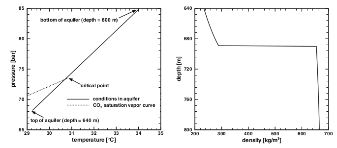
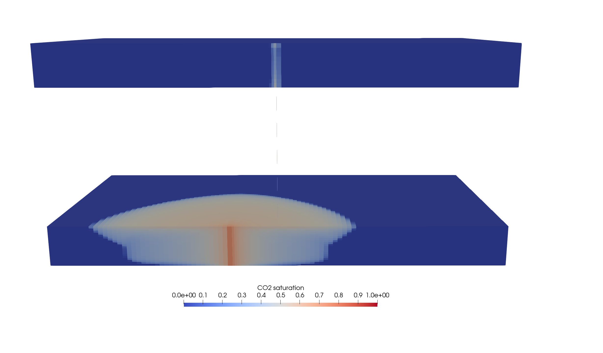
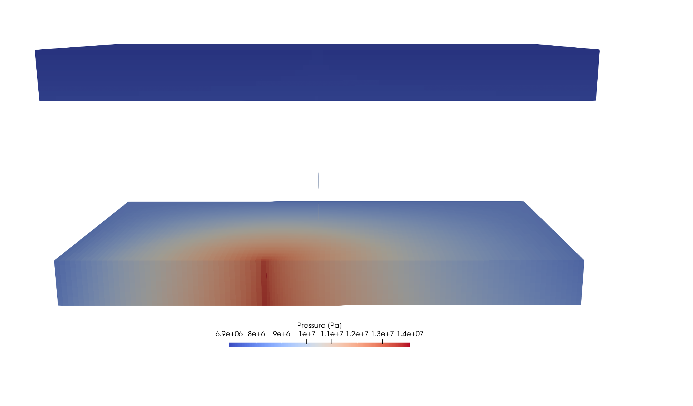
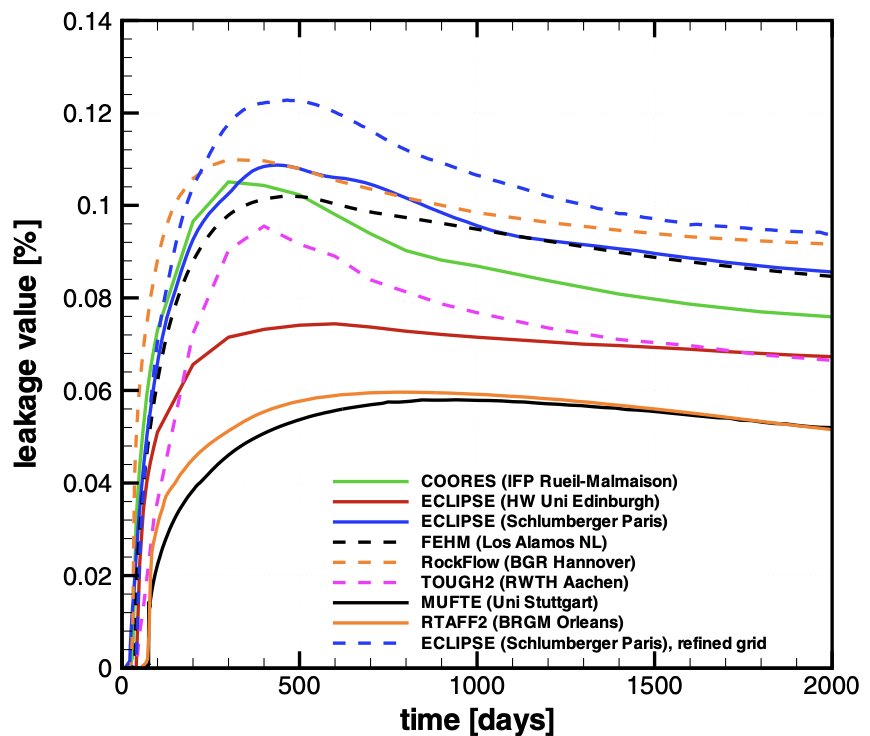

.. _ExampleThermalLeakyWell:

#########################################################################
Non-isothermal CO2 Plume Evolution and Leakage Through an Abandoned Well
#########################################################################

**Context**

This validation case is a more complex version of the benchmark problem presented in :ref:`ExampleIsothermalLeakyWell`.
While the latter is based on simple isothermal and immiscible fluid properties, the present validation case
relies on a more realistic fluid behavior accounting for thermal effects and mass exchange between phases.
This non-isothermal benchmark test has been used in
`(Class et al., 2009) <https://link.springer.com/article/10.1007/s10596-009-9146-x>`__
to compare different implementations of CO2-brine fluid properties in the
context of CO2 injection and storage in saline aquifers.

Our goal is to review the sections of the XML file that are used to parameterize the CO2-brine fluid behavior,
and to demonstrate that GEOSX produces similar results as those presented in
`(Class et al., 2009) <https://link.springer.com/article/10.1007/s10596-009-9146-x>`__.

**Input file**

This benchmark test is based on the XML file located below:

.. code-block:: console

  ../../../../../../inputFiles/compositionalMultiphaseFlow/benchmarks/thermalLeakyWell/thermalLeakyWell_benchmark.xml

------------------------------------------------------------------------
Problem description
------------------------------------------------------------------------

Some of the text below is adapted from
`(Ebigbo, Class, Helmig, 2007) <https://link.springer.com/article/10.1007%2Fs10596-006-9033-7>`__.

The benchmark scenario remains the same as in :ref:`ExampleIsothermalLeakyWell`.
CO2 is injected into an aquifer, spreads within the aquifer, and, upon reaching a leaky well,
rises up to a shallower aquifer.
The model domain still has the dimensions: 1000 x 1000 x 160 m, but it is now assumed to be
shallower, between 640 m and 800 m of depth.

The figure below shows the pressure and temperature in the formation at the mentioned
depths (assuming a geothermal gradient of 0.03 K/m).
The conditions in the aquifer at the considered depths range from supercritical to liquid
to gaseous.
The figure also shows the CO2 density at the conditions of the formation.
There is a large change in density at a certain  depth.
This depth corresponds to the point where the line depicting the formation conditions
crosses the CO2 saturation vapor curve, that is, the boundary between liquid and gaseous CO2.
Other fluid properties such as viscosity also change abruptly at that depth.    

.. _isothermalLeakyWell_aquiferConditions:

   Aquifer conditions (image taken from `(Ebigbo, Class, Helmig, 2007) <https://link.springer.com/article/10.1007%2Fs10596-006-9033-7>`__).

Therefore, as explained later, we use a more sophisticated fluid model in which
the CO2 and brine fluid properties are now a function of the aquifer conditions,
such as pressure, temperature, and salinity. Specifically:

- The CO2 component is present in the CO2-rich phase but can also dissolve in the brine phase. The amount of dissolved CO2 depends on pressure, temperature, and salinity. For now, in GEOSX, the water component cannot be present in the CO2-rich phase.
- Densities and viscosities depend nonlinearly on pressure, temperature, and salinity.
- The hydrostatic initial condition accounts for the geothermal gradient of 0.03 K/m specified in the benchmark description.

We plan to use two types of physical models in this benchmark:

- A model simulating flow and mass transfer, but not heat transfer (i.e., no energy balance is used). The geothermal gradient is constant in time, and is taken into account in the calculation of temperature-dependent properties.
- A fully thermal model simulating flow as well as mass and heat transfer. The results obtained with this more complex model are not available yet and will be added to this page soon.

------------------------------------------------------------------
Mesh and element regions
------------------------------------------------------------------

As illustrated by the ECLIPSE results in `(Class et al., 2009) <https://link.springer.com/article/10.1007/s10596-009-9146-x>`__,
the leakage rate exhibits a high dependence on the degree of spatial refinement (particularly between the two wells in our observations).
Therefore, we consider two meshes in this test case:

- A "coarse" mesh with 206070 cells, whose spatial resolution is similar to that used by most codes based on the information provided by Table 13 of `(Class et al., 2009) <https://link.springer.com/article/10.1007/s10596-009-9146-x>`__. 
- A "fine" mesh with 339390 cells, whose spatial resolution is finer between the two wells.   

These structured meshes are defined as in :ref:`ExampleIsothermalLeakyWell`, as shown next for the "fine" mesh.

.. literalinclude:: ../../../../../../inputFiles/compositionalMultiphaseFlow/benchmarks/thermalLeakyWell/thermalLeakyWell_benchmark.xml
    :language: xml
    :start-after: <!-- SPHINX_MESH -->
    :end-before: <!-- SPHINX_MESH_END -->

As in the previous benchmark, we define four element regions whose material list now includes the name of
the capillary pressure constitutive model (``cappres``).
We refer the reader to :ref:`ExampleIsothermalLeakyWell` for an example of this procedure.

------------------------------------------------------------------
Flow solver
------------------------------------------------------------------

Although the fluid behavior is significantly different from that of the previous benchmark, we still use the GEOSX
general-purpose multiphase flow solver defined in the XML block **CompositionalMultiphaseFVM**:

.. literalinclude:: ../../../../../../inputFiles/compositionalMultiphaseFlow/benchmarks/thermalLeakyWell/thermalLeakyWell_benchmark.xml
    :language: xml
    :start-after: <!-- SPHINX_SOLVER -->
    :end-before: <!-- SPHINX_SOLVER_END -->

In addition to the solid, fluid, permeability, and relative permeability model names, the attribute ``capPressureNames`` is now used
to specify the capillary pressure name.

.. note::
   The attribute ``temperature`` listed above is mandatory, but will be overridden by GEOSX to impose a non-uniform geothermal gradient along the z-axis, as we will see later. We plan to eliminate this attribute in the near future when the thermal version of GEOSX becomes available.

------------------------------------------------------------------
Constitutive models
------------------------------------------------------------------

The Brooks-Corey relative permeabilities and capillary pressure are described using tables
constructed from the parameters values provided in the benchmark description, with a wetting-phase
saturation range between 0.2 and 0.95, an entry pressure of 10000 Pa, and a Brooks-Corey parameter of 2.
We refer the reader to the files used in the **TableFunction** listed below for the exact values
that we have used:

.. literalinclude:: ../../../../../../inputFiles/compositionalMultiphaseFlow/benchmarks/thermalLeakyWell/thermalLeakyWell_benchmark.xml
    :language: xml
    :start-after: <!-- SPHINX_SCAL -->
    :end-before: <!-- SPHINX_SCAL_END -->

The two-phase, two-component CO2-brine model implemented in GEOSX is parameterized in
the **CO2BrinePhillips** XML block:

.. literalinclude:: ../../../../../../inputFiles/compositionalMultiphaseFlow/benchmarks/thermalLeakyWell/thermalLeakyWell_benchmark.xml
    :language: xml
    :start-after: <!-- SPHINX_FLUID -->
    :end-before: <!-- SPHINX_FLUID_END -->

The components of this fluid model are described in detail in the :ref:`CO2-EOS` and are briefly summarized below.
They are parameterized using three parameter files that must be written carefully
to obtain the desired behavior, as explained next.

CO2 density and viscosity
~~~~~~~~~~~~~~~~~~~~~~~~~

These properties are obtained using the models proposed by Span and Wagner (1996) and Fenghour and Wakeham (1998)
for density and viscosity, respectively.
The density and viscosity values are internally tabulated by GEOSX at the beginning of the simulation by solving
the Helmholtz energy equation for each pair :math:`(p,T)`.

The tables size and spacing are specified in the file `pvtgas.txt`.
Here, for both quantities, the values are tabulated between 6.8e4 Pa and 1.5e7 Pa, with a pressure spacing of 5e4 Pa,
and between 302 K and 310 K, with a temperature increment of 0.5 K.
These values have been chosen using the initial condition and an upper bound on the expected pressure increase
during the simulation.

.. code:: 

        DensityFun SpanWagnerCO2Density 6.8e6 2e7 5e4 302.0 307.5 0.5
        ViscosityFun FenghourCO2Viscosity 6.8e6 2e7 5e4 302.0 307.5 0.5

.. note::
   If pressure or temperature go outside the values specified in this parameter file, constant extrapolation is used to obtain the density and viscosity values. Note that for now, no warning is issued by GEOSX when this happens. We plan to add a warning message to document this behavior in the near future.  
	
Brine density and viscosity
~~~~~~~~~~~~~~~~~~~~~~~~~~~

These properties depend on pressure, temperature, composition, and salinity via the models proposed by
Phillips et al. (1981). The brine density is modified to account for the presence of dissolved CO2 using
the method proposed by Garcia (2001).   
The values of (pure) brine density are also tabulated at a function of pressure and temperature, and we
use the same range as for the CO2 properties to construct this table:

.. code::

        DensityFun PhillipsBrineDensity 6.8e6 2e7 5e4 302.0 307.5 0.125 1.901285269
        ViscosityFun PhillipsBrineViscosity 1.901285269

Importantly, the last value on each line in the file `pvtliquid.txt` defines the salinity in the domain.
In our model, salinity is constant in space and in time (i.e., unlike water and CO2, it is not tracked as
a component in GEOSX).
In our model, salinity is specified as a molal concentration in mole of NaCl per kg of solvent (brine).
The value used here (1000 x 10 / ( 58.44 x ( 100 - 10 ) ) = 1.901285269 moles/kg) is
chosen to match the value specified in the benchmark (weight% of 10%).

CO2 solubility in brine
~~~~~~~~~~~~~~~~~~~~~~~

As explained in :ref:`CO2-EOS`, we use the highly nonlinear model proposed by Duan and Sun (2004)
to compute the CO2 solubility as a function of pressure, temperature, composition, and salinity.
In `co2flash.txt`, we use the same parameters as above to construct the pressure-temperature tables
of precomputed CO2 solubility in brine.

.. code::

        FlashModel CO2Solubility 6.8e6 2e7 5e4 302.0 307.5 0.25 1.901285269
	
------------------------------------------------------------------
Initial and boundary conditions
------------------------------------------------------------------

The domain is initially saturated with brine with a hydrostatic pressure field and a geothermal
gradient of 0.03 K/m.
This is specified using the **HydrostaticEquilibrium** XML tag in the **FieldSpecifications** block:

.. literalinclude:: ../../../../../../inputFiles/compositionalMultiphaseFlow/benchmarks/thermalLeakyWell/thermalLeakyWell_benchmark.xml
    :language: xml
    :start-after: <!-- SPHINX_HYDROSTATIC -->
    :end-before: <!-- SPHINX_HYDROSTATIC_END -->

Although this is the same block as in :ref:`ExampleIsothermalLeakyWell`, GEOSX is now enforcing the
geothermal gradient specified in the **TableFunction** named ``initTempTable``, and is also accounting
for the nonlinear temperature dependence of brine density to equilibrate the pressure field.

We use the simple table-based approach shown below to impose the Dirichlet boundary conditions on the four
sides of the domain.  

.. literalinclude:: ../../../../../../inputFiles/compositionalMultiphaseFlow/benchmarks/thermalLeakyWell/thermalLeakyWell_benchmark.xml
    :language: xml
    :start-after: <!-- SPHINX_DIRICHLET_BC -->
    :end-before: <!-- SPHINX_DIRICHLET_BC_END -->

where the ``setNames = "{ east, west, south, north }"`` are defined using the **Box**
XML tags of the **Geometry** section, and where the tables are defined as **TableFunction**
in the **Functions** section. 
		 
.. note::
   Due to the nonlinear dependence of brine density on temperature, this block does not exactly impose a Dirichlet pressure equal to the initial condition. Instead, here, we impose a linear pressure gradient along the z-axis, whose minimum and maximum values are the same as in the initial state. We could have imposed Dirichlet boundary conditions preserving the initial condition using as many points in `zlin.geos` as there are cells along the z-axis (instead of just two points).  

The **SourceFlux** is the same as in the previous benchmark case (see :ref:`ExampleIsothermalLeakyWell`).

---------------------------------
Inspecting results
---------------------------------

We request VTK-format output files and use Paraview to visualize the results.
The following figures show the distribution of CO2 saturation and pressure along the slice defined by x = 0 at t = 300 days.  

.. _isothermalLeakyWell_CO2saturation:

   CO2 saturation after 200 days

.. _isothermalLeakyWell_pressure:

   Pressure after 200 days

To validate the GEOSX results, we consider the metrics used in
`(Class et al., 2009) <https://link.springer.com/article/10.1007/s10596-009-9146-x>`__ as
previously done in :ref:`ExampleIsothermalLeakyWell`.

First, we consider the arrival time of the CO2 plume at the leaky well.
As in `(Class et al., 2009) <https://link.springer.com/article/10.1007/s10596-009-9146-x>`__,
we use the leakage rate threshold of 0.005% to detect the arrival time.
In our numerical tests, the arrival time is highly dependent on the degree of spatial refinement
in the vicinity of the wells and on the time step size, but these parameters are not documented in 
`(Class et al., 2009) <https://link.springer.com/article/10.1007/s10596-009-9146-x>`__.
The next table reports the GEOSX arrival time at the leaky well and compares it with the values published in  
`(Class et al., 2009) <https://link.springer.com/article/10.1007/s10596-009-9146-x>`__.

+-----------------------------+---------------------+
| Code                        | Arrival             |
|                             | time [day]          |
+=============================+=====================+
| GEOSX COARSE                |     36.8            | 
+-----------------------------+---------------------+
| GEOSX FINE                  |     46.7            | 
+-----------------------------+---------------------+
| COORES                      |     31              | 
+-----------------------------+---------------------+
| ECLIPSE HW                  |     42              | 
+-----------------------------+---------------------+
| ECLIPSE SCHLUMBERGER COARSE |     24              |
+-----------------------------+---------------------+
| ECLIPSE SCHLUMBERGER FINE   |     34              |
+-----------------------------+---------------------+
| RockFlow                    |     30              | 
+-----------------------------+---------------------+
| TOUGH2                      |     46              | 
+-----------------------------+---------------------+

.. note::
   In the table above, we only included the values obtained with the codes that do **not** solve an energy balance equation. The values obtained with the fully thermal codes (FEHM, MUFTE, and RTAFF2) are omitted for now.

Next, we measure the CO2 leakage rate through the leaky well, defined by the authors as the CO2 mass
flow at midway between top and bottom aquifers divided by the injection rate (8.87 kg/s), in percent.
The GEOSX leakage rate is shown in the figure below:

.. isothermalLeakyWell_GEOSXLeakageRate:
.. plot::
   :align: center

    import matplotlib
    import matplotlib.pyplot as plt
    import numpy as np
    import h5py
    
    from matplotlib.ticker import AutoMinorLocator

    def main():

        # File path
	hdf5FilePathRefined = 'compOutfluxHistoryRefined.hdf5'
	hdf5FilePathCoarse = 'compOutfluxHistoryCoarse.hdf5'
    
        # Read HDF5
	hf = h5py.File(hdf5FilePathRefined, 'r')
	timeRefined = hf.get('componentOutflux Time')
        timeRefined = np.array(timeRefined)
        compOutfluxRefined = hf.get('componentOutflux')
        compOutfluxRefined = np.array(compOutfluxRefined)

        hf = h5py.File(hdf5FilePathCoarse, 'r')
        timeCoarse = hf.get('componentOutflux Time')
        timeCoarse = np.array(timeCoarse)
        compOutfluxCoarse = hf.get('componentOutflux')
        compOutfluxCoarse = np.array(compOutfluxCoarse)
    
        # Conversions
        inDays = 1.0 / 86400.0
 
        # Data from the benchmark
        timeStepSize = 10000
        injectionRate = 8.87

	cooresTime = np.array([32.804787597143445, 35.61571229783658, 39.36361189876067, 37.48966209829865, 38.89512444864522, 37.48966209829865, 44.79806632010076, 45.922436200378, 43.111511499684866, 50.41991572148703, 52.247016776937585, 56.0417651228733, 61.38252205419025, 67.00437145557652, 71.78294344675481, 77.96697778827973, 83.86991965973533, 89.49176906112154, 92.30269376181468, 102.14093021424065, 119.00647841839947, 131.65563957151858, 142.89933837429106, 154.1430371770636, 165.38673597983615, 176.63043478260863, 187.87413358538117, 200.52329473850023, 221.6052299936988, 249.71447700063004, 277.8237240075614, 307.33843336483926, 341.42089536074354, 369.17877678008824, 400.0989484877126, 431.0191201953371, 461.9392919029616, 492.859463610586, 532.2124094202899, 563.1325811279142, 594.0527528355387, 624.9729245431632,  655.8930962507876, 686.8132679584122, 717.7334396660366, 748.653611373661, 779.5737830812856, 810.49395478891, 841.4141264965343, 872.3342982041589, 903.2544699117833, 934.1746416194077, 965.094813327032, 996.0149850346567, 1026.935156742281, 1057.8553284499053, 1088.7755001575301, 1119.6956718651545, 1150.6158435727789, 1181.5360152804033, 1212.4561869880276, 1243.376358695652, 1274.2965304032768, 1305.2167021109012, 1336.1368738185256, 1367.05704552615, 1397.9772172337744, 1428.8973889413987, 1459.8175606490236, 1490.737732356648, 1521.6579040642723, 1552.5780757718967, 1583.498247479521, 1614.4184191871454, 1645.3385908947703, 1676.2587626023947, 1707.178934310019, 1738.0991060176434, 1769.0192777252682, 1799.9394494328926, 1830.859621140517, 1861.7797928481414, 1892.6999645557657, 1923.6201362633901, 1954.5403079710145, 1981.2440926275995 ]);
        cooresLeakage = np.array([ 0.0023648852657005004, 0.007429234601449286, 0.02962616998792271, 0.025531589673913044, 0.01324784873188406,  0.00570520078502415, 0.03507842693236715, 0.03774349587359099, 0.032319972826086965, 0.04065075051759834, 0.0436878208031401, 0.0468449577294686, 0.05097904715177133, 0.055055668780193245, 0.05839598429951691, 0.06199490489130435, 0.06507661533816425, 0.06756389329206924, 0.0696022041062802, 0.07247559380032206, 0.077274154589372, 0.07997334503321256, 0.08264020984299517, 0.08522626056763286, 0.08783924932065218, 0.09050611413043479, 0.09319991696859903, 0.09587216938405797, 0.09812418855676328, 0.1005270606884058, 0.10292993282004831, 0.10476857570267897, 0.10466204804498792, 0.10445511500878349, 0.10415144996157225, 0.10360289374725516, 0.10297597235946421, 0.10242741614514712, 0.10081113444224857, 0.0995670873133509, 0.09824467501097936, 0.09695164964866052, 0.09567821557971015, 0.09438519021739131, 0.09319991696859903, 0.0920538263065437, 0.09093712258454106, 0.08996735356280194, 0.08932084088164252, 0.08868412384716734, 0.08808658939942907, 0.08767517223869126, 0.08727355072463769, 0.08687192921058409, 0.0864017381697409, 0.08591195583552921, 0.08544176479468599, 0.0849519824604743, 0.0844524044795784, 0.08397241779205095, 0.08350222675120773, 0.08306142265041722, 0.08260102725625823, 0.08216022315546773, 0.08170962340799298, 0.08126881930720246, 0.08081821955972772, 0.08046557627909531, 0.0801423199385156, 0.07978967665788318, 0.07948601161067194, 0.07911377703667105, 0.07880031634277558, 0.07848685564888011, 0.07823216883509003, 0.07797748202129996, 0.07772279520750988, 0.07745831274703557, 0.07719383028656127, 0.07695873476613965, 0.07680200441919192, 0.07660609148550725, 0.07642976984519105, 0.07628283514492754, 0.07613590044466403, 0.07595957880434782 ])

        tough2Time = np.array([ 47.608991020793894, 54.756770973985, 65.19734843370236, 72.62622085696279, 79.65353260869563, 90.49567073994058, 103.34561222882343, 117.6010160680529, 131.65563957151858, 147.11572542533077, 162.37503094337916, 176.63043478260863, 190.6850582860743, 210.36153119092626, 237.065315847511, 265.17456285444234, 293.2838098613736, 341.0695297731569, 371.9897014807814, 402.90987318840575, 461.9392919029616, 478.8048401071203, 526.5905600189036, 544.8615705734089, 594.0527528355387, 612.3237633900441, 655.8930962507876, 686.8132679584122, 717.7334396660366, 734.5989878701954, 782.3847077819786, 800.655718336484, 849.8469005986138, 868.117911153119, 917.3090934152489, 935.5801039697543, 984.7712862318841, 1003.0422967863896, 1055.0444037492125, 1073.3154143037177, 1125.3175212665406, 1143.5885318210462, 1195.590638783869, 1212.4561869880276, 1265.863756301197, 1282.7293045053561, 1336.1368738185256, 1353.0024220226842, 1403.5990666351609, 1421.870077189666, 1476.6831088531821, 1494.9541194076874, 1546.9562263705106, 1565.2272369250159, 1617.2293438878387, 1635.5003544423444, 1687.5024614051672, 1705.7734719596724, 1757.7755789224957, 1776.046589477001, 1828.0486964398237, 1846.319706994329, 1898.3218139571522, 1916.5928245116575, 1971.4058561751735, 1988.2714043793321 ]);
        tough2Leakage = np.array([ 0.0034855072463768344, 0.009091695781573483, 0.01464862620772947, 0.0198386863425926, 0.025369961503623195, 0.03093458850931677, 0.03636837366287095, 0.04150584050422705, 0.04675875603864735, 0.05229003119967794, 0.05771868530020703, 0.06285422799667875, 0.0680802055027174, 0.0737237224486715, 0.07862259532436162, 0.08368694466011042, 0.08868972135955831, 0.092318308767018, 0.09384642964975845, 0.09511986371870883, 0.09303339097496706, 0.0925534042874396, 0.09088814435111989, 0.09050611413043479, 0.08906615406785244, 0.0886743282004831, 0.08614705135595081, 0.0846875, 0.08343365722441809, 0.08317897041062802, 0.08173901034804568, 0.08140106053743962, 0.07997579394488362, 0.07962315066425121, 0.07834971659530084, 0.07811462107487922, 0.07703709993961352, 0.07671384359903381, 0.0758616223375055, 0.07558244640700483, 0.07471553167545016, 0.07450492527173913, 0.07356944101339483, 0.07337352807971015, 0.0726584458717611, 0.07240375905797101, 0.07179642896354853, 0.07154174214975846, 0.07097359464207291, 0.07084135341183576, 0.07049360795454546, 0.07046422101449276, 0.07003321256038647, 0.0699254604468599, 0.06950424763943787, 0.06933282382246377, 0.06880875672485727, 0.06863243508454106, 0.06809367451690822, 0.06798592240338165, 0.06751573136253843, 0.0674471618357488, 0.06709451855511639, 0.06701615338164252, 0.06667330574769434, 0.06658514492753624 ]);

        eclipseTime = np.array([ 23.435038594832974, 37.05721214434584, 36.36529221802135, 38.426636998529716, 43.111511499684866, 46.54708613386538, 46.177974809531975, 49.93804291565391, 50.98210066162568, 52.94974795211084, 54.917395242596, 48.73336090107114, 58.77237768926096, 58.10310990338161, 63.842081167296726, 68.0082731343955, 72.62622085696279, 79.25197193716804, 84.47226066702672, 96.00800359454655, 90.89723141146811, 106.35731726528036, 119.1821612121928, 119.00647841839947, 134.46656427221166, 149.9266501260239, 164.54345856962817, 176.63043478260863, 187.87413358538117, 200.52329473850023, 215.98338059231253, 235.65985349716448, 260.9581758034026, 290.47288516068045, 319.9875945179584, 349.5023038752363, 380.42247558286067, 411.34264729048516, 442.26281899810965, 461.9392919029616, 515.3468612161311, 542.5191333228314, 578.3115745116571, 608.1073763390044, 639.0275480466289, 669.9477197542533, 700.8678914618778, 731.7880631695022, 762.7082348771268, 793.6284065847511, 824.5485782923755, 855.4687500000001, 886.3889217076245, 917.3090934152489, 948.2292651228735, 979.1494368304978, 1010.0696085381222, 1040.9897802457467, 1071.909951953371, 1102.8301236609955, 1122.5065965658478, 1167.4813917769375, 1199.2046848276173, 1230.446105072464, 1260.241906899811, 1291.1620786074354, 1322.0822503150598, 1353.0024220226842, 1383.922593730309, 1414.8427654379334, 1445.7629371455578, 1476.6831088531821, 1507.6032805608065, 1538.523452268431, 1569.4436239760557, 1600.36379568368, 1631.2839673913045, 1662.2041390989289, 1693.1243108065532, 1724.044482514178, 1754.9646542218024, 1816.8049976370512, 1847.7251693446756, 1878.6453410523, 1909.5655127599248, 1940.4856844675492, 1971.4058561751735, 1989.6768667296787 ]);
        eclipseLeakage = np.array([ 0.0014460536067193719, 0.007021434294871842, 0.0034898173309178826, 0.010985054347826095, 0.014465447614734311, 0.019569306058776187, 0.02393489926438297, 0.02936448628364391, 0.026359125905797087, 0.03201467517109502, 0.03453966636473431, 0.021329257246376812, 0.03722423330745342, 0.039711767814009674, 0.042451365300422705, 0.04629564185275559, 0.0498296912741546, 0.0537626434178744, 0.057535677742312705, 0.06377575345849804, 0.06015593548711756, 0.06890908436014302, 0.07426248301630434, 0.07132623792270532, 0.07660609148550725, 0.08109576288244766, 0.08445044535024154, 0.08743517889492754, 0.08983266342089372, 0.09223014794685991, 0.09458273575885667, 0.09691736488526576, 0.0992986865942029, 0.10160458182367149, 0.10393202747584541, 0.10612037494510321, 0.10769747406126481, 0.10839296497584541, 0.10851051273605622, 0.10846479971819646, 0.10744278724747475, 0.10702810487117552, 0.10623792270531401, 0.10586568813131314, 0.1055620230841019, 0.10508203639657443, 0.10444531936209925, 0.10363228068730787, 0.10284862895256917, 0.10173192523056654, 0.10057603892182695, 0.09974340895366711, 0.09878343557861222, 0.09783325785024155, 0.096971240942029, 0.0961288153271849, 0.09530598100570928, 0.09461049009112868, 0.09418507914941339, 0.0934252168423364, 0.09276890851449276, 0.09264156510759772, 0.09256879744651483, 0.09213317104468599, 0.0919068916062802, 0.09163261349912165, 0.09127997021848924, 0.09102528340469918, 0.09069223141743522, 0.09041795331027669, 0.09016326649648661, 0.08982041886253843, 0.08946777558190602, 0.08916411053469478, 0.08883105854743084, 0.08854698479358805, 0.08829229797979798, 0.08800822422595521, 0.08770455917874397, 0.08744987236495388, 0.08720498119784806, 0.08670540321695214, 0.0864605120498463, 0.08627439476284585, 0.08608827747584541, 0.08590216018884497, 0.0857062472551603, 0.08565726902173913 ]);    

        eclipseRefinedTime = np.array([ 23.435038594832974, 37.05721214434584, 38.426636998529716, 37.08810142677106, 43.111511499684866, 46.54708613386538, 46.177974809531975, 49.93804291565391, 50.98210066162568, 52.94974795211084, 54.917395242596, 48.73336090107114, 58.77237768926096, 58.10310990338161, 63.842081167296726, 68.0082731343955, 72.62622085696279, 79.25197193716804, 84.47226066702672, 96.00800359454655, 90.89723141146811, 106.35731726528036, 119.1821612121928, 129.2280227845563, 141.21278355387523, 151.53289281213432, 168.39844101629308, 190.6850582860743, 218.79430529300566, 252.52540170132318, 287.6619604599874, 335.4476803717706, 397.2880237870195, 415.5590343415249, 467.56114130434787, 485.8321518588532, 537.8342588216761, 556.1052693761815, 605.2964516383113, 622.1619998424701, 667.1367950535601, 685.4078056080656, 728.9771384688091, 745.842686672968, 793.6284065847511, 810.49395478891, 858.2796747006931, 875.145222904852, 925.7418675173284, 942.6074157214872, 990.3931356332704, 1008.6641461877756, 1060.6662531505985, 1077.5318013547576, 1128.1284459672338, 1146.399456521739, 1195.590638783869, 1213.8616493383743, 1265.863756301197, 1282.7293045053561, 1333.3259491178324, 1351.596959672338, 1403.5990666351609, 1420.4646148393194, 1473.872184152489, 1490.737732356648, 1561.010849873976, 1611.6074944864527, 1629.8785050409579, 1684.691536704474, 1701.5570849086325, 1754.9646542218024, 1771.830202425961, 1825.2377717391305, 1843.5087822936362, 1895.510889256459, 1913.7818998109642, 1968.5949314744803, 1985.4604796786393 ])
        eclipseRefinedLeakage = np.array([ 0.0014460536067193719, 0.007004857046636975, 0.00346395682367151, 0.011185165415804, 0.01447622282608696, 0.019581278515834688, 0.02393489926438297, 0.02936448628364391, 0.026382831370772963, 0.03201467517109502, 0.03453966636473431, 0.021329257246376812, 0.03722423330745342, 0.039711767814009674, 0.04246483431461352, 0.046311035011830815, 0.04990152601650563, 0.053793429736024856, 0.057535677742312705, 0.06377575345849804, 0.06015593548711756, 0.06890908436014302, 0.07427595203049517, 0.07966233325098815, 0.08485990338164251, 0.09081397731193927, 0.09607843771566599, 0.10153274708132046, 0.1064803649607488, 0.11143696218297101, 0.11604336503623189, 0.1199518280632411, 0.12194034434014053, 0.12207748339371981, 0.12251828749451033, 0.12250849184782608, 0.12180320528656127, 0.12148484676932367, 0.11981468900966183, 0.11938368055555555, 0.11740495992534036, 0.11690538194444444, 0.11475033967391304, 0.11421157910628019, 0.11213490200922266, 0.11173328049516909, 0.11010720314558631, 0.10979374245169082, 0.10840276062252964, 0.1080697086352657, 0.10663954421936758, 0.1062917987620773, 0.10502326251646904, 0.10462164100241546, 0.10354411986714976, 0.10322086352657005, 0.10199640769104085, 0.10171233393719807, 0.10063481280193237, 0.10031155646135266, 0.09938097002635046, 0.0991262832125604, 0.09817610548418973, 0.09804876207729468, 0.0972944972826087, 0.09707899305555556, 0.09632472826086957, 0.09576637639986825, 0.09578596769323672, 0.09539414182586736, 0.09535495923913043, 0.09501211160518225, 0.09492395078502416, 0.09463987703118137, 0.09449294233091787, 0.09427743810386474, 0.09427743810386474, 0.09395418176328502, 0.09373867753623188 ])

        rockflowTime = np.array([ 27.651425645872678, 34.05408746411814, 36.78693092312534, 39.24649003623182, 38.54375886105856, 39.24649003623182, 38.54375886105856, 38.89512444864522, 37.48966209829865, 41.706049149338355, 45.922436200378, 50.138823251417705, 58.57159735349711, 65.19734843370236, 75.43714555765592, 85.2753820100819, 99.33000551354752, 114.79009136735976, 135.87202662255822, 166.7921983301827, 204.73968178954, 228.63254174543158, 273.60733695652175, 290.47288516068045, 341.0695297731569, 359.3405403276622, 414.1535719911783, 431.0191201953371, 481.61576480781343, 499.8867753623189, 549.0779576244487, 567.348968178954, 616.5401504410838, 634.8111609955891, 686.8132679584122, 703.6788161625708, 757.0863854757405, 773.9519336798993, 824.5485782923755, 842.819588846881, 894.8216958097038, 911.6872440138626, 965.094813327032, 981.9603615311909, 1035.3679308443607, 1052.2334790485193, 1105.6410483616887, 1122.5065965658478, 1175.9141658790172, 1192.7797140831758, 1246.1872833963453, 1263.0528316005043, 1316.4604009136738, 1333.3259491178324, 1386.7335184310018, 1403.5990666351609, 1457.0066359483303, 1475.2776465028355, 1527.2797534656584, 1545.550764020164, 1597.5528709829869, 1615.823881537492, 1670.6369132010082, 1687.5024614051672, 1740.9100307183367, 1757.7755789224957, 1811.1831482356652, 1829.4541587901704, 1881.4562657529932, 1899.7272763074989, 1954.5403079710145, 1971.4058561751735 ])
        rockflowLeakage = np.array([ 0.0010718599033816556, 0.005226302502683855, 0.011025461390398561, 0.0323469108544686, 0.027013181234903386, 0.02193536288496377, 0.016372660024154606, 0.043310688405797104, 0.03770757850241546, 0.0486982940821256, 0.053978147644927546, 0.059419629378019326, 0.06516640876610306, 0.07054118680986887, 0.07586978537640901, 0.0813112671095008, 0.08678866621376811, 0.09221218926127214, 0.09737146307798482, 0.10222714959071391, 0.10596854242149759, 0.10677668327294687, 0.10903947765700484, 0.10936273399758453, 0.10966639904479578, 0.10957823822463769, 0.10930396011747914, 0.10903947765700484, 0.10813827816205533, 0.10796195652173912, 0.10661015727931489, 0.10623792270531401, 0.1050134668697848, 0.10467551705917874, 0.10371064586078174, 0.10332861564009663, 0.10235884661835748, 0.10203559027777778, 0.10114418642951252, 0.10095806914251207, 0.10003727835419411, 0.09977279589371982, 0.09891077898550725, 0.09858752264492754, 0.09797039690382081, 0.09772550573671498, 0.0972063364624506, 0.09707899305555556, 0.09650104990118577, 0.09632472826086957, 0.09585453722002635, 0.09578596769323672, 0.09524720712560386, 0.0951394550120773, 0.09463987703118137, 0.09449294233091787, 0.09414029905028547, 0.09411580993357488, 0.09364072106938955, 0.09352317330917875, 0.09316073438186209, 0.0929844127415459, 0.09278849980786122, 0.09276890851449276, 0.09253381299407115, 0.09233790006038647, 0.09216157842007028, 0.09212239583333334, 0.0919068916062802, 0.0919068916062802, 0.09169138737922705, 0.09169138737922705 ])

        # Plot HDF5 content
        plt.plot(rockflowTime[:], rockflowLeakage[:], 'y--', label="ROCKFLOW" )            
        plt.plot(eclipseRefinedTime[:], eclipseRefinedLeakage[:], 'm--', label="ECLIPSE (FINE)" )        
        plt.plot(eclipseTime[:], eclipseLeakage[:], 'g--', label="ECLIPSE (COARSE)" )    
        plt.plot(cooresTime[:], cooresLeakage[:], 'b--', label="COORES" )
        plt.plot(tough2Time[:], tough2Leakage[:], 'c--', label="TOUGH2" )            
        plt.plot(timeRefined[:,0]*inDays, 100*abs(compOutfluxRefined[:,14,0]/timeStepSize)/injectionRate, 'r-', label="GEOSX (FINE)" )    
        plt.plot(timeCoarse[:,0]*inDays, 100*abs(compOutfluxCoarse[:,14,0]/timeStepSize)/injectionRate, 'k-', label="GEOSX (COARSE)" )

        plt.xlim( 0, 2000 )
        plt.ylim( 0, 0.14 )
        ax = plt.axes()
        ax.xaxis.set_minor_locator(AutoMinorLocator())
        ax.yaxis.set_minor_locator(AutoMinorLocator())
    
        plt.grid()
        plt.xlabel('time [days]', fontweight='bold')
        plt.ylabel('leakage value [%]', fontweight='bold')
        plt.legend(loc="lower right")    
        plt.show()

    if __name__ == "__main__":
        main()

We see that GEOSX produces a reasonable match with the numerical codes considered in the study.
Although it is not possible to exactly match the published results (due to the lack of information
on the problem, such as mesh refinement and time step size), GEOSX reproduces well the trend exhibited
by the other codes.
	
For reference, we include below the original figure from
`(Class et al., 2009) <https://link.springer.com/article/10.1007/s10596-009-9146-x>`__
containing all the results, including those obtained with the codes solving an energy equation.

.. _isothermalLeakyWell_referenceLeakageRate:

   Leakage rates [%] obtained with the simulators considered in `(Class et al., 2009) <https://link.springer.com/article/10.1007/s10596-009-9146-x>`__.

To further validate the GEOSX results, we reproduce below Table 9 of
`(Class et al., 2009) <https://link.springer.com/article/10.1007/s10596-009-9146-x>`__ (only considering
codes that do not solve an energy equation) to compare the maximum leakage rate, the time at which this
maximum leakage rate is attained, and the leakage rate at 2000 days.
We observe that the GEOSX values are in the same range as those considered in the benchmark.

+-----------------------------+-------------------------+---------------------------+--------------------------+
| Code                        | Max                     | Time at                   | Leakage at               |
|                             | leakage [%]             | max leakage [day]         | 2000 days [%]            |
+=============================+=========================+===========================+==========================+
| GEOSX COARSE                |  0.102                  |    438.5                  |    0.075                 |
+-----------------------------+-------------------------+---------------------------+--------------------------+
| GEOSX FINE                  |  0.115                  |    425.0                  |    0.085                 |
+-----------------------------+-------------------------+---------------------------+--------------------------+
| COORES                      |  0.105                  |    300                    |    0.076                 |
+-----------------------------+-------------------------+---------------------------+--------------------------+
| ECLIPSE HW                  |  0.074                  |    600                    |    0.067                 |
+-----------------------------+-------------------------+---------------------------+--------------------------+
| ECLIPSE SCHLUMBERGER COARSE |  0.109                  |    437                    |    0.086                 |
+-----------------------------+-------------------------+---------------------------+--------------------------+
| ECLIPSE SCHLUMBERGER FINE   |  0.123                  |    465                    |    0.094                 |
+-----------------------------+-------------------------+---------------------------+--------------------------+
| RockFlow                    |  0.11                   |    279                    |    0.09                  |
+-----------------------------+-------------------------+---------------------------+--------------------------+
| TOUGH2                      |  0.096                  |    400                    |    0.067                 |
+-----------------------------+-------------------------+---------------------------+--------------------------+

This table confirms the agreement between GEOSX and the results of `(Class et al., 2009) <https://link.springer.com/article/10.1007/s10596-009-9146-x>`__.

------------------------------------------------------------------
To go further
------------------------------------------------------------------

**Feedback on this example**

For any feedback on this example, please submit a `GitHub issue on the project's GitHub page <https://github.com/GEOSX/GEOSX/issues>`_.
