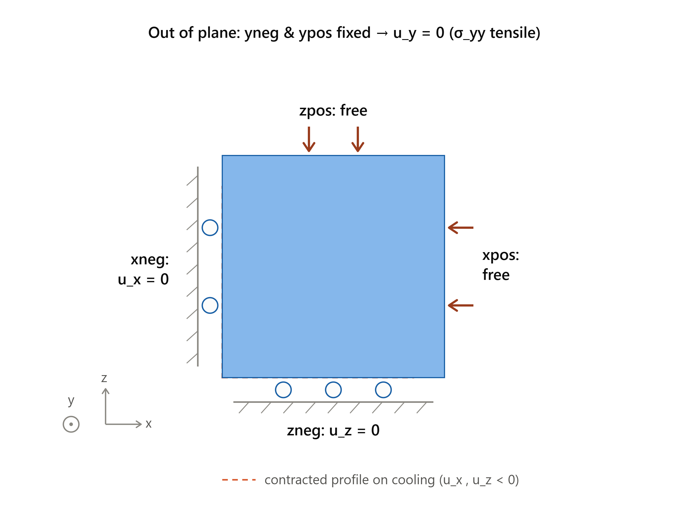

.. _ExampleThermoMech1DCooling:

####################################################
Thermally Induced Failure under Confined Cooling
####################################################

**Context**

When a rock cools but cannot contract, it develops tensile stress. In a confined 
rock mass, this thermal stress combines with the existing in-situ stresses and 
may cause the rock to fail—even when pore pressure and external loading stay constant. 
This mechanism is responsible for thermal fracturing around cold-fluid injectors 
and caprock damage during CO\ :sub:`2` storage, among other phenomena.

This example simulates thermal contraction stresses using a one-dimensional
thermo-mechanical problem. We compare two constitutive models subjected to the same cooling history:

- **Thermo-elastic rock** (``ElasticIsotropic``): The induced stress increases indefinitely as the rock continues cooling.

- **Thermo-plastic rock** (``DruckerPrager``): The induced stress is limited by the yield surface. Beyond a critical temperature drop, the rock fails and deforms plastically.

Both cases have closed-form solutions, making this example useful for verifying 
the thermo-mechanical coupling and the Drucker-Prager return mapping under thermal loading.

**InputFile**

This example uses no external input files. Everything required is contained within three GEOS
input files located at:

.. code-block:: console

  inputFiles/thermoPoromechanics/ThermoMech_1DCooling_base.xml

.. code-block:: console

  inputFiles/thermoPoromechanics/ThermoElastic_1DCooling_fim_smoke.xml

.. code-block:: console

  inputFiles/thermoPoromechanics/ThermoDruckerPrager_1DCooling_fim_smoke.xml

---------------------------------------------------
Description of the case
---------------------------------------------------

We consider a seven-meter column discretized with 14 elements along the ``y`` direction, and a
single element in the two other directions. The column is initially at a uniform temperature
of 100 K, and is cooled down to 20 K following a linear ramp imposed over the whole domain.

The mechanical boundary conditions are the essential ingredient of the problem: the two ends
of the column (``yneg`` and ``ypos``) are fixed along ``y``, so the axial strain is prevented
(ε_yy = 0), while the `x` and `z` directions are only restrained on one face each and are
therefore free to deform. The lateral faces being traction-free, σ_xx = σ_zz = 0, and the only
non-zero stress component is σ_yy.

.. math::

   \varepsilon_{yy} = 0, \qquad \sigma_{xx} = \sigma_{zz} = 0

.. _thermoMech1DCoolingSketchFig:

   Sketch of the confined column: both ends are fixed along ``y``, while ``x`` and ``z`` are
   restrained on a single face each and remain free to deform.

.. literalinclude:: ../../../../../../../inputFiles/thermoPoromechanics/ThermoMech_1DCooling_base.xml
  :language: xml
  :start-after: <!-- SPHINX_CONSTRAINTS -->
  :end-before: <!-- SPHINX_CONSTRAINTS_END -->

The cooling history is prescribed by a ``TableFunction`` applied to the temperature field.
A short initial temperature plateau lets the mechanical equilibrium settle before the thermal
loading starts.

.. literalinclude:: ../../../../../../../inputFiles/thermoPoromechanics/ThermoMech_1DCooling_base.xml
  :language: xml
  :start-after: <!-- SPHINX_COOLING_RAMP -->
  :end-before: <!-- SPHINX_COOLING_RAMP_END -->

The pore pressure is fixed to zero and the permeability is set to a negligible value
(:math:`10^{-100}` m\ :sup:`2`), so that no fluid flow takes place: the stress evolution is
entirely thermo-mechanical, like in the analytical solution.

------------------------------------------------------------------
Constitutive models
------------------------------------------------------------------

The two cases differ **only** by the solid model. The thermo-elastic case uses an
``ElasticIsotropic`` solid, with a drained linear thermal expansion coefficient
:math:`\alpha = 3 \times 10^{-7}` K\ :sup:`-1`:

.. literalinclude:: ../../../../../../../inputFiles/thermoPoromechanics/ThermoElastic_1DCooling_fim_smoke.xml
  :language: xml
  :start-after: <!-- SPHINX_ELASTIC_SOLID -->
  :end-before: <!-- SPHINX_ELASTIC_SOLID_END -->

The thermo-plastic case uses the same elastic properties and thermal expansion
coefficient, and adds a Drucker-Prager yield surface:

.. literalinclude:: ../../../../../../../inputFiles/thermoPoromechanics/ThermoDruckerPrager_1DCooling_fim_smoke.xml
  :language: xml
  :start-after: <!-- SPHINX_DRUCKERPRAGER_SOLID -->
  :end-before: <!-- SPHINX_DRUCKERPRAGER_SOLID_END -->

------------------------------------------------------------------
Analytical solution
------------------------------------------------------------------

**Thermo-elastic response.** In this uniaxial stress state (σ_xx = σ_zz = 0), the axial strain is blocked (ε_yy = 0) and the thermo-elastic constitutive law reduces to

.. math::

   \sigma_{yy} = -E \, \alpha \, \Delta T

with :math:`E = 9KG/(3K+G)` the Young modulus. A cooling :math:`\Delta T < 0` therefore
produces a **tensile** stress that grows linearly with the temperature drop, without any
bound.

**Onset of failure.** The Drucker-Prager yield function implemented in GEOS reads

.. math::

   F = Q + b \, P - c

where :math:`P = \mathrm{tr}(\sigma)/3` is the mean stress and :math:`Q` the von Mises stress.
The two coefficients are obtained from the friction angle :math:`\varphi` and the cohesion so
that the cone passes through the triaxial compression corners of the Mohr-Coulomb surface:

.. math::

   b = \frac{6 \sin \varphi}{3 - \sin \varphi}, \qquad
   c = \frac{6\, \mathrm{cohesion} \cos \varphi}{3 - \sin \varphi}

For the uniaxial stress state of this problem, :math:`Q = \sigma_{yy}` and
:math:`P = \sigma_{yy}/3`, so the yield condition :math:`F = 0` gives a closed-form cap on the
thermally induced stress, and the corresponding critical cooling:

.. math::

   \sigma_{f} = \frac{c}{1 + b/3}, \qquad
   \Delta T_{f} = -\frac{\sigma_{f}}{E \, \alpha}

With the properties of this example, :math:`\sigma_{f} = 8868` Pa is reached after a cooling
of only :math:`\Delta T_{f} = -39.4` K, that is, less than half of the imposed temperature
drop. Beyond that point the rock deforms plastically and the stress stays on the yield
surface.

**Lateral displacement.** Because the ``y`` direction is blocked while ``x`` and ``z`` are
free, all the deformation shows up laterally, and this gives a second, kinematic check that is
independent from the stress. In the elastic regime,

.. math::

   \varepsilon_{xx} = \alpha \, \Delta T \left( 1 + \frac{\lambda}{2(\lambda + G)} \right)

Once the yield surface is reached, plastic flow adds lateral strain while the stress stays
put: the elasto-plastic column keeps contracting **faster** than the elastic one. Both
branches are implemented in ``AnalyticalSol.py``, which is the reference solution used below.

------------------------------------------------------------------
Running the case and post-processing
------------------------------------------------------------------

Both cases are run independently, each in its own directory:

.. code-block:: console

  geosx -i ThermoElastic_1DCooling_fim_smoke.xml
  geosx -i ThermoDruckerPrager_1DCooling_fim_smoke.xml

Each run writes ``stressHistory.hdf5`` and ``displacementHistory.hdf5`` through the
``TimeHistory`` outputs. Those files are **not** stored in the repository; the curves shown
below are extracted once, locally, into a small CSV file with:

.. code-block:: console

  python3 postprocess1DCooling.py -e <elastic_run_dir> -d <druckerPrager_run_dir>

The figure of this page is then generated at documentation build time from that CSV only.

------------------------------------------------------------------
Results
------------------------------------------------------------------

.. plot:: docs/sphinx/advancedExamples/validationStudies/thermoPoromechanics/1DCooling/plot1DCooling.py

The figure on the left shows the stress induced by the confined cooling. Up to
:math:`-\Delta T \approx 39` K the two models are indistinguishable and follow the elastic
line :math:`-E \alpha \Delta T` exactly. Past that threshold, the elastic rock keeps
accumulating tensile stress and reaches 17.8 kPa at the end of the cooling, whereas the
Drucker-Prager rock **yields** and its stress saturates at the analytical cap
:math:`\sigma_{f}`, matching to machine precision.

The figure in the middle explains the mechanism in the invariant plane. Because
:math:`\sigma_{xx} = \sigma_{zz} = 0`, the loading path is the straight line :math:`Q = 3P`,
whatever the amount of cooling. The elastic path simply crosses the Drucker-Prager envelope
and keeps going, which is physically inadmissible; the elasto-plastic path stops on the
envelope and slides along it.

The figure on the right shows the kinematic counterpart. Up to the failure threshold, the two columns
contract identically. Beyond it, the roles reverse with respect to the stress plot: the
elasto-plastic column, whose stress is now frozen, contracts **more** than the elastic one,
reaching :math:`-32.7` against :math:`-29.7` µm. Plastic flow converts what would have been
additional stress into additional strain. GEOS matches the analytical displacement of both
branches to machine precision.

The practical consequence is that **the safe amount of cooling is set by the strength of the
rock, not by its stiffness alone**: an elastic-only analysis of a cold injection would
over-predict the stress by a factor of two here, under-predict the deformation, and miss the
failure entirely.

------------------------------------------------------------------
To go further
------------------------------------------------------------------

**Feedback on this example**

For any feedback on this example, please submit a `GitHub issue on the project's GitHub page <https://github.com/GEOS-DEV/GEOS/issues>`_.
