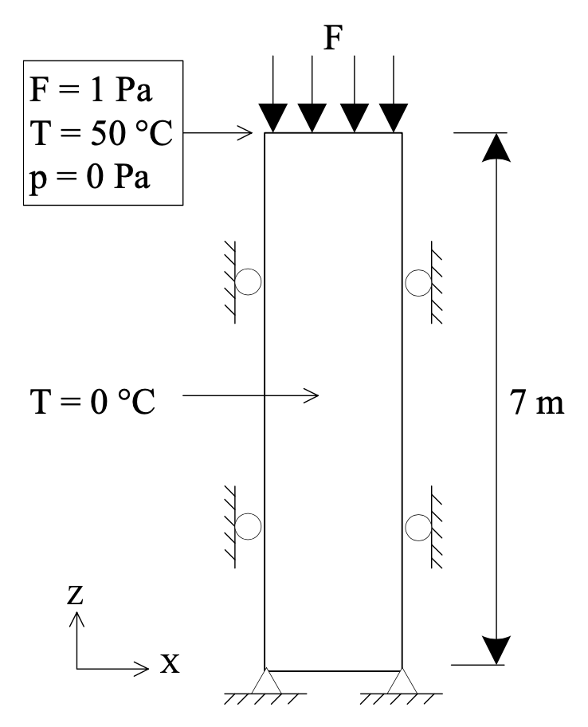

.. _ExampleThermoporoelasticConsolidation:

####################################################
Thermoporoelastic Consolidation
####################################################

**Context**

Thermoporoelastic consolidation is a typical fully coupled problem which involves solid deformation, fluid flow and heat transfer in saturated porous media.
In this example, we use the GEOS coupled solvers to solve a one-dimensional thermoporoelastic consolidation problem with a non-isothermal boundary condition, and we verify the accuracy of the results using the analytical solution provided in `(Bai, 2005) <http://gclx.xml-journal.net/en/article/id/3369>`__ 

**InputFile**

This example uses no external input files and everything required is contained within two GEOS input files located at:

.. code-block:: console

  inputFiles/thermoPoromechanics/ThermoPoroElastic_consolidation_base.xml

.. code-block:: console

  inputFiles/thermoPoromechanics/ThermoPoroElastic_consolidation_benchmark_fim.xml

---------------------------------------------------
Description of the case
---------------------------------------------------

We simulate the consolidation of 1D thermoporoelastic column subjected to a surface traction stress of 1 Pa applied on the top surface, with a surface temperature of 50 degrees Celsius and a pore pressure of 0 Pa.
The initial temperature of the saturated soil is 0 degrees Celsius.
The soil column is insulated and sealed everywhere, except at the top surface.
The problem setup is illustrated below.

.. _thermoPoroMechanicsProblemSketchFig:

   Sketch of the problem (taken from `(Gao and Ghassemi, 2019) <https://www.proquest.com/docview/2387146352>`__).

The coupled dynamics experienced by the system are described in `(Gao and Ghassemi, 2019) <https://www.proquest.com/docview/2387146352>`__ and summarized below.
The model first experiences continuous settlement (contraction).
Initially, the settlement caused by the drainage of the fluid (effective stress increase) and the compression of the solid matrix is larger than the expansion due to the increase of temperature in the region close to the surface on which a higher temperature is applied.
As the temperature diffuses further into the domain, it gradually rebounds (expansion) and reaches a final status.

For this example, we focus on the ``Solvers``,
the ``Constitutive``, and the ``FieldSpecifications`` tags of the GEOS input file.

------------------------------------------------------------------
Solvers
------------------------------------------------------------------

As demonstrated in this example, to setup a thermoporomechanical coupling, we need to define three different solvers in the **Solvers** part of the XML file:

- the mechanics solver, a solver of type ``SolidMechanicsLagrangianSSLE`` called here ``solidMechSolver`` (more information here: :ref:`SolidMechanicsLagrangianFEM`),

.. literalinclude:: ../../../../../../../inputFiles/thermoPoromechanics/ThermoPoroElastic_consolidation_smoke_fim.xml
  :language: xml
  :start-after: <!-- SPHINX_MECHANICALSOLVER -->
  :end-before: <!-- SPHINX_MECHANICALSOLVER_END -->

- the single-phase flow solver, a solver of type ``SinglePhaseFVM`` called here ``flowSolver`` (more information on these solvers at :ref:`SinglePhaseFlow`),

.. literalinclude:: ../../../../../../../inputFiles/thermoPoromechanics/ThermoPoroElastic_consolidation_smoke_fim.xml
  :language: xml
  :start-after: <!-- SPHINX_SINGLEPHASEFVM -->
  :end-before: <!-- SPHINX_SINGLEPHASEFVM_END -->

- the coupling solver (``SinglePhasePoromechanics``) that will bind the two single-physics solvers above, which is named as ``thermoPoroSolver`` (more information at :ref:`PoroelasticSolver`).

.. literalinclude:: ../../../../../../../inputFiles/thermoPoromechanics/ThermoPoroElastic_consolidation_smoke_fim.xml
  :language: xml
  :start-after: <!-- SPHINX_POROMECHANICSSOLVER -->
  :end-before: <!-- SPHINX_POROMECHANICSSOLVER_END -->

To request the simulation of the temperature evolution, we set the ``isThermal`` flag of the coupling solver to 1.
With this choice, the degrees of freedom are the cell-centered pressure, the cell-centered temperature, and the mechanical displacements at the mesh nodes.
The governing equations consist of a mass conservation equation, an energy balance equation, and a linear momentum balance equation. 
In the latter, the total stress includes both a pore pressure and a temperature contribution.
Note that in the coupling solver, we set the ``couplingType`` to ``FullyImplicit`` to require a fully coupled, fully implicit solution strategy. 
	       
------------------------------
Constitutive laws
------------------------------

A homogeneous and isotropic domain with one solid material is assumed, and its mechanical properties and associated fluid rheology are specified in the **Constitutive** section. 
We use the constitutive parameters specified in `(Bai, 2005) <http://gclx.xml-journal.net/en/article/id/3369>`__ listed in the following table. 

+------------------+-------------------------+------------------+--------------------+
| Symbol           | Parameter               | Unit             | Value              |
+==================+=========================+==================+====================+
| :math:`E`        | Young's modulus         | [Pa]             | 6000.0             |
+------------------+-------------------------+------------------+--------------------+
| :math:`\nu`      | Poisson's ratio         | [-]              | 0.4                |
+------------------+-------------------------+------------------+--------------------+
| :math:`\alpha`   | Thermal expansion coef. | [T^(-1)]         | 9.0x10\ :sup:`-7`  |
+------------------+-------------------------+------------------+--------------------+
| :math:`\phi`     | Porosity                | [-]              | 0.20               |
+------------------+-------------------------+------------------+--------------------+
| :math:`b`        | Biot's coefficient      | [-]              | 1.0                |
+------------------+-------------------------+------------------+--------------------+
| :math:`\rho C`   | Heat capacity           | [J/(m^3.K)]      | 167.2x10\ :sup:`3` |
+------------------+-------------------------+------------------+--------------------+
| :math:`\mu`      | Fluid viscosity         | [Pa.s]           | 1\ :sup:`-3`       |
+------------------+-------------------------+------------------+--------------------+
| :math:`k^T`      | Thermal conductivity    | [J/(m.s.K)]      | 836                |
+------------------+-------------------------+------------------+--------------------+
| :math:`k`        | Permeability            | [m^2]            | 4.0x10\ :sup:`-9`  |
+------------------+-------------------------+------------------+--------------------+

The bulk modulus, the Young's modulus, and the thermal expansion coefficient are specified in the ``ElasticIsotropic`` solid model.
Note that for now the solid density is constant and does not depend on temperature.
Given that the gravity vector has been set to 0 in the XML file, the value of the solid density is not used in this simulation.

.. literalinclude:: ../../../../../../../inputFiles/thermoPoromechanics/ThermoPoroElastic_consolidation_base.xml
  :language: xml
  :start-after: <!-- SPHINX_SOLID -->
  :end-before: <!-- SPHINX_SOLID_END -->

The porosity and Biot's coefficient (computed from the ``grainBulkModulus``) appear in the ``BiotPorosity`` model.
In this model, the porosity is updated as a function of the strain increment, the change in pore pressure, and the change in temperature.

.. literalinclude:: ../../../../../../../inputFiles/thermoPoromechanics/ThermoPoroElastic_consolidation_base.xml
  :language: xml
  :start-after: <!-- SPHINX_POROSITY -->
  :end-before: <!-- SPHINX_POROSITY_END -->

The heat capacity is provided in the ``SolidInternalEnergy`` model.
In the computation of the internal energy, the ``referenceTemperature`` is set to the initial temperature.

.. literalinclude:: ../../../../../../../inputFiles/thermoPoromechanics/ThermoPoroElastic_consolidation_base.xml
  :language: xml
  :start-after: <!-- SPHINX_INTERNAL_ENERGY -->
  :end-before: <!-- SPHINX_INTERNAL_ENERGY_END -->

The fluid density and viscosity are given in the ``ThermalCompressibleSinglePhaseFluid``.
Here, they are assumed to be constant and do not depend on pressure and temperature.

.. literalinclude:: ../../../../../../../inputFiles/thermoPoromechanics/ThermoPoroElastic_consolidation_base.xml
  :language: xml
  :start-after: <!-- SPHINX_FLUID -->
  :end-before: <!-- SPHINX_FLUID_END -->

Finally, the permeability and thermal conductivity are specified in the ``ConstantPermeability`` and ``SinglePhaseConstantThermalConductivity``, respectively.

.. literalinclude:: ../../../../../../../inputFiles/thermoPoromechanics/ThermoPoroElastic_consolidation_base.xml
  :language: xml
  :start-after: <!-- SPHINX_PERMEABILITY_CONDUCTIVITY -->
  :end-before: <!-- SPHINX_PERMEABILITY_CONDUCTIVITY_END -->

-----------------------------------------------------------
Initial and boundary conditions
-----------------------------------------------------------

To complete the specification of the problem, we specify two types of fields:

  - The initial values (the displacements, effective stress, and pore pressure have to be initialized),
  - The boundary conditions at the top surface (traction, pressure, and temperature) and at the other boundaries (zero-displacement).

This is done in the **FieldSpecifications** part of the XML file.    
The attribute ``initialCondition`` is set to 1 for the blocks specifying the initial pressure, temperature, and effective stress.

.. literalinclude:: ../../../../../../../inputFiles/thermoPoromechanics/ThermoPoroElastic_consolidation_base.xml
  :language: xml
  :start-after: <!-- SPHINX_IC -->
  :end-before: <!-- SPHINX_IC_END -->

For the zero-displacement boundary conditions, we use the pre-defined set names `xneg` and `xpos`, `yneg`, `zneg` and `zpos` to select the boundary nodes.
Note that here, we have considered a slab in the y-direction, which is why a displacement boundary condition is applied on `zpos` and not applied on `ypos`.

.. literalinclude:: ../../../../../../../inputFiles/thermoPoromechanics/ThermoPoroElastic_consolidation_base.xml
  :language: xml
  :start-after: <!-- SPHINX_ZERO_DISPLACEMENT_BC -->
  :end-before: <!-- SPHINX_ZERO_DISPLACEMENT_BC_END -->

On the top surface, we impose the traction boundary condition and the non-isothermal boundary condition specified in `(Bai, 2005) <http://gclx.xml-journal.net/en/article/id/3369>`__. We also fix the pore pressure to 0 Pa. 
	       
.. literalinclude:: ../../../../../../../inputFiles/thermoPoromechanics/ThermoPoroElastic_consolidation_base.xml
  :language: xml
  :start-after: <!-- SPHINX_TOP_SURFACE_BC -->
  :end-before: <!-- SPHINX_TOP_SURFACE_BC_END -->

---------------------------------
Inspecting results
---------------------------------

We request an output of the displacements, pressure, and temperature using the **TimeHistory** feature of GEOS. 
The figures below compare the results from GEOS (dashed line) and the corresponding analytical solution (solid line) as a function of time at different locations of the slab.
We obtain a very good match, confirming that GEOS can accurately capture the thermo-poromechanical coupling on this example. The first figure illustrates this good agreement for the pressure evolution. 

.. plot:: docs/sphinx/advancedExamples/validationStudies/thermoPoromechanics/thermalConsolidation/thermalConsolidationPressureFigure.py

The second figure confirms the good match with the analytical solution for the temperature.
	  
.. plot:: docs/sphinx/advancedExamples/validationStudies/thermoPoromechanics/thermalConsolidation/thermalConsolidationTemperatureFigure.py

The third figure shows that GEOS is also able to match the vertical displacement (settlement) analytical solution.  
	  
.. plot:: docs/sphinx/advancedExamples/validationStudies/thermoPoromechanics/thermalConsolidation/thermalConsolidationDisplacementFigure.py

------------------------------------------------------------------
To go further
------------------------------------------------------------------

**Feedback on this example**

For any feedback on this example, please submit a `GitHub issue on the project's GitHub page <https://github.com/GEOS-DEV/GEOS/issues>`_.

