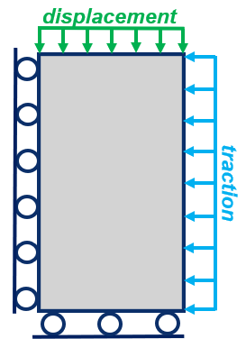
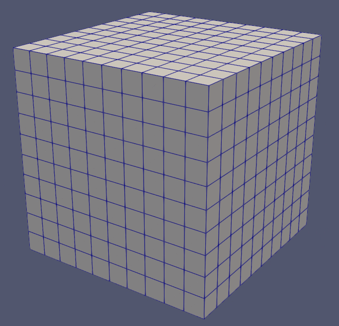
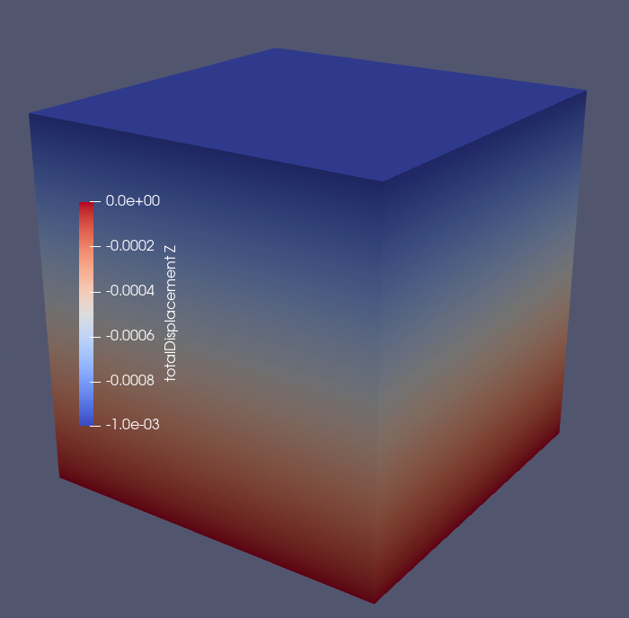

.. _relaxationTest:

#################################################################################
 Verification of a Relaxation Test with Visco Extended Drucker-Prager Model
#################################################################################

**Context**

In this example, we simulate a relaxation test with a Visco Extended Drucker-Prager solid. This problem is solved using a viscoplastic solver (see :ref:`ViscoPlasticModel`) in GEOS to predict the time-dependent deformation of the sample when subject to loading conditions. We verify the numerical results obtained by GEOS against a semi-analytical solution (see :ref:`AdvancedExampleViscoExtendedDruckerPrager`). 

**Input file**

The xml input files for the test case are located at:

.. code-block:: console

  inputFiles/solidMechanics/viscoExtendedDruckerPrager_relaxation_base.xml
  inputFiles/solidMechanics/viscoExtendedDruckerPrager_relaxation_benchmark.xml

A Python script for post-processing the simulation results is provided:

.. code-block:: console

  src/docs/sphinx/advancedExamples/validationStudies/viscoplasticity/RelaxationTest/relaxationTestFigure.py

------------------------------------------------------------------
Description of the case
------------------------------------------------------------------

We model the mechanical response of a viscoplastic slab subject to a displacement-controlled uniaxial loading and a constant confining stress, as shown below. The domain is homogeneous, isotropic, and isothermal. Before loading, the domain is initialized with isotropic stresses. Longitudinal compression is induced and governed by the normal displacement applied uniformly over the top surface. This compressive displacement is initially elevated to allow plastic hardening and then kept as a constant to mimic stress relaxation tests. In this example, fluid flow is not considered.

.. _problemSketch1RelaxationTest:

   Sketch of the problem 

We set up and solve a Visco Extended Drucker-Prager model to obtain the spatial and temporal solutions of stresses and displacements across the domain upon loading. These numerical predictions are compared with the corresponding semi-analytical solutions derived from `Runesson et al. (1999) <https://onlinelibrary.wiley.com/doi/abs/10.1002/(SICI)1099-1484(199901)4:1%3C75::AID-CFM60%3E3.0.CO;2-4>`__ (see :ref:`AdvancedExampleViscoExtendedDruckerPrager`). 

For this example, we focus on the ``Mesh``,
the ``Constitutive``, and the ``FieldSpecifications`` tags.

------------------------------------------------------------------
Mesh
------------------------------------------------------------------

The following figure shows the mesh used for solving this mechanical problem:

.. _problemSketch2RelaxationTest:

   Generated mesh 

The mesh was created with the internal mesh generator and parametrized in the ``InternalMesh`` XML tag. 
It contains 10x10x10 eight-node brick elements in the x, y, and z directions respectively. 
Such eight-node hexahedral elements are defined as ``C3D8`` elementTypes, and their collection forms a mesh
with one group of cell blocks named here ``cellBlockNames``. 

.. literalinclude:: ../../../../../../../inputFiles/solidMechanics/viscoExtendedDruckerPrager_relaxation_benchmark.xml
    :language: xml
    :start-after: <!-- SPHINX_MESH -->
    :end-before: <!-- SPHINX_MESH_END -->

------------------------
Solid mechanics solver
------------------------

For the relaxation tests, pore pressure variations are neglected and subtracted from the analysis. Therefore, we define a solid mechanics solver, called here ``mechanicsSolver``. 
This solid mechanics solver (see :ref:`SolidMechanicsLagrangianFEM`) is based on the Lagrangian finite element formulation. 
The problem is run as ``QuasiStatic`` without considering inertial effects. 
The computational domain is discretized by ``FE1``, defined in the ``NumericalMethods`` section.
We use the ``targetRegions`` attribute to define the regions where the solid mechanics solver is applied.
Here, we only simulate mechanical deformation in one region named as ``Domain``, whose mechanical properties are specified in the ``Constitutive`` section.

.. literalinclude:: ../../../../../../../inputFiles/solidMechanics/viscoExtendedDruckerPrager_relaxation_base.xml
  :language: xml
  :start-after: <!-- SPHINX_MECHANICSSOLVER -->
  :end-before: <!-- SPHINX_MECHANICSSOLVER_END -->

------------------------------
Constitutive laws
------------------------------

A homogeneous domain with one solid material is assumed, and its mechanical properties are specified in the ``Constitutive`` section: 

.. literalinclude:: ../../../../../../../inputFiles/solidMechanics/viscoExtendedDruckerPrager_relaxation_base.xml
    :language: xml
    :start-after: <!-- SPHINX_MATERIAL -->
    :end-before: <!-- SPHINX_MATERIAL_END -->

Recall that in the ``SolidMechanics_LagrangianFEM`` section, 
``rock`` is designated as the material in the computational domain. 
Here, Visco Extended Drucker Prager model ``ViscoExtendedDruckerPrager`` is used to simulate the viscoplastic behavior of ``rock``.
As for the material parameters, ``defaultInitialFrictionAngle``, ``defaultResidualFrictionAngle`` and ``defaultCohesion`` denote the initial friction angle, the residual friction angle, and cohesion, respectively, as defined by the Mohr-Coulomb failure envelope. As the residual friction angle ``defaultResidualFrictionAngle`` is larger than the initial one ``defaultInitialFrictionAngle``, a  strain hardening model is adopted, with a  hardening rate given as ``defaultHardening="0.0005"``. 
Finally, ``relaxationTime`` is a key parameter for characterizing the viscoplastic behavior of the solid called ``rock``.

Constitutive parameters such as density, bulk modulus, and shear modulus are specified in the International System of Units.

------------------------------
Time history function
------------------------------

In the ``Tasks`` section, ``PackCollection`` tasks are defined to collect time history information from several property fields (time-series). 
We can collect either the entire collection of field properties or specified named sets.
In this example, ``stressCollection`` is specified to output the time history of stresses ``fieldName="rock_stress`` for the selected subdomain ``objectPath="ElementRegions/Domain/cb8"``.
And ``displacementCollection`` is defined to output the time history of displacement ``fieldName="totalDisplacement"`` for the subset ``setNames="{ topPoint }"``.

.. literalinclude:: ../../../../../../../inputFiles/solidMechanics/viscoExtendedDruckerPrager_relaxation_base.xml
    :language: xml
    :start-after: <!-- SPHINX_TASKS -->
    :end-before: <!-- SPHINX_TASKS_END -->

These two tasks are triggered using the ``Event`` management where ``PeriodicEvent`` are defined for these recurring tasks. 
GEOS writes two files named after the string defined in the ``filename`` keyword and formatted as HDF5 files (displacement_history.hdf5 and stress_history.hdf5). The TimeHistory file contains the collected time history information from each specified time history collector. This information includes datasets for the simulation time, element center or nodal position, and the time history information.
We use a Python script to read and plot any specified subset of the time history data for verification and visualization. 

-----------------------------------
Initial and boundary conditions
-----------------------------------

The next step is to specify fields, including:

  - The initial value (the stresses have to be initialized),
  - The boundary conditions (the displacement control, lateral confining stress, and constraints of the outer boundaries have to be set).

In this example, we specify isotropic stresses (:math:`\sigma_{xx}` = -10.0 MPa, :math:`\sigma_{yy}` = -10.0 MPa, and :math:`\sigma_{zz}` = -10.0 MPa,). 

A compressive traction (:math:`P_w` = -10.0 MPa) is applied on the domain laterals ``xpos`` (all faces on the x-side of the domain, positive side) and ``ypos`` (all faces on the y-side of the domain, positive side).

The normal displacement (``axialload``) is instantaneously applied at the top surface ``zpos`` (all surfaces on the top) at time :math:`t` = 0 s, and will gradually increase to a higher absolute value (-0.001) in 0.5 days to let the rock slab contract. Then, it remains constant for 1.5 days to allow stress relaxation.

The remaining outer boundaries of the domain are subjected to roller constraints.  

These boundary conditions are set up through the ``FieldSpecifications`` section.

The lateral traction and compressive displacement have negative values due to the negative sign convention for compressive stresses in GEOS. 

.. literalinclude:: ../../../../../../../inputFiles/solidMechanics/viscoExtendedDruckerPrager_relaxation_base.xml
    :language: xml
    :start-after: <!-- SPHINX_BC -->
    :end-before: <!-- SPHINX_BC_END -->

The parameters used in the simulation are summarized in the following table.

+------------------+-------------------------+------------------+---------------+
| Symbol           | Parameter               | Unit             | Value         |
+==================+=========================+==================+===============+
| :math:`K`        | Bulk modulus            | [GPa]            | 10.0          |
+------------------+-------------------------+------------------+---------------+
| :math:`G`        | Shear Modulus           | [GPa]            | 6.0           |
+------------------+-------------------------+------------------+---------------+
| :math:`c`        | Cohesion                | [MPa]            | 0.1           |
+------------------+-------------------------+------------------+---------------+
| :math:`\phi_i`   | Initial Friction Angle  | [degree]         | 15.0          |
+------------------+-------------------------+------------------+---------------+
| :math:`\phi_r`   | Residual Friction Angle | [degree]         | 20.0          |
+------------------+-------------------------+------------------+---------------+
| :math:`m`        | Hardening Rate          | [-]              | 0.0005        |
+------------------+-------------------------+------------------+---------------+
| :math:`\tau`     | Relaxation Time         | [s]              | 5000.0        |
+------------------+-------------------------+------------------+---------------+
| :math:`\sigma_h` | Horizontal Stress       | [MPa]            | -10.0         |
+------------------+-------------------------+------------------+---------------+
| :math:`\sigma_v` | Vertical Stress         | [MPa]            | -10.0         |
+------------------+-------------------------+------------------+---------------+
| :math:`P_w`      | Traction at lateral     | [MPa]            | -10.0         |
+------------------+-------------------------+------------------+---------------+

---------------------------------
Inspecting results
---------------------------------

In the example, we request hdf5 output files for time-series (time history). We use Python scripts to visualize the outcome.
The following figure shows the final distribution of vertical displacement upon loading.

.. _problemRelaxationTestDisp:

   Simulation result of vertical displacement

The figure below shows the comparisons between the numerical predictions (marks) and the corresponding analytical solutions (lines) with respect to stress–strain relationship, stress path on the top surface, the evolution of axial stress. Predictions computed by GEOS match the semi-analytical results. The bottom figure highlights the change in axial stress with time. Note that, if normal displacement remains constant, the axial stress decreases gradually to a residue value. This behavior is typically reported in the relaxation tests in laboratory.   

.. plot:: docs/sphinx/advancedExamples/validationStudies/viscoplasticity/RelaxationTest/relaxationTestFigure.py

------------------------------------------------------------------
To go further
------------------------------------------------------------------

**Feedback on this example**

For any feedback on this example, please submit a `GitHub issue on the project's GitHub page <https://github.com/GEOS-DEV/GEOS/issues>`_.
