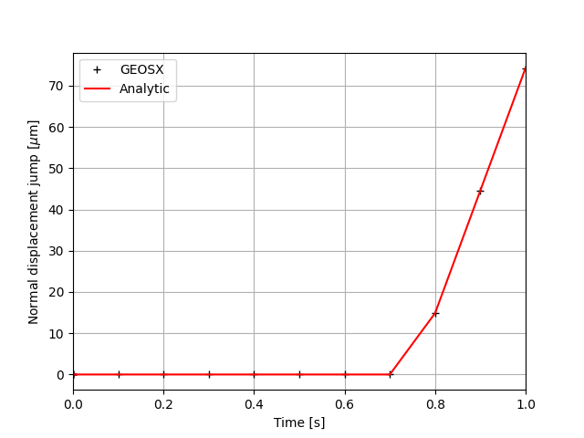

.. _AdvancedExampleCasedContactElasticWellbore:

#############################################################################################
Cased Elastic Wellbore with Impefect Casing-Cement and Cement-Rock Contact Interfaces Problem
#############################################################################################

------------------------------------------------------------------
Problem description
------------------------------------------------------------------

This example uses the ``LagrangianContact`` solver to handle a cased wellbore problem with imperfect contact interfaces. The completed wellbore is composed of a steel casing, a cement sheath and rock formation. Isotropic linear elastic behavior is assumed for all the three materials. The contact surfaces between these materials are supposed obey the Lagrangian contact law. 

.. figure:: sketch.png
   :align: center
   :figclass: align-center

With a radial compression loading, the imperfect contact intefaces behave just like the perfect one (see AdvancedExampleCasedElasticWellbore_). With a radial tension loading on the inner face of the wellbore, the casing is debonded from the cement layer. Analytical results of the radial displacement :math:`u_{r}`, in the casing is expressed as `(Hervé and Zaoui, 1995) <https://link.springer.com/chapter/10.1007%2F978-94-015-8494-4_55>`__ :

.. math::
   u_{r} = Ar - \frac{B}{r}

where :math:`r` is the radial coordinate, :math:`A` and :math:`B` are piecewise constants that are obtained by solving the boundary conditions, as detailed in the post-processing script. The outer face of the casing as well as the inner face of the cement layer are free of stress because of the debonding at the casing-cement interface. Thefore, the displacement jump at the cement-rock interface is nil and the displacement jump accross the casing-cement interface is equal to :math:`u_{r_out_casing}` where :math:`r_out_casing` is the outer raidus of the casing. 

**Input file**

This benchmark example uses no external input files and everything required is
contained within two GEOSX xml files that are located at:

.. code-block:: console

  inputFiles/wellbore/CasedContactElasticWellbore_base.xml

and

.. code-block:: console

  inputFiles/wellbore/CasedContactElasticWellbore_benchmark.xml

The corresponding integrated test is

.. code-block:: console

  inputFiles/wellbore/CasedContactElasticWellbore_smoke.xml

-----------------------------------------------------------
Solvers
-----------------------------------------------------------

.. literalinclude:: ../../../../../../../inputFiles/wellbore/CasedContactElasticWellbore_benchmark.xml
  :language: xml
  :start-after: <!-- SPHINX_Solvers -->
  :end-before: <!-- SPHINX_SolversEnd -->

--------------------------------------------------------------------
Cylinder geometry for defining the contact nodesets
--------------------------------------------------------------------

 
.. literalinclude:: ../../../../../../../inputFiles/wellbore/CasedContactElasticWellbore_benchmark.xml
  :language: xml
  :start-after: <!-- SPHINX_CementSheathInterfaces -->
  :end-before: <!-- SPHINX_CementSheathInterfacesEnd -->

--------------------------------------------------------------------   
Events
--------------------------------------------------------------------

.. literalinclude:: ../../../../../../../inputFiles/wellbore/CasedContactElasticWellbore_base.xml
  :language: xml
  :start-after: <!-- SPHINX_Events -->
  :end-before: <!-- SPHINX_EventsEnd -->

--------------------------------------------------------------------	       
NumericalMethods
--------------------------------------------------------------------

.. literalinclude:: ../../../../../../../inputFiles/wellbore/CasedContactElasticWellbore_base.xml
  :language: xml
  :start-after: <!-- SPHINX_NumericalMethods -->
  :end-before: <!-- SPHINX_NumericalMethodsEnd -->

--------------------------------------------------------------------	       
SurfaceElementRegion
--------------------------------------------------------------------

.. literalinclude:: ../../../../../../../inputFiles/wellbore/CasedContactElasticWellbore_base.xml
  :language: xml
  :start-after: <!-- SPHINX_SurfaceElementRegion -->
  :end-before: <!-- SPHINX_SurfaceElementRegion -->

--------------------------------------------------------------------	       
Contact Material
--------------------------------------------------------------------

.. literalinclude:: ../../../../../../../inputFiles/wellbore/CasedContactElasticWellbore_base.xml
  :language: xml
  :start-after: <!-- SPHINX_Material -->
  :end-before: <!-- SPHINX_MaterialEnd -->

--------------------------------------------------------------------	       
Boundary conditions
--------------------------------------------------------------------

.. literalinclude:: ../../../../../../../inputFiles/wellbore/CasedContactElasticWellbore_base.xml
  :language: xml
  :start-after: <!-- SPHINX_BoundaryConditions -->
  :end-before: <!-- SPHINX_BoundaryConditionsEnd -->

---------------------------------
Results and benchmark
---------------------------------

The GEOSX results of displacement jump accross the casing-cement and cement-rock interfaces are shown in the figure below: 

.. figure:: displacementJump3D.png
   :align: center
   :figclass: align-center

We can observe an expected zero displacement jump at the cement-rock interface under a tension stress. The displacement jump at the casing-cement interface is homogenous and varies with time because the tension stress on the inner surface of the casing varies with time as defined in the XML file. The validation of GEOSX results versus theoretical results is shown in the figure below:

.. plot:: elastic_casedWellbore_displacementJump.py

------------------------------------------------------------------
To go further
------------------------------------------------------------------

**Feedback on this example**

This concludes the cased wellbore example.
For any feedback on this example, please submit a `GitHub issue on the project's GitHub page <https://github.com/GEOSX/GEOSX/issues>`_.
