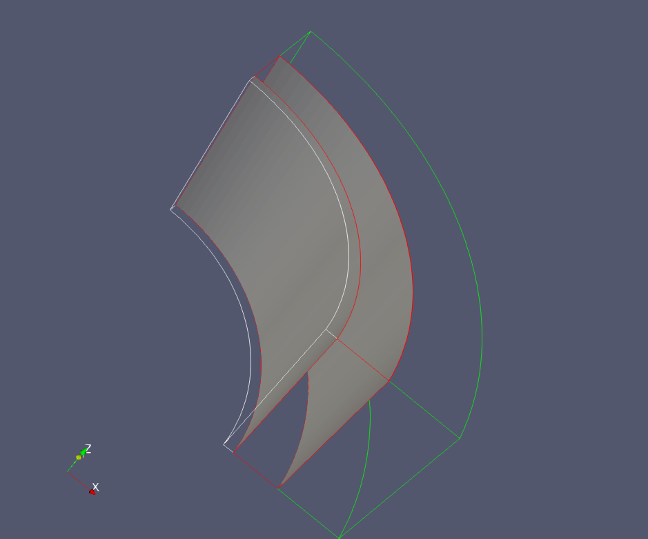
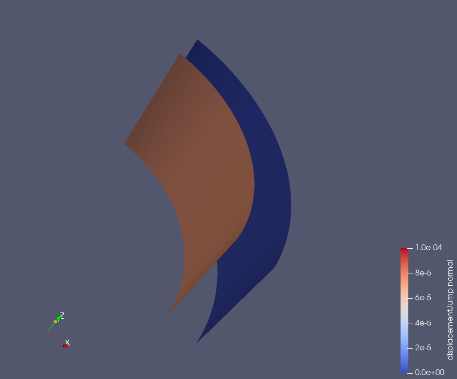

.. _AdvancedExampleCasedElasticWellbore_ImperfectInterfaces:

###############################################
Cased Elastic Wellbore with Imperfect Interfaces
###############################################

------------------------------------------------------------------
Problem description
------------------------------------------------------------------

This example uses the ``LagrangianContact`` solver to handle a cased wellbore problem with imperfect contact interfaces. The completed wellbore is composed of a steel casing, a cement sheath, and rock formation. All the three materials are assumed to exhibit isotropic linear elastic behavior. The contact surfaces between these materials are simulated using a Lagrangian contact model. 

.. _problemSketchCasedElasticWellboreInterfacesFig:

   A cased wellbore with imperfect casing-cement and cement-rock interfaces 

Under a compressional loading in the radial direction, the imperfect contact interfaces behave like the perfect ones (see :ref:`AdvancedExampleCasedElasticWellbore`). When a radial tension acting on the inner face of the wellbore, the casing debonds from the cement layer. Analytical results of the radial displacement :math:`u_{r}` in the casing is expressed as `(Hervé and Zaoui, 1995) <https://link.springer.com/chapter/10.1007%2F978-94-015-8494-4_55>`__ :

.. math::
   u_{r} = Ar - \frac{B}{r}

where :math:`r` is the radial coordinate, :math:`A` and :math:`B` are constants that are obtained by solving the boundary conditions, as detailed in the post-processing script. The outer face of the casing as well as the inner face of the cement layer are free of stress because of the debonding at the casing-cement interface. Therefore, the displacement jump at the cement-rock interface is nil, and the displacement jump across the casing-cement interface is equal to :math:`u_r(r=r_{out_casing})`, where :math:`r_{out_casing}` is the outer radius of the casing. 

**Input file**

This benchmark example does not use any external input files and everything required is
contained within two GEOS XML files located at:

.. code-block:: console

  inputFiles/wellbore/CasedElasticWellbore_ImperfectInterfaces_base.xml

and

.. code-block:: console

  inputFiles/wellbore/CasedElasticWellbore_ImperfectInterfaces_benchmark.xml

The corresponding integrated test is

.. code-block:: console

  inputFiles/wellbore/CasedElasticWellbore_ImperfectInterfaces_smoke.xml

In this example, we should focus on following XML blocks:

--------------------------------------------------------------------
Cylinder geometry
--------------------------------------------------------------------

The nodesets that define the casing-cement and cement-rock interfaces are curved. In this example, we use the ``Cylinder`` geometry to select these nodesets. This geometry is defined by the centers of the two plane faces, ``firstFaceCenter`` and ``secondFaceCenter``, and its inner and outer radii, ``innerRadius`` and ``outerRadius``. Note that the inner radius is optional as it is only needed for defining a hollow cylinder (i.e. an annulus). The inner radius is required in this example to select only the nodes on the casing-cement and the cement-rock interfaces.
 
.. literalinclude:: ../../../../../../../inputFiles/wellbore/CasedElasticWellbore_ImperfectInterfaces_benchmark.xml
  :language: xml
  :start-after: <!-- SPHINX_CementSheathInterfaces -->
  :end-before: <!-- SPHINX_CementSheathInterfacesEnd -->

--------------------------------------------------------------------   
Events
--------------------------------------------------------------------

In this example, we need to define a solo event for generating the imperfect contact surfaces as shown below:

.. literalinclude:: ../../../../../../../inputFiles/wellbore/CasedElasticWellbore_ImperfectInterfaces_benchmark.xml
  :language: xml
  :start-after: <!-- SPHINX_EventSurfaceGen -->
  :end-before: <!-- SPHINX_EventSurfaceGenEnd -->

where the surface generation solver is defined as follows:

.. literalinclude:: ../../../../../../../inputFiles/wellbore/CasedElasticWellbore_ImperfectInterfaces_base.xml
  :language: xml
  :start-after: <!-- SPHINX_SolversSurfaceGenerator -->
  :end-before: <!-- SPHINX_SolversSurfaceGeneratorEnd -->

Here, ``rockToughness`` is defined by default but has been omitted in this simulation.

To collect the displacement jump across the imperfect interfaces, we also define two periodic events as shown below:

.. literalinclude:: ../../../../../../../inputFiles/wellbore/CasedElasticWellbore_ImperfectInterfaces_benchmark.xml
  :language: xml
  :start-after: <!-- SPHINX_EventDisplacementJumpHistoryCollection -->
  :end-before: <!-- SPHINX_EventDisplacementJumpHistoryCollectionEnd -->

The corresponding ``Tasks`` and ``Outputs`` targets must be defined in conjunction with these events.

--------------------------------------------------------------------	       
Numerical Methods
--------------------------------------------------------------------

The ``stabilizationName`` that is required in the ``LagrangianContact`` solver is defined by: 

.. literalinclude:: ../../../../../../../inputFiles/wellbore/CasedElasticWellbore_ImperfectInterfaces_base.xml
  :language: xml
  :start-after: <!-- SPHINX_NumericalMethods -->
  :end-before: <!-- SPHINX_NumericalMethodsEnd -->

--------------------------------------------------------------------	       
Contact region and material
--------------------------------------------------------------------

The imperfect contact surfaces between casing, cement, and rock layers are defined as ``Fracture`` as shown below:

.. literalinclude:: ../../../../../../../inputFiles/wellbore/CasedElasticWellbore_ImperfectInterfaces_base.xml
  :language: xml
  :start-after: <!-- SPHINX_SurfaceElementRegion -->
  :end-before: <!-- SPHINX_SurfaceElementRegionEnd -->

Here, the ``faceBlock`` name, ``faceElementSubRegion``, is needed to define ``Tasks`` for collecting displacement jumps across the contact surfaces. The ``defaultAperture`` defined in this block is the default hydraulic aperture that should not be confused with the mechanical aperture. For this purely mechanical problem, the default hydraulic aperture parameter is omitted. The fracture material given in the ``materialList`` is defined as follows:

.. literalinclude:: ../../../../../../../inputFiles/wellbore/CasedElasticWellbore_ImperfectInterfaces_base.xml
  :language: xml
  :start-after: <!-- SPHINX_MaterialContact -->
  :end-before: <!-- SPHINX_MaterialContactEnd -->

For this purely mechanical problem, without fluid flow and shearing stress acting on the contact surface, all the parameters defined in this block are omitted.

---------------------------------
Results and benchmark
---------------------------------

The GEOS results of displacement jump across the casing-cement and cement-rock interfaces are shown in the figure below: 

.. _CasedElasticWellboreInterfacesDisplacementJump3DFig:

   Displacement jumps across the casing-cement and cement-rock interfaces

As expected, we observe a zero-displacement jump at the cement-rock interface under a tension stress on the inner surface of the casing. Indeed, the stress applied here does not cause any strain on the cement and rock layers after debonding has occurred at the casing-cement interface. The displacement jump at the casing-cement interface is homogeneous and varies over time because the tension stress on the inner surface of the casing varies with time, as defined in the XML file. A perfect comparison between GEOS results and theoretical results is shown in the figure below:

.. plot:: docs/sphinx/advancedExamples/validationStudies/wellboreProblems/casedContactElasticWellbore/elastic_casedWellbore_displacementJump.py

------------------------------------------------------------------
To go further
------------------------------------------------------------------

**Feedback on this example**

This concludes the cased wellbore example.
For any feedback on this example, please submit a `GitHub issue on the project's GitHub page <https://github.com/GEOS-DEV/GEOS/issues>`_.
