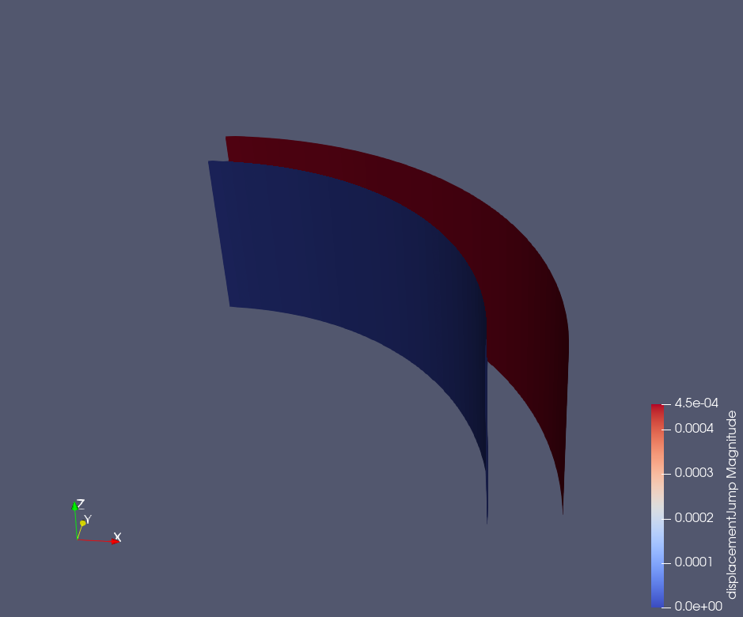
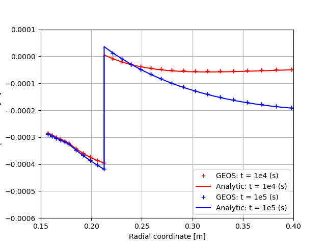
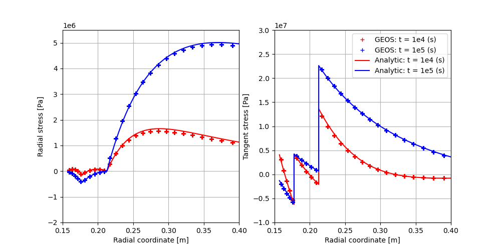

.. _AdvancedExampleCasedContactThermoElasticWellbore:

######################################################################
Cased ThermoElastic Wellbore Problem with Imperfect Contact Interfaces
######################################################################

------------------------------------------------------------------
Problem description
------------------------------------------------------------------

This example uses the coupled THM solver in GEOS to handle a cased wellbore problem subject to a temperature reduction at the casing surface due to cold CO2 injection. The wellbore consists of a steel casing, a cement sheath, and a rock formation. We assume an isotropic linear thermo-elastic behavior for all three materials.

In this example, we do not model any fluid flow. All heat transfers between the casing, cement layer, and rock formation are due only to conduction, and no heat convection is not considered. While GEOS could also simulate convection,  we chose to simulate a simplified conduction-only case because semi-analytical solutions exist for this problem. Debonding (separation) is allowed for the casing-cement and cement-rock contact interfaces.

This example is an extension of the pure mechanical debonding example:ref:`AdvancedExampleCasedElasticWellbore` and the THM problem without debonding :ref:`AdvancedExampleCasedThermoElasticWellbore`. A large portion of the XML files are inherited from those two examples.

Analytical results for the temperature field, the radial displacement, and the radial and hoop stresses can be derived for the axisymmetric plane strain problem with assumptions of debonding at casing-cement or cement-rock interfaces. Note that solutions to this problem are not available in the literature for citation, as it is newly derived by the GEOS team for verifying the numerical results.

**Input file**

This benchmark example uses no external input files and everything required is
contained within two GEOS XML files located at:

.. code-block:: console

  inputFiles/wellbore/CasedThermoElasticWellbore_ImperfectInterfaces_base.xml

and

.. code-block:: console

  inputFiles/wellbore/CasedThermoElasticWellbore_ImperfectInterfaces_benchmark.xml

The corresponding integrated test is

.. code-block:: console

  inputFiles/wellbore/CasedThermoElasticWellbore_ImperfectInterfaces_smoke.xml

-----------------------------------------------------------
Geometry and mesh
-----------------------------------------------------------

The geometry and mesh are defined similarly to the ones in the example :ref:`AdvancedExampleCasedThermoElasticWellbore`. To define the imperfect interfaces between the casing, cement and rock layers, we added the following blocks:

.. literalinclude:: ../../../../../../../inputFiles/wellbore/CasedThermoElasticWellbore_ImperfectInterfaces_benchmark.xml
  :language: xml
  :start-after: <!-- SPHINX_CementSheathInterfaces -->
  :end-before: <!-- SPHINX_CementSheathInterfacesEnd -->

Here, we use the ``Cylinder`` geometry to select these nodesets. A detailed explanation of the inputs in this block is given in the example :ref:`AdvancedExampleCasedElasticWellbore`.

-----------------------------------------------------------
Material properties
-----------------------------------------------------------

Besides the THM properites of casing, cement and rock as defined in the example :ref:`AdvancedExampleCasedThermoElasticWellbore`, we define properties for the contact interfaces. The mechanical properties of the contact surfaces are defined similarly to the example :ref:`AdvancedExampleCasedElasticWellbore`. Additionally, following blocks define the thermal conductivity of the contact interface.

.. literalinclude:: ../../../../../../../inputFiles/wellbore/CasedThermoElasticWellbore_ImperfectInterfaces_base.xml
  :language: xml
  :start-after: <!-- SPHINX_ContactThermalProperties -->
  :end-before: <!-- SPHINX_ContactThermalPropertiesEnd -->

These properties are used for defining the imperfect contact surfaces as follows:

.. literalinclude:: ../../../../../../../inputFiles/wellbore/CasedThermoElasticWellbore_ImperfectInterfaces_base.xml
  :language: xml
  :start-after: <!-- SPHINX_SurfaceElementRegion -->
  :end-before: <!-- SPHINX_SurfaceElementRegionEnd -->

As we are using the fully coupled THM solver to solve the thermo-elastic coupled problem, it is also required to define the flow properties for the contact surfaces as follows:

.. literalinclude:: ../../../../../../../inputFiles/wellbore/CasedThermoElasticWellbore_ImperfectInterfaces_base.xml
  :language: xml
  :start-after: <!-- SPHINX_ContactFlowProperties -->
  :end-before: <!-- SPHINX_ContactFlowPropertiesEnd -->

-----------------------------------------------------------
Boundary and initial conditions
-----------------------------------------------------------

The boundary condition at the casing inner surface and in the far-field are defined identically to the ones of the example :ref:`AdvancedExampleCasedThermoElasticWellbore`. The in-situ initial conditions are also defined in the same way as described in that example. The additional specifications for the contact surfaces are defined identically to the example :ref:`AdvancedExampleCasedElasticWellbore`.

-----------------------------------------------------------
Solvers
-----------------------------------------------------------

The solver for simulating this THM problem with imperfect contact interfaces is defined as follows:

.. literalinclude:: ../../../../../../../inputFiles/wellbore/CasedThermoElasticWellbore_ImperfectInterfaces_base.xml
  :language: xml
  :start-after: <!-- SPHINX_ContactTHMSolver -->
  :end-before: <!-- SPHINX_ContactTHMSolverEnd -->

where the Lagrangian contact solver is identical to the one used in the example :ref:`AdvancedExampleCasedElasticWellbore` and the THM coupled solver is the same as that of the example :ref:`AdvancedExampleCasedThermoElasticWellbore`.

---------------------------------
Results and benchmark
---------------------------------

The GEOS results of displacement jump across the casing-cement and cement-rock interfaces at 1e5 seconds are shown in the figure below: 

.. _CasedThermoElasticWellboreInterfacesThermalDebondingFig:

   Displacement jumps across the casing-cement and cement-rock interfaces at 1e5 seconds.

The GEOS results and analytical results for temperature distribution around the cased wellbore are shown in the figures below:

.. _problemCasedContactThermoElasticWellbore_Temperature_Fig:
.. figure:: temperature.png
   :align: center
   :width: 800
   :figclass: align-center

   Temperature field.

and the radial displacement around the wellbore is shown below:

.. _problemCasedContactThermoElasticWellbore_Displacement_Fig:

   The displacement field.

The total radial and hoop stress (tangential stress) components computed by GEOS and the reference results are shown in the figure below:

.. _problemCasedContactThermoElasticWellbore_Stresses_Fig:

   The stress field.

We can observe a good agreement between GEOS results and the analytical results.

------------------------------------------------------------------
To go further
------------------------------------------------------------------

**Feedback on this example**

This concludes the cased wellbore example.
For any feedback on this example, please submit a `GitHub issue on the project's GitHub page <https://github.com/GEOS-DEV/GEOS/issues>`_.
