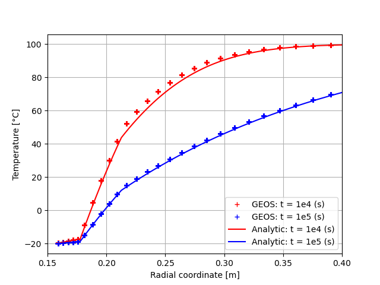

.. _AdvancedExampleCasedContactThermoElasticWellbore:

######################################################################
Cased ThermoElastic Wellbore Problem with Imperfect Contact Interfaces
######################################################################

------------------------------------------------------------------
Problem description
------------------------------------------------------------------

This example uses the coupled THM solver to handle a cased wellbore problem subjected to a cold temperature condition at the casing surface because of cold CO2 injection. The completed wellbore is composed of a steel casing, a cement sheath and rock formation. Isotropic linear thermo-elastic behavior is assumed for all the three materials. Fluid flow is not considered, i.e. heat tranfer between the casing, cement layer and rock formation is purely diffusion. Heat transfer by the convexion phenominon is not negligible. The capability of GEOS is not limited to this case, however we chose to simulate this simplified case because of the exisiting of the semi-analytical results. The separation is allowed for the casing-cement and cement-rock contact interfaces.

This example is an extension of the pure mechanical debonding example :ref:`AdvancedExampleCasedElasticWellbore` and the THM problem without debonding :ref:`AdvancedExampleCasedThermoElasticWellbore`. Many of the setups in the xml files are herited from those two examples.

Analytical results of the temperature field, the radial displacement, the radial and hoop stresses can be derived for the axisymmetric plane strain problem with assumptions of debonding at casing-cement or cement-rock interfaces. Note that solutions to this problem do not exist yet in literature for citation. Therefore, it is developed by GEOS team for validating the numerical results. 

**Input file**

This benchmark example uses no external input files and everything required is
contained within two GEOS xml files that are located at:

.. code-block:: console

  inputFiles/wellbore/CasedThermoElasticWellbore_ImperfectInterfaces_base.xml

and

.. code-block:: console

  inputFiles/wellbore/CasedThermoElasticWellbore_ImperfectInterfaces_benchmark.xml

The corresponding integrated test is

.. code-block:: console

  inputFiles/wellbore/CasedThermoElasticWellbore_ImperfectInterfaces_smoke.xml

-----------------------------------------------------------
Geometry and mesh
-----------------------------------------------------------

The geometry and mesh are defined similarly to the ones in the example :ref:`AdvancedExampleCasedThermoElasticWellbore`. To define the imperfect interfaces between the casing, cement and rock layers, we added following blocks:

.. literalinclude:: ../../../../../../../inputFiles/wellbore/CasedThermoElasticWellbore_ImperfectInterfaces_benchmark.xml
  :language: xml
  :start-after: <!-- SPHINX_CementSheathInterfaces -->
  :end-before: <!-- SPHINX_CementSheathInterfacesEnd -->

Here, we use the ``Cylinder`` geometry to select these nodesets. A detailed explaination of the inputs in this block is given in the example :ref:`AdvancedExampleCasedElasticWellbore`.

-----------------------------------------------------------
Material properties
-----------------------------------------------------------

Besides the THM properites of casing, cement and rock as defined in the example :ref:`AdvancedExampleCasedThermoElasticWellbore`, we need to define the properties of the contact interfaces. The mechanical properties of the contact surafeces are defined similarly to the example :ref:`AdvancedExampleCasedElasticWellbore`. Additionaly, The following block defines the thermal conductivity of the contact interface.

.. literalinclude:: ../../../../../../../inputFiles/wellbore/CasedThermoElasticWellbore_ImperfectInterfaces_base.xml
  :language: xml
  :start-after: <!-- SPHINX_ContactThermalProperties -->
  :end-before: <!-- SPHINX_ContactThermalPropertiesEnd -->

These properties are used for defining the imperfect contact surafaces as follows:

.. literalinclude:: ../../../../../../../inputFiles/wellbore/CasedThermoElasticWellbore_ImperfectInterfaces_base.xml
  :language: xml
  :start-after: <!-- SPHINX_SurfaceElementRegion -->
  :end-before: <!-- SPHINX_SurfaceElementRegionEnd -->

As we are using the fully coupled THM solver to solve the thermo-elastic coupled problem, it is also required to defined the flow properties for the contact surfaces as follows:

.. literalinclude:: ../../../../../../../inputFiles/wellbore/CasedThermoElasticWellbore_ImperfectInterfaces_base.xml
  :language: xml
  :start-after: <!-- SPHINX_ContactFlowProperties -->
  :end-before: <!-- SPHINX_ContactFlowPropertiesEnd -->

-----------------------------------------------------------
Boundary and initial conditions
-----------------------------------------------------------

The boundary condition at the casing inner surface as well as the far-field boundary condition are defined identically to the ones of the example :ref:`AdvancedExampleCasedThermoElasticWellbore`. The in-situ initial conditions are also defined by the same way as that example. The additional specifications for the contact surfaces are defined identically to the example :ref:`AdvancedExampleCasedElasticWellbore`.

-----------------------------------------------------------
Solvers
-----------------------------------------------------------

The solver for simulating this THM problem with imperfect contact interfaces is defined as follows:

.. literalinclude:: ../../../../../../../inputFiles/wellbore/CasedThermoElasticWellbore_ImperfectInterfaces_base.xml
  :language: xml
  :start-after: <!-- SPHINX_ContactTHMSolver -->
  :end-before: <!-- SPHINX_ContactTHMSolverEnd -->

where the Lagrangian contact solver is defined identically to the one in the example :ref:`AdvancedExampleCasedElasticWellbore` and the THM coupled solver is defined identically to that in the example :ref:`AdvancedExampleCasedThermoElasticWellbore`.

---------------------------------
Results and benchmark
---------------------------------

The GEOS results of displacement jump across the casing-cement and cement-rock interfaces at 1e5 seconds are shown in the figure below: 

.. _CasedThermoElasticWellboreInterfacesThermalDebondingFig:
.. figure:: thermalDebonding.png
   :align: center
   :width: 600
   :figclass: align-center

   Displacement jumps across the casing-cement and cement-rock interfaces at 1e5 seconds.

The GEOS results and analytical results for temperature distribution around the cased wellbore is shown in the figures below:

.. plot:: docs/sphinx/advancedExamples/validationStudies/wellboreProblems/casedContactThermoElasticWellbore/thermoElastic_casedContactWellbore_temperature.py

.. _problemCasedContactThermoElasticWellbore_Temperature_Fig:

   Temperature field.

and the radial displacement around the wellbore is shown below:

.. plot:: docs/sphinx/advancedExamples/validationStudies/wellboreProblems/casedContactThermoElasticWellbore/thermoElastic_casedContactWellbore_displacement.py

.. _problemCasedContactThermoElasticWellbore_Displacement_Fig:
.. figure:: displacement.png
   :align: center
   :width: 800
   :figclass: align-center

   The displacement field.

The total radial and hoop stress (tangent stress) components computed by GEOS and the reference results are shown in the figure below:

.. plot:: docs/sphinx/advancedExamples/validationStudies/wellboreProblems/casedContactThermoElasticWellbore/thermoElastic_casedContactWellbore_stress.py

.. _problemCasedContactThermoElasticWellbore_Stresses_Fig:
.. figure:: stress.png
   :align: center
   :width: 800
   :figclass: align-center

   The stress field.

We can observe a good agreement between GEOS results and the analytical results.

------------------------------------------------------------------
To go further
------------------------------------------------------------------

**Feedback on this example**

This concludes the cased wellbore example.
For any feedback on this example, please submit a `GitHub issue on the project's GitHub page <https://github.com/GEOS-DEV/GEOS/issues>`_.
