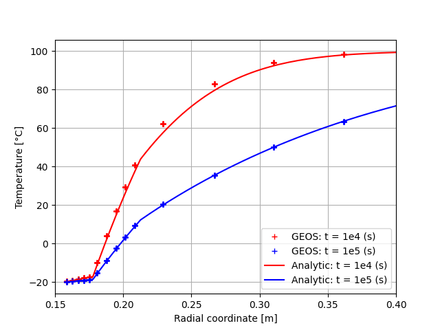
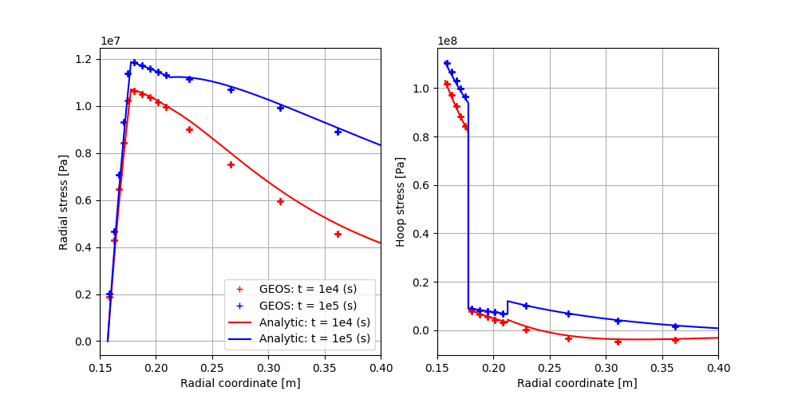

.. _AdvancedExampleCasedThermoElasticWellbore:

####################################################
Cased ThermoElastic Wellbore Problem
####################################################

------------------------------------------------------------------
Problem description
------------------------------------------------------------------

This example uses the thermal option of the ``SinglePhasePoromechanics`` solver to handle a cased wellbore problem subject to a uniform temperature change on the inner surface of the casing. The wellbore is composed of a steel casing, a cement sheath and rock formation. Isotropic linear thermoelastic behavior is assumed for all three materials. No separation or thermal barrier is allowed for the casing-cement and cement-rock contact interfaces. Plane strain condition is assumed.

.. _problemSketchCasedThermalElasticWellboreFig:
.. figure:: sketch.png
   :align: center
   :width: 500
   :figclass: align-center

   Sketch of a cased thermoelastic wellbore 

Solution to this axisymmetric problem can be obtained in the cylindrical coordinate system by using an implicit 1D finite difference method `(Jane and Lee 1999) <https://www.sciencedirect.com/science/article/abs/pii/S0093641399000828>`__. Results of such analysis will be considered as reference solutions to validate GEOS results.

**Input file**

This benchmark example uses no external input files and everything required is
contained within two GEOS XML files located at:

.. code-block:: console

  inputFiles/wellbore/CasedThermoElasticWellbore_base.xml

and

.. code-block:: console

  inputFiles/wellbore/CasedThermoElasticWellbore_benchmark.xml

The corresponding integrated test is

.. code-block:: console

  inputFiles/wellbore/CasedThermoElasticWellbore_smoke.xml

-----------------------------------------------------------
Geometry and mesh
-----------------------------------------------------------

The internal wellbore mesh generator ``InternalWellbore`` is employed to create the mesh of this wellbore problem. The radii of the casing cylinder, the cement sheath cylinder and the far-field boundary of the surrounding rock formation are defined by a vector ``radius``. In the tangent direction, ``theta`` angle is specified from 0 to 90 degrees to simulate the problem on a quarter of the wellbore geometry. The problem is under plane strain condition and therefore we only consider radial thermal diffusion on a single horizontal layer. The trajectory of the well is defined by ``trajectory``, which is vertical in this case. The ``autoSpaceRadialElems`` parameters allow for optimally increasing the element size from the wellbore to the far-field zone. In this example, the auto spacing option is only applied to the rock formation. The ``useCartesianOuterBoundary`` with a value 3 specified for the rock layer transforms the far-field boundary to a circular shape. The ``cellBlockNames`` and ``elementTypes`` define the regions and related element types associated to casing, cement sheath, and rock. 
 
.. literalinclude:: ../../../../../../../inputFiles/wellbore/CasedThermoElasticWellbore_benchmark.xml
  :language: xml
  :start-after: <!-- SPHINX_WellboreMesh -->
  :end-before: <!-- SPHINX_WellboreMeshEnd -->

.. _meshCasedThermalElasticWellboreFig:

   An optimized mesh for the cased wellbore.

-----------------------------------------------------------
Material properties
-----------------------------------------------------------

The bulk and shear drained elastic moduli of the materials as well as its drained linear thermal expansion coefficient relating stress change to temperature change are defined within the ``Constitutive`` tag as follows:
 
.. literalinclude:: ../../../../../../../inputFiles/wellbore/CasedThermoElasticWellbore_base.xml
  :language: xml
  :start-after: <!-- SPHINX_ThermoElasticProperties -->
  :end-before: <!-- SPHINX_ThermoElasticPropertiesEnd -->

Here the solid density is also defined but it is not used because the gravitational effect is ignored in this example. To mimic a thermoelastic coupling without fluid flow, a negligible porosity and a zero Biot coefficient are defined as:

.. literalinclude:: ../../../../../../../inputFiles/wellbore/CasedThermoElasticWellbore_base.xml
  :language: xml
  :start-after: <!-- SPHINX_PoroElasticProperties -->
  :end-before: <!-- SPHINX_PoroElasticPropertiesEnd -->

In this XML block, the Biot coefficient is defined using the elastic bulk modulus :math:`K_{s}` of the solid skeleton as :math:`b_{Biot} = 1 - K/K_{s}`. In this example, we define a skeleton bulk modulus that is identical to the drained bulk modulus :math:`K` defined above to enforce the Biot coefficient to zero.

The thermal conductivities and the volumetric heat capacities of casing, cement, and rock are defined by following XML blocks:

.. literalinclude:: ../../../../../../../inputFiles/wellbore/CasedThermoElasticWellbore_base.xml
  :language: xml
  :start-after: <!-- SPHINX_ThermalProperties -->
  :end-before: <!-- SPHINX_ThermalPropertiesEnd -->

and

.. literalinclude:: ../../../../../../../inputFiles/wellbore/CasedThermoElasticWellbore_base.xml
  :language: xml
  :start-after: <!-- SPHINX_HeatCapacityProperties -->
  :end-before: <!-- SPHINX_HeatCapacityPropertiesEnd -->

An ultra-low permeability is defined for the three layers to simulate a thermoelastic problem without the impact of fluid flow.

.. literalinclude:: ../../../../../../../inputFiles/wellbore/CasedThermoElasticWellbore_base.xml
  :language: xml
  :start-after: <!-- SPHINX_PermeabilityProperties -->
  :end-before: <!-- SPHINX_PermeabilityPropertiesEnd -->

Also, a negligible volumetric heat capacity is defined for the fluid to completely ignore the thermal convection effect such that only thermal transfers via the diffusion phenomenon are considered.

.. literalinclude:: ../../../../../../../inputFiles/wellbore/CasedThermoElasticWellbore_base.xml
  :language: xml
  :start-after: <!-- SPHINX_FluidProperties -->
  :end-before: <!-- SPHINX_FluidPropertiesEnd -->

Other fluid properties such as viscosity, thermal expansion coefficient, etc. are not relevant to this example because fluid flow is ignored and pore pressure is zero everywhere.

-----------------------------------------------------------
Boundary conditions
-----------------------------------------------------------

The mechanical boundary conditions are applied to ensure the axisymmetric plane strain conditions such as:

.. literalinclude:: ../../../../../../../inputFiles/wellbore/CasedThermoElasticWellbore_base.xml
  :language: xml
  :start-after: <!-- SPHINX_PlaneStrainAxisymmetryBC -->
  :end-before: <!-- SPHINX_PlaneStrainAxisymmetryBCEnd -->

Besides, the far-field boundary is assumed to be fixed because the local changes on the wellbore must have negligible effect on the far-field boundary. 

.. literalinclude:: ../../../../../../../inputFiles/wellbore/CasedThermoElasticWellbore_base.xml
  :language: xml
  :start-after: <!-- SPHINX_FixedFarFieldBC -->
  :end-before: <!-- SPHINX_FixedFarFieldBCEnd -->

The traction-free condition on the inner surface of the casing is defined by:

.. literalinclude:: ../../../../../../../inputFiles/wellbore/CasedThermoElasticWellbore_base.xml
  :language: xml
  :start-after: <!-- SPHINX_ZeroInnerTractionBC -->
  :end-before: <!-- SPHINX_ZeroInnerTractionBCEnd -->

The initial reservoir temperature (that is also the far-field boundary temperature) and the temperature of a cold fluid applied on the inner surface of the casing are defined as

.. literalinclude:: ../../../../../../../inputFiles/wellbore/CasedThermoElasticWellbore_base.xml
  :language: xml
  :start-after: <!-- SPHINX_TemperatureBC -->
  :end-before: <!-- SPHINX_TemperatureBCEnd -->

It is important to remark that the initial effective stress of each layers must be set with accordance to the initial temperature: :math:`\sigma_{0} = 3K\alpha \delta T_{0}` where :math:`\sigma_{0}` is the initial effective principal stress, :math:`\delta T_{0}` is the initial temperature change, :math:`K` is the drained bulk modulus and :math:`\alpha` is the drained linear thermal expansion coefficient of the materials.

.. literalinclude:: ../../../../../../../inputFiles/wellbore/CasedThermoElasticWellbore_base.xml
  :language: xml
  :start-after: <!-- SPHINX_StressCasingInit -->
  :end-before: <!-- SPHINX_StressCasingInitEnd -->

Zero pore pressure is set everywhere to simulate a thermoelastic problem in which fluid flow is ignored:

.. literalinclude:: ../../../../../../../inputFiles/wellbore/CasedThermoElasticWellbore_base.xml
  :language: xml
  :start-after: <!-- SPHINX_ZeroPorePressureBC -->
  :end-before: <!-- SPHINX_ZeroPorePressureBCEnd -->

-----------------------------------------------------------
Collecting output data
-----------------------------------------------------------

It is convenient to collect data in hdf5 format that can be easily post-processed using Python. To collect the temperature field in the three layers for all the time steps, the following XML blocks need to be defined:

.. literalinclude:: ../../../../../../../inputFiles/wellbore/CasedThermoElasticWellbore_base.xml
  :language: xml
  :start-after: <!-- SPHINX_TemperatureCollection -->
  :end-before: <!-- SPHINX_TemperatureCollectionEnd -->

.. literalinclude:: ../../../../../../../inputFiles/wellbore/CasedThermoElasticWellbore_base.xml
  :language: xml
  :start-after: <!-- SPHINX_TemperatureTimeHistory -->
  :end-before: <!-- SPHINX_TemperatureTimeHistoryEnd -->

Similarly, the following blocks are needed to collect the solid stress:

.. literalinclude:: ../../../../../../../inputFiles/wellbore/CasedThermoElasticWellbore_base.xml
  :language: xml
  :start-after: <!-- SPHINX_SolidStressCollection -->
  :end-before: <!-- SPHINX_SolidStressCollectionEnd -->

.. literalinclude:: ../../../../../../../inputFiles/wellbore/CasedThermoElasticWellbore_base.xml
  :language: xml
  :start-after: <!-- SPHINX_SolidStressTimeHistory -->
  :end-before: <!-- SPHINX_SolidStressTimeHistoryEnd -->

The displacement field can be collected for the whole domain using ``nodeManager`` as follows

.. literalinclude:: ../../../../../../../inputFiles/wellbore/CasedThermoElasticWellbore_base.xml
  :language: xml
  :start-after: <!-- SPHINX_DisplacementCollection -->
  :end-before: <!-- SPHINX_DisplacementCollectionEnd -->

.. literalinclude:: ../../../../../../../inputFiles/wellbore/CasedThermoElasticWellbore_base.xml
  :language: xml
  :start-after: <!-- SPHINX_DisplacementTimeHistory -->
  :end-before: <!-- SPHINX_DisplacementTimeHistoryEnd -->

Also, periodic events are required to trigger the collection of this data on the mesh. For example, the periodic events for collecting the displacement field are defined as:

.. literalinclude:: ../../../../../../../inputFiles/wellbore/CasedThermoElasticWellbore_benchmark.xml
  :language: xml
  :start-after: <!-- SPHINX_DisplacementPeriodicEvent -->
  :end-before: <!-- SPHINX_DisplacementPeriodicEventEnd -->

---------------------------------
Results and benchmark
---------------------------------

A good agreement between the GEOS results and analytical results for temperature distribution around the cased wellbore is shown in the figures below:

.. plot:: docs/sphinx/advancedExamples/validationStudies/wellboreProblems/casedThermoElasticWellbore/thermoElastic_casedWellbore_temperature.py

.. _problemCasedThermoElasticWellbore_Temperature_Fig:

   Validation of the temperature.

and the validation for the radial displacement around the cased wellbore is shown below:

.. plot:: docs/sphinx/advancedExamples/validationStudies/wellboreProblems/casedThermoElasticWellbore/thermoElastic_casedWellbore_displacement.py

.. _problemCasedThermoElasticWellbore_Displacement_Fig:
.. figure:: displacement.png
   :align: center
   :width: 800
   :figclass: align-center

   Validation of the displacement.

The validations of the total radial and hoop stress (tangent stress) components computed by GEOS against reference results are shown in the figure below:

.. plot:: docs/sphinx/advancedExamples/validationStudies/wellboreProblems/casedThermoElasticWellbore/thermoElastic_casedWellbore_stress.py

.. _problemCasedThermoElasticWellbore_Stresses_Fig:

   Validation of the stresses.

------------------------------------------------------------------
To go further
------------------------------------------------------------------

**Feedback on this example**

This concludes the cased wellbore example.
For any feedback on this example, please submit a `GitHub issue on the project's GitHub page <https://github.com/GEOS-DEV/GEOS/issues>`_.
