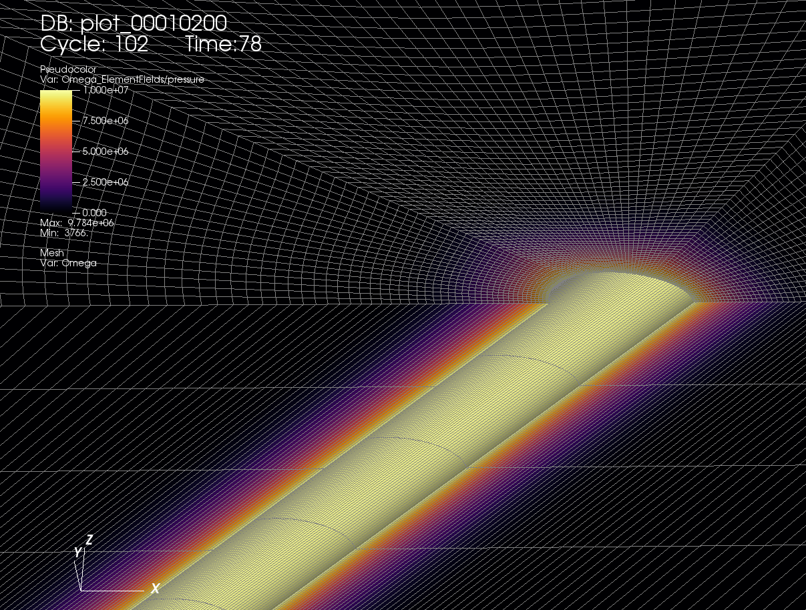

.. _AdvancedExampleDeviatedPoroElasticWellbore:

#################################################################
Deviated Poro-Elastic Wellbore Subjected to Fluid Injection
#################################################################

------------------------------------------------------------------
Problem description
------------------------------------------------------------------

This example aims to solve a typical injection problem of a deviated wellbore subjected to a fluid pressure loaded at wellbore wall. The problem geometry is generated with the internal wellbore mesh generator. Open hole completion and poroelastic deformation are assumed. The coupled poroelastic solver, which combines the solid mechanics solver and the single phase flow solver, is hereby employed to solve this specific problem. In-situ stresses and gravity effect are excluded from this example. Please refer to the case :ref:`AdvancedExampleDeviatedPoroElasticWellboreDrilling` for in-situ stresses and pore pressure effects.

Analytical solutions of the pore pressure, the radial and hoop stresses in the near wellbore region are expressed in the Laplace space as `(Detournay and Cheng, 1988) <https://www.sciencedirect.com/science/article/abs/pii/0148906288922991>`__ :

.. math::
    p = p_0 \frac{k_0(R \sqrt{s})}{s k_0(\sqrt{s})}

.. math::
    \sigma_{rr} = -b \frac{1-2\nu}{1-\nu} p_0 \frac{-R k_1(R \sqrt{s}) + k_1(\sqrt{s})}{R^2 \sqrt{s^3} k_0(\sqrt{s})}

.. math::
    \sigma_{\theta\theta} = -b \frac{1-2\nu}{1-\nu} p - \sigma_{rr}

where :math:`s` is the Laplace variable normalized by the fluid diffusion coefficient, :math:`k_0` and :math:`k_1` are respectively the modified Bessel functions of second kind of order 0 and 1, :math:`R` is the dimensionless radial coordinate that is defined by the radial coordinate normalized by the wellbore radius, :math:`\nu` is the Poisson ratio and :math:`b` is the Biot coefficient. Fluid pressure and stresses in time space are obtained from these analytical expressions by the inverse Laplace transform (see the attached Python script for more details).

**Input file**

Everything required is
contained within two GEOS xml files that are located at:

.. code-block:: console

  inputFiles/wellbore/DeviatedPoroElasticWellbore_Injection_base.xml

.. code-block:: console

  inputFiles/wellbore/DeviatedPoroElasticWellbore_Injection_benchmark.xml

In this example, we would focus our attention on the ``Solvers`` and the ``Mesh`` tags.

-----------------------------------------------------------
Poroelastic solver
-----------------------------------------------------------

The coupled ``Poroelastic`` solver, that defines a coupling strategy between the solid mechanics solver ``SolidMechanicsLagrangianSSLE`` and the single phase flow solver ``SinglePhaseFVM``, is required for solving this wellbore problem.

.. literalinclude:: ../../../../../../../inputFiles/wellbore/DeviatedPoroElasticWellbore_Injection_benchmark.xml
  :language: xml
  :start-after: <!-- SPHINX_PoroelasticSolver -->
  :end-before: <!-- SPHINX_PoroelasticSolverEnd -->

.. literalinclude:: ../../../../../../../inputFiles/wellbore/DeviatedPoroElasticWellbore_Injection_benchmark.xml
  :language: xml
  :start-after: <!-- SPHINX_SolidMechanicsSolver -->
  :end-before: <!-- SPHINX_SolidMechanicsSolverEnd -->

.. literalinclude:: ../../../../../../../inputFiles/wellbore/DeviatedPoroElasticWellbore_Injection_benchmark.xml
  :language: xml
  :start-after: <!-- SPHINX_SinglePhaseFVM -->
  :end-before: <!-- SPHINX_SinglePhaseFVMEnd -->

--------------------------------------------------------------------
Deviated wellbore mesh
--------------------------------------------------------------------

The internal wellbore mesh generator ``InternalWellbore`` is employed to create the mesh of this wellbore problem. The radius of the wellbore and the size of the surrounding rock formation are defined by a vector ``radius``. In the tangent direction, ``theta`` angle is specified from 0 to 180 degree for a half of the domain regarding its symmetry. Note that the whole domain could be specified with a ``theta`` angle from 0 to 360 degree, if modeling complicated scenarios. The trajectory of the well is defined by ``trajectory``. In this example, the wellbore is inclined in the x-z plane by an angle of 45 degree. The ``autoSpaceRadialElems`` parameter allows optimally increasing the element size from local zone around the wellbore to the far-field zone, which is set to 1 to activate this option. The ``useCartesianOuterBoundary`` transforms the far-field boundary to a squared shape to enforce a Cartesian aligned outer boundary, which eases the loading of the far-field boundary conditions. In this example, this value is set to 0 for the single region along the radial direction.  
 
.. literalinclude:: ../../../../../../../inputFiles/wellbore/DeviatedPoroElasticWellbore_Injection_benchmark.xml
  :language: xml
  :start-after: <!-- SPHINX_WellboreMesh -->
  :end-before: <!-- SPHINX_WellboreMeshEnd -->

--------------------------------------------------------------------   
Constitutive law
--------------------------------------------------------------------

Isotropic elastic constitutive block ``ElasticIsotropic``, with the specified bulk and shear elastic moduli, is considered for the rock around the wellbore. Fluid properties, such as dynamic viscosity and compressibility, are given in the ``CompressibleSinglePhaseFluid`` constitutive block. The grain bulk modulus, that is required for computing the Biot coefficient, as well as the default porosity are located in the ``BiotPorosity`` block. The constant permeability is given in the ``ConstantPermeability`` block. 

.. literalinclude:: ../../../../../../../inputFiles/wellbore/DeviatedPoroElasticWellbore_Injection_base.xml
  :language: xml
  :start-after: <!-- SPHINX_Material -->
  :end-before: <!-- SPHINX_MaterialEnd -->

--------------------------------------------------------------------	       
Boundary conditions
--------------------------------------------------------------------

Far-field boundaries are impermeable and subjected to roller constraints. The pressure on the wellbore wall is defined by face pressure field specification. The nodeset generated by the internal wellbore generator for this face is named as ``rneg``. The negative sign of the scale denotes the fluid injection. Initial fluid pressure and the corresponding initial porosity are also given for the computational domain. In this example, uniform isotropic permeability is assumed.

.. literalinclude:: ../../../../../../../inputFiles/wellbore/DeviatedPoroElasticWellbore_Injection_base.xml
  :language: xml
  :start-after: <!-- SPHINX_BoundaryConditions -->
  :end-before: <!-- SPHINX_BoundaryConditionsEnd -->

---------------------------------
Results and benchmark
---------------------------------

Result of the fluid pressure distribution after 78 s injection is shown in the figure below:

A good agreement between the GEOS results and the corresponding analytical solutions is shown in the figure below:

.. plot:: docs/sphinx/advancedExamples/validationStudies/wellboreProblems/deviatedPoroElasticWellbore/deviatedPoroElasticWellboreExample1Figure.py

------------------------------------------------------------------
To go further
------------------------------------------------------------------

**Feedback on this example**

This concludes the deviated poro-elastic wellbore example.
For any feedback on this example, please submit a `GitHub issue on the project's GitHub page <https://github.com/GEOS-DEV/GEOS/issues>`_.
