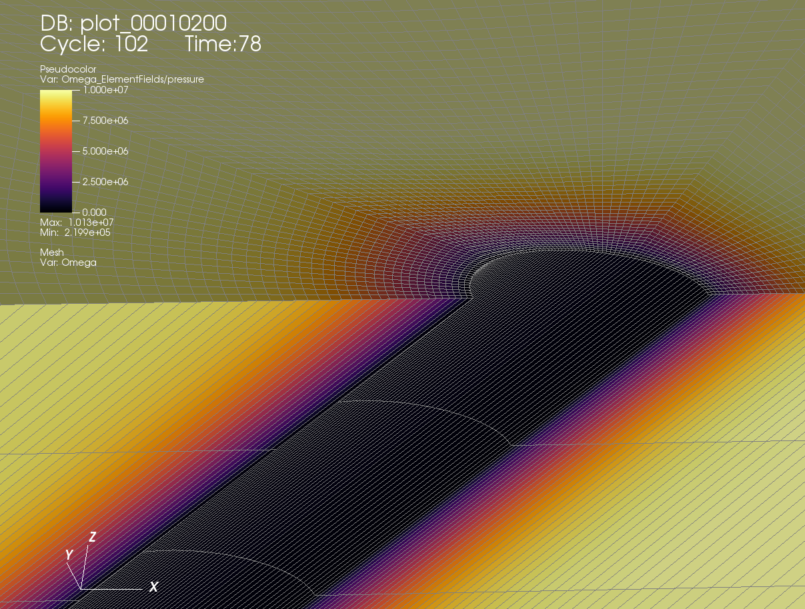

.. _AdvancedExampleDeviatedPoroElasticWellboreDrilling:

#########################################################################################
Deviated Poro-Elastic Wellbore Subjected to In-situ Stresses and Pore Pressure
#########################################################################################

------------------------------------------------------------------
Problem description
------------------------------------------------------------------

This example deals with the problem of drilling a deviated poro-elastic wellbore. This is an extension of the poroelastic wellbore example :ref:`AdvancedExampleDeviatedPoroElasticWellbore` with the consideration of in-situ stresses and in-situ pore pressure. Both pore pressure and mud pressure are supposed to be nil at the borehole wall following the consideration of `(Abousleiman and Cui, 1998) <https://www.sciencedirect.com/science/article/pii/S0020768398001012>`__. Also, the in-situ horizontal stresses are anisotropic, i.e. :math:`\sigma_{hmax}` > :math:`\sigma_{hmin}`. The wellbore trajectory is deviated from the directions of the in-situ stresses. Analytical solutions of the pore pressure, the radial and hoop stresses in the near wellbore region are given by `(Abousleiman and Cui, 1998) <https://www.sciencedirect.com/science/article/pii/S0020768398001012>`__. They are hereby used to verify the modeling predictions.

**Input file**

Everything required is
contained within two GEOS xml files that are located at:

.. code-block:: console

  inputFiles/wellbore/DeviatedPoroElasticWellbore_Drilling_base.xml

.. code-block:: console

  inputFiles/wellbore/DeviatedPoroElasticWellbore_Drilling_benchmark.xml

This case is nearly identical to another example :ref:`AdvancedExampleDeviatedPoroElasticWellbore`, except for the ``FieldSpecifications`` tag. For this specific case, we need to consider following additional field specifications to define the in-situ stresses, in-situ pore pressure, as well as the zero pore pressure at the borehole wall.

.. literalinclude:: ../../../../../../../inputFiles/wellbore/DeviatedPoroElasticWellbore_Drilling_base.xml
  :language: xml
  :start-after: <!-- SPHINX_InsituConditions -->
  :end-before: <!-- SPHINX_InsituConditionsEnd -->

---------------------------------
Results and benchmark
---------------------------------

Pore pressure distribution after 78 s injection is shown in the figure below:

A good agreement between the GEOS results and the corresponding analytical solutions `(Abousleiman and Cui, 1998) <https://www.sciencedirect.com/science/article/pii/S0020768398001012>`__ is shown in the figure below:

.. plot:: docs/sphinx/advancedExamples/validationStudies/wellboreProblems/deviatedPoroElasticWellbore/deviatedPoroElasticWellboreExample2Figure.py

------------------------------------------------------------------
To go further
------------------------------------------------------------------

**Feedback on this example**

This concludes the deviated poro-elastic wellbore example with in-situ stresses and pore pressure effects.
For any feedback on this example, please submit a `GitHub issue on the project's GitHub page <https://github.com/GEOS-DEV/GEOS/issues>`_.
