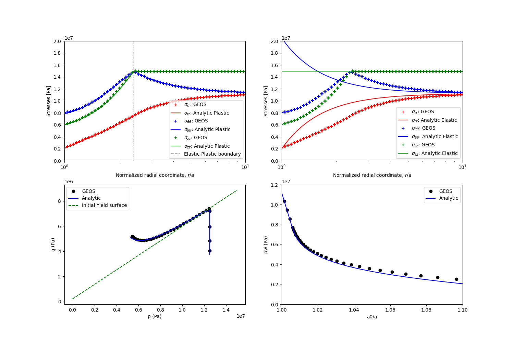

.. _ExampleDPWellbore:

#########################################################
Drucker-Prager Model with Hardening for Wellbore Problems
#########################################################

**Context**

This is an alternative to the example :ref:`ExampleEDPWellbore`, and the Drucker-Prager constitutive with cohesion hardening (see :ref:`DruckerPrager`) is hereby considered. Analytical solutions to this problem are not provided from literature work, however they can be derived following `(Chen and Abousleiman 2017)  <https://www.sciencedirect.com/science/article/pii/S1365160917301090>`__. Details of those solutions are given in Python scripts associated to this example.

**Input file**

This example uses no external input files and everything required is
contained within two xml files that are located at:

.. code-block:: console

  inputFiles/solidMechanics/DruckerPragerWellbore_base.xml

.. code-block:: console

  inputFiles/solidMechanics/DruckerPragerWellbore_benchmark.xml

The related integrated test is

.. code-block:: console

  inputFiles/solidMechanics/DruckerPragerWellbore_smoke.xml

The Drucker-Prager material properties are specified in the ``Constitutive`` section: 

.. literalinclude:: ../../../../../../../inputFiles/solidMechanics/DruckerPragerWellbore_base.xml
    :language: xml
    :start-after: <!-- SPHINX_DP_WELLBORE_MATERIAL -->
    :end-before: <!-- SPHINX_DP_WELLBORE_MATERIAL_END -->

Here, ``rock`` is designated as the material in the computational domain. Drucker Prager model ``DruckerPrager`` is used to simulate the elastoplastic behavior of ``rock``. The material parameters, ``defaultFrictionAngle``, ``defaultDilationAngle`` and ``defaultCohesion`` denote the friction angle, the dilation angle, and the cohesion, respectively. In this example, the hardening of the cohesion is described by a linear hardening law, which is governed by the parameter ``defaultHardeningRate``. The constitutive parameters such as the density, the bulk modulus, and the shear modulus are specified in the International System of Units.

The parameters used in the simulation are summarized in the following table.

+------------------+-------------------------+------------------+---------------+
| Symbol           | Parameter               | Unit             | Value         |
+==================+=========================+==================+===============+
| :math:`K`        | Bulk modulus            | [MPa]            | 500           |
+------------------+-------------------------+------------------+---------------+
| :math:`G`        | Shear Modulus           | [MPa]            | 300           |
+------------------+-------------------------+------------------+---------------+
| :math:`c`        | Cohesion                | [MPa]            | 0.1           |
+------------------+-------------------------+------------------+---------------+
| :math:`\phi`     | Friction Angle          | [degree]         | 15.27         |
+------------------+-------------------------+------------------+---------------+
| :math:`\psi`     | Dilation Angle          | [degree]         | 15.0          |
+------------------+-------------------------+------------------+---------------+
| :math:`h`        | Hardening Rate          | [MPa]            | 10.0          |
+------------------+-------------------------+------------------+---------------+
| :math:`\sigma_h` | Horizontal Stress       | [MPa]            | -11.25        |
+------------------+-------------------------+------------------+---------------+
| :math:`\sigma_v` | Vertical Stress         | [MPa]            | -15.0         |
+------------------+-------------------------+------------------+---------------+
| :math:`a_0`      | Initial Well Radius     | [m]              | 0.1           |
+------------------+-------------------------+------------------+---------------+
| :math:`p_w`      | Mud Pressure            | [MPa]            | -2.0          |
+------------------+-------------------------+------------------+---------------+

The validation of GEOS results against analytical results is shown in the figure below:

.. _dpWellboreVerificationFig:

   Validation of GEOS results.

------------------------------------------------------------------
To go further
------------------------------------------------------------------

**Feedback on this example**

This concludes the example on Plasticity Model for Wellbore Problems.
For any feedback on this example, please submit a `GitHub issue on the project's GitHub page <https://github.com/GEOS-DEV/GEOS/issues>`_.
