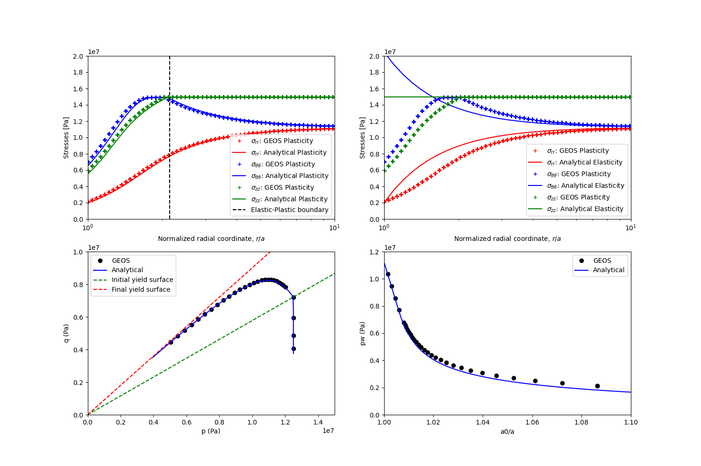

.. _ExampleEDPWellbore:

####################################################
Extended Drucker-Prager Model for Wellbore Problems
####################################################

**Context**

The main goal of this example is to learn how to use the internal wellbore mesh generator and an elasto-plastic model to handle wellbore problems in GEOS. The Extended Drucker-Prager model (see :ref:`DruckerPragerExtended`) is applied to solve for elastoplastic deformation within the vicinity of a vertical wellbore. For the presented example, an analytical solution is employed to verify the accuracy of the numerical results. The resulting model can be used as a base for more complex analysis (e.g., wellbore drilling, fluid injection and storage scenarios). 

**Objectives**

At the end of this example you will know:

  - how to construct meshes for wellbore problems with the internal mesh generator,
  - how to specify initial and boundary conditions, such as in-situ stresses and variation of traction at the wellbore wall,
  - how to use a plastic model for mechanical problems in the near wellbore region.

**Input file**

This example uses no external input files and everything required is
contained within two xml files that are located at:

.. code-block:: console

  inputFiles/solidMechanics/ExtendedDruckerPragerWellbore_base.xml

.. code-block:: console

  inputFiles/solidMechanics/ExtendedDruckerPragerWellbore_benchmark.xml

The Python scripts for post-processing GEOS results, analytical restuls and validation plots are also provided in this example.

------------------------------------------------------------------
Description of the case
------------------------------------------------------------------

We simulate a drained wellbore problem subjected to isotropic horizontal stress (:math:`\sigma_h`) and vertical stress (:math:`\sigma_v`). By lowering the wellbore supporting pressure (:math:`P_w`), the wellbore contracts, and the reservoir rock experiences elastoplastic deformation. A plastic zone develops in the near wellbore region, as shown below.

.. _problemSketchEDPWellboreFig:
.. figure:: Wellbore.png
   :align: center
   :width: 500
   :figclass: align-center

   Sketch of the wellbore problem `(Chen and Abousleiman, 2017)  <https://www.sciencedirect.com/science/article/pii/S1365160917301090>`__

To simulate this phenomenon, the strain hardening Extended Drucker-Prager model with an associated plastic flow rule in GEOS is used in this example. Displacement and stress fields around the wellbore are numerically calculated. These numerical predictions are then compared with the corresponding analytical solutions `(Chen and Abousleiman, 2017)  <https://www.sciencedirect.com/science/article/pii/S1365160917301090>`__ from the literature. 

All inputs for this case are contained inside a single XML file.
In this example, we focus our attention on the ``Mesh`` tags,
the ``Constitutive`` tags, and the ``FieldSpecifications`` tags.

------
Mesh
------

Following figure shows the generated mesh that is used for solving this 3D wellbore problem

.. _problemSketchEDPWellboreFig2:

   Generated mesh for the wellbore problem

Let us take a closer look at the geometry of this wellbore problem.
We use the internal mesh generator ``InternalWellbore`` to create a rock domain
(:math:`10\, m \, \times 10 \,  m \, \times 2 \, m`), with a wellbore of
initial radius equal to :math:`0.1` m.
Coordinates of ``trajectory`` defines the wellbore trajectory, which represents a vertical well in this example. 
By turning on ``autoSpaceRadialElems="{ 1 }"``, the internal mesh generator automatically sets number and spacing of elements in the radial direction, which overrides the values of ``nr``. In this way, a structured three-dimensional mesh is created. All the elements are eight-node hexahedral elements (``C3D8``) and refinement is performed
to conform with the wellbore geometry. This mesh is defined as a cell block with the name
``cb1``.

.. literalinclude:: ../../../../../../../inputFiles/solidMechanics/ExtendedDruckerPragerWellbore_benchmark.xml
    :language: xml
    :start-after: <!-- SPHINX_DP_WELLBORE_MESH -->
    :end-before: <!-- SPHINX_DP_WELLBORE_MESH_END -->

------------------------
Solid mechanics solver
------------------------

For the drained wellbore problem, the pore pressure variation is omitted and can be subtracted from the analysis. Therefore, we just need to define a solid mechanics solver, which is called ``mechanicsSolver``. 
This solid mechanics solver (see :ref:`SolidMechanicsLagrangianFEM`) is based on the Lagrangian finite element formulation. 
The problem is run as ``QuasiStatic`` without considering inertial effects. 
The computational domain is discretized by ``FE1``, which is defined in the ``NumericalMethods`` section. 
The material is named as ``rock``, whose mechanical properties are specified in the ``Constitutive`` section.

.. literalinclude:: ../../../../../../../inputFiles/solidMechanics/ExtendedDruckerPragerWellbore_base.xml
  :language: xml
  :start-after: <!-- SPHINX_DP_WELLBORE_SOLVER -->
  :end-before: <!-- SPHINX_DP_WELLBORE_SOLVER_END -->

------------------------------
Constitutive laws
------------------------------

For this drained wellbore problem, we simulate the elastoplastic deformation caused by wellbore contraction.
A homogeneous domain with one solid material is assumed, whose mechanical properties are specified in the ``Constitutive`` section: 

.. literalinclude:: ../../../../../../../inputFiles/solidMechanics/ExtendedDruckerPragerWellbore_base.xml
    :language: xml
    :start-after: <!-- SPHINX_DP_WELLBORE_MATERIAL -->
    :end-before: <!-- SPHINX_DP_WELLBORE_MATERIAL_END -->

Recall that in the ``SolidMechanics_LagrangianFEM`` section, 
``rock`` is designated as the material in the computational domain. 
Here, Extended Drucker Prager model ``ExtendedDruckerPrager`` is used to simulate the elastoplastic behavior of ``rock``.
As for the material parameters, ``defaultInitialFrictionAngle``, ``defaultResidualFrictionAngle`` and ``defaultCohesion`` denote the initial friction angle, the residual friction angle, and cohesion, respectively, as defined by the Mohr-Coulomb failure envelope. In this example, zero cohesion is considered to consist with the reference analytical results. As the residual friction angle ``defaultResidualFrictionAngle`` is larger than the initial one ``defaultInitialFrictionAngle``, a  strain hardening model is adopted, whose hardening rate is given as ``defaultHardening="0.01"``. 
If the residual friction angle is set to be less than the initial one, strain weakening will take place. 
Setting ``defaultDilationRatio="1.0"`` corresponds to an associated flow rule.
The constitutive parameters such as the density, the bulk modulus, and the shear modulus are specified in the International System of Units.

-----------------------------------------------------------
Initial and boundary conditions
-----------------------------------------------------------

The next step is to specify fields, including:

  - The initial value (the in-situ stresses and traction at the wellbore wall have to be initialized)
  - The boundary conditions (the reduction of wellbore pressure and constraints of the outer boundaries have to be set)

In this example, we need to specify isotropic horizontal stress (:math:`\sigma_h` = -11.25 MPa) and vertical stress (:math:`\sigma_v` = -15.0 MPa). 
To reach equilibrium, a compressive traction :math:`p_w` = -11.25 MPa is instantaneously applied at the wellbore wall ``rneg`` at time :math:`t` = 0 s, which will then be gradually reduced to a lower absolute value (-2.0 MPa) to let wellbore contract.
The boundaries at ``tneg`` and ``tpos`` are subjected to roller constraints. The plane strain condition is ensured by fixing the vertical displacement at ``zneg`` and ``zpos`` The far-field boundary is fixed in horizontal displacement.  
These boundary conditions are set up through the ``FieldSpecifications`` section.

.. literalinclude:: ../../../../../../../inputFiles/solidMechanics/ExtendedDruckerPragerWellbore_base.xml
    :language: xml
    :start-after: <!-- SPHINX_DP_WELLBORE_BC -->
    :end-before: <!-- SPHINX_DP_WELLBORE_BC_END -->

With ``tractionType="normal"``, traction is applied to the wellbore wall ``rneg`` as a pressure specified from the product of scale ``scale="1.0"`` and the outward face normal. 
A table function ``timeFunction`` is used to define the time-dependent traction ``ExternalLoad``. 
The ``coordinates`` and ``values`` form a time-magnitude
pair for the loading time history. In this case, the loading magnitude decreases linearly as the time evolves. 

.. literalinclude:: ../../../../../../../inputFiles/solidMechanics/ExtendedDruckerPragerWellbore_base.xml
    :language: xml
    :start-after: <!-- SPHINX_DP_WELLBORE_TABLE -->
    :end-before: <!-- SPHINX_DP_WELLBORE_TABLE_END -->

You may note :

 - All initial value fields must have ``initialCondition`` field set to ``1``;
 - The ``setName`` field points to the previously defined box to apply the fields;
 - ``nodeManager`` and ``faceManager`` in the ``objectPath`` indicate that the boundary conditions are applied to the element nodes and faces, respectively;
 - ``fieldName`` is the name of the field registered in GEOS;
 - Component ``0``, ``1``, and ``2`` refer to the x, y, and z direction, respectively;
 - And the non-zero values given by ``Scale`` indicate the magnitude of the loading; 
 - Some shorthand, such as ``tpos`` and ``xpos``, are used as the locations where the boundary conditions are applied in the computational domain. For instance, ``tpos`` means the portion of the computational domain located at the left-most in the x-axis, while ``xpos`` refers to the portion located at the right-most area in the x-axis. Similar shorthand include ``ypos``, ``tneg``, ``zpos``, and ``zneg``;
 - The mud pressure loading has a negative value due to the negative sign convention for compressive stress in GEOS.

 
The parameters used in the simulation are summarized in the following table.

+------------------+-------------------------+------------------+---------------+
| Symbol           | Parameter               | Unit             | Value         |
+==================+=========================+==================+===============+
| :math:`K`        | Bulk modulus            | [MPa]            | 500           |
+------------------+-------------------------+------------------+---------------+
| :math:`G`        | Shear Modulus           | [MPa]            | 300           |
+------------------+-------------------------+------------------+---------------+
| :math:`c`        | Cohesion                | [MPa]            | 0.0           |
+------------------+-------------------------+------------------+---------------+
| :math:`\phi_i`   | Initial Friction Angle  | [degree]         | 15.27         |
+------------------+-------------------------+------------------+---------------+
| :math:`\phi_r`   | Residual Friction Angle | [degree]         | 23.05         |
+------------------+-------------------------+------------------+---------------+
| :math:`m`        | Hardening Rate          | [-]              | 0.01          |
+------------------+-------------------------+------------------+---------------+
| :math:`\sigma_h` | Horizontal Stress       | [MPa]            | -11.25        |
+------------------+-------------------------+------------------+---------------+
| :math:`\sigma_v` | Vertical Stress         | [MPa]            | -15.0         |
+------------------+-------------------------+------------------+---------------+
| :math:`a_0`      | Initial Well Radius     | [m]              | 0.1           |
+------------------+-------------------------+------------------+---------------+
| :math:`p_w`      | Mud Pressure            | [MPa]            | -2.0          |
+------------------+-------------------------+------------------+---------------+

---------------------------------
Inspecting results
---------------------------------

In the above example, we requested hdf5 output files. We can therefore use python scripts to visualize the outcome. Below figure shows the comparisons between the numerical predictions (marks) and the corresponding analytical solutions (solid curves) with respect to the distributions of principal stress components, stress path on the wellbore surface, the supporting wellbore pressure and wellbore size. It is clear that the GEOS predictions are in excellent agreement with the analytical results. On the top-right figure, we added also a comparison between GEOS results for elasto-plastic material and the anlytical solutions of an elastic material. Note that the elastic solutions are differed from the elasto-plastic results even in the elastic zone (r/a>2).

.. _edpWellboreVerificationFig:

   Validation of GEOS results.

For the same wellbore problem, using different constitutive models (plastic vs. elastic), obviously, distinct differences in rock deformation and distribution of resultant stresses is also observed and highlighted.  

------------------------------------------------------------------
To go further
------------------------------------------------------------------

**Feedback on this example**

This concludes the example on Plasticity Model for Wellbore Problems.
For any feedback on this example, please submit a `GitHub issue on the project's GitHub page <https://github.com/GEOS-DEV/GEOS/issues>`_.

**For more details**

  - More on plasticity models, please see :ref:`DruckerPragerExtended`.
  - More on functions, please see :ref:`FunctionManager`.
