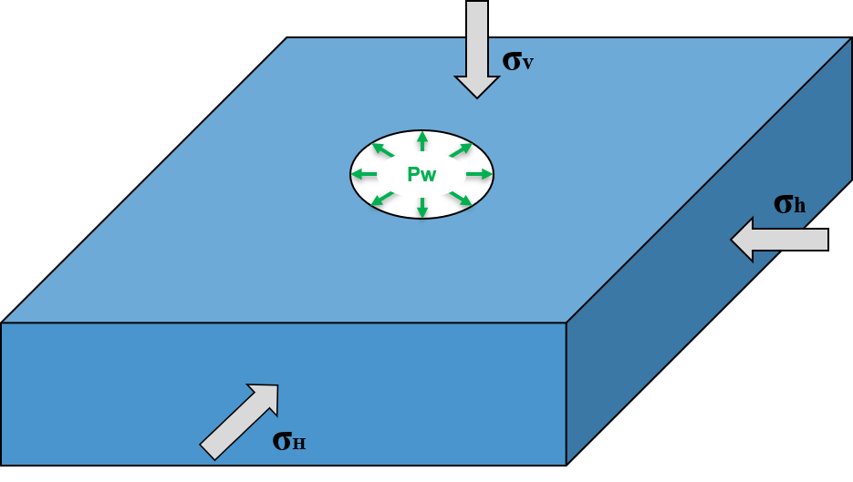
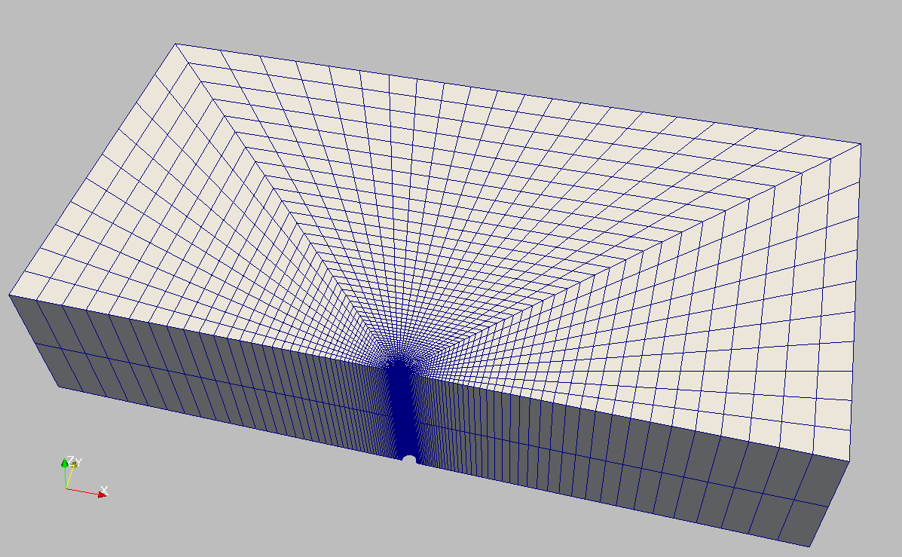
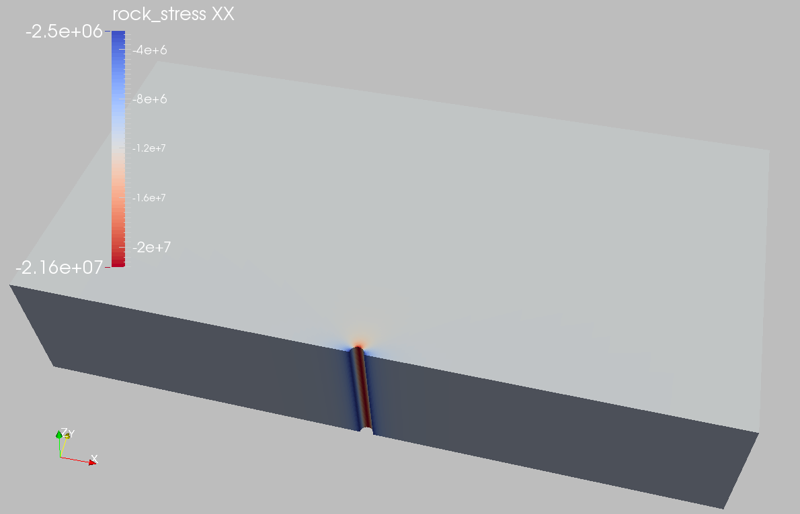

.. _ExampleKirschWellbore:

####################################################
Kirsch Wellbore Problem
####################################################

**Context**

In this example, we simulate a vertical elastic wellbore subjected to in-situ stress and the induced elastic deformation of the reservoir rock. Kirsch's solution to this problem provides the stress and displacement fields developing around a circular cavity, which is hereby employed to verify the accuracy of the numerical results. For this example, the ``TimeHistory`` function and python scripts are used to output and post-process multi-dimensional data (stress and displacement). 

**Input file**

Everything required is contained within two GEOS input files located at:

.. code-block:: console

  inputFiles/solidMechanics/KirschProblem_base.xml
  
.. code-block:: console

  inputFiles/solidMechanics/KirschProblem_benchmark.xml

------------------------------------------------------------------
Description of the case
------------------------------------------------------------------

We solve a drained wellbore problem subjected to anisotropic horizontal stress (:math:`\sigma_{xx}` and :math:`\sigma_{yy}`) as shown below. This is a vertical wellbore drilled in an infinite, homogeneous, isotropic, and elastic medium. Far-field in-situ stresses and internal supporting pressure acting at the circular cavity cause a mechanical deformation of the reservoir rock and stress concentration in the near-wellbore region. For verification purpose, a plane strain condition is considered for the numerical model. 

.. _problemSketchKirschWellboreFig:

   Sketch of the wellbore problem 

In this example, stress (:math:`\sigma_{rr}`, :math:`\sigma_{\theta\theta}`, and :math:`\sigma_{r\theta}`) and displacement (:math:`u_{r}` and :math:`u_{\theta}`) fields around the wellbore are calculated numerically. These numerical predictions are compared with the corresponding Kirsch solutions `(Poulos and Davis, 1974)  <https://www.geoengineer.org/publications/online-library?keywords=E.H.%20Davis>`__. 

.. math::
   \sigma_{rr} =  \frac{ \sigma_{xx} + \sigma_{yy} }{ 2 } {[ 1 - ( \frac{ a_0 }{ r })^{ 2 } ]} + \frac{ \sigma_{xx} - \sigma_{yy} }{ 2 } {[ 1 - 4 ( \frac{ a_0 }{ r })^{ 2 } + 3 ( \frac{ a_0 }{ r })^{ 4 } ]} \text{cos} \left( {2 \theta} \right) + P_w {( \frac{ a_0 }{ r })^{ 2 }}

.. math::
   \sigma_{\theta\theta} =  \frac{ \sigma_{xx} + \sigma_{yy} }{ 2 } {[ 1 + ( \frac{ a_0 }{ r })^{ 2 } ]} - \frac{ \sigma_{xx} - \sigma_{yy} }{ 2 } {[ 1 + 3 ( \frac{ a_0 }{ r })^{ 4 } ]} \text{cos} \left( {2 \theta} \right) - P_w {( \frac{ a_0 }{ r })^{ 2 }}

.. math::
   \sigma_{r\theta} =  - \frac{ \sigma_{xx} - \sigma_{yy} }{ 2 } {[ 1 + 2 ( \frac{ a_0 }{ r })^{ 2 } - 3 ( \frac{ a_0 }{ r })^{ 4 } ]} \text{sin} \left( {2 \theta} \right)

.. math::
   u_{r} = - \frac{ ( a_0 )^{ 2 } }{ 2Gr } {[ \frac{ \sigma_{xx} + \sigma_{yy} }{ 2 } + \frac{ \sigma_{xx} - \sigma_{yy} }{ 2 } {( 4 ( 1- \nu ) - ( \frac{ a_0 }{ r })^{ 2 } )} \text{cos} \left( {2 \theta} \right) - P_w ]}

.. math::
   u_{\theta} = \frac{ ( a_0 )^{ 2 } }{ 2Gr } { \frac{ \sigma_{xx} - \sigma_{yy} }{ 2 } {[ 2 (1- 2 \nu) + ( \frac{ a_0 }{ r })^{ 2 } ]} \text{sin} \left( {2 \theta} \right) }

where :math:`a_0` is the intiial wellbore radius, :math:`r` is the radial coordinate, :math:`\nu` is the Poisson's ratio, :math:`G` is the shear modulus, :math:`P_w` is the normal traction acting on the wellbore wall, the angle :math:`\theta` is measured with respect to x-z plane and defined as positive in counter-clockwise direction. 

In this example, we focus our attention on the ``Mesh``,
the ``Constitutive``, and the ``FieldSpecifications`` tags.

------------------------------------------------------------------
Mesh
------------------------------------------------------------------

Following figure shows the generated mesh that is used for solving this wellbore problem.

.. _problemMeshKirschWellboreFig:

   Generated mesh for a vertical wellbore problem

Let us take a closer look at the geometry of this wellbore problem.
We use the internal wellbore mesh generator ``InternalWellbore`` to create a rock domain
(:math:`10\, m \, \times 5 \,  m \, \times 2 \, m`), with a wellbore of
initial radius equal to :math:`0.1` m. 
Only half of the domain is modeled by a ``theta`` angle from 0 to 180, assuming symmetry for the rest of the domain.
Coordinates of ``trajectory`` defines the wellbore trajectory, a vertical well in this example. 
By turning on ``autoSpaceRadialElems="{ 1 }"``, the internal mesh generator automatically sets number and spacing of elements in the radial direction, which overrides the values of ``nr``. 
With ``useCartesianOuterBoundary="0"``, a Cartesian aligned boundary condition is enforced on the outer blocks.
This way, a structured three-dimensional mesh is created with 50 x 40 x 2 elements in the radial, tangential and z directions, respectively. All elements are eight-node hexahedral elements (``C3D8``) and refinement is performed
to conform with the wellbore geometry. This mesh is defined as a cell block with the name
``cb1``. 

.. literalinclude:: ../../../../../../../inputFiles/solidMechanics/KirschProblem_benchmark.xml
    :language: xml
    :start-after: <!-- SPHINX_MESH -->
    :end-before: <!-- SPHINX_MESH_END -->

------------------------
Solid mechanics solver
------------------------

For a drained wellbore problem, the pore pressure variation is omitted. Therefore, we just need to define a solid mechanics solver, which is called ``mechanicsSolver``. 
This solid mechanics solver (see :ref:`SolidMechanicsLagrangianFEM`) is based on the Lagrangian finite element formulation. 
The problem is run as ``QuasiStatic`` without considering inertial effects. 
The computational domain is discretized by ``FE1``, which is defined in the ``NumericalMethods`` section. 
The material is named ``rock``, whose mechanical properties are specified in the ``Constitutive`` section.

.. literalinclude:: ../../../../../../../inputFiles/solidMechanics/KirschProblem_base.xml
  :language: xml
  :start-after: <!-- SPHINX_SOLVER -->
  :end-before: <!-- SPHINX_SOLVER_END -->

------------------------------
Constitutive laws
------------------------------

For this drained wellbore problem, we simulate a linear elastic deformation around the circular cavity.
A homogeneous and isotropic domain with one solid material is assumed, with mechanical properties specified in the ``Constitutive`` section: 

.. literalinclude:: ../../../../../../../inputFiles/solidMechanics/KirschProblem_base.xml
    :language: xml
    :start-after: <!-- SPHINX_MATERIAL -->
    :end-before: <!-- SPHINX_MATERIAL_END -->

Recall that in the ``SolidMechanics_LagrangianFEM`` section, 
``rock`` is the material in the computational domain. 
Here, the isotropic elastic model ``ElasticIsotropic`` simulates the mechanical behavior of ``rock``.

The constitutive parameters such as the density, the bulk modulus, and the shear modulus are specified in the International System of Units.

------------------------------
Time history function
------------------------------

In the ``Tasks`` section, ``PackCollection`` tasks are defined to collect time history information from fields. 
Either the entire field or specified named sets of indices in the field can be collected. 
In this example, ``stressCollection`` and ``displacementCollection`` tasks are specified to output the resultant stresses (tensor stored as an array with Voigt notation) and total displacement field (stored as a 3-component vector) respectively.

.. literalinclude:: ../../../../../../../inputFiles/solidMechanics/KirschProblem_base.xml
    :language: xml
    :start-after: <!-- SPHINX_TASKS -->
    :end-before: <!-- SPHINX_TASKS_END -->

These two tasks are triggered using the ``Event`` management, where ``PeriodicEvent`` are defined for these recurring tasks. 
GEOS writes two files named after the string defined in the ``filename`` keyword and formatted as HDF5 files (displacement_history.hdf5 and stress_history.hdf5). The TimeHistory file contains the collected time history information from each specified time history collector. This information includes datasets for the simulation time, element center or nodal position, and the time history information. Then, a Python script is prepared to access and plot any specified subset of the time history data for verification and visualization.

-----------------------------------------------------------
Initial and boundary conditions
-----------------------------------------------------------

The next step is to specify fields, including:

  - The initial value (the in-situ stresses and traction at the wellbore wall have to be initialized),
  - The boundary conditions (constraints of the outer boundaries have to be set).

Here, we specify anisotropic horizontal stress values (:math:`\sigma_{yy}` = -9.0 MPa and :math:`\sigma_{xx}` = -11.25 MPa) and a vertical stress (:math:`\sigma_{zz}` = -15.0 MPa). 
A compressive traction (``WellLoad``) :math:`P_w` = -2.0 MPa is loaded at the wellbore wall ``rneg``.
The remaining parts of the outer boundaries are subjected to roller constraints.  
These boundary conditions are set in the ``FieldSpecifications`` section.

.. literalinclude:: ../../../../../../../inputFiles/solidMechanics/KirschProblem_base.xml
    :language: xml
    :start-after: <!-- SPHINX_BC -->
    :end-before: <!-- SPHINX_BC_END -->

With ``tractionType="normal"``, traction is applied to the wellbore wall ``rneg`` as a pressure specified as the scalar product of scale ``scale="-2.0e6"`` and the outward face normal vector.
In this case, the loading magnitude of the traction does not change with time. 

You may note :

 - All initial value fields must have ``initialCondition`` field set to ``1``;
 - The ``setName`` field points to the previously defined set to apply the fields;
 - ``nodeManager`` and ``faceManager`` in the ``objectPath`` indicate that the boundary conditions are applied to the element nodes and faces, respectively;
 - ``fieldName`` is the name of the field registered in GEOS;
 - Component ``0``, ``1``, and ``2`` refer to the x, y, and z direction, respectively;
 - And the non-zero values given by ``scale`` indicate the magnitude of the loading; 
 - Some shorthand, such as ``xneg`` and ``xpos``, are used as the locations where the boundary conditions are applied in the computational domain. For instance, ``xneg`` means the face of the computational domain located at the left-most extent in the x-axis, while ``xpos`` refers to the face located at the right-most extent in the x-axis. Similar shorthands include ``ypos``, ``yneg``, ``zpos``, and ``zneg``;
 - The mud pressure loading and in situ stresses have negative values due to the negative sign convention for compressive stress in GEOS. 

 
The parameters used in the simulation are summarized in the following table.

+---------------------+-------------------------+------------------+--------------------+
| Symbol              | Parameter               | Unit             | Value              |
+=====================+=========================+==================+====================+
| :math:`K`           | Bulk Modulus            | [MPa]            | 500.0              |
+---------------------+-------------------------+------------------+--------------------+
| :math:`G`           | Shear Modulus           | [MPa]            | 300.0              |
+---------------------+-------------------------+------------------+--------------------+
| :math:`\sigma_{yy}` | Min Horizontal Stress   | [MPa]            | -9.0               |
+---------------------+-------------------------+------------------+--------------------+
| :math:`\sigma_{xx}` | Max Horizontal Stress   | [MPa]            | -11.25             |
+---------------------+-------------------------+------------------+--------------------+
| :math:`\sigma_{zz}` | Vertical Stress         | [MPa]            | -15.0              |
+---------------------+-------------------------+------------------+--------------------+
| :math:`a_0`         | Initial Well Radius     | [m]              | 0.1                |
+---------------------+-------------------------+------------------+--------------------+
| :math:`P_w`         | Traction at Well        | [MPa]            | -2.0               |
+---------------------+-------------------------+------------------+--------------------+

---------------------------------
Inspecting results
---------------------------------

In the above examples, we request VTK output files that can be imported into Paraview to visualize the outcome. The following figure shows the distribution of :math:`\sigma_{xx}` in the near wellbore region.

.. _problemVerificationKirschWellboreSxx:

   Simulation result of :math:`\sigma_{xx}`

We use time history function to collect time history information and run a Python script to query and plot the results. The figure below shows the comparisons between the numerical predictions (marks) and the corresponding analytical solutions (solid curves) with respect to the distributions of stress components and displacement at :math:`\theta` = 45 degrees. Predictions computed by GEOS match the analytical results.  

.. plot:: docs/sphinx/advancedExamples/validationStudies/wellboreProblems/kirschWellbore/kirschWellboreFigure.py

------------------------------------------------------------------
To go further
------------------------------------------------------------------

**Feedback on this example**

For any feedback on this example, please submit a `GitHub issue on the project's GitHub page <https://github.com/GEOS-DEV/GEOS/issues>`_.
