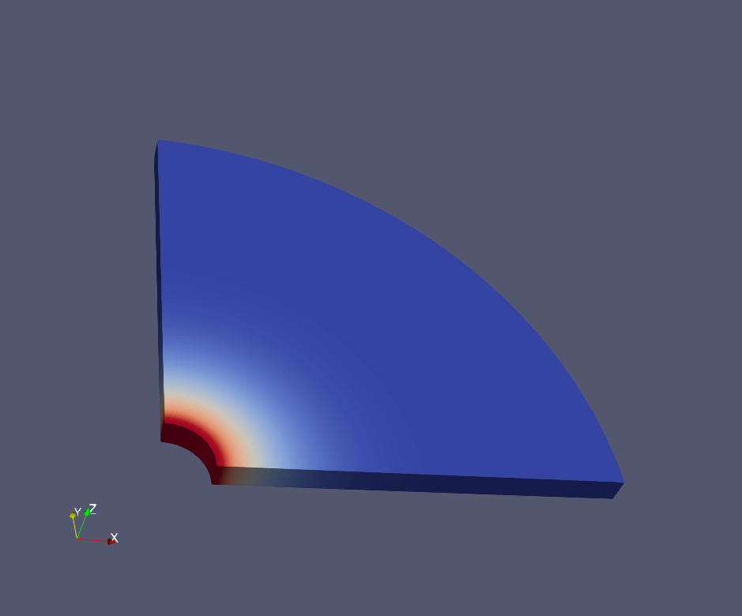

.. _AdvancedExamplePureThermalDiffusionWellbore:

####################################################
Pure Thermal Diffusion Around a Wellbore
####################################################

------------------------------------------------------------------
Problem description
------------------------------------------------------------------

This example uses the thermal single-phase flow solver to model a pure thermal diffusion problem around a wellbore. To mimic this specific problem, thermal convection and fluid flow are neglected by setting fluid pressure and fluid heat capacity to zero. With a uniform temperature applied on the inner surface of the wellbore, temperature field would radially diffuse as shown in the figure below:
  
.. _problemSketchRadialThermalDiffusionWellboreFig:

   Sketch of the radial thermal diffusion around a wellbore 

Analytical results of the temperature profile along the radial direction is given by `(Wang and Papamichos, 1994) <https://agupubs.onlinelibrary.wiley.com/doi/abs/10.1029/94WR01774>`__ :

.. math::
   T(r) = T_{in}\sqrt{\frac{R_{in}}{r}}erfc(\frac{r-R_{in}}{2\sqrt{c_{T}t}})

where :math:`r` is the radial coordinate, :math:`T_{in}` is the temperature applied on the surface of the wellbore at :math:`r = R_{in}`, :math:`c_{T}` is the thermal diffusion coefficient of rock, which is defined as the ratio between the thermal conductivity and the volumetric heat capacity of rock.

**Input file**

This benchmark example uses no external input file and everything required is
contained within two GEOS xml files that are located at:

.. code-block:: console

  inputFiles/singlePhaseFlow/thermalCompressible_2d_base.xml

and

.. code-block:: console

  inputFiles/singlePhaseFlow/thermalCompressible_2d_benchmark.xml

The corresponding integrated test is

.. code-block:: console

  inputFiles/singlePhaseFlow/thermalCompressible_2d_smoke.xml

In this example, we would focus our attention on the ``Constitutive`` and ``FieldSpecifications`` tags.

-----------------------------------------------------------
Constitutive
-----------------------------------------------------------

The volumetric heat capacity of the medium around the wellbore is defined in the ``SolidInternalEnergy`` XML block as  

.. literalinclude:: ../../../../../../../inputFiles/singlePhaseFlow/thermalCompressible_2d_base.xml
  :language: xml
  :start-after: <!-- SPHINX_SolidInternalEnergy -->
  :end-before: <!-- SPHINX_SolidInternalEnergyEnd -->

The thermal conductivity of the medium around the wellbore is defined in the ``SinglePhaseConstantThermalConductivity`` XML block as  

.. literalinclude:: ../../../../../../../inputFiles/singlePhaseFlow/thermalCompressible_2d_base.xml
  :language: xml
  :start-after: <!-- SPHINX_SinglePhaseConstantThermalConductivity -->
  :end-before: <!-- SPHINX_SinglePhaseConstantThermalConductivityEnd -->

The volumetric heat capacity of fluid is set to a negligible value to exclude thermal convection effect. It is defined in the ``ThermalCompressibleSinglePhaseFluid`` XML block as  

.. literalinclude:: ../../../../../../../inputFiles/singlePhaseFlow/thermalCompressible_2d_base.xml
  :language: xml
  :start-after: <!-- SPHINX_ThermalCompressibleSinglePhaseFluid -->
  :end-before: <!-- SPHINX_ThermalCompressibleSinglePhaseFluidEnd -->

--------------------------------------------------------------------   
FieldSpecifications
--------------------------------------------------------------------

The initial temperature, the imposed temperature at the curved wellbore surface as well as the far-field temperature are defined as Dirichlet face boundary conditions using ``faceManager`` as

.. literalinclude:: ../../../../../../../inputFiles/singlePhaseFlow/thermalCompressible_2d_base.xml
  :language: xml
  :start-after: <!-- SPHINX_FieldSpecificationImposedTemperature -->
  :end-before: <!-- SPHINX_FieldSpecificationImposedTemperatureEnd -->

Although a pure thermal diffusion problem is considered, it is also required to define specifications for fluid pressure, as thermal transfer is always coupled with fluid flow in GEOS. In this example, fluid pressure is set to zero everywhere to mimic a pure thermal diffusion problem as

.. literalinclude:: ../../../../../../../inputFiles/singlePhaseFlow/thermalCompressible_2d_base.xml
  :language: xml
  :start-after: <!-- SPHINX_FieldSpecificationImposedPressure -->
  :end-before: <!-- SPHINX_FieldSpecificationImposedPressureEnd -->

---------------------------------
Results and benchmark
---------------------------------

A good agreement between the GEOS results and analytical results is shown in the figure below:

.. plot:: docs/sphinx/advancedExamples/validationStudies/wellboreProblems/pureThermalDiffusion/pureThermalDiffusionAroundWellbore.py

------------------------------------------------------------------
To go further
------------------------------------------------------------------

**Feedback on this example**

This concludes the example of pure thermal diffusion problem around a wellbore.
For any feedback on this example, please submit a `GitHub issue on the project's GitHub page <https://github.com/GEOS-DEV/GEOS/issues>`_.
