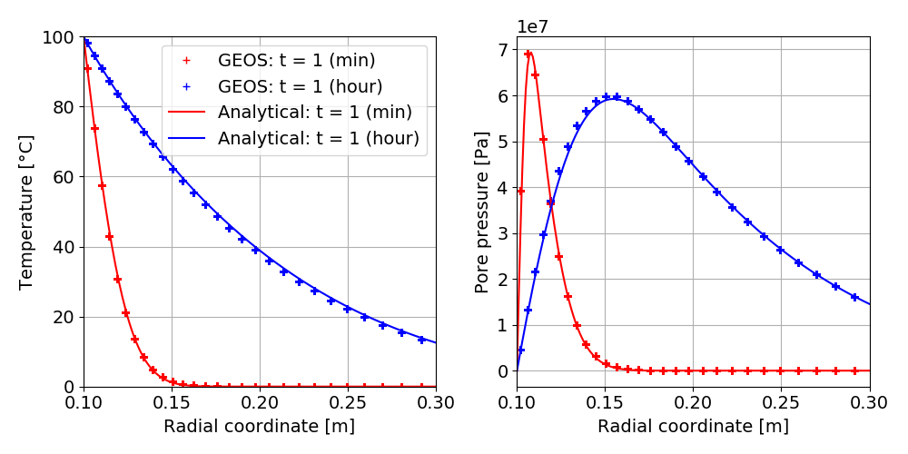
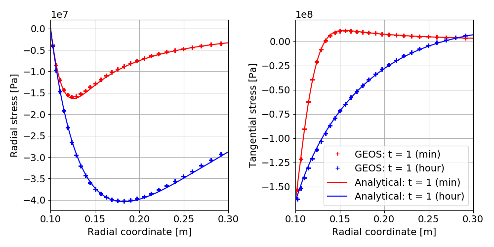

.. _AdvancedExampleThermoPoroElasticWellbore:

####################################################
ThermoPoroElastic Wellbore Problem
####################################################

------------------------------------------------------------------
Problem description
------------------------------------------------------------------

This example uses the thermal option of the ``SinglePhasePoromechanics`` solver to handle an open wellbore problem subjected to a uniform temperature change on its inner surface. Isotropic linear thermoporoelastic behavior is considered for the rock formation around the wellbore. Plane strain and axisymmetric conditions are assumed.

.. _problemSketchThermoPoroElasticWellboreFig:

   Sketch of a thermoporoelastic wellbore 

Analytical solutions to this problem were first derived by `(Wang and Papamichos 1994) <https://agupubs.onlinelibrary.wiley.com/doi/abs/10.1029/94WR01774>`__ using a one-way coupling simplification. They are also reformulated for the full coupling assumption in the book of `(Cheng 2016) <https://link.springer.com/book/10.1007/978-3-319-25202-5>`__. These solutions will be considered to validate GEOS results.

**Input file**

This benchmark example uses no external input files and everything required is
contained within two GEOS xml files that are located at:

.. code-block:: console

  inputFiles/wellbore/ThermoPoroElasticWellbore_base.xml

and

.. code-block:: console

  inputFiles/wellbore/ThermoPoroElasticWellbore_benchmark.xml

The corresponding integrated test is

.. code-block:: console

  inputFiles/wellbore/ThermoPoroElasticWellbore_smoke.xml

-----------------------------------------------------------
Geometry and mesh
-----------------------------------------------------------

The internal wellbore mesh generator ``InternalWellbore`` is employed to create the mesh of this wellbore problem. The radii of the open wellbore and the far-field boundary of the surrounding rock formation are defined by a vector ``radius``. In the tangent direction, ``theta`` angle is specified from 0 to 90 degrees to simulate the problem on a quarter of the wellbore geometry. The problem is under plane strain condition and therefore we only consider thermal diffusion along the radial direction within a single horizontal layer. The trajectory of the well is defined by ``trajectory``, which is vertical in this case. The ``autoSpaceRadialElems`` parameters allow for optimally increasing the element size from the near wellbore zone to the far-field one. 
 
.. literalinclude:: ../../../../../../../inputFiles/wellbore/ThermoPoroElasticWellbore_benchmark.xml
  :language: xml
  :start-after: <!-- SPHINX_WellboreMesh -->
  :end-before: <!-- SPHINX_WellboreMeshEnd -->

.. _meshThermoPoroElasticWellboreFig:

   An optimized mesh for the open wellbore.

-----------------------------------------------------------
Material properties
-----------------------------------------------------------

The bulk and shear drained elastic moduli of rock as well as its drained linear thermal expansion coefficient relating stress change to temperature variation are defined within the ``Constitutive`` tag as follows:
 
.. literalinclude:: ../../../../../../../inputFiles/wellbore/ThermoPoroElasticWellbore_base.xml
  :language: xml
  :start-after: <!-- SPHINX_ThermoElasticProperties -->
  :end-before: <!-- SPHINX_ThermoElasticPropertiesEnd -->

Here the solid density is also defined, but it is not used as the gravitational effect is ignored in this example. The porosity and the elastic bulk modulus :math:`K_{s}` of the solid skeleton are defined as:

.. literalinclude:: ../../../../../../../inputFiles/wellbore/ThermoPoroElasticWellbore_base.xml
  :language: xml
  :start-after: <!-- SPHINX_PoroElasticProperties -->
  :end-before: <!-- SPHINX_PoroElasticPropertiesEnd -->

The thermal conductivities and the volumetric heat capacities of rock are defined by following XML blocks:

.. literalinclude:: ../../../../../../../inputFiles/wellbore/ThermoPoroElasticWellbore_base.xml
  :language: xml
  :start-after: <!-- SPHINX_ThermalProperties -->
  :end-before: <!-- SPHINX_ThermalPropertiesEnd -->

and

.. literalinclude:: ../../../../../../../inputFiles/wellbore/ThermoPoroElasticWellbore_base.xml
  :language: xml
  :start-after: <!-- SPHINX_HeatCapacityProperties -->
  :end-before: <!-- SPHINX_HeatCapacityPropertiesEnd -->

The permeability of rock is defined by:

.. literalinclude:: ../../../../../../../inputFiles/wellbore/ThermoPoroElasticWellbore_base.xml
  :language: xml
  :start-after: <!-- SPHINX_PermeabilityProperties -->
  :end-before: <!-- SPHINX_PermeabilityPropertiesEnd -->

Fluid properties such as viscosity, thermal expansion coefficient, etc. are defined by the XML block below. A negligible volumetric heat capacity is defined for fluid to ignore the thermal convection effect. This way, only thermal transfer via the diffusion phenomenon is considered.

.. literalinclude:: ../../../../../../../inputFiles/wellbore/ThermoPoroElasticWellbore_base.xml
  :language: xml
  :start-after: <!-- SPHINX_FluidProperties -->
  :end-before: <!-- SPHINX_FluidPropertiesEnd -->

-----------------------------------------------------------
Boundary conditions
-----------------------------------------------------------

The mechanical boundary conditions are applied to ensure the axisymmetric plane strain conditions such as:

.. literalinclude:: ../../../../../../../inputFiles/wellbore/ThermoPoroElasticWellbore_base.xml
  :language: xml
  :start-after: <!-- SPHINX_PlaneStrainAxisymmetryBC -->
  :end-before: <!-- SPHINX_PlaneStrainAxisymmetryBCEnd -->

Besides, the far-field boundary is assumed to be fixed because the local changes on the wellbore must have negligible effect on the far-field boundary. 

.. literalinclude:: ../../../../../../../inputFiles/wellbore/ThermoPoroElasticWellbore_base.xml
  :language: xml
  :start-after: <!-- SPHINX_FixedFarFieldBC -->
  :end-before: <!-- SPHINX_FixedFarFieldBCEnd -->

The traction-free condition on the inner surface of the wellbore is defined by:

.. literalinclude:: ../../../../../../../inputFiles/wellbore/ThermoPoroElasticWellbore_base.xml
  :language: xml
  :start-after: <!-- SPHINX_ZeroInnerTractionBC -->
  :end-before: <!-- SPHINX_ZeroInnerTractionBCEnd -->

The initial temperature (that is also the far-field boundary temperature) and the temperature applied on the inner surface of the wellbore are defined as

.. literalinclude:: ../../../../../../../inputFiles/wellbore/ThermoPoroElasticWellbore_base.xml
  :language: xml
  :start-after: <!-- SPHINX_TemperatureBC -->
  :end-before: <!-- SPHINX_TemperatureBCEnd -->

It is important to remark that the initial effective stress of rock must be set with accordance to the initial temperature change: :math:`\sigma_{0} = 3K\alpha \delta T_{0}` where :math:`\sigma_{0}` is the initial effective principal stress, :math:`\delta T_{0}` is the initial temperature change, :math:`K` is the drained bulk modulus and :math:`\alpha` is the drained linear thermal expansion coefficient of the materials. In this example, the initial effective stresses are set to zero because the initial temperature change is set to zero.

.. literalinclude:: ../../../../../../../inputFiles/wellbore/ThermoPoroElasticWellbore_base.xml
  :language: xml
  :start-after: <!-- SPHINX_StressInit -->
  :end-before: <!-- SPHINX_StressInitEnd -->

The initial and boundary conditions for pore pressure are defined in the block below:

.. literalinclude:: ../../../../../../../inputFiles/wellbore/ThermoPoroElasticWellbore_base.xml
  :language: xml
  :start-after: <!-- SPHINX_PorePressureBC -->
  :end-before: <!-- SPHINX_PorePressureBCEnd -->

-----------------------------------------------------------
Collecting output data
-----------------------------------------------------------

It is convenient to collect data in hdf5 format that can be easily post-processed using Python. To collect the temperature field for all the time steps, the following XML blocks need to be defined:

.. literalinclude:: ../../../../../../../inputFiles/wellbore/ThermoPoroElasticWellbore_base.xml
  :language: xml
  :start-after: <!-- SPHINX_TemperatureCollection -->
  :end-before: <!-- SPHINX_TemperatureCollectionEnd -->

.. literalinclude:: ../../../../../../../inputFiles/wellbore/ThermoPoroElasticWellbore_base.xml
  :language: xml
  :start-after: <!-- SPHINX_TemperatureTimeHistory -->
  :end-before: <!-- SPHINX_TemperatureTimeHistoryEnd -->

Similarly, the following blocks are needed to collect the effective stress field across the domain:

.. literalinclude:: ../../../../../../../inputFiles/wellbore/ThermoPoroElasticWellbore_base.xml
  :language: xml
  :start-after: <!-- SPHINX_SolidStressCollection -->
  :end-before: <!-- SPHINX_SolidStressCollectionEnd -->

.. literalinclude:: ../../../../../../../inputFiles/wellbore/ThermoPoroElasticWellbore_base.xml
  :language: xml
  :start-after: <!-- SPHINX_SolidStressTimeHistory -->
  :end-before: <!-- SPHINX_SolidStressTimeHistoryEnd -->

The displacement field can be collected using ``nodeManager`` as follows

.. literalinclude:: ../../../../../../../inputFiles/wellbore/ThermoPoroElasticWellbore_base.xml
  :language: xml
  :start-after: <!-- SPHINX_DisplacementCollection -->
  :end-before: <!-- SPHINX_DisplacementCollectionEnd -->

.. literalinclude:: ../../../../../../../inputFiles/wellbore/ThermoPoroElasticWellbore_base.xml
  :language: xml
  :start-after: <!-- SPHINX_DisplacementTimeHistory -->
  :end-before: <!-- SPHINX_DisplacementTimeHistoryEnd -->

Also, periodic events are required to trigger the collection of this data during the entire simulation. For example, the periodic events for collecting the displacement field are defined as:

.. literalinclude:: ../../../../../../../inputFiles/wellbore/ThermoPoroElasticWellbore_benchmark.xml
  :language: xml
  :start-after: <!-- SPHINX_DisplacementPeriodicEvent -->
  :end-before: <!-- SPHINX_DisplacementPeriodicEventEnd -->

---------------------------------
Results and benchmark
---------------------------------

A good agreement between the GEOS results and analytical results for temperature and pore pressure distribution around the wellbore is shown in the figures below:

.. _problemThermoPoroElasticWellbore_Temperature_Pressure_Fig:

   Validation of temperature and pore pressure.

and the validation for the radial displacement around the cased wellbore is shown below:

.. _problemThermoPoroElasticWellbore_Displacement_Fig:

   Validation of the radial displacement.

The validations of the total radial and hoop stress (tangent stress) components computed by GEOS against reference results are shown in the figure below:

.. _problemThermoPoroElasticWellbore_Stress_Fig:

   Validation of the radial and tangent stresses.

------------------------------------------------------------------
To go further
------------------------------------------------------------------

**Feedback on this example**

This concludes the cased wellbore example.
For any feedback on this example, please submit a `GitHub issue on the project's GitHub page <https://github.com/GEOS-DEV/GEOS/issues>`_.
