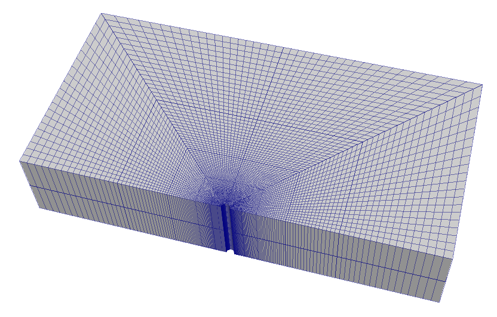
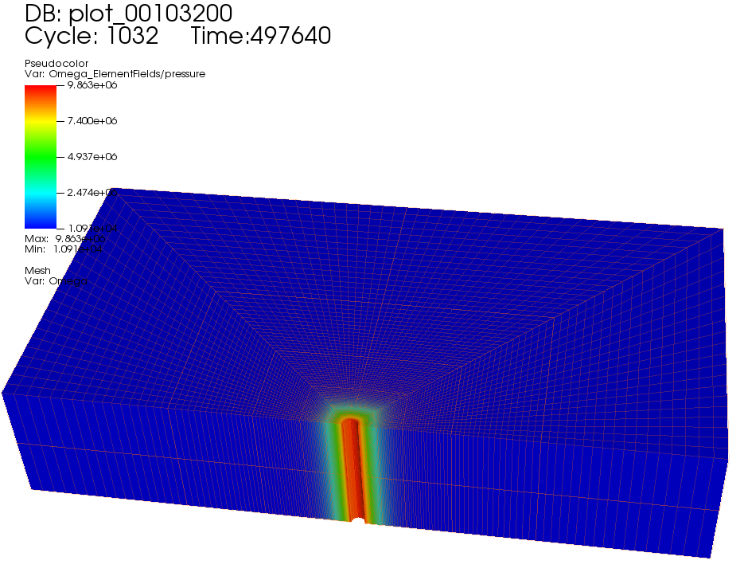
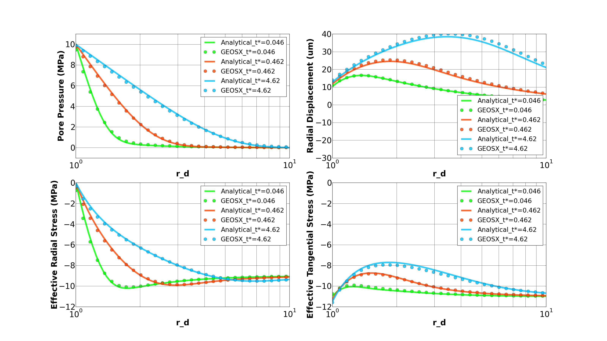
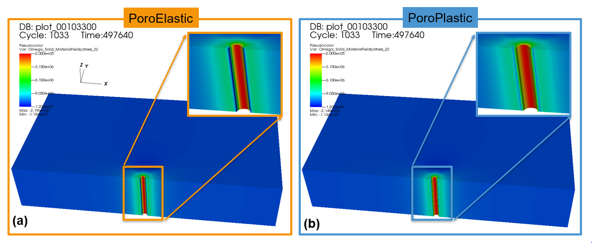
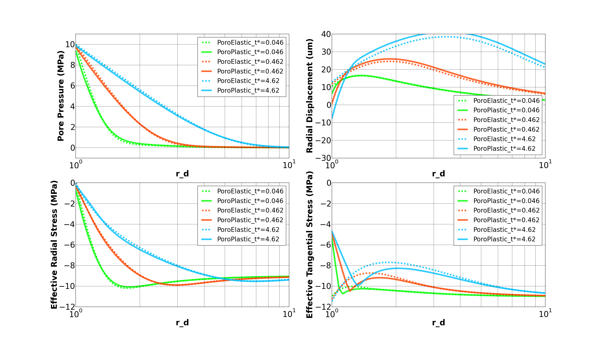

.. _ExampleVerticalPoroElastoPlasticWellbore:

####################################################
Vertical PoroElasto-Plastic Wellbore Problem
####################################################

**Context**

The main objective of this example is to demonstrate how to use the internal wellbore mesh generator and poromechanical solvers in GEOS to tackle wellbore problems in porous media. In this example, a poroplastic model is applied to find the solution of rock deformation within the vicinity of a vertical wellbore, considering elastoplastic deformation, fluid diffusion and poromechanical coupling effect. To do so, a single phase flow solver is fully coupled with a Lagrangian mechanics solver and the Extended Drucker-Prager model (see :ref:`DruckerPragerExtended`) is chosen as the material model for the solid domain. We first solve this problem with a poroelastic model and verify the modeling results with the corresponding analytical solutions. Then, the verified case is modified to test a poroplastic version, whose results are compared with the ones obtained from the poroelastic case to highlight the impact of plasticity in this specific problem.
 

**Objectives**

At the end of this example you will know:

  - how to construct meshes for wellbore problems with the internal wellbore mesh generator,
  - how to specify initial and boundary conditions, such as reservoir properties, in-situ stresses, mixed loading (mechanical and fluid) at wellbore wall and far-field constraints,
  - how to use multiple solvers in GEOS for predicting poroplastic deformations in the near wellbore region.

**Input file**

This example uses no external input files and everything required is
contained within a single GEOS input file. 

The xml input files for the test case with poroelasticity are located at:

.. code-block:: console
  
  inputFiles/poromechanics/PoroElasticWellbore_base.xml
  inputFiles/poromechanics/PoroElasticWellbore_benchmark.xml

The xml input files for the test case with poroplasticity are located at:

.. code-block:: console

  inputFiles/poromechanics/PoroDruckerPragerWellbore_base.xml
  inputFiles/poromechanics/PoroDruckerPragerWellbore_benchmark.xml

------------------------------------------------------------------
Description of the case
------------------------------------------------------------------

We simulate the wellbore problem subjected to anisotropic horizontal stress (:math:`\sigma_h` and :math:`\sigma_H`) and vertical stress (:math:`\sigma_v`), as shown below. This is a vertical wellbore, which is drilled in a porous medium. By changing the wellbore supporting pressure, the mechanical deformation of the reservoir rock will be induced and evolve with time, due to fluid diffusion and coupling effect. Considering inelastic constitutive behavior, the reservoir rock in the near wellbore region will experience elastoplastic deformation and a plastic zone will be developed and expand with time. To setup the base case, a poroelastic version is employed to find the poroelastic solutions of this wellbore problem, which are verified with the analytical solution `(Detournay and Cheng, 1993)  <https://www.sciencedirect.com/science/article/pii/B9780080406152500113>`__ from the literature. Following that, a poroplastic version is built and used to obtain the temporal and spatial solutions of pore pressure, displacement and stress fields around the wellbore, considering induced plastic deformation. 

.. _problemSketchVerticalPoroWellboreFig:
.. figure:: PoroDP_wellSketch.png
   :align: center
   :width: 500
   :figclass: align-center

   Sketch of the wellbore problem 

All inputs for this case are contained inside a single XML file.
In this example, we focus our attention on the ``Mesh`` tags, the ``Solver`` tags, the ``Constitutive`` tags, and the ``FieldSpecifications`` tags.

---------
Mesh 
---------

The following figure shows the generated mesh that is used for solving this wellbore problem

.. _problemMeshVerticalPoroWellboreFig:

   Generated mesh for the wellbore problem

Let us take a closer look at the geometry of this wellbore problem.
We use the internal mesh generator ``InternalWellbore`` to create a rock domain
(:math:`10\, m \, \times 5 \,  m \, \times 2 \, m`), with a wellbore of
initial radius equal to :math:`0.1` m.
Coordinates of ``trajectory`` defines the wellbore trajectory, which represents a perfect vertical well in this example. 
By turning on ``autoSpaceRadialElems="{ 1 }"``, the internal mesh generator automatically sets number and spacing of elements in the radial direction, which overrides the values of ``nr``. 
With ``useCartesianOuterBoundary="0"``, a Cartesian aligned outer boundary on the outer block is enforced.
In this way, a structured three-dimensional mesh is created with 100 x 80 x 2 elements in the radial, tangential and z directions, respectively. All the elements are eight-node hexahedral elements (``C3D8``) and refinement is performed
to conform with the wellbore geometry. This mesh is defined as a cell block with the name
``cb1``.

.. literalinclude:: ../../../../../../../inputFiles/poromechanics/PoroElasticWellbore_benchmark.xml
    :language: xml
    :start-after: <!-- SPHINX_WELLBORE_MESH -->
    :end-before: <!-- SPHINX_WELLBORE_MESH_END -->

--------------------------
Solid mechanics solver
--------------------------

GEOS is a multi-physics platform. Different combinations of
physics solvers available in the code can be applied
in different regions of the domain and be functional at different stages of the simulation.
The ``Solvers`` tag in the XML file is used to list and parameterize these solvers.

To specify a coupling between two different solvers, we define and characterize each single-physics solver separately.
Then, we customize a *coupling solver* between these single-physics
solvers as an additional solver.
This approach allows for generality and flexibility in constructing multi-physics solvers.
The order of specifying these solvers is not restricted in GEOS.
Note that end-users should give each single-physics solver a meaningful and distinct name, as GEOS will recognize these single-physics solvers based on their customized names and create user-expected coupling.

As demonstrated in this example, to setup a poromechanical coupling, we need to define three different solvers in the XML file:

- the mechanics solver, a solver of type ``SolidMechanics_LagrangianFEM`` called here ``mechanicsSolver`` (more information here: :ref:`SolidMechanicsLagrangianFEM`),

.. literalinclude:: ../../../../../../../inputFiles/poromechanics/PoroElasticWellbore_base.xml
  :language: xml
  :start-after: <!-- SPHINX_WELLBORE_MECHANICALSOLVER -->
  :end-before: <!-- SPHINX_WELLBORE_MECHANICALSOLVER_END -->

- the single-phase flow solver, a solver of type ``SinglePhaseFVM`` called here ``SinglePhaseFlowSolver`` (more information on these solvers at :ref:`SinglePhaseFlow`),

.. literalinclude:: ../../../../../../../inputFiles/poromechanics/PoroElasticWellbore_base.xml
  :language: xml
  :start-after: <!-- SPHINX_WELLBORE_SINGLEPHASEFVM -->
  :end-before: <!-- SPHINX_WELLBORE_SINGLEPHASEFVM_END -->

- the coupling solver (``SinglePhasePoromechanics``) that will bind the two single-physics solvers above, which is named as ``PoromechanicsSolver`` (more information at :ref:`PoroelasticSolver`).

.. literalinclude:: ../../../../../../../inputFiles/poromechanics/PoroElasticWellbore_base.xml
  :language: xml
  :start-after: <!-- SPHINX_WELLBORE_POROMECHANICSSOLVER -->
  :end-before: <!-- SPHINX_WELLBORE_POROMECHANICSSOLVER_END -->

The two single-physics solvers are parameterized as explained
in their corresponding documents. 

In this example, let us focus on the coupling solver.
This solver (``PoromechanicsSolver``) uses a set of attributes that specifically describe the coupling process within a poromechanical framework.
For instance, we must point this solver to the designated fluid solver (here: ``SinglePhaseFlowSolver``) and solid solver (here: ``mechanicsSolver``).
These solvers are forced to interact through the ``porousMaterialNames="{porousRock}"`` with all the constitutive models. We specify the discretization method (``FE1``, defined in the ``NumericalMethods`` section), and the target regions (here, we only have one, ``Omega``).
More parameters are required to characterize a coupling procedure (more information at :ref:`PoroelasticSolver`). In this way, the two single-physics solvers will be simultaneously called and executed for solving the wellbore problem here.

------------------------------------------------
Discretization methods for multiphysics solvers
------------------------------------------------

Numerical methods in multiphysics settings are similar to single physics numerical methods. In this problem, we use finite volume for flow and finite elements for solid mechanics. All necessary parameters for these methods are defined in the ``NumericalMethods`` section.

As mentioned before, the coupling solver and the solid mechanics solver require the specification of a discretization method called ``FE1``.
In GEOS, this discretization method represents a finite element method
using linear basis functions and Gaussian quadrature rules.
For more information on defining finite elements numerical schemes,
please see the dedicated :ref:`FiniteElement` section.

The finite volume method requires the specification of a discretization scheme.
Here, we use a two-point flux approximation scheme (``singlePhaseTPFA``), as described in the dedicated documentation (found here: :ref:`FiniteVolume`).

.. literalinclude:: ../../../../../../../inputFiles/poromechanics/PoroElasticWellbore_base.xml
  :language: xml
  :start-after: <!-- SPHINX_WELLBORE_NUMERICAL -->
  :end-before: <!-- SPHINX_WELLBORE_NUMERICAL_END -->

--------------------
Constitutive laws
--------------------

For this test problem, the solid and fluid materials are named as ``rock`` and ``water`` respectively, whose mechanical properties are specified in the ``Constitutive`` section. In this example, different material models, linear elastic isotropic model (see :ref:`ElasticIsotropic`) and Extended Drucker-Prager model (see :ref:`DruckerPragerExtended`), are used to solve the mechanical deformation, which is the only difference between the poroelastic and poroplastic cases in this example.

For the poroelastic case, ``PorousElasticIsotropic`` model is used to describe the linear elastic isotropic response of ``rock`` to loading. And the single-phase fluid model ``CompressibleSinglePhaseFluid`` is selected to simulate the flow of ``water`` upon injection:

.. literalinclude:: ../../../../../../../inputFiles/poromechanics/PoroElasticWellbore_base.xml
    :language: xml
    :start-after: <!-- SPHINX_WELLBORE_MATERIAL -->
    :end-before: <!-- SPHINX_WELLBORE_MATERIAL_END -->

For the poroplastic case, ``PorousExtendedDruckerPrager`` model is used to simulate the elastoplastic behavior of ``rock``. And the single-phase fluid model ``CompressibleSinglePhaseFluid`` is employed to handle the storage and flow of ``water``: 

.. literalinclude:: ../../../../../../../inputFiles/poromechanics/PoroDruckerPragerWellbore_base.xml
    :language: xml
    :start-after: <!-- SPHINX_WELLBORE_MATERIAL -->
    :end-before: <!-- SPHINX_WELLBORE_MATERIAL_END -->

As for the material parameters, ``defaultInitialFrictionAngle``, ``defaultResidualFrictionAngle`` and ``defaultCohesion`` denote the initial friction angle, the residual friction angle, and cohesion, respectively, as defined by the Mohr-Coulomb failure envelope.
As the residual friction angle ``defaultResidualFrictionAngle`` is larger than the initial one ``defaultInitialFrictionAngle``, a strain hardening model is automatically chosen, whose hardening rate is given as ``defaultHardening="0.01"``. 
If the residual friction angle is set to be less than the initial one, strain weakening will take place. 
``defaultDilationRatio="1.0"`` corresponds to an associated flow rule.
If using an incompressible fluid, the user can lower the fluid compressibility ``compressibility`` to 0.
The constitutive parameters such as the density, the bulk modulus, and the shear modulus are specified in the International System of Units. A stress-dependent porosity model ``rockPorosity`` and constant permeability ``rockPerm`` model are defined in this section.

-----------------------------------
Initial and boundary conditions
-----------------------------------

The next step is to specify fields, including:

  - The initial value (the in-situ stresses and pore pressure have to be initialized)
  - The boundary conditions (traction and fluid loading at the wellbore wall and constraints of the outer boundaries have to be set)

In this example, we need to specify anisotropic horizontal stress (:math:`\sigma_h` = -9.0 MPa and :math:`\sigma_H` = -11.0 MPa) and vertical stress (:math:`\sigma_v` = -12.0 MPa). 
A compressive traction (``InnerMechanicalLoad``) :math:`P_w` = -10 MPa and fluid loading (``InnerFluidLoad``) :math:`P_f` = 10 MPa are applied at the wellbore wall ``rneg``.
The remaining parts of the outer boundaries are subjected to roller constraints.  
These boundary conditions are set up through the ``FieldSpecifications`` section.

.. literalinclude:: ../../../../../../../inputFiles/poromechanics/PoroElasticWellbore_base.xml
    :language: xml
    :start-after: <!-- SPHINX_WELLBORE_BC -->
    :end-before: <!-- SPHINX_WELLBORE_BC_END -->

With ``tractionType="normal"``, traction is applied to the wellbore wall ``rneg`` as a pressure specified from the product of scale ``scale="-10.0e6"`` and the outward face normal. 
A table function ``timeFunction`` is used to define the time-dependent loading. 
The ``coordinates`` and ``values`` form a time-magnitude
pair for the loading time history. In this case, the loading magnitude is given as: 

.. literalinclude:: ../../../../../../../inputFiles/poromechanics/PoroElasticWellbore_base.xml
    :language: xml
    :start-after: <!-- SPHINX_WELLBORE_TABLE -->
    :end-before: <!-- SPHINX_WELLBORE_TABLE_END -->

You may note :

 - All initial value fields must have ``initialCondition`` field set to ``1``;
 - The ``setName`` field points to the previously defined box to apply the fields;
 - ``nodeManager`` and ``faceManager`` in the ``objectPath`` indicate that the boundary conditions are applied to the element nodes and faces, respectively;
 - ``fieldName`` is the name of the field registered in GEOS;
 - Component ``0``, ``1``, and ``2`` refer to the x, y, and z direction, respectively;
 - And the non-zero values given by ``scale`` indicate the magnitude of the loading;
 - Some shorthands, such as ``xneg`` and ``xpos``, are used as the locations where the boundary conditions are applied in the computational domain. For instance, ``xneg`` means the portion of the computational domain located at the left-most in the x-axis, while ``xpos`` refers to the portion located at the right-most area in the x-axis. Similar shorthands include ``ypos``, ``yneg``, ``zpos``, and ``zneg``;
 - The mud pressure loading has a negative value due to the negative sign convention for compressive stress in GEOS. 

 
The parameters used in the simulation are summarized in the following table, which are specified in the
``Constitutive`` and ``FieldSpecifications`` sections.

+------------------+-------------------------+------------------+--------------------+
| Symbol           | Parameter               | Unit             | Value              |
+==================+=========================+==================+====================+
| :math:`K`        | Bulk Modulus            | [GPa]            | 11.11              |
+------------------+-------------------------+------------------+--------------------+
| :math:`G`        | Shear Modulus           | [GPa]            | 8.33               |
+------------------+-------------------------+------------------+--------------------+
| :math:`C`        | Cohesion                | [MPa]            | 1.0                |
+------------------+-------------------------+------------------+--------------------+
| :math:`\phi_i`   | Initial Friction Angle  | [degree]         | 15.27              |
+------------------+-------------------------+------------------+--------------------+
| :math:`\phi_r`   | Residual Friction Angle | [degree]         | 23.05              |
+------------------+-------------------------+------------------+--------------------+
| :math:`c_h`      | Hardening Rate          | [-]              | 0.01               |
+------------------+-------------------------+------------------+--------------------+
| :math:`\sigma_h` | Min Horizontal Stress   | [MPa]            | -9.0               |
+------------------+-------------------------+------------------+--------------------+
| :math:`\sigma_H` | Max Horizontal Stress   | [MPa]            | -11.0              |
+------------------+-------------------------+------------------+--------------------+
| :math:`\sigma_v` | Vertical Stress         | [MPa]            | -12.0              |
+------------------+-------------------------+------------------+--------------------+
| :math:`a_0`      | Initial Well Radius     | [m]              | 0.1                |
+------------------+-------------------------+------------------+--------------------+
| :math:`P_w`      | Traction at Well        | [MPa]            | -10.0              |
+------------------+-------------------------+------------------+--------------------+
| :math:`P_f`      | Fluid Pressure at Well  | [MPa]            | 10.0               |
+------------------+-------------------------+------------------+--------------------+
| :math:`\rho_f`   | Fluid Density           | [kg/m\ :sup:`3`] | 1000.0             |
+------------------+-------------------------+------------------+--------------------+
| :math:`\mu`      | Fluid Viscosity         | [Pa s]           | 0.001              |
+------------------+-------------------------+------------------+--------------------+
| :math:`c_f`      | Fluid Compressibility   | [Pa\ :sup:`-1`]  | 2.09*10\ :sup:`-10`|
+------------------+-------------------------+------------------+--------------------+
| :math:`\kappa`   | Matrix Permeability     | [m\ :sup:`2`]    | 1.0*10\ :sup:`-20` |
+------------------+-------------------------+------------------+--------------------+
| :math:`\phi`     | Porosity                | [-]              | 0.3                |
+------------------+-------------------------+------------------+--------------------+

---------------------
Inspecting results
---------------------

As defined in the ``Events`` section, we run this simulation for 497640 seconds. In the above examples, we requested silo-format output files. We can therefore import these into VisIt and use python scripts to visualize the outcome. Please note that a non-dimensional time is used in the analytical solution, and the end time here leads to a non-dimensional end time of t* = 4.62. 

Using the poroelastic solver, below figure shows the prediction of pore pressure distribution upon fluid injection.

.. _problemVerificationVerticalPoroWellboreFig1:

   Simulation result of pore pressure distribution

For the above poroelastic example, an analytical solution `(Detournay and Cheng, 1993)  <https://www.sciencedirect.com/science/article/pii/B9780080406152500113>`__ is hereby employed to verify the accuracy of the numerical results. Following figure shows the comparisons between the numerical predictions (marks) and the corresponding analytical solutions (solid curves) with respect to the distributions of pore pressure, radial displacement, effective radial and tangential stresses along the minimum horizontal stress direction (x-axis). One can observe that GEOS results correlate very well with the analytical solutions for the poroelastic case. 

.. _problemVerificationVerticalPoroWellboreFig2:

   Comparing GEOS results with analytical solutions

For the same 3D wellbore problem, the poroplastic case is thereafter tested and compared with the poroelastic one. The figure below shows the distribution of :math:`\sigma_{yy}` in the near wellbore region for both cases. As expected, a relaxation of the tangential stress along the direction of minimum horizontal stress is detected, which can be attributed to the plastic response of the rock.

.. _problemVerificationVerticalPoroWellboreFig3:

   Simulation result of Syy: PoroElastic vs. PoroPlastic

By using python scripts, we can extract the simulation results along any direction and provide detailed comparisons between different cases. Here, the pore pressure, radial displacement, radial and tangential effective stresses along the direction of minimum horizontal stress are obtained at different time steps and plotted against the corresponding ones of the poroelastic case. Because of fluid diffusion and coupling effect, following figure shows that these solutions evolve with time for both cases. As mentioned above, a plastic zone is developed in the vicinity of the wellbore, due to stress concentration. As for the far field region, these two cases become almost identical, with the rock deformation governed by poroelasticity.    

.. _problemVerificationVerticalPoroWellboreFig4:

   Comparing the PoroPlastic case with the PoroElastic case at different times

 

------------------------------------------------------------------
To go further
------------------------------------------------------------------

**Feedback on this example**

This concludes the example on PoroPlasticity Model for Wellbore Problems.
For any feedback on this example, please submit a `GitHub issue on the project's GitHub page <https://github.com/GEOS-DEV/GEOS/issues>`_.

**For more details**

  - More on plasticity models, please see :ref:`DruckerPragerExtended`.
  - More on multiphysics solvers, please see :ref:`PoroelasticSolver`.

