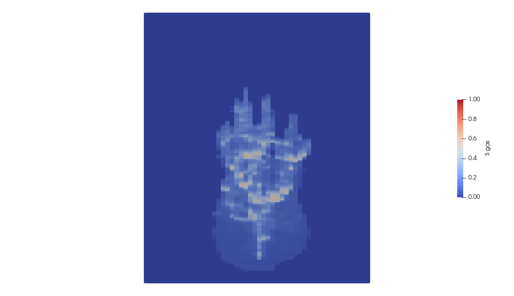

.. _TutorialCO2FieldCase:

##################################################################
CO :sub:`2` Injection
##################################################################

**Context**

In this example, we show how to set up a multiphase simulation of CO :sub:`2` injection. 

**Objectives**

At the end of this example you will know:

 - how to set up a CO :sub:`2` injection scenario with a well,
 - how to run a case using MPI-parallelism.

   
**Input file**

The XML file for this test case is located at :

.. code-block:: console

  inputFiles/compositionalMultiphaseWell/simpleCo2InjTutorial_base.xml

.. code-block:: console

  inputFiles/compositionalMultiphaseWell/simpleCo2InjTutorial_smoke.xml

This mesh is a simple internally generated regular grid (50 x 1 x 150).
A single CO :sub:`2` injection well is at the center of the reservoir.

The XML file considered here follows the typical structure of the GEOS input files:

 #. :ref:`Solver <Solver_tag_co2_field_case>`
 #. :ref:`Mesh <Mesh_tag_co2_field_case>`
 #. :ref:`Events <Events_tag_co2_field_case>`
 #. :ref:`NumericalMethods <NumericalMethods_tag_co2_field_case>`
 #. :ref:`ElementRegions <ElementRegions_tag_co2_field_case>`
 #. :ref:`Constitutive <Constitutive_tag_co2_field_case>`
 #. :ref:`FieldSpecifications <FieldSpecifications_tag_co2_field_case>`
 #. :ref:`Outputs <Outputs_tag_co2_field_case>`
 #. :ref:`Tasks <Tasks_tag_co2_field_case>`    

.. _Solver_tag_co2_field_case:

--------------------------------
Multiphase flow and well solvers
--------------------------------

Let us inspect the **Solver** XML tags.
They consist of three blocks **CompositionalMultiphaseFVM**, **CompositionalMultiphaseWell** and **CompositionalMultiphaseReservoir**, which are respectively handling the solution from multiphase flow in the reservoir, multiphase flow in the wells, and coupling between those two parts.

.. literalinclude:: ../../../../../inputFiles/compositionalMultiphaseWell/simpleCo2InjTutorial_base.xml
  :language: xml
  :start-after: <!-- SPHINX_FIELD_CASE_Co2_SOLVER -->
  :end-before: <!-- SPHINX_FIELD_CASE_Co2_SOLVER_END -->

In the **CompositionalMultiphaseFVM** (:ref:`CompositionalMultiphaseFlow`), a classical multiphase compositional solver with a TPFA discretization is described.

The **CompositionalMultiphaseWell** (:ref:`CompositionalMultiphaseWell`)  consists of wellbore specifications (see :ref:`TutorialDeadOilEgg` for detailed example). As its reservoir counterpart, it includes references to fluid and relative permeability models, but also defines a  **WellControls** sub-tag.
This sub-tag specifies the CO :sub:`2` injector control mode: the well is initially rate-controlled, with a rate specified in ``targetTotalRate`` and a maximum pressure specified in ``targetBHP``. The injector-specific attribute, ``injectionStream``, describes the composition of the injected mixture (here, pure CO :sub:`2`).

The **CompositionalMultiphaseReservoir** coupling section describes the binding between those two previous elements (see :ref:`TutorialPoroelasticity` for detailed example on coupling physics in GEOS). In addition to being bound to the previously described blocks through ``flowSolverName`` and ``wellSolverName`` sub-tags, it contains the ``initialDt`` starting time-step size value and defines the **NonlinearSolverParameters** and **LinearSolverParameters** that are used to control Newton-loop and linear solver behaviors (see :ref:`LinearSolvers` for a detailed description of linear solver attributes). 

.. note::
   To use the linear solver options of this example, you need to ensure that GEOS is configured to use the Hypre linear solver package.
   

.. _Mesh_tag_co2_field_case:

----------------------
Mesh and well geometry
----------------------

In this example, the **Mesh** tag is used to generate the reservoir mesh internally (:ref:`TutorialSinglePhaseFlowWithInternalMesh`). The internal generation of well is defined with the **InternalWell** sub-tag. Apart from the ``name`` identifier attribute and their ``wellRegionName`` (:ref:`ElementRegions <ElementRegions_tag_co2_field_case>`) and ``wellControlsName`` (:ref:`Solver <Solver_tag_co2_field_case>`) binding attributes, ``polylineNodeCoords`` and ``polylineSegmentConn`` attributes are used to define the path of the wellbore and connections between its nodes. The ``numElementsPerSegment`` discretizes the wellbore segments while the ``radius`` attribute specifies the wellbore radius (:ref:`TutorialDeadOilEgg` for details on wells). Once the wellbore is defined and discretized, the position of **Perforations** is defined using the linear distance from the head of the wellbore (``distanceFromHead``).

.. literalinclude:: ../../../../../inputFiles/compositionalMultiphaseWell/simpleCo2InjTutorial_smoke.xml
  :language: xml
  :start-after: <!-- SPHINX_FIELD_CASE_Co2_MESH -->
  :end-before: <!-- SPHINX_FIELD_CASE_Co2_MESH_END -->

.. note::
        It is the responsibility of the user to make sure that there is a perforation in the bottom cell of the well mesh, otherwise an error will be thrown and the simulation will terminate.

.. _Events_tag_co2_field_case:

--------
Events
--------
        
The solver is applied as a periodic event whose target is referred to as ``coupledFlowAndWells`` nametag.
Using the ``maxEventDt`` attribute, we specify a max time step size of 5 x :math:`10^6` seconds.

The output event triggers a VTK output  every :math:`10^7` seconds, constraining the solver schedule to match exactly these dates.
The output path to data is specified as a ``target`` of this **PeriodicEvent**.

Another periodic event is defined under the name ``restarts``.
It consists of saved checkpoints every 5 x :math:`10^7` seconds, whose physical output folder name is defined under the **Output** tag.

Finally, the time history collection and output events are used to trigger the mechanisms involved in the generation of a time series of well pressure (see the procedure outlined in :ref:`TasksManager`, and the example in :ref:`TutorialDeadOilEgg`).

.. literalinclude:: ../../../../../inputFiles/compositionalMultiphaseWell/simpleCo2InjTutorial_smoke.xml
  :language: xml
  :start-after: <!-- SPHINX_FIELD_CASE_Co2_EVENTS -->
  :end-before: <!-- SPHINX_FIELD_CASE_Co2_EVENTS_END -->

.. _NumericalMethods_tag_co2_field_case:

-----------------
Numerical methods
-----------------

The **TwoPointFluxApproximation** is chosen for the fluid equation discretization. The tag specifies:

- A primary field to solve for as ``fieldName``. For a flow problem, this field is pressure. 
- A set of target regions in ``targetRegions``. 
- A ``coefficientName`` pointing to the field used for TPFA transmissibilities construction.
- A ``coefficientModelNames`` used to specify the permeability constitutive model(s).

.. literalinclude:: ../../../../../inputFiles/compositionalMultiphaseWell/simpleCo2InjTutorial_base.xml
  :language: xml
  :start-after: <!-- SPHINX_FIELD_CASE_Co2_NUMERICAL -->
  :end-before: <!-- SPHINX_FIELD_CASE_Co2_NUMERICAL_END -->

.. _ElementRegions_tag_co2_field_case:

---------------
Element regions
---------------

We define a **CellElementRegion** pointing to the cell block defining the reservoir mesh, and a **WellElementRegion** for the well.
The two regions contain a list of constitutive model names.

.. literalinclude:: ../../../../../inputFiles/compositionalMultiphaseWell/simpleCo2InjTutorial_base.xml
  :language: xml
  :start-after: <!-- SPHINX_FIELD_CASE_Co2_REGION -->
  :end-before: <!-- SPHINX_FIELD_CASE_Co2_REGION_END -->

.. _Constitutive_tag_co2_field_case:

-----------------
Constitutive laws
-----------------

Under the **Constitutive** tag, four items can be found:

- **CO2BrinePhillipsFluid** : this tag defines phase names, component molar weights, and fluid behaviors such as CO :sub:`2` solubility in brine and viscosity/density dependencies on pressure and temperature. 
- **PressurePorosity** : this tag contains all the data needed to model rock compressibility.
- **BrooksCoreyRelativePermeability** : this tag defines the relative permeability model for each phase, its end-point values, residual volume fractions (saturations), and the Corey exponents.
- **ConstantPermeability** : this tag defines the permeability model that is set to a simple constant diagonal tensor, whose values are defined in ``permeabilityComponent``. Note that these values will be overwritten by the permeability field imported in **FieldSpecifications**.

.. literalinclude:: ../../../../../inputFiles/compositionalMultiphaseWell/simpleCo2InjTutorial_base.xml
  :language: xml
  :start-after: <!-- SPHINX_FIELD_CASE_Co2_CONSTITUTIVE -->
  :end-before: <!-- SPHINX_FIELD_CASE_Co2_CONSTITUTIVE_END -->

The PVT data specified by **CO2BrinePhillipsFluid** is set to model the behavior of the CO :sub:`2`-brine system as a function of pressure, temperature, and salinity.
We currently rely on a two-phase, two-component (CO :sub:`2` and H :sub:`2` O) model in which salinity is a constant parameter in space and in time.
The model is described in detail in  :ref:`CO2-EOS`.
The model definition requires three text files:

In *co2flash.txt*, we define the CO :sub:`2` solubility model used to compute the amount of CO :sub:`2` dissolved in the brine phase as a function of pressure (in Pascal), temperature (in Kelvin), and salinity (in units of molality):

.. code::

   FlashModel CO2Solubility  1e6 1.5e7 5e4 367.15 369.15 1 0

The first keyword is an identifier for the model type (here, a flash model). It is followed by the model name. Then, the lower, upper, and step increment values for pressure and temperature ranges are specified.
The trailing 0 defines a zero-salinity in the model. 
Note that the water component is not allowed to evaporate into the CO :sub:`2` -rich phase.

The *pvtgas.txt* and *pvtliquid.txt* files define the models used to compute the density and viscosity of the two phases, as follows:

.. code:: 

        DensityFun SpanWagnerCO2Density 1.0e5 7.5e7 1e5 285.15 395.15 5
        ViscosityFun FenghourCO2Viscosity 1.0e5 7.5e7 1e5 285.15 395.15 5 

.. code::
  
        DensityFun PhillipsBrineDensity 1.0e5 7.5e7 1e5 285.15 395.15 5 0
        ViscosityFun PhillipsBrineViscosity 0

In these files, the first keyword of each line is an identifier for the model type (either a density or a viscosity model).
It is followed by the model name.
Then, the lower, upper, and step increment values for pressure and temperature ranges are specified.
The trailing 0 for ``PhillipsBrineDensity`` and ``PhillipsBrineViscosity`` entry is the salinity of the brine, set to zero.

.. note::
   It is the responsibility of the user to make sure that the pressure and temperature values encountered in the simulation (in the reservoir and in the well) are within the bounds specified in the PVT files. GEOS will not throw an error if a value outside these bounds is encountered, but the (nonlinear) behavior of the simulation and the quality of the results will likely be negatively impacted.  

.. _FieldSpecifications_tag_co2_field_case:

----------------------
Property specification
----------------------

The **FieldSpecifications** tag is used to declare fields such as directional permeability, reference porosity, initial pressure, and compositions.
Here, these fields are homogeneous, except for the permeability field that is taken as an heterogeneous log-normally distributed field and specified in **Functions** as in :ref:`TutorialFieldCase`.

.. literalinclude:: ../../../../../inputFiles/compositionalMultiphaseWell/simpleCo2InjTutorial_base.xml
  :language: xml
  :start-after: <!-- SPHINX_FIELD_CASE_Co2_FIELD -->
  :end-before: <!-- SPHINX_FIELD_CASE_Co2_FIELD_END -->

.. note::
        In this case, we are using the same permeability field (*perm.geos*) for all the directions. Note also that
        the ``fieldName`` values are set to *rockPerm_permeability* to access the permeability field handled as
        a **Constitutive** law. These permeability values will overwrite the values already set in the **Constitutive** block. 

.. _Outputs_tag_co2_field_case:

.. warning::
  This XML file example does not take into account elevation when imposing the intial pressure with ``initialPressure``. 
  Consider using a "HydrostraticEquilibrium" for a closer answer to modeled physical processes.

------
Output
------

The **Outputs** XML tag is used to write visualization, restart, and time history files.

Here, we write visualization files in a format natively readable by Paraview under the tag **VTK**.
A **Restart** tag is also be specified. In conjunction with a **PeriodicEvent**,
a restart file allows to resume computations from a set of checkpoints in time. 
Finally, we require an output of the well pressure history using the **TimeHistory** tag. 

.. literalinclude:: ../../../../../inputFiles/compositionalMultiphaseWell/simpleCo2InjTutorial_base.xml
  :language: xml
  :start-after: <!-- SPHINX_FIELD_CASE_Co2_OUTPUT -->
  :end-before: <!-- SPHINX_FIELD_CASE_Co2_OUTPUT_END -->

.. _Tasks_tag_co2_field_case:

-----
Tasks
-----

In the **Events** block, we have defined an event requesting that a task periodically collects the pressure at the well.
This task is defined here, in the **PackCollection** XML sub-block of the **Tasks** block.
The task contains the path to the object on which the field to collect is registered (here, a ``WellElementSubRegion``) and the name of the field (here, ``pressure``).
The details of the history collection mechanism can be found in :ref:`TasksManager`. 

.. literalinclude:: ../../../../../inputFiles/compositionalMultiphaseWell/simpleCo2InjTutorial_base.xml
  :language: xml
  :start-after: <!-- SPHINX_FIELD_CASE_Co2_TASKS -->
  :end-before: <!-- SPHINX_FIELD_CASE_Co2_TASKS_END -->

------------------------------------
Running GEOS
------------------------------------

The simulation can be launched with 4 cores using MPI-parallelism:

.. code-block:: console

  mpirun -np 4 geosx -i simpleCo2InjTutorial_smoke.xml -x 1 -y 1 -z 4

A restart from a checkpoint file `simpleCo2InjTutorial_restart_000000024.root` is always available thanks to the following command line :

.. code-block:: console

  mpirun -np 4 geosx -i simpleCo2InjTutorial_smoke.xml -r simpleCo2InjTutorial_restart_000000024 -x 1 -y 1 -z 4

The output then shows the loading of HDF5 restart files by each core. 

.. code-block:: console

        Loading restart file simpleCo2InjTutorial_restart_000000024
        Rank 0: rankFilePattern = simpleCo2InjTutorial_restart_000000024/rank_%07d.hdf5
        Rank 0: Reading in restart file at simpleCo2InjTutorial_restart_000000024/rank_0000000.hdf5
        Rank 1: Reading in restart file at simpleCo2InjTutorial_restart_000000024/rank_0000001.hdf5
        Rank 3: Reading in restart file at simpleCo2InjTutorial_restart_000000024/rank_0000003.hdf5
        Rank 2: Reading in restart file at simpleCo2InjTutorial_restart_000000024/rank_0000002.hdf5

and the simulation restarts from this point in time. 	

-------------
Visualization
-------------

Using Paraview, we can observe the CO :sub:`2` plume moving upward under buoyancy effects and
forming a gas cap at the top of the domain,

|pic1| |pic2| |pic3|

The heterogeneous values of the log permeability field can also be visualized in Paraview as shown below:

------------------------------------
To go further
------------------------------------

**Feedback on this example**

This concludes the CO :sub:`2` injection field case example.
For any feedback on this example, please submit a `GitHub issue on the project's GitHub page <https://github.com/GEOS-DEV/GEOS/issues>`_.

**For more details**

  - A complete description of the reservoir flow solver is found here: :ref:`CompositionalMultiphaseFlow`.
  - The well solver is described at :ref:`CompositionalMultiphaseWell`. 
  - The available fluid constitutive models are listed at :ref:`FluidModels`.

