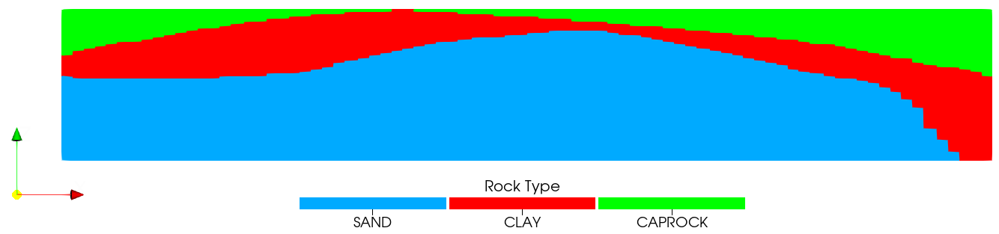

.. _ExampleCO2DepletedReservoir:

##################################################################
CO2 Injection into a Depleted Reservoir
##################################################################

-------------------
Context
-------------------

This tutorial example highlights the practical application of GEOS for simulating the injection of carbon dioxide into a depleted geological reservoir. In this specific context, the term "depleted reservoir" refers to a subsurface rock formation that already contains a mixture of preexisting hydrocarbons from prior production activities. Furthermore, the computational approach relies on an isothermal simulation setup that utilizes a robust multicomponent fluid formulation to accurately capture the complex phase behaviors.

There are two versions of the model highlighting two different types of fluid models used:

.. code-block:: console

inputFiles/compositionalMultiphaseWell/dome_kvalue_bench.xml
inputFiles/compositionalMultiphaseWell/dome_soreide_whitson_bench.xml

The main difference between these two files is how the thermodynamic equilibrium between phases is handled. The first file uses a K-value-based approach (`CompositionalTwoPhaseKValueFluidPhillipsBrine`), which relies on pre-tabulated equilibrium constants. The second file uses a direct Equation of State approach (`CompositionalTwoPhaseFluidPhillipsBrine`) combining the Peng-Robinson and Soreide-Whitson models for rigorous phase behavior calculations.

-------------------
Objectives
-------------------

At the end of this example you will know:

* How to define a multicomponent fluid for depletion and CO2 injection.

* How to initialize a model with preexisting multiple phases.

* How to set up depletion via initial gas production.

* How to set up a possible water flood after depletion.

* How to perform CO2 injection in the depleted reservoir.

-------------------
Mesh
-------------------

he mesh is defined via a VTK file in the regular VTI format, located at:

.. code-block:: console

inputFiles/compositionalMultiphaseWell/dome_bench.vti

The mesh encompasses three distinct regions, layered in a dome-like structure as seen in the visualization:

* **SAND**: The lowest region in the model (shown in blue), representing higher quality rock that forms the base of the dome structure.

* **CLAY**: The middle region (shown in red), representing lower quality rock that sits directly above the sand layer.

* **CAPROCK**: A sealing rock located at the very top of the domain (shown in green) sitting above the clay, which does not take part in the flow simulation.

    Visualization of the dome mesh highlighting the three rock types.

-------------------
Fluid
-------------------

Both fluid configurations model an isothermal system at a temperature of 344.15 K and feature a 4-component mixture consisting of CH4, CO2, H2S, and H2O. The brine salinity in both models is set to 2.3.

The defining difference lies in the constitutive models (see `EquilibriumInitialCondition'_). The K-value case directly queries `KV_CH4`, `KV_CO2`, `KV_H2S`, and `KV_H2O` tables for component partitioning, whereas the Soreide-Whitson case evaluates these interactions numerically at runtime using critical pressures, critical temperatures, and binary interaction coefficients.

-------------------
Initialization
-------------------

The model is initialized with a gas-water contact at an elevation depth of -4400.0 meters. A capillary pressure gravity equilibrium is then performed (see `EquilibriumInitialCondition`_).

In the `HydrostaticEquilibrium` block (as shown in the snippet below), the reference datum elevation is set to -4453.75 m with a reference datum pressure of 2.7e7 Pa. The expected initial state is a gravitationally stable phase distribution where a predominant gas cap (rich in CH4) sits above the contact point at -4400.0 m, and a brine-rich water zone sits below it. 

.. literalinclude:: ../../../../../inputFiles/compositionalMultiphaseWell/dome_kvalue_base.xml
    :language: xml
    :start-after: <!-- SPHINX_DOME_EQUILIBRIUM_BEGIN -->
    :end-before: <!-- SPHINX_DOME_EQUILIBRIUM_END -->

The initial composition is defined via depth tables which specify a constant composition in this case. Note that as explained in `EquilibriumInitialCondition`_, the initial composition is used as a starting point for the initialisation and the actual initial compositions are calculated to ensure that the initial phase saturations conform to the capillary pressure model. 

The initial state is established by defining a reference datum and a horizontal gas-water contact, which generates a gravitationally stable hydrostatic pressure gradient (**see the initial pressure distribution in the table below**). Below the contact, the reservoir is fully saturated with the aqueous phase (predominantly H2O), while above the contact, a gas cap exists (rich in CH4, **as visualized in the initial composition fraction images**).

The impact of the different capillary pressure models assigned to the distinct rock types is clearly visible in the **initial gas saturation distribution image**. In the higher-quality SAND region at the bottom of the reservoir, the phase transition at the gas-water contact is relatively sharp. Conversely, in the lower-quality CLAY region sitting above the sand, the capillary transition zone is much broader. This illustrates how the equilibrium calculation conforms the initial phase saturations to the specific rock properties, reflecting the higher entry pressure and stronger capillary forces present in the clay.

.. list-table:: Initial State Visualizations
:widths: 50 50
:align: center

* * .. figure:: dome-initial-pressure.png
:width: 100%
:align: center
:alt: Initial pressure distribution
Initial hydrostatic pressure distribution increasing with depth.
* .. figure:: dome-initial-saturation.png
:width: 100%
:align: center
:alt: Initial gas saturation showing varying transition zones
Initial gas phase volume fraction. Note the sharp contact in the lower SAND region and the broader transition zone in the middle CLAY layer.

* * .. figure:: dome-initial-ch4.png
:width: 100%
:align: center
:alt: Initial CH4 fraction
Initial global composition fraction of CH4, dominating the gas cap.
* .. figure:: dome-initial-h2o.png
:width: 100%
:align: center
:alt: Initial H2O fraction
Initial global composition fraction of H2O, dominating the reservoir below the contact.

-------------------
Wells
-------------------

There are physically two well locations within the model:

* A producer located near the top of the dome in the middle.

* An injector located on the left side of the model in the SAND region.

Because the injection well switches from injecting water to injecting a CO2 mixture, it is defined as two separate well specifications (`WATER.INJECTOR` and `GAS.INJECTOR`) located at the exact same physical coordinates. The geometry of the wells is defined in the `dome_mesh_bench.xml` file:

.. literalinclude:: ../../../../../inputFiles/compositionalMultiphaseWell/dome_mesh_bench.xml
    :language: xml
    :start-after: <!-- SPHINX_DOME_MESH_BEGIN -->
    :end-before: <!-- SPHINX_DOME_MESH_END -->

The controls and schedules for the wells are defined via Table Functions in the base XML files. The schedule is as follows:

1. **Depletion:** The producer operates from year 0 to year 5, producing fluids at a rate of 15.

2. **Water Flood:** Following depletion, the water injector operates from year 5 to year 8 at a rate of 0.2.

3. **Gas Injection:** Finally, the gas injector introduces an injection stream of 85% CO2 and 15% CH4 from year 13 to year 18 at a volumetric rate of 20.

-------------------
Visualization
-------------------

Output visualization is handled via the `VTK` output tag. Post-processing these outputs in applications like Paraview allows you to track phase volume fractions, phase pressures, and the dynamic movement of the CO2 plume and water flood front over the simulation schedule.

