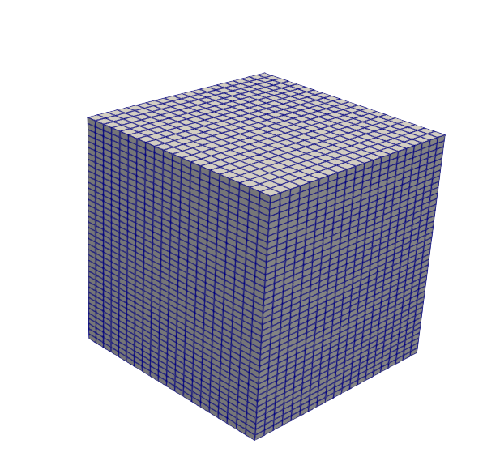

.. _gravityinducedhydrostaticinitialization:

#################################################################################
 Verification of a Gravity Induced Hydrostatic Stress Initialization
#################################################################################

**Context**

In this example, we perform a gravity-only stress initialization for a reservoir with an hydrostatic in-situ pressure. The problem is solved by using a singlephase poromechanics solver (see :ref:`SinglePhasePoroMechanicsSolver`) in Geos to predict the initial state of stress with depth in the reservoir subject to the reservoir rock properties and the prevailing hydrostatic pressure condition. We verify the numerical results obtained by Geos against an anlaytical Eaton's equation. 

**Input file**

The xml input files for the test case are located at:

.. code-block:: console

  inputFiles/initialization/gravityInducedStress_initialization_base.xml
  inputFiles/initialization/gravityInducedStress_initialization_benchmark.xml

A Python script for post-processing the simulation results is provided:

.. code-block:: console

  src/docs/sphinx/basicExamples/initialization/plotInitialization.py

------------------------------------------------------------------
Description of the case
------------------------------------------------------------------

We model the insitu state of stress of a subsurface reservoir subject to a gravity-only induced stress and hydrostatic insitu pressure condition. The domain is homogenous, isotropic and isothermal. The domain is also subject to roller boundaray conditions on both lateral surfaces and at the base of the model, while the top surface of the model is a free surface.

.. _problemSketch1InitializationTest:
.. figure:: sketch_of_problem.png
   :align: center
   :width: 300
   :figclass: align-center

   Sketch of the problem 

We set up and solve a PoroMechanics model to obtain the gradient of stresses (principal stress components) across the domain due to gravity effects and hydrostatic pressure only. These numerical predictions are compared with the analytical solutions derived from `Eaton et al. (1969, 1975) <https://onepetro.org/SPEATCE/proceedings/75FM/All-75FM/SPE-5544-MS/138715>`__

For this example, we focus on the ``Mesh``,
the ``Constitutive``, and the ``FieldSpecifications`` tags.

------------------------------------------------------------------
Mesh
------------------------------------------------------------------

The following figure shows the mesh used for solving this mechanical problem:

.. _problemSketch2InitializationTest:

   Generated mesh 

The mesh was created with the internal mesh generator and parametrized in the ``InternalMesh`` XML tag. 
It contains 20x20x40 eight-node brick elements in the x, y, and z directions respectively. 
Such eight-node hexahedral elements are defined as ``C3D8`` elementTypes, and their collection forms a mesh
with one group of cell blocks named here ``cellBlockNames``. 

.. literalinclude:: ../../../../../inputFiles/initialization/gravityInducedStress_initialization_benchmark.xml
    :language: xml
    :start-after: <!-- SPHINX_MESH -->
    :end-before: <!-- SPHINX_MESH_END -->

------------------------
Poro Mechanics solver
------------------------

For the initialization test, a hydrostatic pore pressure is imposed on the system. This is done using the Hydrostatic Equilibrium tag under Field Specifications. We then define a poro mechanics solver called here poroSolve. 
This solid mechanics solver (see :ref:`SolidMechanicsLagrangianFEM`) called ``lagSolve`` is based on the Lagrangian finite element formulation. 
The problem is run as ``QuasiStatic`` without considering inertial effects. 
The computational domain is discretized by ``FE1``, defined in the ``NumericalMethods`` section.
We use the ``targetRegions`` attribute to define the regions where the solid mechanics solver is applied.
Here, since we only have one cellBlockName type called ``Domain``, the solid mechanics solver is applied to every element of the model. 
The flow solver for this problem (see :ref:`SinglePhaseFVM`) called ``SinglePhaseFlow`` is discretized by ``fluidTPFA``, defined in the ``NumericalMethods`` section by using the same cellBlockName type called ``Domain`` that was applied for the solid mechanics solver. 

.. literalinclude:: ../../../../../inputFiles/initialization/gravityInducedStress_initialization_benchmark.xml
    :language: xml
  :language: xml
  :start-after: <!-- SPHINX_POROMECHANICSSOLVER -->
  :end-before: <!-- SPHINX_POROMECHANICSSOLVER_END -->

.. literalinclude:: ../../../../../inputFiles/initialization/gravityInducedStress_initialization_benchmark.xml
    :language: xml
  :language: xml
  :start-after: <!-- SPHINX_NUMERICAL -->
  :end-before: <!-- SPHINX_NUMERICAL_END -->

------------------------------
Constitutive laws
------------------------------

A homogeneous domain with one solid material is assumed, and its mechanical and fluid properties are specified in the ``Constitutive`` section: 

.. literalinclude:: ../../../../../inputFiles/initialization/gravityInducedStress_initialization_benchmark.xml
    :language: xml
    :start-after: <!-- SPHINX_MATERIAL -->
    :end-before: <!-- SPHINX_MATERIAL_END -->

As shown above, in the ``CellElementRegion`` section, 
``rock`` is designated as the solid material in the computational domain and ``water`` is the fluid. 
Here, Porous Elastic Isotropic model ``PorousElasticIsotropic`` is used to simulate the elastic behavior of ``rock``.
As for the solid material parameters, ``defaultDensity``, ``defaultPoissonRatio``, ``defaultYoungModulus``, ``grainBulkModulus``, ``defaultReferencePorosity``, and ``permeabilityComponents`` denote the rock's density, poisson ratio, young modulus, grain bulk modulus, porosity, and permeability components respectively. In additon, the fluid's (``water``) property of density, viscosity, compressibility and viscosibility are specified with ``defaultDensity``, ``defaultViscosity``, ``compressibility``, and ``viscosibility``. 
All properties are specified in the International System of Units.

------------------------------
Stress Initialization function
------------------------------

In the ``Tasks`` section, ``SinglePhasePoromechanicsInitialization`` tasks is defined to initialize the model by calling the poro mechanics solver ``poroSolve``. 

.. literalinclude:: ../../../../../inputFiles/initialization/gravityInducedStress_initialization_base.xml
    :language: xml
    :start-after: <!-- SPHINX_TASKS -->
    :end-before: <!-- SPHINX_TASKS_END -->
    
The initialization is triggered into action using the ``Event`` management section whereby the ``soloEvent`` function calls the task at the target time (in this case -1e10s).
 
.. literalinclude:: ../../../../../inputFiles/initialization/gravityInducedStress_initialization_base.xml
    :language: xml
    :start-after: <!-- SPHINX_EVENTS -->
    :end-before: <!-- SPHINX_EVENTS_END -->

The ``PeriodicEvent`` function is used here to define recurring tasks that progress for a stipulated time during the simuation. We also use it in this example to save the vtkOuput results for analysis purposes.

.. literalinclude:: ../../../../../inputFiles/initialization/gravityInducedStress_initialization_base.xml
    :language: xml
    :start-after: <!-- SPHINX_OUTPUT -->
    :end-before: <!-- SPHINX_OUTPUT_END -->

We use Paraview to extract the data from the vtkOutput files at the initialization time, and then use a Python script to read and plot the stress and pressure gradients for verification and visualization. 

-----------------------------------
Initial and boundary conditions
-----------------------------------

The next step is to specify fields, including:

  - The initial value (hydrostatic equilibrium),
  - The boundary conditions (the displacement control of the outer boundaries have to be set).

In this problem, all outer boundaries of the domain are subjected to roller constraints except the top of the model which is left as a free surface.  

These boundary conditions are set up through the ``FieldSpecifications`` section.

.. literalinclude:: ../../../../../inputFiles/initialization/gravityInducedStress_initialization_base.xml
    :language: xml
    :start-after: <!-- SPHINX_BC -->
    :end-before: <!-- SPHINX_BC_END -->

The parameters used in the simulation are summarized in the following table.

+------------------+-------------------------+------------------+--------------------+
| Symbol           | Parameter               | Unit             | Value              |
+==================+=========================+==================+====================+
| :math:`E`        | Young Modulus           | [MPa]            | 100                |
+------------------+-------------------------+------------------+--------------------+
| :math:`v`        | Poisson Ratio           | [-]              | 0.25               |
+------------------+-------------------------+------------------+--------------------+
| :math:`\rho_b`   | Bulk Density            | [kg/m3]          | 2500               |
+------------------+-------------------------+------------------+--------------------+
| :math:`\phi`     | Porosity                | [-]              | 0.375              |
+------------------+-------------------------+------------------+--------------------+
| :math:`\K_s`     | Grain Bulk Modulus      | [Pa]             | 10\ :sup:`27`      |
+------------------+-------------------------+------------------+--------------------+
| :math:`\kappa`   | Permeability            | [m2]             | 10^-12             |
+------------------+-------------------------+------------------+--------------------+
| :math:`\rho_f`   | Fluid Density           | [kg/m3]          | 1000               |
+------------------+-------------------------+------------------+--------------------+
| :math:`c_f`      | Fluid compressibility   | [Pa\ :sup:`-1`]  | 4.4x10\ :sup:`-10` |
+------------------+-------------------------+------------------+--------------------+
| :math:`\mu`      | Fluid viscosity         | [Pa s]           | 10\ :sup:`-3`      |
+------------------+-------------------------+------------------+--------------------+

---------------------------------
Inspecting results
---------------------------------

In the example, we request vtk output files for time-series (time history). We use Python scripts to visualize the outcome at the time 0s.
The following figure shows the final gradient of the principal stress components and of pressure after initialization is completed.

.. _problemInitializationPres:
.. figure:: vertical_grad.png
   :align: center
   :width: 500
   :figclass: align-center

   Simulation result of pressure

The figure below shows the comparisons between the numerical predictions (marks) and the corresponding analytical solutions (lines) with respect to the computed principal stresses.

.. plot:: docs/sphinx/basicExamples/gravityInducedStressInitialization/plotInitialization.py

------------------------------------------------------------------
To go further
------------------------------------------------------------------

**Feedback on this example**

For any feedback on this example, please submit a `GitHub issue on the project's GitHub page <https://github.com/GEOS-DEV/GEOS/issues>`_.
