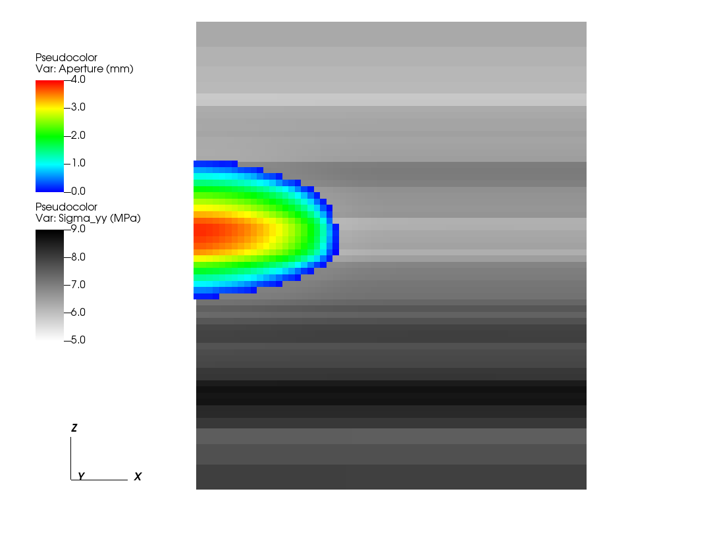
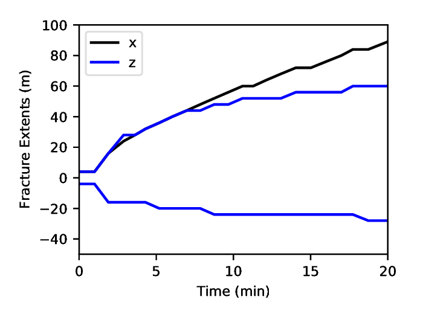
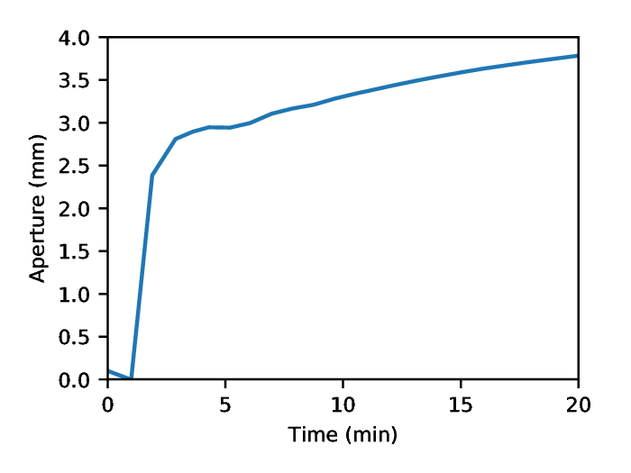
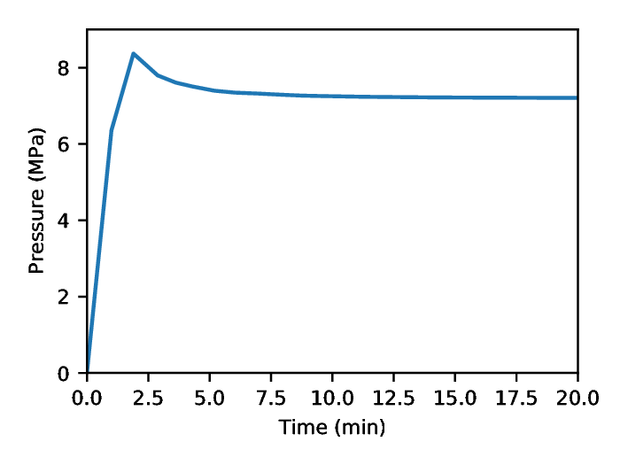

.. _TutorialHydraulicFractureWithAdvancedXML:

#####################################################
Hydraulic Fracturing 
#####################################################

**Context**

In this example, we use a fully coupled hydrofracture solver from GEOS to solve for the propagation of a single fracture within a reservoir with heterogeneous in-situ properties.
Advanced xml features will be used throughout the example.

**Objectives**

At the end of this example you will know:

  - how to use multiple solvers for hydraulic fracturing problems,
  - how to specify pre-existing fractures and where new fractures can develop,
  - how to construct a mesh with bias,
  - how to specify heterogeneous in-situ properties and initial conditions,
  - how to use parameters, symbolic math, and units in xml files.

**Input files**

This example uses a set of input files and table files located at:

.. code-block:: console

  inputFiles/hydraulicFracturing

Because the input files use the advanced xml features, they must be preprocessed using the geosx_xml_tools package.
If you have not already done so, setup these features by following the instructions here: :ref:`AdvancedXMLFeatures` .

------------------------------------------------------------------
Description of the case
------------------------------------------------------------------

Here, our goal is to demonstrate how hydraulic fractures are modeled in a typical environment.
The in-situ properties and initial conditions are based upon a randomly generated, fractal, 1D layer-cake model.

The inputs for this case are contained inside a case-specific (``heterogeneousInSitu_benchmark.xml``) and base (``heterogeneousInSitu_base.xml``) XML files.
The ``tables`` directory contains the pre-constructed geologic model.
This example will first focus on the case-specific input file, which contains the key parameter definitions, then consider the base xml file.

---------------------------------------------
Included: including external xml files
---------------------------------------------

At the head of the case-specific xml file is a block that will instruct GEOS to include an external file.
In our case, this points to the base hydraulic fracturing input file.

.. literalinclude:: ../../../../../inputFiles/hydraulicFracturing/heterogeneousInSitu_benchmark.xml
  :language: xml
  :start-after: <!-- SPHINX_HYDROFRACTURE_INCLUDED -->
  :end-before: <!-- SPHINX_HYDROFRACTURE_INCLUDED_END -->

--------------------------------------------------------------
Parameters: defining variables to be used throughout the file
--------------------------------------------------------------

The ``Parameters`` block defines a series of variables that can be used throughout the input file.
These variables allow a given input file to be easily understood and/or modified for a specific environment, even by non-expert users. Parameters are specified in pairs of names and values.
The names should only contain alphanumeric characters and underlines.
The values can contain any type (strings, doubles, etc.).

Parameters can be used throughout the input file (or an included input file) by placing them in-between dollar signs.
Barring any circular-definition errors, parameters can be used within other parameters.
For example, see the parameter ``mu_upscaled``.
The value of this parameter is a symbolic expression, which is denoted by the surrounding back-ticks, and is dependent upon two other parameters.
During pre-processing, geosx_xml_tools will substitute the parameter definitions, and evaluate the symbolic expression using a python-derived syntax.

A number of the input parameters include optional unit definitions, which are denoted by the square brackets following a value.
For example, the parameter ``t_max`` is used to set the maximum time for the simulation to 20 minutes.

.. literalinclude:: ../../../../../inputFiles/hydraulicFracturing/heterogeneousInSitu_benchmark.xml
  :language: xml
  :start-after: <!-- SPHINX_HYDROFRACTURE_PARAMETERS -->
  :end-before: <!-- SPHINX_HYDROFRACTURE_PARAMETERS_END -->

--------------------------------------------------------------
Mesh with biased boundaries
--------------------------------------------------------------

The mesh block for this example uses a biased mesh along the simulation boundaries to reduce the size of the problem, while maintaining the desired spatial extents.
For a given element region with bias, the left-hand element will be x% smaller and the right-hand element will be x% larger than the average element size.
Along the x-axis of the mesh, we select a value of zero for the first region to indicate that we want a uniform-sized mesh, and we select a bias of -0.6 for the second region to indicate that we want the element size to smoothly increase in size as it moves in the +x direction.
The other dimensions of the mesh follow a similar pattern.

.. literalinclude:: ../../../../../inputFiles/hydraulicFracturing/heterogeneousInSitu_benchmark.xml
  :language: xml
  :start-after: <!-- SPHINX_HYDROFRACTURE_MESH -->
  :end-before: <!-- SPHINX_HYDROFRACTURE_MESH_END -->

----------------------------------------------
Defining a fracture nodeset
----------------------------------------------

For this example, we want to propagate a single hydraulic fracture along the plane defined by y = 0.
To achieve this, we need to define three nodesets:

- source_a: The location where we want to inject fluid.  Typically, we want this to be a single face in the x-z plane.
- perf_a: This is the initial fracture for the simulation.  This nodeset needs to be at least two-faces wide in the x-z plane (to represent the fracture at least one internal node needs to be open).
- fracturable_a: This is the set of faces where we will allow the fracture to grow. For a problem where we expect the fracture to curve out of the plane defined by y = 0 , this could be replaced.

.. literalinclude:: ../../../../../inputFiles/hydraulicFracturing/heterogeneousInSitu_benchmark.xml
  :language: xml
  :start-after: <!-- SPHINX_HYDROFRACTURE_GEOMETRY -->
  :end-before: <!-- SPHINX_HYDROFRACTURE_GEOMETRY_END -->

--------------------	       
Boundary conditions
--------------------

The boundary conditions for this problem are defined in the case-specific and the base xml files.
The case specific block includes four instructions:

- frac: this marks the initial perforation.
- separableFace: this marks the set of faces that are allowed to break during the simulation.
- waterDensity: this initializes the fluid in the perforation.
- sourceTerm: this instructs the code to inject fluid into the source_a nodeset.  Note the usage of the symbolic expression and parameters in the scale.  This boundary condition is also driven by a function, which we will define later. 

.. literalinclude:: ../../../../../inputFiles/hydraulicFracturing/heterogeneousInSitu_benchmark.xml
  :language: xml
  :start-after: <!-- SPHINX_HYDROFRACTURE_BC -->
  :end-before: <!-- SPHINX_HYDROFRACTURE_BC_END -->

The base block includes instructions to set the initial in-situ properties and stresses.
It is also used to specify the external mechanical boundaries on the system.
In this example, we are using roller-boundary conditions (zero normal-displacement).
Depending upon how close they are to the fracture, they can significantly affect its growth.
Therefore, it is important to test whether the size of the model is large enough to avoid this.

.. literalinclude:: ../../../../../inputFiles/hydraulicFracturing/heterogeneousInSitu_base.xml
  :language: xml
  :start-after: <!-- SPHINX_HYDROFRACTURE_BC_BASE -->
  :end-before: <!-- SPHINX_HYDROFRACTURE_BC_BASE_END -->

-----------------------------------------------------------------
Coupled hydraulic fracturing solver
-----------------------------------------------------------------

The Solvers block is located in the base xml file.
Note that the ``gravityVector`` attribute indicates that we are applying gravity in the z-direction in this problem.

Similar to other coupled physics solvers, the Hydrofracture solver is specified in three parts:

- Hydrofracture: this is the primary solver, which will be called by the event manager.  Two of its key attributes are the names of the dependent solid and fluid solvers.
- SolidMechanicsLagrangianSSLE: this is the solid mechanics solver.
- SinglePhaseFVM: this is the fluid solver.

The final solver present in this example is the SurfaceGenerator, which manages how faces in the model break.

.. literalinclude:: ../../../../../inputFiles/hydraulicFracturing/heterogeneousInSitu_base.xml
  :language: xml
  :start-after: <!-- SPHINX_HYDROFRACTURE_SOLVERS -->
  :end-before: <!-- SPHINX_HYDROFRACTURE_SOLVERS_END -->

---------
Events 
---------

Rather than explicitly specify the desired timestep behavior, this example uses a flexible approach for timestepping.
The hydrofracture solver is applied in the ``solverApplications`` event, which request a ``maxEventDt = 30 s``.
To maintain stability during the critical early phase of the model, we delay turning on the pump by ``pump_start``.
We then use the ``pumpStart`` event to limit the further limit the timestep to ``pump_ramp_dt_limit`` as the fracture experiences rapid development (``pump_start`` to ``pump_start + pump_ramp``).
Note that while this event does not have a target, it can still influence the time step behavior.
After this period, the hydraulic fracture solver will attempt to increase / decrease the requested timestep to maintain stability.

Other key events in this problem include:

- preFracture: this calls the surface generator at the beginning of the problem and helps to initialize the fracture.
- outputs_vtk and outputs_silo: these produces output vtk and silo files.
- restarts (inactive): this is a HaltEvent, which tracks the external clock.  When the runtime exceeds the specified value (here $t_allocation$=28 minutes), the code will call the target (which writes a restart file) and instruct the code to exit.

.. literalinclude:: ../../../../../inputFiles/hydraulicFracturing/heterogeneousInSitu_base.xml
  :language: xml
  :start-after: <!-- SPHINX_HYDROFRACTURE_EVENTS -->
  :end-before: <!-- SPHINX_HYDROFRACTURE_EVENTS_END -->

-----------------------------------------------------------------
Functions to set in-situ properties
-----------------------------------------------------------------

The function definitions are in the base xml file, and rely upon the files in the tables directory.
The functions in this example include the flow rate over time, the in-situ principal stress, and the bulk/shear moduli of the rock.
Note the use of the table_root parameter, which contains the root path to the table files.

The flow_rate TableFunction is an example of a 1D function.
It has a single input, which is time.
The table is defined using a single coordinateFile:

.. literalinclude:: ../../../../../inputFiles/hydraulicFracturing/tables/flowRate_time.csv
  :language: none

And a single voxelFile:

.. literalinclude:: ../../../../../inputFiles/hydraulicFracturing/tables/flowRate.csv
  :language: none

Given the specified linear interpolation method, these values define a simple trapezoidal function.
Note: since this is a 1D table, these values could alternately be given within the xml file using the ``coordinates`` and ``values`` attributes.

The sigma_xx TableFunction is an example of a 3D function.
It uses ``elementCenter`` as its input, which is a vector.
It is specified using a set of three coordinate files (one for each axis), and a single voxel file.
The geologic model in this example is a layer-cake, which was randomly generated, so the size of the x and y axes are 1.
The interpolation method used here is upper, so the values in the table indicate those at the top of each layer.

.. literalinclude:: ../../../../../inputFiles/hydraulicFracturing/heterogeneousInSitu_base.xml
  :language: xml
  :start-after: <!-- SPHINX_HYDROFRACTURE_FUNCTIONS -->
  :end-before: <!-- SPHINX_HYDROFRACTURE_FUNCTIONS_END -->

---------------------------------
Running GEOS
---------------------------------

Assuming that the preprocessing tools have been correctly installed (see :ref:`AdvancedXMLFeatures` ), there will be a script in the GEOS build/bin directory called `geosx_preprocessed`.
Replacing `geosx` with `geosx_preprocessed` in an input command will automatically apply the preprocessor and send the results to GEOS.

Before beginning, we reccomend that you make a local copy of the example and its tables.
Because we are using advanced xml features in this example, the input file must be pre-processed before running.
For example, this will run the code on a debug partition using a total of 36 cores.

.. code-block:: bash

  cp -r examples/hydraulicFracturing ./hf_example
  cd hf_example
  srun -n 36 -ppdebug geosx_preprocessed -i heterogeneousInSitu_benchmark.xml -x 6 -y 2 -z 3 -o hf_results

Note that as part of the automatic preprocessing step a compiled xml file is written to the disk (by default '[input_name].preprocessed').
When developing an xml with advanced features, we reccomend that you check this file to ensure its accuracy.

---------------------------------
Inspecting results
---------------------------------

In the above example, we requested vtk- and silo-format output files every minute.
We can therefore import these into VisIt, Paraview, or python and visualize the outcome.
The following figure shows the extents of the generated fracture over time:

Notes for visualization tools:

1) In Visit, we currently recommend that you look at the silo-format files (due to a compatibility issue with vtk)
2) In Paraview, you may need to use the Multi-block Inspector (on the right-hand side of the screen by default) to limit the visualization to the fracture.  In addition, the Properties inspector (on the left-hand side of the sceen by default) may not include some of the parameters present on the fracture.  Instead, we recommend that you use the property dropdown box at the top of the screen.

Because we did not explicitly specify any fracture barriers in this example, the fracture dimensions are controlled by the in-situ stresses.
During the first couple of minutes of growth, the fracture quickly reaches its maximum/minimum height, which corresponds to a region of low in-situ minimum stress.

The following figures show the aperture and pressure of the hydraulic fracture (near the source) over time:

-------------------------------------------
Modifying Parameters Via the Command-Line
-------------------------------------------

The advanced xml feature preprocessor allows parameters to be set or overriden by specifying any number of `-p name value` arguments on the command-line.
Note that if the parameter value has spaces, it needs to be enclosed by quotation marks.

To illustrate this feature, we can re-run the previous analysis with viscosity increased from 1 cP to 5 cP:

.. code-block:: bash

  srun -n 36 -ppdebug geosx_preprocessed -i heterogeneousInSitu_benchmark.xml -p mu 0.005 -x 6 -y 2 -z 3 -o hf_results_lower_mu

------------------------------------------------------------------
To go further
------------------------------------------------------------------

**Feedback on this example**

This concludes the hydraulic fracturing example.
For any feedback on this example, please submit a `GitHub issue on the project's GitHub page <https://github.com/GEOS-DEV/GEOS/issues>`_.

**For more details**

  - More on advanced xml features, please see :ref:`AdvancedXMLFeatures`.
  - More on functions, please see :ref:`FunctionManager`.
  - More on biased meshes, please see :ref:`Mesh_bias`.

