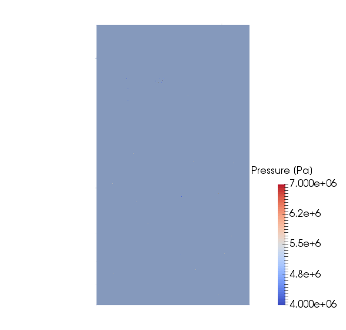
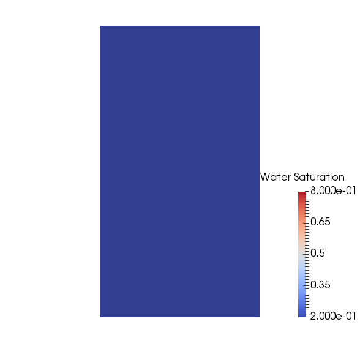

.. _TutorialDeadOilBottomLayersSPE10:

####################################################################
Multiphase Flow
####################################################################

**Context**

In this example, we set up a multiphase, multicomponent test case (see :ref:`CompositionalMultiphaseFlow`).
The permeability field corresponds to the two bottom layers (layers 84 and 85) of the SPE10 test case.
The thermodynamic behavior of the fluid mixture is specified using a simple immiscible two-phase (Dead-Oil) model.
Injection and production are simulated using boundary conditions.

**Objective**

The main objective of this example is to review the main elements of a simple two-phase simulation in GEOS, including:

- the compositional multiphase flow solver,
- the multiphase constitutive models,
- the specifications of multiphase boundary conditions.

**Input file**

This example is based on the XML file located at

.. code-block:: console

  inputFiles/compositionalMultiphaseFlow/benchmarks/SPE10/deadOilSpe10Layers84_85_base_iterative.xml

The XML file considered here follows the typical structure of the GEOS input files:

 #. :ref:`Solver <Solver_tag_dead_oil_bottom_layers_spe10>`
 #. :ref:`Mesh <Mesh_tag_dead_oil_bottom_layers_spe10>`
 #. :ref:`Geometry <Geometry_tag_dead_oil_bottom_layers_spe10>`    
 #. :ref:`Events <Events_tag_dead_oil_bottom_layers_spe10>`
 #. :ref:`NumericalMethods <NumericalMethods_tag_dead_oil_bottom_layers_spe10>`
 #. :ref:`ElementRegions <ElementRegions_tag_dead_oil_bottom_layers_spe10>`
 #. :ref:`Constitutive <Constitutive_tag_dead_oil_bottom_layers_spe10>`
 #. :ref:`FieldSpecifications <FieldSpecifications_tag_dead_oil_bottom_layers_spe10>`
 #. :ref:`Outputs <Outputs_tag_dead_oil_bottom_layers_spe10>`   

.. _Solver_tag_dead_oil_bottom_layers_spe10:

-----------------------
Multiphase flow solver
-----------------------

In GEOS, the setup of a multiphase simulation starts in the **Solvers** XML block of the input file.
This example relies on a solver of type **CompositionalMultiphaseFVM** that implements a fully implicit finite-volume
scheme based on the standard two-point approximation of the flux (TPFA).
More information on this solver can be found at :ref:`CompositionalMultiphaseFlow`.  

Let us have a closer look at the **Solvers** XML block displayed below.
The solver has a name (here, ``compflow``) that can be chosen by the user and is not imposed by GEOS.
Note that this name is used in the **Events** XML block to trigger the application of the solver.
Using the ``targetRegions`` attribute, the solver defines the target regions on which it is applied.
In this example, there is only one region, named ``reservoir``.

The **CompositionalMultiphaseFVM** block contains two important sub-blocks, namely **NonlinearSolverParameters** and **LinearSolverParameters**.
In **NonlinearSolverParameters**, one can finely tune the nonlinear tolerance, the application of the linear search algorithm, and the heuristics used to increase the time step size.
In **LinearSolverParameters**, the user can specify the linear tolerance, the type of (direct or iterative) linear solver, and the
type of preconditioner, if any.
For large multiphase flow problems, we recommend using an iterative linear solver (``solverType="gmres"`` or ``solverType="fgmres"``) combined
with the multigrid reduction (MGR) preconditioner (``preconditionerType="mgr"``). More information about the MGR preconditioner can be found in :ref:`LinearSolvers`.

.. note::
        For non-trivial simulations, we recommend setting the ``initialDt`` attribute to a small value (relative to the time scale of the problem) in seconds. If the simulation appears to be slow, use ``logLevel="1"`` in **CompositionalMultiphaseFVM** to detect potential Newton convergence problems. If the Newton solver struggles, please set ``lineSearchAction="Attempt"`` in **NonlinearSolverParameters**. If the Newton convergence is good, please add ``logLevel="1"`` in the **LinearSolverParameters** block to detect linear solver problems, especially if an iterative linear solver is used.

.. note::
   To use the linear solver options of this example, you need to ensure that GEOS is configured to use the Hypre linear solver package.
	
.. literalinclude:: ../../../../../inputFiles/compositionalMultiphaseFlow/benchmarks/SPE10/deadOilSpe10Layers84_85_base_iterative.xml
  :language: xml
  :start-after: <!-- SPHINX_TUT_DEAD_OIL_BOTTOM_SPE10_SOLVERS -->
  :end-before: <!-- SPHINX_TUT_DEAD_OIL_BOTTOM_SPE10_SOLVERS_END -->

	       
.. _Mesh_tag_dead_oil_bottom_layers_spe10:

-------
Mesh
-------

In this simulation, we define a simple mesh generated internally using the **InternalMesh** generator, as
illustrated in the first tutorial (:ref:`TutorialSinglePhaseFlowWithInternalMesh`).
The mesh dimensions and cell sizes are chosen to be those specified in the SPE10 test case, but are limited to the two bottom layers.
The mesh description must be done in meters.

.. literalinclude:: ../../../../../inputFiles/compositionalMultiphaseFlow/benchmarks/SPE10/deadOilSpe10Layers84_85_benchmark.xml
  :language: xml
  :start-after: <!-- SPHINX_TUT_DEAD_OIL_BOTTOM_SPE10_MESH -->
  :end-before: <!-- SPHINX_TUT_DEAD_OIL_BOTTOM_SPE10_MESH_END -->

.. _Geometry_tag_dead_oil_bottom_layers_spe10:

------------
Geometry
------------

As in the previous examples, the **Geometry** XML block is used to select the cells in which the boundary conditions are applied.
To mimic the setup of the original SPE10 test case, we place a source term in the middle of the domain, and a sink term in each corner.
The specification of the boundary conditions applied to the selected mesh cells is done in the **FieldSpecifications** block of the XML file
using the names of the boxes defined here.

.. literalinclude:: ../../../../../inputFiles/compositionalMultiphaseFlow/benchmarks/SPE10/deadOilSpe10Layers84_85_benchmark.xml
  :language: xml
  :start-after: <!-- SPHINX_TUT_DEAD_OIL_BOTTOM_SPE10_GEOMETRY -->
  :end-before: <!-- SPHINX_TUT_DEAD_OIL_BOTTOM_SPE10_GEOMETRY_END -->

.. _Events_tag_dead_oil_bottom_layers_spe10:

------------------------
Events
------------------------

In the **Events** XML block of this example, we specify two types of **PeriodicEvents**
serving different purposes, namely solver application and result output.

The periodic event named ``solverApplications`` triggers the application of the solver on its target region. 
This event must point to the solver by name.
In this example, the name of the solver is ``compflow`` and was defined in the **Solvers** block.
The time step is initialized using the ``initialDt`` attribute of the flow solver.
Then, if the solver converges in less than a certain number of nonlinear iterations (by default, 40% of the
maximum number of nonlinear iterations), the time step will be increased until it reaches the maximum
time step size specified with ``maxEventDt``. 
If the time step fails, the time step will be cut. The parameters defining the time stepping strategy
can be finely tuned by the user in the flow solver block.
Note that all times are in seconds.

The output event forces GEOS to write out the results at the frequency specified by the attribute
``timeFrequency``.
Here, we choose to output the results using the VTK format (see :ref:`TutorialSinglePhaseFlowExternalMesh`
for a tutorial that uses the Silo output file format).
Using ``targetExactTimestep=1`` in this XML block forces GEOS to adapt the time stepping to
ensure that an output is generated exactly at the time frequency requested by the user.
In the ``target`` attribute, we must use the name defined in the **VTK** XML tag
inside the **Output** XML section, as documented at the end of this example (here, ``vtkOutput``).

More information about events can be found at :ref:`EventManager`.

.. literalinclude:: ../../../../../inputFiles/compositionalMultiphaseFlow/benchmarks/SPE10/deadOilSpe10Layers84_85_base_iterative.xml
  :language: xml
  :start-after: <!-- SPHINX_TUT_DEAD_OIL_BOTTOM_SPE10_EVENTS -->
  :end-before: <!-- SPHINX_TUT_DEAD_OIL_BOTTOM_SPE10_EVENTS_END -->

.. _NumericalMethods_tag_dead_oil_bottom_layers_spe10:

----------------------------------
Numerical methods
----------------------------------

In the **NumericalMethods** XML block, we select a two-point flux approximation (TPFA) finite-volume scheme to
discretize the governing equations on the reservoir mesh.
TPFA is currently the only numerical scheme that can be used with a flow solver of type
**CompositionalMultiphaseFVM**.

.. literalinclude:: ../../../../../inputFiles/compositionalMultiphaseFlow/benchmarks/SPE10/deadOilSpe10Layers84_85_base_iterative.xml
  :language: xml
  :start-after: <!-- SPHINX_TUT_DEAD_OIL_BOTTOM_SPE10_NUMERICAL_METHODS -->
  :end-before: <!-- SPHINX_TUT_DEAD_OIL_BOTTOM_SPE10_NUMERICAL_METHODS_END -->

.. _ElementRegions_tag_dead_oil_bottom_layers_spe10:

-----------------------------------
Reservoir region
-----------------------------------

In the **ElementRegions** XML block, we define a **CellElementRegion** named ``reservoir`` corresponding to the
reservoir mesh.
``cellBlocks`` is set to ``{ * }`` to automatically target every cells of the mesh.

The **CellElementRegion** must also point to the constitutive models that are used to update
the dynamic rock and fluid properties in the cells of the reservoir mesh.
The names ``fluid``, ``rock``, and ``relperm`` used for this in the ``materialList``
correspond to the **Constitutive** blocks with the coresponding names.

.. literalinclude:: ../../../../../inputFiles/compositionalMultiphaseFlow/benchmarks/SPE10/deadOilSpe10Layers84_85_base_iterative.xml
  :language: xml
  :start-after: <!-- SPHINX_TUT_DEAD_OIL_BOTTOM_SPE10_ELEMENT_REGIONS -->
  :end-before: <!-- SPHINX_TUT_DEAD_OIL_BOTTOM_SPE10_ELEMENT_REGIONS_END -->

.. _Constitutive_tag_dead_oil_bottom_layers_spe10:

---------------------
Constitutive models
---------------------

For a simulation performed with the **CompositionalMultiphaseFVM** physics solver,
at least four types of constitutive models must be specified in the **Constitutive** XML block:

- a fluid model describing the thermodynamics behavior of the fluid mixture,
- a relative permeability model,
- a rock permeability model,
- a rock porosity model.

All these models use SI units exclusively.
A capillary pressure model can also be specified in this block but is omitted here for simplicity.
  
Here, we introduce a fluid model describing a simplified mixture thermodynamic behavior.
Specifically, we use an immiscible two-phase (Dead Oil) model by placing the XML tag **DeadOilFluid**.
Other fluid models can be used with the **CompositionalMultiphaseFVM** solver, as explained in :ref:`FluidModels`.

With the tag **BrooksCoreyRelativePermeability**, we define a relative permeability model.
A list of available relative permeability models can be found at
:ref:`RelativePermeabilityModels`.

The properties are chosen to match those of the original SPE10 test case.
     
.. note::
   The names and order of the phases listed for the attribute ``phaseNames`` must be identical in the fluid model
   (here, **DeadOilFluid**) and the relative permeability model (here, **BrooksCoreyRelativePermeability**).
   Otherwise, GEOS will throw an error and terminate.

We also introduce models to define rock compressibility and permeability.
This step is similar to what is described in the previous examples
(see for instance :ref:`TutorialSinglePhaseFlowWithInternalMesh`).

We remind the reader that the attribute ``name`` of the constitutive models defined here
must be used in the **ElementRegions** and **Solvers** XML blocks to point the element
regions and the physics solvers to their respective constitutive models.

.. literalinclude:: ../../../../../inputFiles/compositionalMultiphaseFlow/benchmarks/SPE10/deadOilSpe10Layers84_85_base_iterative.xml
  :language: xml
  :start-after: <!-- SPHINX_TUT_DEAD_OIL_BOTTOM_SPE10_CONSTITUTIVE -->
  :end-before: <!-- SPHINX_TUT_DEAD_OIL_BOTTOM_SPE10_CONSTITUTIVE_END -->

.. _FieldSpecifications_tag_dead_oil_bottom_layers_spe10:

--------------------------------
Initial and boundary conditions
--------------------------------

In the **FieldSpecifications** section, we define the initial and boundary conditions as well
as the geological properties (porosity, permeability).
All this is done using SI units.
Here, we focus on the specification of the initial and boundary conditions for
a simulation performed with the **CompositionalMultiphaseFVM** solver.
We refer to :ref:`TutorialSinglePhaseFlowWithInternalMesh` for a more general
discussion on the **FieldSpecification** XML blocks.

For a simulation performed with the **CompositionalMultiphaseFVM** solver,
we have to set the initial pressure as well as the initial global component
fractions (in this case, the oil and water component fractions).
The ``component`` attribute of the **FieldSpecification** XML block must use the
order in which the ``phaseNames`` have been defined in the **DeadOilFluid**
XML block. In other words, ``component=0`` is used to initialize the oil
global component fraction and ``component=1`` is used to initialize the water global
component fraction, because we previously set ``phaseNames="{oil, water}"``
in the **DeadOilFluid** XML block. 

To specify the sink terms, we use the **FieldSpecification** mechanism in a similar
fashion to impose the sink pressure and composition.
This is done to mimic a pressure-controlled well (before breakthrough).
To specify the source term, we use a **SourceFlux**  block to impose a fixed mass
injection rate of component 1 (water) to mimic a rate-controlled well.

.. literalinclude:: ../../../../../inputFiles/compositionalMultiphaseFlow/benchmarks/SPE10/deadOilSpe10Layers84_85_base_iterative.xml
  :language: xml
  :start-after: <!-- SPHINX_TUT_DEAD_OIL_BOTTOM_SPE10_FIELD_SPECS -->
  :end-before: <!-- SPHINX_TUT_DEAD_OIL_BOTTOM_SPE10_FIELD_SPECS_END -->

.. _Outputs_tag_dead_oil_bottom_layers_spe10:

----------
Output
----------

In this section, we request an output of the results in VTK format.
Note that the name defined here must match the names used in the **Events** XML block to define the output frequency.

.. literalinclude::  ../../../../../inputFiles/compositionalMultiphaseFlow/benchmarks/SPE10/deadOilSpe10Layers84_85_base_iterative.xml
  :language: xml
  :start-after: <!-- SPHINX_TUT_DEAD_OIL_BOTTOM_SPE10_OUTPUTS -->
  :end-before: <!-- SPHINX_TUT_DEAD_OIL_BOTTOM_SPE10_OUTPUTS_END -->

      
All elements are now in place to run GEOS.

------------------------------------
Running GEOS
------------------------------------

The first few lines appearing to the console are indicating that the XML elements are read and registered correctly:

.. code-block:: console

  Adding Solver of type CompositionalMultiphaseFVM, named compflow
  Adding Mesh: InternalMesh, mesh
  Adding Geometric Object: Box, source
  Adding Geometric Object: Box, sink1
  Adding Geometric Object: Box, sink2
  Adding Geometric Object: Box, sink3
  Adding Geometric Object: Box, sink4
  Adding Event: PeriodicEvent, outputs
  Adding Event: PeriodicEvent, solverApplications
  TableFunction: permxFunc
  TableFunction: permyFunc
  TableFunction: permzFunc
  TableFunction: poroFunc
  TableFunction: B_o_table
  TableFunction: visc_o_table
  Adding Output: VTK, vtkOutput
  Adding Object CellElementRegion named region from ObjectManager::Catalog.
  region/block/fluid is allocated with 1 quadrature points.
  region/block/rock is allocated with 1 quadrature points.
  aaregion/block/relperm is allocated with 1 quadrature points.
			
At this point, we are done with the case set-up and
the code steps into the execution of the simulation itself:

.. code-block:: console
		
  Time: 0s, dt:1000s, Cycle: 0

    Attempt:  0, NewtonIter:  0
    ( Rfluid ) = (2.28e+00) ;     ( R ) = ( 2.28e+00 ) ; 
    Attempt:  0, NewtonIter:  1
    ( Rfluid ) = (8.83e-03) ;     ( R ) = ( 8.83e-03 ) ; 
    Last LinSolve(iter,res) = (   2, 2.74e-03 ) ; 
    Attempt:  0, NewtonIter:  2
    ( Rfluid ) = (8.86e-05) ;     ( R ) = ( 8.86e-05 ) ; 
    Last LinSolve(iter,res) = (   2, 8.92e-03 ) ;
    
  compflow: Max phase CFL number: 0.00399585
  compflow: Max component CFL number: 0.152466
  compflow: Newton solver converged in less than 16 iterations, time-step required will be doubled.

------------------------------------
Visualization
------------------------------------

A file compatible with Paraview is produced in this example.
It is found in the output folder, and usually has the extension `.pvd`.
More details about this file format can be found
`here <https://www.paraview.org/Wiki/ParaView/Data_formats#PVD_File_Format>`_.
We can load this file into Paraview directly and visualize results:

|pic1| |pic2|

------------------------------------
To go further
------------------------------------

**Feedback on this example**

This concludes the example on setting up an immiscible two-phase flow simulation in a channelized permeability field.
For any feedback on this example, please submit
a `GitHub issue on the project's GitHub page <https://github.com/GEOS-DEV/GEOS/issues>`_.

**For more details**

  - A complete description of the reservoir flow solver is found here: :ref:`CompositionalMultiphaseFlow`.
  - The available constitutive models are listed at :ref:`Constitutive`.
