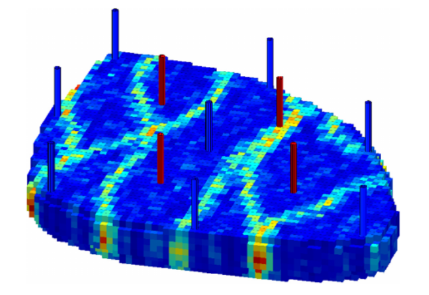
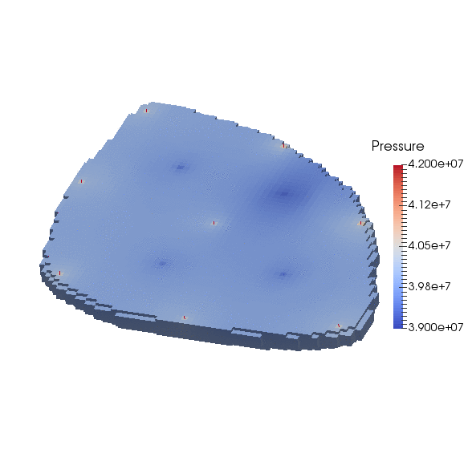
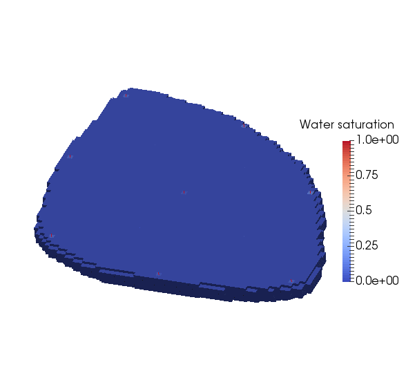

.. _TutorialDeadOilEgg:

########################################################
Multiphase Flow with Wells
########################################################

**Context**

In this example, we build on the concepts presented in :ref:`TutorialDeadOilBottomLayersSPE10`
to show how to set up a multiphase water injection problem with wells in
the three-dimensional `Egg model <https://rmets.onlinelibrary.wiley.com/doi/full/10.1002/gdj3.21>`_.
The twelve wells (four producers and eight injectors) are placed according to the description
of the original test case.

**Objectives**

In this example, we re-use many GEOS features already presented in
:ref:`TutorialDeadOilBottomLayersSPE10`, but we now focus on:

- how to import an external mesh with embedded geological properties (permeability) in the VTK format (``.vtu``),
- how to set up the wells.

**Input file**

This example is based on the XML file located at

.. code-block:: console

  ../../../../../inputFiles/compositionalMultiphaseWell/benchmarks/Egg/deadOilEgg_benchmark.xml

The mesh file corresponding to the Egg model is stored in the GEOSDATA repository.
Therefore, you must first download the GEOSDATA repository in the same folder
as the GEOS repository to run this test case.

.. note::
        `GEOSDATA <https://github.com/GEOS-DEV/GEOSDATA>`_ is a separate repository in which we store large mesh files in order to keep the main GEOS repository lightweight.
   
The XML file considered here follows the typical structure of the GEOS input files:

 #. :ref:`Solver <Solver_tag_dead_oil_egg_model>`
 #. :ref:`Mesh <Mesh_tag_dead_oil_egg_model>`
 #. :ref:`Events <Events_tag_dead_oil_egg_model>`
 #. :ref:`NumericalMethods <NumericalMethods_tag_dead_oil_egg_model>`
 #. :ref:`ElementRegions <ElementRegions_tag_dead_oil_egg_model>`
 #. :ref:`Constitutive <Constitutive_tag_dead_oil_egg_model>`
 #. :ref:`FieldSpecifications <FieldSpecifications_tag_dead_oil_egg_model>`
 #. :ref:`Outputs <Outputs_tag_dead_oil_egg_model>`
 #. :ref:`Tasks <Tasks_tag_dead_oil_egg_model>`    

.. _Solver_tag_dead_oil_egg_model:

-----------------------------------------
Coupling the flow solver with wells
-----------------------------------------

In GEOS, the simulation of reservoir flow with wells is set up by combining three solvers
listed and parameterized in the **Solvers** XML block of the input file.
We introduce separately a flow solver and a well solver acting on different regions of the
domain---respectively, the reservoir region and the well regions.
To drive the simulation and bind these single-physics solvers, we also specify a *coupling solver*
between the reservoir flow solver and the well solver.
This coupling of single-physics solvers is the generic approach used in GEOS to
define multiphysics problems.
It is illustrated in :ref:`TutorialPoroelasticity` for a poroelastic test case. 

The three solvers employed in this example are:

 - the single-physics reservoir flow solver, a solver of type **CompositionalMultiphaseFVM** named ``compositionalMultiphaseFlow`` (more information on this solver at :ref:`CompositionalMultiphaseFlow`),
 - the single-physics well solver, a solver of type **CompositionalMultiphaseWell** named ``compositionalMultiphaseWell`` (more information on this solver at :ref:`CompositionalMultiphaseWell`),
 - the coupling solver that binds the two single-physics solvers above, an object of type **CompositionalMultiphaseReservoir** named ``coupledFlowAndWells``.

The **Solvers** XML block is shown below.
The coupling solver points to the two single-physics solvers using the attributes
``flowSolverName`` and ``wellSolverName``.
These names can be chosen by the user and are not imposed by GEOS.
The flow solver is applied to the reservoir and the well solver is applied to the wells,
as specified by their respective ``targetRegions`` attributes.

The simulation is fully coupled and driven by the coupled solver. Therefore, the time stepping
information (here, ``initialDt``, but there may be other parameters used to fine-tune the time
stepping strategy), the nonlinear solver parameters, and the linear solver parameters must be
specified at the level of the coupling solver.
There is no need to specify these parameters at the level of the single-physics solvers.
Any solver information specified in the single-physics XML blocks will not be taken into account.

.. note::
        It is worth repeating the ``logLevel="1"`` parameter at the level of the well solver to make sure that a notification is issued when the well control is switched (from rate control to BHP control, for instance).

Here, we instruct GEOS to perform at most ``newtonMaxIter = "10"`` Newton iterations. 
GEOS will adjust the time step size as follows:

- if the Newton solver converges in ``timeStepIncreaseIterLimit x newtonMaxIter = 5`` iterations or fewer, GEOS will double the time step size for the next time step,
- if the Newton solver converges in ``timeStepDecreaseIterLimit x newtonMaxIter = 8`` iterations or more, GEOS will reduce the time step size for the next time step by a factor ``timestepCutFactor = 0.1``,
- if the Newton solver fails to converge in ``newtonMaxIter = 10``, GEOS will cut the time step size by a factor ``timestepCutFactor = 0.1`` and restart from the previous converged time step.

The maximum number of time step cuts is specified by the attribute ``maxTimeStepCuts``.
Note that a backtracking line search can be activated by setting the attribute ``lineSearchAction`` to ``Attempt`` or ``Require``.
If ``lineSearchAction = "Attempt"``, we accept the nonlinear iteration even if the line search does not reduce the residual norm.
If ``lineSearchAction = "Require"``, we cut the time step if the line search does not reduce the residual norm. 

.. note::
   To use the linear solver options of this example, you need to ensure that GEOS is configured to use the Hypre linear solver package.

.. literalinclude:: ../../../../../inputFiles/compositionalMultiphaseWell/benchmarks/Egg/deadOilEgg_base_iterative.xml
  :language: xml
  :start-after: <!-- SPHINX_TUT_DEAD_OIL_EGG_SOLVERS -->
  :end-before: <!-- SPHINX_TUT_DEAD_OIL_EGG_SOLVERS_END -->

	       

.. _Mesh_tag_dead_oil_egg_model:

-------------------------------------------------
Mesh definition and well geometry
-------------------------------------------------

In the presence of wells, the **Mesh** block of the XML input file includes two parts:

 - a sub-block **VTKMesh** defining the reservoir mesh (see :ref:`TutorialSinglePhaseFlowExternalMesh` for more on this),
 - a collection of sub-blocks defining the geometry of the wells.

The reservoir mesh is imported from a ``.vtu`` file that contains the mesh geometry
and also includes the permeability values in the x, y, and z directions.
These quantities must be specified using the metric unit system, i.e., in meters
for the well geometry and square meters for the permeability field.
We note that the mesh file only contains active cells, so there is no keyword
needed in the XML file to define them.

.. literalinclude:: ../../../../../inputFiles/compositionalMultiphaseWell/benchmarks/Egg/deadOilEgg_benchmark.xml
  :language: xml
  :start-after: <!-- SPHINX_TUT_DEAD_OIL_EGG_MESH -->
  :end-before: <!-- SPHINX_TUT_DEAD_OIL_EGG_MESH_END -->

.. _Events_tag_dead_oil_egg_model:

~~~~~~~~~~~~~~~~~~~~~~~~~~~~~~~~~
**InternalWell** sub-blocks
~~~~~~~~~~~~~~~~~~~~~~~~~~~~~~~~~

Each well is defined internally (i.e., not imported from a file) in a separate **InternalWell**
XML sub-block. An **InternalWell** sub-block must point to the region corresponding to this well using the attribute
``wellRegionName``, and to the control of this well using the attribute ``wellControl``.

Each well is defined using a vertical polyline going through the seven layers of the
mesh with a perforation in each layer.
The well placement implemented here follows the pattern of the original test case.
The well geometry must be specified in meters.

The location of the perforations is found internally using the linear distance along the wellbore
from the top of the well specified by the attribute ``distanceFromHead``.
It is the responsibility of the user to make sure that there is a perforation in the bottom cell
of the well mesh otherwise an error will be thrown and the simulation will terminate.
For each perforation, the well transmissibility factors employed to compute the perforation rates are calculated
internally using the Peaceman formulation.

~~~~~~~~~~~~~~~~~~~~~~~~~~~~~~~~~
**VTKWell** sub-blocks
~~~~~~~~~~~~~~~~~~~~~~~~~~~~~~~~~

Each well is loaded from a file in a separate **VTKWell**
XML sub-block. A **VTKWell** sub-block must point to the region corresponding to this well using the attribute
``wellRegionName``, and to the control of this well using the attribute ``wellControl``.

Each well is defined using a vertical VTK polyline going through the seven layers of the
mesh with a perforation in each layer.
The well placement implemented here follows the pattern of the original test case.
The well geometry must be specified in meters.

The location of perforations is found internally using the linear distance along the wellbore
from the top of the well specified by the attribute ``distanceFromHead``.
It is the responsibility of the user to make sure that there is a perforation in the bottom cell
of the well mesh otherwise an error will be thrown and the simulation will terminate.
For each perforation, the well transmissibility factors employed to compute the perforation rates are calculated
internally using the Peaceman formulation.

.. literalinclude:: ../../../../../inputFiles/compositionalMultiphaseWell/benchmarks/Egg/deadOilEggVTK_benchmark.xml
  :language: xml
  :start-after: <!-- SPHINX_TUT_DEAD_OIL_EGG_VTKWELL -->
  :end-before: <!-- SPHINX_TUT_DEAD_OIL_EGG_VTKWELL_END -->

------------------------
Events
------------------------

In the **Events** XML block, we specify four types of **PeriodicEvents**.

The periodic event named ``solverApplications`` notifies GEOS that the
coupled solver ``coupledFlowAndWells`` has to be applied to its target
regions (here, reservoir and wells) at every time step.
The time stepping strategy has been fully defined in the **CompositionalMultiphaseReservoir**
coupling block using the ``initialDt`` attribute and the **NonlinearSolverParameters**
nested block.

We also define an output event instructing GEOS to write out ``.vtk`` files at the time frequency specified
by the attribute ``timeFrequency``.
Here, we choose to output the results using the VTK format (see :ref:`TutorialSinglePhaseFlowExternalMesh`
for a example that uses the Silo output file format).
The ``target`` attribute must point to the **VTK** sub-block of the **Outputs**
block defined at the end of the XML file by its user-specified name (here, ``vtkOutput``).

We define the events involved in the collection and output of well production rates following the procedure defined in :ref:`TasksManager`.
The time-history collection events trigger the collection of well rates at the desired frequency, while the time-history output events trigger the output of HDF5 files containing the time series.
These events point by name to the corresponding blocks of the **Tasks** and **Outputs** XML blocks. Here, these names are ``wellRateCollection1`` and ``timeHistoryOutput1``.

.. literalinclude:: ../../../../../inputFiles/compositionalMultiphaseWell/benchmarks/Egg/deadOilEgg_base_iterative.xml
  :language: xml
  :start-after: <!-- SPHINX_TUT_DEAD_OIL_EGG_EVENTS -->
  :end-before: <!-- SPHINX_TUT_DEAD_OIL_EGG_EVENTS_END -->

.. _NumericalMethods_tag_dead_oil_egg_model:

----------------------------------
Numerical methods
----------------------------------

In the ``NumericalMethods`` XML block, we instruct GEOS to use a TPFA (Two-Point Flux Approximation) finite-volume
numerical scheme.
This part is similar to the corresponding section of :ref:`TutorialDeadOilBottomLayersSPE10`, and has been adapted to match the specifications of the Egg model.

.. literalinclude:: ../../../../../inputFiles/compositionalMultiphaseWell/benchmarks/Egg/deadOilEgg_base_iterative.xml
  :language: xml
  :start-after: <!-- SPHINX_TUT_DEAD_OIL_EGG_NUMERICAL_METHODS -->
  :end-before: <!-- SPHINX_TUT_DEAD_OIL_EGG_NUMERICAL_METHODS_END -->

.. _ElementRegions_tag_dead_oil_egg_model:

-----------------------------------
Reservoir and well regions
-----------------------------------

In this section of the input file, we follow the procedure described in
:ref:`TutorialDeadOilBottomLayersSPE10` for the definition of the reservoir region with multiphase constitutive models.

We associate a **CellElementRegion** named ``reservoir`` to the reservoir mesh.
Since we have imported a mesh with only one region, we can set ``cellBlocks`` to ``{ * }``
(we could also set ``cellBlocks`` to ``{ hexahedra }`` as the mesh has only hexahedral cells).

We also associate a **WellElementRegion** to each well. As the **CellElementRegion**,
it contains a ``materialList`` that must point (by name) to the constitutive models
defined in the **Constitutive** XML block.

.. literalinclude:: ../../../../../inputFiles/compositionalMultiphaseWell/benchmarks/Egg/deadOilEgg_base_iterative.xml
  :language: xml
  :start-after: <!-- SPHINX_TUT_DEAD_OIL_EGG_ELEMENT_REGIONS -->
  :end-before: <!-- SPHINX_TUT_DEAD_OIL_EGG_ELEMENT_REGIONS_END -->

.. _Constitutive_tag_dead_oil_egg_model:

-------------------
Constitutive models
-------------------

The **CompositionalMultiphaseFVM** physics solver relies on at least four types of constitutive
models listed in the **Constitutive** XML block:

- a fluid model describing the thermodynamics behavior of the fluid mixture,
- a relative permeability model,
- a rock permeability model,
- a rock porosity model.

All the parameters must be provided using the SI unit system.

This part is identical to that of :ref:`TutorialDeadOilBottomLayersSPE10`. 

.. literalinclude:: ../../../../../inputFiles/compositionalMultiphaseWell/benchmarks/Egg/deadOilEgg_base_iterative.xml
  :language: xml
  :start-after: <!-- SPHINX_TUT_DEAD_OIL_EGG_CONSTITUTIVE -->
  :end-before: <!-- SPHINX_TUT_DEAD_OIL_EGG_CONSTITUTIVE_END -->

.. _FieldSpecifications_tag_dead_oil_egg_model:

-----------------------
Initial conditions
-----------------------

We are ready to specify the reservoir initial conditions of the problem in the **FieldSpecifications**
XML block.
The well variables do not have to be initialized here since they will be defined internally.

The formulation of the **CompositionalMultiphaseFVM** physics solver (documented
at :ref:`CompositionalMultiphaseFlow`) requires the definition of the initial pressure field
and initial global component fractions.
We define here a uniform pressure field that does not satisfy the hydrostatic equilibrium,
but a hydrostatic initialization of the pressure field is possible using :ref:`FunctionManager`:.
For the initialization of the global component fractions, we remind the user that their ``component``
attribute (here, 0 or 1) is used to point to a specific entry of the ``phaseNames`` attribute
in the **DeadOilFluid** block. 

Note that we also define the uniform porosity field here since it is not included in the mesh file
imported by the **VTKMesh**.

.. literalinclude:: ../../../../../inputFiles/compositionalMultiphaseWell/benchmarks/Egg/deadOilEgg_base_iterative.xml
  :language: xml
  :start-after: <!-- SPHINX_TUT_DEAD_OIL_EGG_FIELD_SPECS -->
  :end-before: <!-- SPHINX_TUT_DEAD_OIL_EGG_FIELD_SPECS_END -->

.. _Outputs_tag_dead_oil_egg_model:

-------
Outputs
-------

In this section, we request an output of the results in VTK format and an output of the rates for each producing well.
Note that the name defined here must match the name used in the **Events** XML block to define the output frequency.

.. literalinclude:: ../../../../../inputFiles/compositionalMultiphaseWell/benchmarks/Egg/deadOilEgg_base_iterative.xml
  :language: xml
  :start-after: <!-- SPHINX_TUT_DEAD_OIL_EGG_OUTPUTS -->
  :end-before: <!-- SPHINX_TUT_DEAD_OIL_EGG_OUTPUTS_END -->

.. _Tasks_tag_dead_oil_egg_model:

-------
Tasks
-------

In the **Events** block, we have defined four events requesting that a task periodically collects the rate for each producing well.
This task is defined here, in the **PackCollection** XML sub-block of the **Tasks** block.
The task contains the path to the object on which the field to collect is registered (here, a ``WellElementSubRegion``) and the name of the field (here, ``wellElementMixtureConnectionRate``).
The details of the history collection mechanism can be found in :ref:`TasksManager`. 

.. literalinclude:: ../../../../../inputFiles/compositionalMultiphaseWell/benchmarks/Egg/deadOilEgg_base_iterative.xml
  :language: xml
  :start-after: <!-- SPHINX_TUT_DEAD_OIL_EGG_TASKS -->
  :end-before: <!-- SPHINX_TUT_DEAD_OIL_EGG_TASKS_END -->
	       

All elements are now in place to run GEOS.

------------------------------------
Running GEOS
------------------------------------

The first few lines appearing to the console are indicating that the XML elements are read and registered correctly:

.. code-block:: console

  Adding Mesh: VTKMesh, mesh
  Adding Mesh: InternalWell, wellProducer1
  Adding Mesh: InternalWell, wellProducer2
  Adding Mesh: InternalWell, wellProducer3
  Adding Mesh: InternalWell, wellProducer4
  Adding Mesh: InternalWell, wellInjector1
  Adding Mesh: InternalWell, wellInjector2
  Adding Mesh: InternalWell, wellInjector3
  Adding Mesh: InternalWell, wellInjector4
  Adding Mesh: InternalWell, wellInjector5
  Adding Mesh: InternalWell, wellInjector6
  Adding Mesh: InternalWell, wellInjector7
  Adding Mesh: InternalWell, wellInjector8
  Adding Solver of type CompositionalMultiphaseReservoir, named coupledFlowAndWells
  Adding Solver of type CompositionalMultiphaseFVM, named compositionalMultiphaseFlow
  Adding Solver of type CompositionalMultiphaseWell, named compositionalMultiphaseWell
  Adding Event: PeriodicEvent, vtk
  Adding Event: PeriodicEvent, timeHistoryOutput1
  Adding Event: PeriodicEvent, timeHistoryOutput2
  Adding Event: PeriodicEvent, timeHistoryOutput3
  Adding Event: PeriodicEvent, timeHistoryOutput4
  Adding Event: PeriodicEvent, solverApplications
  Adding Event: PeriodicEvent, timeHistoryCollection1
  Adding Event: PeriodicEvent, timeHistoryCollection2
  Adding Event: PeriodicEvent, timeHistoryCollection3
  Adding Event: PeriodicEvent, timeHistoryCollection4
  Adding Event: PeriodicEvent, restarts
  Adding Output: VTK, vtkOutput
  Adding Output: TimeHistory, timeHistoryOutput1
  Adding Output: TimeHistory, timeHistoryOutput2
  Adding Output: TimeHistory, timeHistoryOutput3
  Adding Output: TimeHistory, timeHistoryOutput4
  Adding Output: Restart, restartOutput
  Adding Object CellElementRegion named reservoir from ObjectManager::Catalog.
  Adding Object WellElementRegion named wellRegion1 from ObjectManager::Catalog.
  Adding Object WellElementRegion named wellRegion2 from ObjectManager::Catalog.
  Adding Object WellElementRegion named wellRegion3 from ObjectManager::Catalog.
  Adding Object WellElementRegion named wellRegion4 from ObjectManager::Catalog.
  Adding Object WellElementRegion named wellRegion5 from ObjectManager::Catalog.
  Adding Object WellElementRegion named wellRegion6 from ObjectManager::Catalog.
  Adding Object WellElementRegion named wellRegion7 from ObjectManager::Catalog.
  Adding Object WellElementRegion named wellRegion8 from ObjectManager::Catalog.
  Adding Object WellElementRegion named wellRegion9 from ObjectManager::Catalog.
  Adding Object WellElementRegion named wellRegion10 from ObjectManager::Catalog.
  Adding Object WellElementRegion named wellRegion11 from ObjectManager::Catalog.
  Adding Object WellElementRegion named wellRegion12 from ObjectManager::Catalog.
                
This is followed by the creation of the 18553 hexahedral cells of the imported mesh.
At this point, we are done with the case set-up and
the code steps into the execution of the simulation itself:

.. code-block:: console

  Time: 0s, dt:10000s, Cycle: 0
      Attempt:  0, ConfigurationIter:  0, NewtonIter:  0
      ( Rflow ) = ( 1.01e+01 ) ;     ( Rwell ) = ( 4.96e+00 ) ;     ( R ) = ( 1.13e+01 ) ; 
      Attempt:  0, ConfigurationIter:  0, NewtonIter:  1
      ( Rflow ) = ( 1.96e+00 ) ;     ( Rwell ) = ( 8.07e-01 ) ;     ( R ) = ( 2.12e+00 ) ; 
      Last LinSolve(iter,res) = (  44, 8.96e-03 ) ; 
      Attempt:  0, ConfigurationIter:  0, NewtonIter:  2
      ( Rflow ) = ( 4.14e-01 ) ;     ( Rwell ) = ( 1.19e-01 ) ;     ( R ) = ( 4.31e-01 ) ; 
      Last LinSolve(iter,res) = (  44, 9.50e-03 ) ; 
      Attempt:  0, ConfigurationIter:  0, NewtonIter:  3
      ( Rflow ) = ( 1.77e-02 ) ;     ( Rwell ) = ( 9.38e-03 ) ;     ( R ) = ( 2.00e-02 ) ; 
      Last LinSolve(iter,res) = (  47, 8.69e-03 ) ; 
      Attempt:  0, ConfigurationIter:  0, NewtonIter:  4
      ( Rflow ) = ( 1.13e-04 ) ;     ( Rwell ) = ( 5.09e-05 ) ;     ( R ) = ( 1.24e-04 ) ; 
      Last LinSolve(iter,res) = (  50, 9.54e-03 ) ; 
      Attempt:  0, ConfigurationIter:  0, NewtonIter:  5
      ( Rflow ) = ( 2.17e-08 ) ;     ( Rwell ) = ( 1.15e-07 ) ;     ( R ) = ( 1.17e-07 ) ; 
      Last LinSolve(iter,res) = (  55, 2.71e-04 ) ; 
  coupledFlowAndWells: Newton solver converged in less than 15 iterations, time-step required will be doubled.

------------------------------------
Visualization
------------------------------------

A file compatible with Paraview is produced in this example.
It is found in the output folder, and usually has the extension `.pvd`.
More details about this file format can be found 
`here <https://www.paraview.org/Wiki/ParaView/Data_formats#PVD_File_Format>`_.
We can load this file into Paraview directly and visualize results:

|pic1| |pic2|

We have instructed GEOS to output the time series of rates for each producer.
The data contained in the corresponding HDF5 files can be extracted and plotted
as shown below.

.. plot:: docs/sphinx/basicExamples/multiphaseFlowWithWells/multiphaseFlowWithWellsFigure.py

	   
------------------------------------
To go further
------------------------------------

**Feedback on this example**

This concludes the example on setting up a Dead-Oil simulation in the Egg model.
For any feedback on this example, please submit
a `GitHub issue on the project's GitHub page <https://github.com/GEOS-DEV/GEOS/issues>`_.

**For more details**

  - A complete description of the reservoir flow solver is found here: :ref:`CompositionalMultiphaseFlow`.
  - The well solver is description at :ref:`CompositionalMultiphaseWell`. 
  - The available constitutive models are listed at :ref:`Constitutive`.

