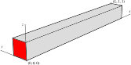

.. _TutorialPoroelasticity:

##############################################
Poromechanics
##############################################

**Context**

In this example, we use a coupled solver to solve a poroelastic Terzaghi-type
problem, a classic benchmark in poroelasticity.
We do so by coupling a single phase flow solver with a small-strain Lagrangian mechanics solver.

**Objectives**

At the end of this example you will know:

  - how to use multiple solvers for poromechanical problems,
  - how to define finite elements and finite volume numerical methods.

**Input file**

This example uses no external input files and everything required is
contained within two GEOSX input files located at:

.. code-block:: console

  inputFiles/poromechanics/integratedTests/PoroElastic_Terzaghi_base_direct.xml

.. code-block:: console

  inputFiles/poromechanics/integratedTests/PoroElastic_Terzaghi_smoke.xml

------------------------------------------------------------------
Description of the case
------------------------------------------------------------------

We simulate the consolidation of a poroelastic fluid-saturated column of height
:math:`L` having unit cross-section.
The column is instantaneously loaded at time :math:`t` = 0 s with a constant
compressive traction :math:`w` applied on the face highlighted in red in the
figure below.
Only the loaded face if permeable to fluid flow, with the remaining parts of
the boundary subject to roller constraints and impervious.

.. _problemSketchFig:

   Sketch of the setup for Terzaghi's problem.

GEOSX will calculate displacement and pressure fields along the column as a
function of time.
We will use the analytical solution for pressure to check the accuracy of the
solution obtained with GEOSX, namely

.. math::
   p(x,t) = \frac{4}{\pi} p_0 \sum_{m=0}^{\infty}
            \frac{1}{2m + 1}
            \text{exp} \left[ -\frac{(2m + 1)^2 \pi^2 c_c t}{4 L^2} \right]
            \text{sin} \left[ \frac{(2m+1)\pi x}{2L} \right],

where :math:`p_0 = \frac{b}{K_vS_{\epsilon} + b^2} |w|` is the initial pressure, constant throughout the column, and :math:`c_c = \frac{\kappa}{\mu} \frac{K_v}{K_v S_{\epsilon} + b^2}` is the consolidation coefficient (or diffusion coefficient), with

- :math:`b` Biot's coefficient
- :math:`K_v = \frac{E(1-\nu)}{(1+\nu)(1-2\nu)}` the uniaxial bulk modulus, :math:`E` Young's modulus, and :math:`\nu` Poisson's ratio
- :math:`S_{\epsilon}=\frac{(b - \phi)(1 - b)}{K} + \phi c_f` the constrained specific storage coefficient, :math:`\phi` porosity, :math:`K = \frac{E}{3(1-2\nu)}` the bulk modulus, and :math:`c_f` the fluid compressibility
- :math:`\kappa` the isotropic permeability
- :math:`\mu` the fluid viscosity

The characteristic consolidation time of the system is defined as :math:`t_c = \frac{L^2}{c_c}`.
Knowledge of :math:`t_c` is useful for choosing appropriately the  timestep sizes that are used in the discrete model.

----------------
Coupled solvers 
----------------

GEOSX is a multi-physics tool. Different combinations of
physics solvers available in the code can be applied
in different regions of the mesh at different moments of the simulation.
The XML ``Solvers`` tag is used to list and parameterize these solvers.

We define and characterize each single-physics solver separately.
Then, we define a *coupling solver* between these single-physics
solvers as another, separate, solver.
This approach allows for generality and flexibility in our multi-physics resolutions.
The order in which these solver specifications is done is not important.
It is important, though, to instantiate each single-physics solver
with meaningful names. The names given to these single-physics solver instances
will be used to recognize them and create the coupling.

To define a poromechanical coupling, we will effectively define three solvers:

 - the single-physics flow solver, a solver of type ``SinglePhaseFVM`` called here ``SinglePhaseFlowSolver`` (more information on these solvers at :ref:`SinglePhaseFlow`),
 - the small-stress Lagrangian mechanics solver, a solver of type ``SolidMechanicsLagrangianSSLE`` called here ``LinearElasticitySolver`` (more information here: :ref:`SolidMechanicsLagrangianFEM`),
 - the coupling solver that will bind the two single-physics solvers above, an object of type ``SinglePhasePoromechanics`` called here ``PoroelasticitySolver`` (more information at :ref:`PoroelasticSolver`).

Note that the ``name`` attribute of these solvers is
chosen by the user and is not imposed by GEOSX.

The two single-physics solvers are parameterized as explained
in their respective documentation.

Let us focus our attention on the coupling solver.
This solver (``PoroelasticitySolver``) uses a set of attributes that specifically describe the coupling for a poromechanical framework.
For instance, we must point this solver to the correct fluid solver (here: ``SinglePhaseFlowSolver``), the correct solid solver (here: ``LinearElasticitySolver``).
Now that these two solvers are tied together inside the coupling solver,
we have a coupled multiphysics problem defined.
More parameters are required to characterize a coupling.
Here, we specify 
the discretization method (``FE1``, defined further in the input file),
and the target regions (here, we only have one, ``Domain``).

.. literalinclude:: ../../../../../inputFiles/poromechanics/PoroElastic_Terzaghi_base_direct.xml
  :language: xml
  :start-after: <!-- SPHINX_POROELASTIC_SOLVER -->
  :end-before: <!-- SPHINX_POROELASTIC_SOLVER_END -->

---------------------------------
Multiphysics numerical methods
---------------------------------

Numerical methods in multiphysics settings are similar to single physics numerical methods. All can be defined under the same ``NumericalMethods`` XML tag.
In this problem, we use finite volume for flow and finite elements for solid mechanics.
Both methods require additional parameterization attributes to be defined here.

As we have seen before, the coupling solver and the solid mechanics solver require the specification of a discretization method called ``FE1``.
This discretization method is defined here as a finite element method
using linear basis functions and Gaussian quadrature rules.
For more information on defining finite elements numerical schemes,
please see the dedicated :ref:`FiniteElement` section.

The finite volume method requires the specification of a discretization scheme.
Here, we use a two-point flux approximation as described in the dedicated documentation (found here: :ref:`FiniteVolume`).

.. literalinclude:: ../../../../../inputFiles/poromechanics/PoroElastic_Terzaghi_base_direct.xml
  :language: xml
  :start-after: <!-- SPHINX_POROELASTIC_NUMERICAL_METHODS -->
  :end-before: <!-- SPHINX_POROELASTIC_NUMERICAL_METHODS_END -->

--------------------------------------------------
Mesh, material properties, and boundary conditions
--------------------------------------------------

Last, let us take a closer look at the geometry of this simple problem.
We use the internal mesh generator to create a beam-like mesh,
with one single element along the Y and Z axes, and 21 elements along the X axis.
All the elements are hexahedral elements (C3D8) of the same dimension (1x1x1 meters).

.. literalinclude:: ../../../../../inputFiles/poromechanics/PoroElastic_Terzaghi_base_direct.xml
  :language: xml
  :start-after: <!-- SPHINX_POROELASTIC_MESH -->
  :end-before: <!-- SPHINX_POROELASTIC_MESH_END -->

The parameters used in the simulation are summarized in the following table.

+----------------+-----------------------+------------------+-------------------+
| Symbol         | Parameter             | Units            | Value             |
+================+=======================+==================+===================+
| :math:`E`      | Young's modulus       | [Pa]             | 10\ :sup:`4`      |
+----------------+-----------------------+------------------+-------------------+
| :math:`\nu`    | Poisson's ratio       | [-]              | 0.2               |
+----------------+-----------------------+------------------+-------------------+
| :math:`b`      | Biot's coefficient    | [-]              | 1.0               |
+----------------+-----------------------+------------------+-------------------+
| :math:`\phi`   | Porosity              | [-]              | 0.3               |
+----------------+-----------------------+------------------+-------------------+
| :math:`\rho_f` | Fluid density         | [kg/m\ :sup:`3`] | 1.0               |
+----------------+-----------------------+------------------+-------------------+
| :math:`c_f`    | Fluid compressibility | [Pa\ :sup:`-1`]  | 0.0               |
+----------------+-----------------------+------------------+-------------------+
| :math:`\kappa` | Permeability          | [m\ :sup:`2`]    | 10\ :sup:`-4`     |
+----------------+-----------------------+------------------+-------------------+
| :math:`\mu`    | Fluid viscosity       | [Pa s]           | 1.0               |
+----------------+-----------------------+------------------+-------------------+
| :math:`|w|`    | Applied compression   | [Pa]             | 1.0               |
+----------------+-----------------------+------------------+-------------------+
| :math:`L`      | Column length         | [m]              | 10.0              |
+----------------+-----------------------+------------------+-------------------+

Material properties and boundary conditions are specified in the
``Constitutive`` and ``FieldSpecifications`` sections.
For such set of parameters we have :math:`p_0` = 1.0 Pa, :math:`c_c` = 1.111 m\ :sup:`2` s\ :sup:`-1`, and :math:`t_c` = 90 s.
Therefore, as shown in the ``Events`` section, we run this simulation for 90 seconds.

--------------
Running GEOSX 
--------------

To run the case, use the following command:

``path/to/geosx -i inputFiles/poromechanics/PoroElastic_Terzaghi_smoke.xml``

Here, we see for instance the ``RSolid`` and ``RFluid`` at a representative timestep
(residual values for solid and fluid mechanics solvers, respectively)

.. code-block:: sh

   Attempt:  0, NewtonIter:  0
   ( RSolid ) = (5.00e-01) ;     ( Rsolid, Rfluid ) = ( 5.00e-01, 0.00e+00 )
   ( R ) = ( 5.00e-01 ) ; 
   Attempt:  0, NewtonIter:  1
   ( RSolid ) = (4.26e-16) ;     ( Rsolid, Rfluid ) = ( 4.26e-16, 4.22e-17 )
   ( R ) = ( 4.28e-16 ) ; 
   

As expected, since we are dealing with a linear problem,
the fully implicit solver converges in a single iteration.

--------------------
Inspecting results
--------------------

This plot compares the analytical pressure solution (continuous lines) at selected
times with the numerical solution (markers).

.. plot::

   import matplotlib
   import matplotlib.pyplot as plt
   import numpy as np
   import h5py
   import xml.etree.ElementTree as ElementTree
   from mpmath import *
   import math

   class terzaghi:

       def __init__(self, hydromechanicalParameters, xMin, xMax, appliedTraction):
           E = hydromechanicalParameters["youngModulus"]
           nu = hydromechanicalParameters["poissonRation"]
           b = hydromechanicalParameters["biotCoefficient"]
           mu = hydromechanicalParameters["fluidViscosity"]
           cf = hydromechanicalParameters["fluidCompressibility"]
           phi = hydromechanicalParameters["porosity"]
           k = hydromechanicalParameters["permeability"]

           K = E / 3.0 / (1.0 - 2.0 * nu) # bulk modulus
           Kv = E * (1.0 - nu) / ((1.0 + nu) * (1.0 - 2.0 * nu )) # uniaxial bulk modulus
           Se = (b - phi) * (1.0 - b) / K + phi * cf          # constrained specific storage

           self.characteristicLength = xMax - xMin
           self.appliedTraction = abs(appliedTraction)
           self.loadingEfficiency = b / (Kv * Se + b**2)
           self.consolidationCoefficient = (k / mu) * Kv / (Se * Kv + b**2)
           self.consolidationTime = self.characteristicLength**2 / self.consolidationCoefficient
           self.initialPressure = self.loadingEfficiency * self.appliedTraction

       def computePressure(self, x, t):
           if  t == 0.0:
               return self.initialPressure
           else:
               cc = self.consolidationCoefficient
               L = self.characteristicLength
               p = nsum(lambda m: 1 / (2 * m + 1)
                 * exp(-((2 * m + 1) ** 2) * (math.pi ** 2) * cc * t / 4 / L / L)
                 * sin((2 * m + 1) * math.pi * x / 2 / L), [0, inf])
               return 4 * self.initialPressure / math.pi * p

   def getHydromechanicalParametersFromXML( xmlFilePath ):
       tree = ElementTree.parse(xmlFilePath)

       param1 = tree.find('Constitutive/ElasticIsotropic')
       param2 = tree.find('Constitutive/BiotPorosity')
       param3 = tree.find('Constitutive/CompressibleSinglePhaseFluid')
       param4 = tree.find('Constitutive/ConstantPermeability')

       hydromechanicalParameters = dict.fromkeys(["youngModulus",
                                                  "poissonRation",
                                                  "biotCoefficient",
                                                  "fluidViscosity",
                                                  "fluidCompressibility",
                                                  "porosity",
                                                  "permeability"])

       hydromechanicalParameters["youngModulus"] = float(param1.get("defaultYoungModulus"))
       hydromechanicalParameters["poissonRation"] = float(param1.get("defaultPoissonRatio"))

       E = hydromechanicalParameters["youngModulus"]
       nu = hydromechanicalParameters["poissonRation"]
       K = E / 3.0 / (1.0 - 2.0 * nu )
       Kg = float(param2.get("grainBulkModulus"))

       hydromechanicalParameters["biotCoefficient"] = 1.0 - K / Kg
       hydromechanicalParameters["porosity"] = float(param2.get("defaultReferencePorosity"))
       hydromechanicalParameters["fluidViscosity"] = float(param3.get("defaultViscosity"))
       hydromechanicalParameters["fluidCompressibility"] = float(param3.get("compressibility"))
       
       perm = param4.get("permeabilityComponents")
       perm = np.array(perm[1:-1].split(','),float)
       hydromechanicalParameters["permeability"] = perm[0]
       
       return hydromechanicalParameters

   def getAppliedTractionFromXML( xmlFilePath ):
       tree = ElementTree.parse(xmlFilePath)
       param = tree.find('FieldSpecifications/Traction')
       return float(param.get("scale"))

   def getDomainMaxMinXCoordFromXML(xmlFilePath):
       tree = ElementTree.parse(xmlFilePath)
       meshElement = tree.find('Mesh/InternalMesh')
       nodeXCoords = meshElement.get("xCoords")
       nodeXCoords = [float(i) for i in nodeXCoords[1:-1].split(",")]
       xMin = nodeXCoords[0]
       xMax = nodeXCoords[-1]
       return xMin, xMax

   def main():
       # File path
       hdf5FilePath = "pressure_history.hdf5"
       xmlBaseFilePath = "../../../../../inputFiles/poromechanics/PoroElastic_Terzaghi_base_direct.xml"
       xmlSmokeFilePath = "../../../../../inputFiles/poromechanics/PoroElastic_Terzaghi_smoke.xml"
   
       # Read HDF5
       hf = h5py.File(hdf5FilePath, 'r')
       time = hf.get('pressure Time')
       pressure = hf.get('pressure')
       x = hf.get('pressure elementCenter')
   
       # Extract info from XML
       hydromechanicalParameters = getHydromechanicalParametersFromXML(xmlBaseFilePath)
       appliedTraction = getAppliedTractionFromXML(xmlBaseFilePath)
   
       # Get domain min/max coordinate in the x-direction
       xMin, xMax =getDomainMaxMinXCoordFromXML(xmlSmokeFilePath)
   
       # Initialize Terzaghi's analytical solution
       terzaghiAnalyticalSolution = terzaghi(hydromechanicalParameters, xMin, xMax, appliedTraction)
   
       # Plot analytical (continuous line) and numerical (markers) pressure solution
       x_analytical = np.linspace(xMin, xMax, 51, endpoint=True)
       pressure_analytical = np.empty(len(x_analytical))
   
       cmap = plt.get_cmap("tab10")
       iplt = -1
       for k in range(0, len(time), 2):
           iplt += 1
           t = time[k,0]
           i = 0
           for xCell in x_analytical:
               xScaled = terzaghiAnalyticalSolution.characteristicLength * (xCell - xMin) / (xMax - xMin)
               pressure_analytical[i] = terzaghiAnalyticalSolution.computePressure(xScaled, t)
               i += 1
           plt.plot(x_analytical, pressure_analytical, color=cmap(iplt), label='t = ' + str(t) + ' s')
           plt.plot(x[k, :, 0], pressure[k, :], 'o', color=cmap(iplt))
   
       plt.grid()
       plt.xlabel('$x$ [m]')
       plt.ylabel('pressure [Pa]')
       plt.legend(bbox_to_anchor=(0.1, 0.55), loc='lower left', borderaxespad=0.)
       plt.show()
   
   if __name__ == "__main__":
       main()

------------------------------------------------------------------
To go further
------------------------------------------------------------------

**Feedback on this example**

This concludes the poroelastic example.
For any feedback on this example, please submit a `GitHub issue on the project's GitHub page <https://github.com/GEOSX/GEOSX/issues>`_.

**For more details**

  - More on poroelastic multiphysics solvers, please see :ref:`PoroelasticSolver`.
  - More on numerical methods, please see :ref:`NumericalMethodsManager`.
  - More on functions, please see :ref:`FunctionManager`.
