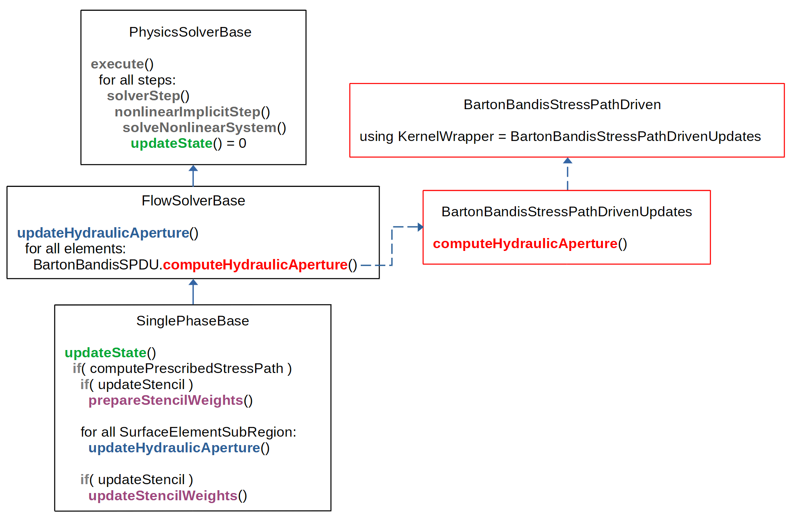

.. _stressPathDrivenExample:

#############################################################
Stress-Path Driven Simulation
#############################################################

**Context**

In this example, we demonstrate how to set up a single-phase flow simulation driven by the oedometric stress path. The domain contains a single fracture, whose aperture is updated according to the Barton–Bandis constitutive law.

**Objectives**

At the end of this example, you will know:

 - how to set up the Barton-Bandis parameters for the oedometric stress path simulation
 - how to update the fracture aperture without a mechanics solver

**Input file**

The XML file for this test case is located at:

.. code-block:: console

  inputFiles/stressPathDrivenGeomechanics/fractureMatrixFlow_edfm_horizontalFrac_SPD_smoke.xml

------------------------------------------------------------------
Description of the case
------------------------------------------------------------------

This example is part of the research about integrating geomechanical effects into the Embedded Discrete Fracture Model (EDFM). Here, the EDFM formulation was coupled with analytical poromechanics under an Oedometric Stress Path assumption (flat reservoir with low contrast between it and adjacent formation stiffness), enabling a direct relationship between pore-pressure variations and changes in effective normal stress. These stresses, in turn, govern aperture evolution via the Barton–Bandis constitutive law. Also, we assume:

 - In-situ stress data are available
 - Andersonian stress regime (no lateral stress, constant vertical total stress)
 - Permeability computed by Parallel Plates law

The simulation presented below is a simplified case designed to validate the implementation against the analytical solution detailed in the Section ..... The simplification include the use of a single-phase flow solver with TPFA as discretization method, an impermeable matrix, and a through-going fracture.
 
------------------------------
Mesh and geometry
------------------------------

The hexahedral mesh is generated internally and consists of 11 cells aligned along the Y-axis, each measuring 1x1x1 m. The fracture is represented as a plane that crosses the entire domain, dividing it into two halves. A pressure gradient is applied at the boundary cells of the domain and directly at the fracture tips.

.. figure:: stressPathDrivenExampleParaview.png
   :align: center
   :width: 500
   :figclass: align-center

   Visualization of the first simulation step. 

------------------------------
Initial Conditions
------------------------------

This example needs the following input values to work properly:

- Surface Element Region's default aperture and Stress-path driven reference aperture must be the same.
- Initial pressure in the rock and fracture must be the same.
- Stress-path driven reference pressure must equal the initial pressure.

------------------------------
Constitutive law
------------------------------

The new class ``BartonBandisStressPathDriven`` follows a similar implementation to the class ``BartonBandis``. Both are defined as contact laws managed by the ``HydraulicApertureRelationSelector``, and each contains a private kernel responsible for computing the updated hydraulic aperture. However, because the proposed formulation of the Barton–Bandis model is stress-dependent, the implementation of the new class’s kernel differs and requires the following inputs:

.. literalinclude:: ../../../../../inputFiles/stressPathDrivenGeomechanics/fractureMatrixFlow_edfm_SPD_base.xml
  :language: xml
  :start-after: <!-- SPHINX_TUT_STRESS_PATH_DRIVEN_LAW -->
  :end-before: <!-- SPHINX_TUT_STRESS_PATH_DRIVEN_LAW_END -->

In summary, by assuming the oedometric conditions, it is possible to relate pore pressure and total stresses by

.. math::
   \Delta \sigma_V = \alpha\, \Delta p, \qquad \Delta \sigma_H = \Delta \sigma_h = \frac{\nu}{1 - \nu}\, \Delta \sigma_V 
   
where :math:`\alpha` is the Biot coefficient and :math:`\nu` is Poisson's ratio.

Given the in-situ effective stress,

.. math::
	\sigma_0 = \sigma_{\text{ref}} - \alpha\, p_0\, I,

where :math:`p_0` is the reference pore pressure, we compute the normal stress acting on the fracture plane by projecting the updated total stress tensor onto the fracture normal direction:

.. math::
	\sigma_n = \left( \sigma_0 - \sigma_T \right) : (\vec{n} \otimes \vec{n}),

where :math:`\vec{n}` is the unit normal vector to the fracture plane.

Once the normal effective stress is obtained, the fracture closure is computed using the Barton--Bandis hyperbolic law, which relates normal stress to mechanical aperture reduction. The fracture 
closure is given by

.. math::
	g_n(\sigma_n) = \frac{\sigma_n\, V_m}{K_{ni}\, V_m + \sigma_n},

where :math:`K_{ni}` is the initial normal stiffness and :math:`V_m` is the maximum possible closure. 
The resulting closure is then used to update the aperture (:math:`a`), from which the intrinsic fracture permeability (:math:`K_f`) is obtained using the parallel-plates law

.. math::
	K_f = \frac{a^2}{12}.

Both quantities — the updated aperture and the resulting permeability — affect the EDFM transmissibilities.

------------------------------------------------------------------
Single-phase flow solver with fracture aperture update
------------------------------------------------------------------

The single-phase flow solver definition in the input file remains the same, with the exception of one optional flag. The flag ``computePrescribedStressPath`` enables the computation of the updated fracture aperture using the new ``BartonBandisStressPathDriven`` class. If this constitutive law is not defined in the input file while the flag is set to 1, an error will be raised. Also, if this flag is set to 0, the fracture aperture will not be updated, even if the constitutive law is defined.

.. literalinclude:: ../../../../../inputFiles/stressPathDrivenGeomechanics/fractureMatrixFlow_edfm_SPD_base.xml
  :language: xml
  :start-after: <!-- SPHINX_TUT_STRESS_PATH_DRIVEN -->
  :end-before: <!-- SPHINX_TUT_STRESS_PATH_DRIVEN_END -->

To trigger the fracture aperture computation, the new constitutive class had to be visible to the ``FlowSolverBase`` class. This required a modification to the code architecture, once flow solvers in the current version of GEOS can only manipulate constitutive law classes for permeability and porosity. Since the new class is a contact law, the header file of its manager (``HydraulicApertureRelationSelector``) is now included and therefore accessible to all flow solvers. A new function was then implemented to apply the stress-path driven Barton–Bandis law to the fracture elements, and it is defined in the ``FlowSolverBase`` class.

This new functionality is illustrated in the diagram below. The entry point of the updated code flow is the ``updateState`` function in the ``PhysicsSolverBase`` class. The execution then proceeds to its implementation in the ``SinglePhaseBase`` class, two levels below in the class hierarchy. If the ``computePrescribedStressPath`` flag is enabled, the function defined in the ``FlowSolverBase`` class is invoked to compute the updated fracture aperture using the stress-path-driven Barton–Bandis class.

   Diagram of the new implementation to incorporate Barton-Bandis law to the single-phase flow solver. 

------------------------
Events
------------------------

Saving the data of the pressure and aperture of the fracture.

.. literalinclude:: ../../../../../inputFiles/stressPathDrivenGeomechanics/fractureMatrixFlow_edfm_horizontalFrac_SPD_smoke.xml
  :language: xml
  :start-after: <!-- SPHINX_TUT_STRESS_PATH_DRIVEN_TIMEHISTORY -->
  :end-before: <!-- SPHINX_TUT_STRESS_PATH_DRIVEN_TIMEHISTORY_END -->

------------------------------
Unit test
------------------------------

The function implemented in the ``BartonBandisStressPathDriven`` class can be tested by verifying if in the first step of the simulation, at reference pressure, the new fracture aperture is the in-situ aperture.

------------------------------------------------------------------
To go further
------------------------------------------------------------------

**Feedback on this example**

For any feedback on this example, please submit a `GitHub issue on the project's GitHub page <https://github.com/GEOS-DEV/GEOS/issues>`_.
