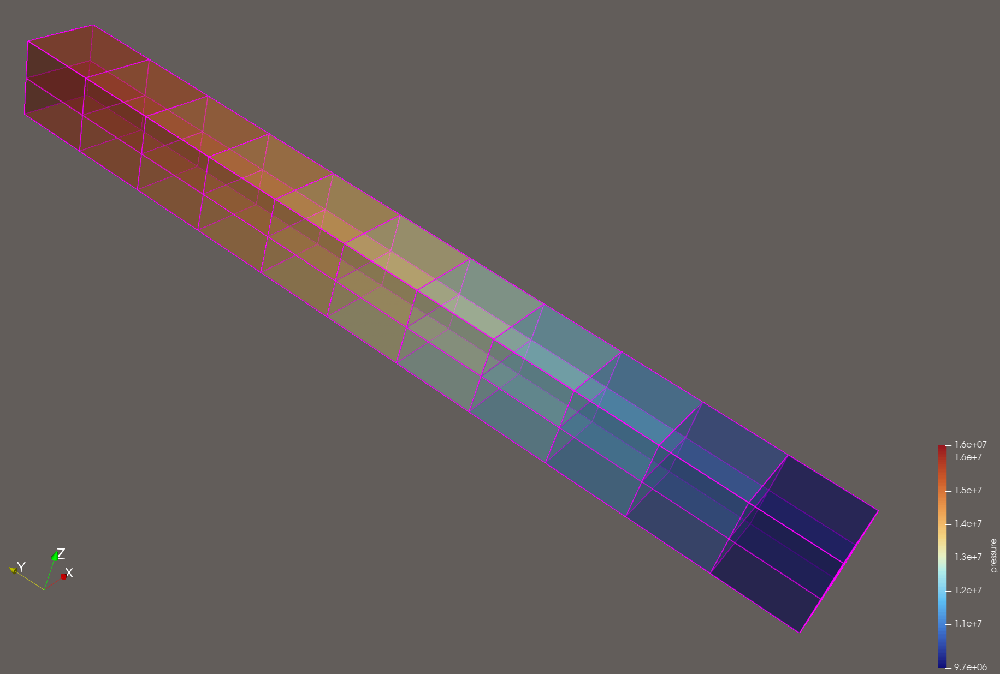

.. _stressPathDrivenExample:

#############################################################
Stress-Path Driven Simulation
#############################################################

**Context**

In this example, we show how to set up a single-phase simulation driven by the oedometric stress path. The domain contains only one fracture, and its aperture is updated by the Barton-Bandis constitutive law.

**Objectives**

At the end of this example, you will know:

 - how to set up the Barton-Bandis parameters for the oedometric stress path simulation
 - how to update the fracture aperture without a mechanics solver

**Input file**

The XML file for this test case is located at:

.. code-block:: console

  inputFiles/stressPathDrivenGeomechanics/fractureMatrixFlow_edfm_horizontalFrac_SPD_smoke.xml

------------------------------------------------------------------
Description of the case
------------------------------------------------------------------

This example is part of the research about integrating geomechanical effects into the Embedded Discrete Fracture Model (EDFM). Here, the EDFM formulation was coupled with analytical poromechanics under an Oedometric Stress Path assumption (flat reservoir with low contrast between it and adjacent formation stiffness), enabling a direct relationship between pore-pressure variations and changes in effective normal stress. These stresses, in turn, govern aperture evolution via the Barton–Bandis constitutive law. Also, we assume:

 - In-situ stress data are available
 - Andersonian stress regime (no lateral stress, constant vertical total stress)
 - Permeability computed by Parallel Plates law

The simulation presented below is a simplified case designed to validate the implementation according to the analytical solution detailed in the Section ... The simplification includes setting a single-phase solver and TPFA as discretization method.
 
------------------------------
Mesh and geometry
------------------------------

The hexahedron mesh is generated internally, and it contains a sequence in Y axis of 11 cells of size 1x1x1 meters. The fracture is defined as a plane crossing all the domain, cutting it in half. Also, the pressure gradient is defined at the end cells of the domain, and on the tips of the fracture.

.. literalinclude:: ../../../../../inputFiles/stressPathDrivenGeomechanics/fractureMatrixFlow_edfm_SPD_base.xml
  :language: xml
  :start-after: <!-- SPHINX_TUT_STRESS_PATH_DRIVEN_PRESSURE -->
  :end-before: <!-- SPHINX_TUT_STRESS_PATH_DRIVEN_PRESSURE_END -->
  
  

------------------------------
Constitutive law
------------------------------

The new class ``BartonBandisStressPathDriven`` follows a similar implementation to class ``BartonBandis``. Both are defined as a constitutive contact law managed by the ``HydraulicApertureRelationSelector``, both have a private kernel to compute the new hydraulic aperture.

.. literalinclude:: ../../../../../inputFiles/stressPathDrivenGeomechanics/fractureMatrixFlow_edfm_SPD_base.xml
  :language: xml
  :start-after: <!-- SPHINX_TUT_STRESS_PATH_DRIVEN_LAW -->
  :end-before: <!-- SPHINX_TUT_STRESS_PATH_DRIVEN_LAW_END -->

------------------------------------------------------------------
Single-phase flow solver with fracture aperture update
------------------------------------------------------------------

The single-phase solver definition in the input file is still the same, except for the addition of two optional flags. The first, ``computesPrescribedStressPath``, enables the computation of the new fracture aperture through the new class ``BartonBandisStressPathDriven``. If this constitutive law is not defined in the input file when the flag equals 1, an error will be raised. Also, if this flag is 0, even if the constitutive law is defined, the fracture aperture will not be updated. The second flag, ``updatesStencil``, enables the update of the geometric component of the transmissibility.

.. literalinclude:: ../../../../../inputFiles/stressPathDrivenGeomechanics/fractureMatrixFlow_edfm_SPD_base.xml
  :language: xml
  :start-after: <!-- SPHINX_TUT_STRESS_PATH_DRIVEN -->
  :end-before: <!-- SPHINX_TUT_STRESS_PATH_DRIVEN_END -->

   
------------------------
Events
------------------------

Saving the data of the pressure and aperture of the fracture.

.. literalinclude:: ../../../../../inputFiles/stressPathDrivenGeomechanics/fractureMatrixFlow_edfm_horizontalFrac_SPD_smoke.xml
  :language: xml
  :start-after: <!-- SPHINX_TUT_STRESS_PATH_DRIVEN_TIMEHISTORY -->
  :end-before: <!-- SPHINX_TUT_STRESS_PATH_DRIVEN_TIMEHISTORY_END -->

------------------------------
Unit test
------------------------------

The function implemented in the ``BartonBandisStressPathDriven`` class can be tested by verifying if in the first step of the simulation, at reference pressure, the new fracture aperture is the in-situ aperture.

------------------------------------------------------------------
To go further
------------------------------------------------------------------

**Feedback on this example**

For any feedback on this example, please submit a `GitHub issue on the project's GitHub page <https://github.com/GEOS-DEV/GEOS/issues>`_.
