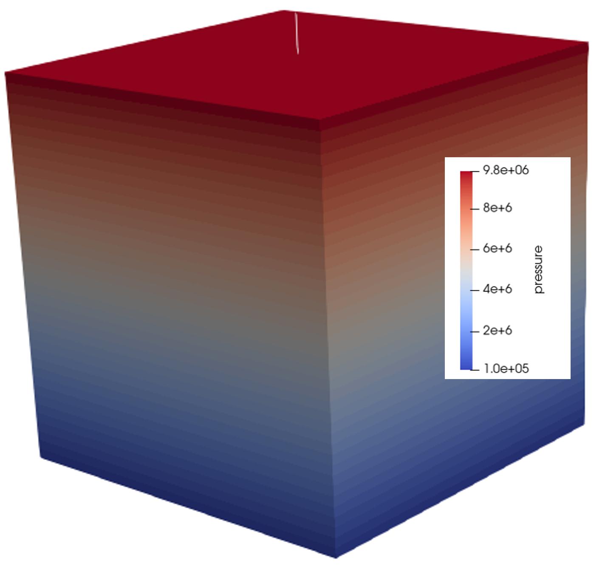

.. _userdefinedstressinitialization:

#################################################################################
 Verification of User Defined Stress Initialization
#################################################################################

**Context**

This example build uses the same simple reservoir model as in the gravity induced hysrostatic stress initialization case (see :ref:`gravityinducedhydrostaticinitialization`). In this example, however, we provide the stress and pore pressure gradients for a reservoir under an hydrostatic pressure equilibrium and then request the simulator to perform an initialization of the stresses in every element in the numerical model. The problem is also solved by using the singlephase poromechanics solver (see :ref:`PoroelasticSolver`) in Geos.

**Input file**

The xml input files for the test case are located at:

.. code-block:: console

  inputFiles/initialization/userdefinedStress_initialization_base.xml
  inputFiles/initialization/userdefinedStress_initialization_benchmark.xml

-------------------------------------
Stress Initialization Table Functions
-------------------------------------

The major distinction between this "user-defined" initialization and the "gravity-based" initialization is that in the user-defined case, the user provides the following additional information:

  - The effective stresses at the top and base of the model.

This is shown in the following tags under the ``FieldSpecifications`` section below

.. literalinclude:: ../../../../../inputFiles/initialization/userdefinedStress_initialization_base.xml
    :language: xml
    :start-after: <!-- SPHINX_USER_TABLES -->
    :end-before: <!-- SPHINX_USER_TABLES_END -->

The tables for ``sigma_xx``, ``sigma_yy``, ``sigma_zz`` and ``init_pressure`` are listed under the ``Functions`` section as shown below.

.. literalinclude:: ../../../../../inputFiles/initialization/userdefinedStress_initialization_base.xml
    :language: xml
    :start-after: <!-- SPHINX_FUNCTIONS -->
    :end-before: <!-- SPHINX_FUNCTIONS_END -->
    
The required input files: x.csv, y.csv, z.csv, effectiveSigma_xx.csv, effectiveSigma_yy.csv, effectiveSigma_zz.csv, and porePressure.csv are generated based on the expected stress-gradients in the model.

A Python script to generate these files is provided:

.. code-block:: console

  src/docs/sphinx/basicExamples/initialization/genetrateTable.py

In addition to generating the files listed above, the script prints out the resultant fluid density and rock density based on the model parameters provided. These values are then input into the ``defaultDensity`` parameter of the ``CompressibleSinglePhaseFluid`` and ``ElasticIsotropic`` tags, respectively, as shown below:

.. literalinclude:: ../../../../../inputFiles/initialization/userdefinedStress_initialization_base.xml
    :language: xml
    :start-after: <!-- SPHINX_Modify_Density -->
    :end-before: <!-- SPHINX_Modify_Density_END -->

.. literalinclude:: ../../../../../inputFiles/initialization/userdefinedStress_initialization_base.xml
    :language: xml
    :start-after: <!-- SPHINX_Modify_FluidDensity -->
    :end-before: <!-- SPHINX_Modify_FluidDensity_END -->

---------------------------------
Inspecting results
---------------------------------

In the example, we request vtk output files for time-series (time history). We use Python scripts to visualize the outcome at the time 0s.
The following figure shows the final gradient of pressure after initialization is completed.

.. _problemInitializationPres:

   Simulation result of pressure

The figure below shows the comparisons between the numerical predictions (marks) and the corresponding user-provided stress gradients.

.. plot:: docs/sphinx/basicExamples/userTableStressInitialization/plotInitialization_usertable.py

------------------------------------------------------------------
To go further
------------------------------------------------------------------

**Feedback on this example**

For any feedback on this example, please submit a `GitHub issue on the project's GitHub page <https://github.com/GEOS-DEV/GEOS/issues>`_.
