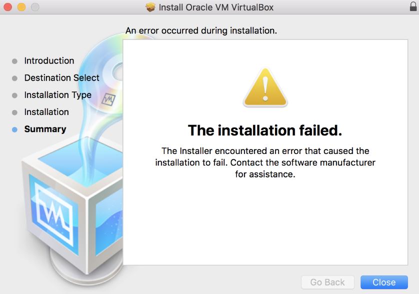
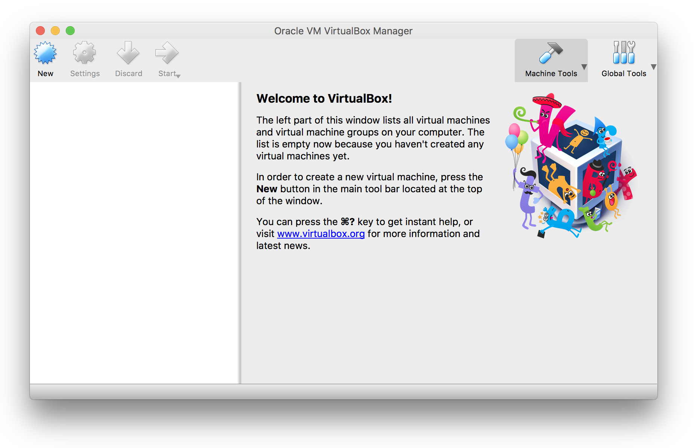

Appendix: Running an Ubuntu Virtual Machine on OSX
================================================================================

This document summarizes the steps needed to install and run Ubuntu on a Virtual Machine on OSX.
The virtualization layer provided by VirtualBox will be used.
Many Mac users find this approach more straightforward than setting up a native OSX environment for GEOSX.

Installing VirtualBox
--------------------------------------------------------------------------------

The following instructions are taken from `Matthew Palmer's blog <https://matthewpalmer.net/blog/2017/12/10/install-virtualbox-mac-high-sierra/index.html>`__.

- Download the latest binary for OS X hosts from the VirtualBox `downloads <https://www.virtualbox.org/wiki/Downloads>`__ page.

- Run the VirtualBox installer.

- After reaching the end, installation will fail with the following message

- Navigate to System Preferences > Security & Privacy. At the bottom of the window, you should see a message saying “System software from developer, ‘Oracle, America, Inc.‘ was blocked from loading.”

- Click the lock in the bottom left corner, enter your password

- Click ‘Allow’ next to the ”blocked from loading” message.

- Re-run the VirtualBox installer. It should succeed.

Creating an Ubuntu Virtual Machine
--------------------------------------------------------------------------------
- Download an image of the latest Long Term Support (LTS) version of Ubuntu `here <https://www.ubuntu.com/download/desktop>`__.

- Open the VirtualBox Manager window by double-clicking on the "VirtualBox" item in the "Applications" folder.

- Click on the "New" button at the top of the VirtualBox Manager window.   A wizard will pop up to guide you through setting up a new virtual machine (VM):

  1. Define name and operating system for the Ubuntu Virtual Machine

  .. image:: VM_install_02.png
    :width: 400

  2. Assign memory size to be assigned to the Virtual Machine

  .. image:: VM_install_03.png
    :width: 400

  3. Create a virtual disk

  .. image:: VM_install_04.png
    :width: 400

  4. Select the virtual disk type

  Select the VDI option.

  .. image:: VM_install_05.png
    :width: 400

  5. Select the memory allocation type for the virtual hard disk.

  For better performance, use a fixed-size virtual hard drive.

  .. image:: VM_install_06.png
    :width: 400

  6. Specify the Name and Size of the virtual hard disk

  This depends on the amount of free memory on your computer; 30GB is a reasonable choice. Feel free to type in the hard drive size manually using GB for gigabytes.

  .. image:: VM_install_07.png
    :width: 400

  7. Install the operating system of the Virtual Machine

  Navigate to the virtual box to the Ubuntu .iso file. Unless specified otherwise, it should reside in your Download folder. Then click `Start`

  .. image:: VM_install_09.png
    :width: 400

- Installation of the Ubuntu Virtual machine

  1. Select your language and click on "Install Ubuntu"

  .. image:: Ubuntu_installation_01.png
    :width: 400

  2. Select a Normal Installation, and activate the download of updates

  .. image:: Ubuntu_installation_02.png
    :width: 400

  3. Proceed with the installation

  .. image:: Ubuntu_installation_03.png
    :width: 400

  4. Select your Ubuntu username and password

  .. image:: Ubuntu_installation_04.png
    :width: 400

  5. If successful, follow the prompt to reboot your virtual machine

  .. image:: Ubuntu_installation_05.png
    :width: 400

- After restarting the Virtual Machine, login, open a new terminal (``control+option+T``) and install Ubuntu updates

.. code-block:: sh

  sudo apt update
  sudo apt upgrade

- Customize the Virtual machine

  We will now configure the shared drive and shared clipboard between your virtual Ubuntu machine and your host MacOS machine.

  1. Right-click on the newly created Ubuntu Virtual Machine in the VM Virtual Box Manager, and select Settings

  .. image:: VM_settings_01.png
    :width: 400

  2. Under the General section, in the Advanced tab, select bidirectional clipboard and drag'n drop options.

  This allows you to copy-paste and drag-and-drop files seamlessly and in both directions between your virtual and real machine.

  .. image:: VM_settings_02.png
    :width: 400

  3. Under the System section in the Processor tab, assign the maximum number of processors and RAM available to the Virtual Machine

  .. image:: VM_settings_03.png
    :width: 400

  4. In the Shared Folder section, add a shared folder for the Ubuntu Virtual Machine on the MacOS host.

  .. image:: VM_settings_04c.png
    :width: 400

Click ``OK`` to close all Settings windows.

  5. Start the virtual machine and log in

  Once the machine has finished booting, notice the application menu bar at the very top of your host machine screen (the VirtualBox VM bar) has now a Device option.

     - Go to Devices > Insert Guest Additions CD image

     - At the prompt, click on Run

     - Open a terminal and yourself to the Virtual Box share folder group and reboot

     .. code-block:: sh

      sudo usermod -G vboxsf -a YOUR_USERNAME
      reboot

     - The shared folder will now be accessible and located at `` /media/sf_FOLDER_NAME``.
