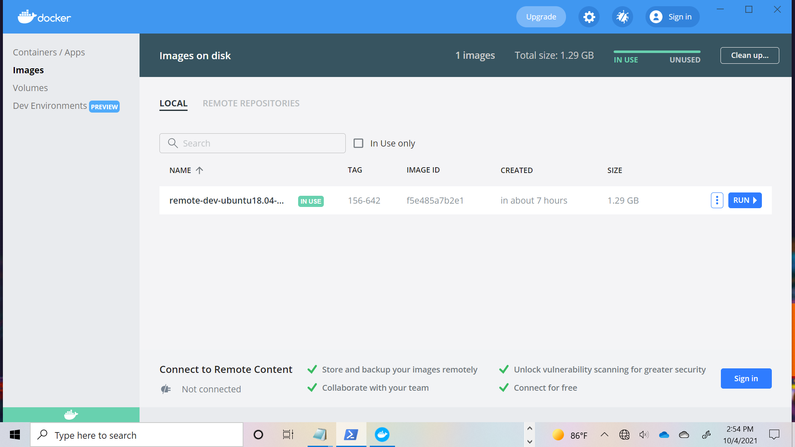
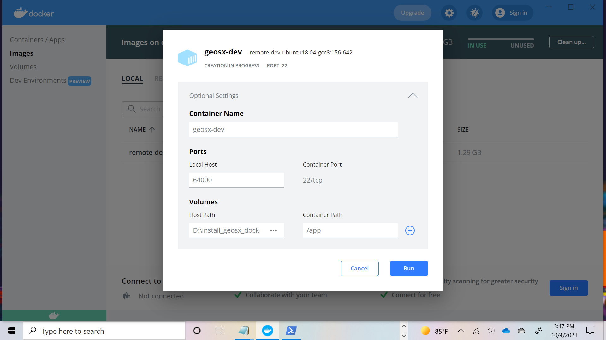

.. _InstallWin:

[Best effort] Installing GEOS on Windows machines using Docker
=================================================================

In this section, we will install GEOS on a Windows machine using a ``Docker`` container with a precompiled version of
GEOS's third party libraries (TPL). These steps are an adaptation of `ref:UsingDocker` for the Windows environment.
In the following sections, we will be using *Ubuntu* based image as an example.

1. Install *Docker Desktop*
----------------------------

On your Windows machine, follow these `steps <https://docs.docker.com/desktop/windows/install/>`_.
Download the most recent installer for *Docker Desktop*. Before installation please check the current status of Windows
Subsystem for Linux ( ``WSL`` ) on your machine as ``Docker`` will use ``WSL2`` as a `backend <https://docs.docker.com/desktop/windows/wsl/>`_.
To do that, open a ``PowerShell(Admin)``

.. PS admin

.. code:: shell

        PS > wsl --install
        PS > wsl --status
        PS > wsl --set-default-version 2
        PS > wsl --status

The first command should install *WSL2*, download an *Ubuntu* distribution for it and ask for a restart.
The following commands are used to check the status, and if the ``WSL`` is still the default one, change it to ``WSL2``.
More details on the installation procedure can be found `here <https://docs.microsoft.com/en-us/windows/wsl/install>`_.

Once the ``WSL2`` is set as default, proceed with the *Docker Desktop* installation.

2. Start *Docker Desktop*
----------------------------

When launching Docker Desktop for the first time, you should be prompted with a message informing you that it uses ``WSL2``.
Using ``PowerShell``, you can check that ``Docker`` and ``WSL2`` are actually running in the background:

.. code:: shell

    PS > Get-Process docker
    Handles  NPM(K)    PM(K)      WS(K)     CPU(s)     Id  SI ProcessName
    -------  ------    -----      -----     ------     --  -- -----------
        123      11    26084      25608       0.42  13960   1 docker

    PS > Get-Process wsl
    Handles  NPM(K)    PM(K)      WS(K)     CPU(s)     Id  SI ProcessName
    -------  ------    -----      -----     ------     --  -- -----------
        146       8     1412       6848       0.05  14816   1 wsl
        146       7     1356       6696       0.02  15048   1 wsl
        145       7     1368       6704       0.02  15100   1 wsl
        145       7     1352       6716       0.14  15244   1 wsl
        146       7     1396       6876       0.02  16156   1 wsl

You should be able to see one docker process and several *wsl* processes.

3. Preparing *DockerFile*
--------------------------

Let us now prepare the installation, picking a destination folder and editing our ``Dockerfile``:

.. code:: shell

    PS > cd D:/
    PS > mkdir install-geosx-docker
    PS > cd install-geosx-docker/
    PS > notepad.exe Dockerfile

Let us edit the ``Dockerfile``, which is the declarative file for out container:

.. literalinclude:: Dockerfile-remote-dev.example
   :linenos:

This file enriches a base image already containing the GEOS's TPL as well as extra utils, such as ``cmake`` and preparing for ssh connexion.
In the end, we will be able to run it in a detached mode, and connect to it to run and develop in GEOS.

There are two things you may have noticed reading through the ``Dockerfile`` :

- It has environment variables to be passed to it to select the proper image to pull, namely ``${ORG}``, ``${IMG}`` and ``${VERSION}``, we'll then have to declare them

.. code:: shell

    PS> $env:VERSION='224-965'
    PS> $env:IMG='ubuntu20.04-gcc9'
    PS> $env:REMOTE_DEV_IMG="remote-dev-${env:IMG}"

Please note the preposition of ``env:`` in the windows formalisme. The ``${ORG}`` variable will be hard-coded as ``geosx``. The last variable will be use
as the image name. ``224-965`` refers to a specific version of the TPLs which may not be up to date. Please refer to :ref:`Continuous_Integration_process` for further info.

- You'll need to generate a ssh-key to be able to access the container without the need for defining a password. This can be done from the *PowerShell*,

.. code:: shell

    PS > ssh-keygen.exe
    PS > cat [path-to-gen-key]/[your-key].pub

The first command will prompt you with a message asking you to complete the desired path for the key as well as a passphrase, with confirmation.
More details on `ssh-key generation <https://docs.microsoft.com/en-us/windows-server/administration/openssh/openssh_keymanagement#user-key-generation>`_.

4. Build the image and run the container
-----------------------------------------

The preliminary tasks are now done. Let us build the image that will be containerized.

.. code:: shell

    PS> cd [path-to-dockerfile-folder]/
    PS > docker build --build-arg ORG=geosx --build-arg IMG=${env:IMG} --build-arg VERSION=${env:VERSION} -t ${env:REMOTE_DEV_IMG}:${env:VERSION} -f Dockerfile .

As described above, we are passing our environment variables in the building stage, which offer the flexibility of changing the version or image by a simple redefinition.
A log updating or pulling the different layers should be displayed afterwards and on the last line the *image id*. We can check that the image is created using ``PowerShell`` CLI:

.. code:: shell

    PS > docker images

or using the *Docker Desktop*

Now that we have the image build, let us run a container from,

.. code:: shell

    PS > docker run --cap-add=SYS_PTRACE  -d --name ${env:REMOTE_DEV_IMG}-${env:VERSION} -p 64000:22 --mount 'type=bind,source=D:/install_geosx_docker/,target=/app' ${env:REMOTE_DEV_IMG}:${env:VERSION}

Note that in addition to the detached flag (``-d``) and the name tage (``--name``), we provide ``Docker`` with the port the container should be associated to
communicate with ssh port 22, as well as a binding between a host mount point (``D:/install_geosx_docker/``) and a container mount point (``/app``) to have a peristent storage
for our development/geosx builds. More details on the `--mount options <https://docs.docker.com/storage/bind-mounts/>`_

A similar step can be achieved using the *Docker Desktop* GUI in the image tabs, clicking on the *run* button and filling the same information in the interface,

Coming back to our ``PowerShell`` terminal, we can check that our container is running and trying to ssh to it.

.. code:: shell

    PS > docker ps -a
    CONTAINER ID   IMAGE                                 COMMAND               CREATED                  STATUS          PORTS                                     NAMES
    1efffac66c4c   remote-dev-ubuntu20.04-gcc9:224-965   "/usr/sbin/sshd -D"   Less than a second ago   Up 18 seconds   0.0.0.0:64000->22/tcp, :::64000->22/tcp   remote-dev-ubuntu20.04-gcc9-224-965

    PS > ssh root@localhost -p 64000
    Enter passphrase for key 'C:\***********/.ssh/id_rsa':
    Welcome to Ubuntu 18.04.5 LTS (GNU/Linux 5.10.16.3-microsoft-standard-WSL2 x86_64)

     * Documentation:  https://help.ubuntu.com
     * Management:     https://landscape.canonical.com
     * Support:        https://ubuntu.com/advantage
    This system has been minimized by removing packages and contents that are
    not required on a system that users do not log into.

    To restore this content, you can run the 'unminimize' command.

    The programs included with the Ubuntu system are free software;
    the exact distribution terms for each program are described in the
    individual files in /usr/share/doc/*/copyright.

    Ubuntu comes with ABSOLUTELY NO WARRANTY, to the extent permitted by
    applicable law.

    root@b105f9ead860:~# cd /app && ls

We are now logged into our container and can start :ref:`QuickStart`.

.. note::
    Note that :

        #. You might be prompted that you miss certificates to clone, this can be resolved by installing *ca-certificates* and updating them
        #. It might occur that *git-lfs* is missing then install it

        .. code:: shell

                PS > apt install ca-certificates && update-ca-certificates
                PS > apt install git-lfs

From there you should be able to develop in your container or access it from an IDE, e.g. `VSCode <https://code.visualstudio.com/docs/remote/ssh>`_
or `MSVC19 <https://docs.microsoft.com/en-us/cpp/linux/connect-to-your-remote-linux-computer?view=msvc-160>`_.

5. Running a case
-------------------

Once the code is configured and compiled, let us check the status of the build,

.. code:: shell

    root@b105f9ead860:~# cd [path-to-build]/ && ./bin/geosx --help

Trying to launch a case using ``mpirun``, you might get the following warning

.. code:: console

    root@b105f9ead860:/tmp# mpirun -np 4 /app/code/GEOS/build-environment-debug/bin/geosx -i [geosx-case].xml -x 4 -y1 -z1
    --------------------------------------------------------------------------
    mpirun has detected an attempt to run as root.
    Running at root is *strongly* discouraged as any mistake (e.g., in
    defining TMPDIR) or bug can result in catastrophic damage to the OS
    file system, leaving your system in an unusable state.

    You can override this protection by adding the --allow-run-as-root
    option to your cmd line. However, we reiterate our strong advice
    against doing so - please do so at your own risk.
    --------------------------------------------------------------------------

A possible workaround is to create a new user account and a run folder from this account

.. code:: shell

    root@b105f9ead860:~# adduser runner
    root@b105f9ead860:~# su runner
    runner@b105f9ead860:/root$ mkdir -p /tmp/geosx && cd /tmp/geosx/
    runner@b105f9ead860:/tmp/geosx$ cp [path-to-case]/[geosx-case].xml .
    runner@b105f9ead860:/tmp/geosx$ ${MPIEXEC} -np 4 /app/code/GEOS/build-environment-debug/bin/geosx -i [geosx-case].xml -x 4 -y 1 -z 1

.. GPU ?? https://docs.docker.com/desktop/windows/wsl/#gpu-support

