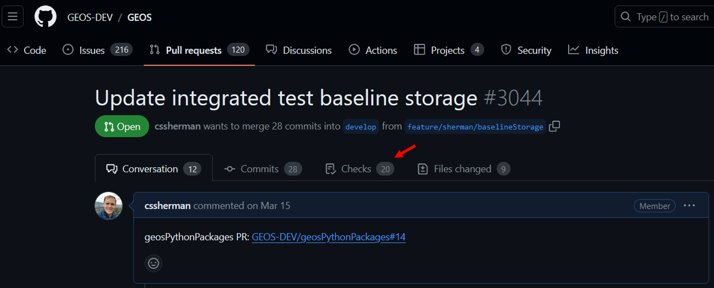
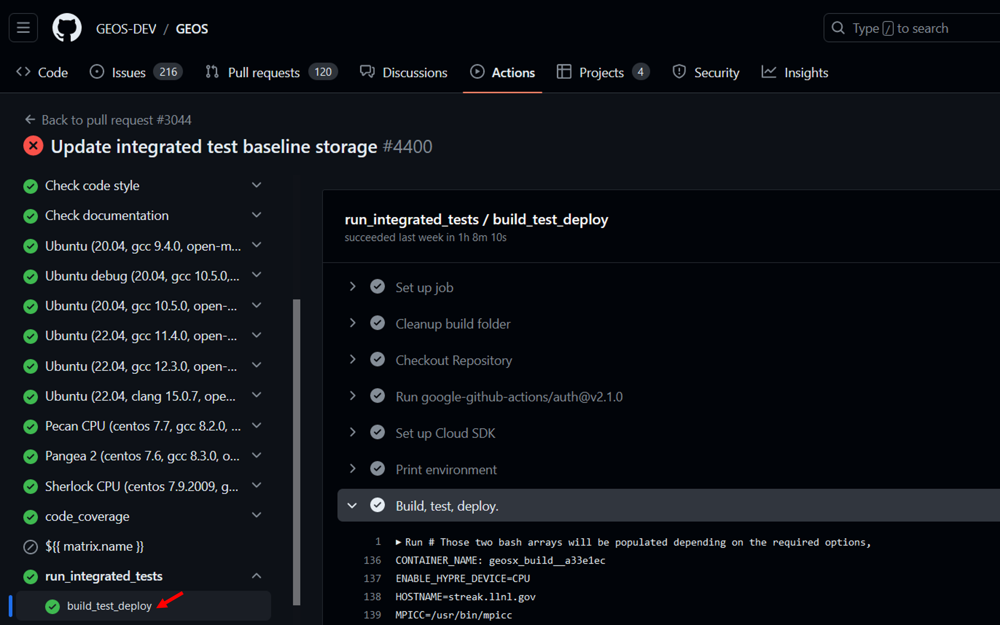

.. _IntegratedTests:

###############################################################################
Integrated Tests
###############################################################################

About
=================================
The GEOS integrated test system leverages the `Automated Test System <https://ats.readthedocs.io/en/latest/>`_ (ATS) and `GEOS ATS <https://github.com/GEOS-DEV/geosPythonPackages>`_ packages to run various combinations of input files and machine configurations.
The output of these runs are then compared to baseline files and/or analytic solutions to guarantee the accuracy of the code.

Structure
=================================

GEOS integrated tests are defined in the *GEOS/inputFiles* directory, and are organized into folders based on the physical processes being tested.
A test folder can contain any number of *.ats* configuration files, *.xml* input files, and supporting inputs (tables files, meshes, etc.).

.. code-block:: sh

  - inputFiles/
    - main.ats/
    - solidMechanics/
      - sedov.ats
      - sedov.xml
    - etc.
  - .integrated_tests.yaml

Test baselines are stored as *.tar.gz* archive and share the same directory structure as *GEOS/inputFiles*.
During test execution, the *geos_ats* package will fetch and unpack any necessary baselines described in the top-level *.integrated_tests.yaml* configuration file.

How to Run the Tests
=================================

GEOS CI Pipeline
---------------------------------

In most cases, developers will be able to rely on the integrated tests that are run as part of the GEOS CI Pipeline.
These can be triggered if the **ci: run integrated tests** label is selected for a pull request (this can be added from the right-hand panel on PR page).

To inspect the results of CI tests, select the *Checks* tab from the top of the pull request and then select *run_integrated_tests/build_test_deploy* from the left-hand panel.

This page will show the full output of GEOS build process and the integrated test suite.
At the bottom of this page, the logs will contain a summary of the test results and a list of any ignored/failed tests.

.. code-block:: sh

  =======================
  Integrated test results
  =======================
  expected: 0
  created: 0
  batched: 0
  filtered: 104
  skipped: 0
  running: 0
  passed: 215
  timedout: 0 (3 ignored)
  halted: 0
  lsferror: 0
  failed: 0
  =======================
  Ignored tests
  =======================
  pennyShapedToughnessDominated_smoke_01
  pennyShapedViscosityDominated_smoke_01
  pknViscosityDominated_smoke_01
  =======================
  Overall status: PASSED
  =======================

The log will provide instructions on where to download the test results and a baseline ID that can be assigned in the *.integrated_tests.yaml* file.

. code-block:: sh

  Download the bundle at https://storage.googleapis.com/geosx/integratedTests/baseline_integratedTests-pr3044-4400-e6359ca.tar.gz
  New baseline ID: baseline_integratedTests-pr3044-4400-e6359ca

.. note::
  Integrated tests within GEOS CI pipeline are run on a shared machine, and may take up to 30 minutes to complete.  It may take some time for the tests to begin if the machine is in use by other developers.

Manual Test Runs
---------------------------------

Before running the integrated tests manually, we recommend that you define the following variables in your machine's host configuration file:

* `ATS_WORKING_DIR` : The location where tests should be run (default=*GEOS/[build-dir]/integratedTests/workingDir*)
* `ATS_BASELINE_DIR` : The location where test baselines should be stored (default=*GEOS/integratedTests*)

.. note::
  The `ATS_WORKING_DIR` should be located on a file system that is amenable to parallel file IO.

After building GEOS, the integrated tests can be triggered in the GEOS build directory with the following commands:

* `make ats_environment` : Setup the testing environment (Note: this step is run by default for the other make targets).  This process will install packages required for testing into the python environment defined in your current host config file.  Depending on how you have built GEOS, you may be prompted to manually run the `make pygeosx` command and then re-run this step.
* `make ats_run` : Run all of the available tests (see the below note on testing resources).
* `make ats_clean` : Remove any unnecessary files created during the testing process (.vtk, .hdf5 files, etc.)
* `make ats_rebaseline` : Selectively update the baseline files for tests.
* `make ats_rebaseline_failed` : Automatically update the baseline files for any failed tests.

.. note::
  The `make_ats_environment` and `ats_run` steps may require internet access to collect python packages and baseline files.

.. note::
  Running the integrated tests requires significant computational resources.
  If you are on a shared system, we recommend that you only run `make ats_run` within an allocation.

.. note::
  We forward any arguments included in the `ATS_ARGUMENTS` cmake variable to the testing system.
  For example, on LLNL Lassen builds we select a couple of runtime options:
  set(ATS_ARGUMENTS "--ats jsrun_omp --ats jsrun_bind=packed"  CACHE STRING "")

.. note::
  When running test or creating new baselines on LC systems, we recommend that you use the *quartz-gcc-12-release* configuration

.. _overrideTestBehavior:

Override Test Behavior
----------------------

For cases where you need additional control over the integrated tests behavior, you can use this script in your build directory: */path/to/GEOS/build-xyz/integratedTests/geos_ats.sh*.
To run the tests, simply call this script with any desired arguments (see the output of `geos_ats.sh --help` for additional details.)
Common options for this script include:

* -a/--action : The type of action to run.  Common options include: `run`, `veryclean`, `rebaseline`, and `rebaselinefailed`.
* -r/--restartCheckOverrides : Arguments to pass to the restart check function.  Common options include: `skip_missing` (ignores any new/missing values in restart files) and `exclude parameter1 parameter2` (ignore these values in restart files).
* --machine : Set the ats machine type name.
* --ats : Pass an argument to the underlying ats framework.  Running `geos_ats.sh --ats help` will show you a list of available options for your current machine.

Machine Definitions
------------------------

On many machines, ATS will automatically identify your machine's configuration and optimize it's performance.
If the tests fail to run or to properly leverage your machine's resources, you may need to manually configure the machine.
If you know the appropriate name for your machine in ATS (or the geos_ats package), then you can run `./geos_ats.sh --machine machine_name --ats help` to see a list of potential configuration options.

The `openmpi` machine is a common option for non-LC systems.
For a system with 32 cores/node, an appropriate run command might look like:

.. code-block:: sh

  ./geos_ats.sh --machine openmpi --ats openmpi_numnodes 32 --ats openmpi_args=--report-bindings --ats openmpi_args="--bind-to none" --ats openmpi_install "/path/to/openmpi/installation"

.. note::
  In this example, the path given by `openmpi_install` should include `bin/mpirun`. 

.. note::
  When you have identified a set of arguments that work for your machine, we recommend recording in the `ATS_ARGUMENTS` cmake variable in your system host config file.

Test Filtering
------------------------

An arbitrary number of filter arguments can be supplied to ATS to limit the number of tests to be run.
Filter arguments should refer to an ATS test variable and use a python-syntax (e.g.: "'some_string' in ats_variable" or "ats_variable<10").
These can be set via command-line arguments (possible via the `ATS_ARGUMENTS` variable):

.. code-block:: sh

  ./geos_ats.sh --ats f "np==1" --ats f "'SinglePhaseFVM' in solvers"

or via an environment variable (`ATS_FILTER`):

.. code-block:: sh

  export ATS_FILTER="np==1,'SinglePhaseFVM' in solvers"

Common ATS variables that you can filter tests include:

* np : The number of parallel processes for the test
* label : The name of the test case (e.g.: "sedov_01")
* collection : The name of the parent test folder (e.g.: "contactMechanics")
* checks : A comma-separated list of checks (e.g.: "curve,restart")
* solvers : A comma-separated list of solver types (e.g.: "SinglePhaseFVM,SurfaceGenerator")
* outputs : A comma-separated list of output types (e.g.: "Restart,VTK")
* constitutive_models : A comma-separated list of constitutive model types (e.g.: "CompressibleSinglePhaseFluid,ElasticIsotropic")

Inspecting Test Results
=================================

While the tests are running, the name and size of the active test will be periodically printed out to the screen.
Test result summaries will also be periodically written to the screen and files in */path/to/GEOS/build-xyz/integratedTests/TestsResults*.
For most users, we recommend inspecting the *test_results.html* file in your browser (e.g.: `firefox integratedTests/TestsResults/test_results.html`).
Tests will be organized by their status variable, which includes:

* *RUNNING* : The test is currently running
* *NOT RUN* : The test is waiting to start
* *PASSED* : The test and associated checks succeeded
* *FAIL RUN* : The test was unable to run (this often occurs when there is an error in the .ats file)
* *FAIL CHECK* : The test ran to completion, but failed either its restart or curve check
* *SKIPPED* : The test was skipped (likely due to lack of computational resources)

If each test ends up in the *PASSED* category, then you are likely done with the integrated testing procedure.
However, if tests end up in any other category, it is your responsibility to address the failure.
If you identify that a failure is due to an expected change in the code (e.g.: adding a new parameter to the xml structure or fixing a bug in an algorithm), you can follow the :ref:`rebaselining procedure <rebaselining-tests>`.
Otherwise, you will need to track down and potentially fix the issue that triggered the failure.

Test Output
--------------------------------

Output files from the tests will be stored in the specified working directory (linked here: */path/to/GEOS/build-xyz/integratedTests/TestsResults*).
Using the serial beam bending test as an example, key output files include:

* *beamBending_01.data* : Contains the standard output for all test steps.
* *beamBending_01.err* :  Contains the standard error output for all test steps.
* *displacement_history.hdf5* : Contains time history information that is used as an input to the curve check step.
* *totalDisplacement_trace.png* : A figure displaying the results of the curve check step.
* *beamBending.geos.out* : Contains the standard output for only the geos run step.
* *beamBending_restart_000000010.restartcheck* which holds all of the standard output for only the *restartcheck* step.
* *beamBending_restart_000000010.0.diff.hdf5* which mimmics the hierarchy of the restart file and has links to the 

See :ref:`Restart Check <restart-check>` and :ref:`Curve Check <curve-check>` for further details on the test checks and output files.

.. _restart-check:

Restart Check
=================================

This check compares a restart file output at the end of a run against a baseline. 
The python script that evaluates the diff is included in the `geos_ats` package, and is located here: *integratedTests/scripts/geos_ats_package/geos_ats/helpers/restart_check.py*.
The script compares the two restart files and writes out a *.restart_check* file with the results, as well as exiting with an error code if the files compare differently.
This script takes two positional arguments and a number of optional keyword arguments:

* file_pattern : Regex specifying the restart file. If the regex matches multiple files the one with the greater string is selected. For example *restart_100.hdf5* wins out over *restart_088.hdf5*.
* baseline_pattern : Regex specifying the baseline file.
* -r/--relative : The relative tolerance for floating point comparison, the default is 0.0.
* -a/--absolute : The absolute tolerance for floating point comparison, the default is 0.0.
* -e/--exclude : A list of regex expressions that match paths in the restart file tree to exclude from comparison. The default is [.*/commandLine].
* -w/-Werror : Force warnings to be treated as errors, default is false.
* -m/--skip-missing : Ignore values that are missing from either the baseline or target file.

The  itself starts off with a summary of the arguments.
The script begins by recording the arguments to the *.restart_check* file header, and then compares the *.root* restart files to their baseline.
If these match, the script will compare the linked *.hdf5* data files to their baseline.
If the script encounters any differences it will output an error message, and record a summary to the *.restart_check* file.

The restart check step can be run in parallel using mpi via

.. code-block:: sh

  mpirun -n NUM_PROCESSES python -m mpi4py restartcheck.py ...

In this case rank zero reads in the restart root file and then each rank parses a subset of the data files creating a *.$RANK.restartcheck* file. Rank zero then merges the output from each of these files into the main *.restartcheck* file and prints it to standard output.

Scalar Error Example
-------------------------------

An error message for scalar values looks as follows

.. code-block:: sh

  Error: /datagroup_0000000/sidre/external/ProblemManager/domain/ConstitutiveManager/shale/YoungsModulus
    Scalar values of types float64 and float64 differ: 22500000000.0, 10000022399.9.

Where the first value is the value in the test's restart file and the second is the value in the baseline.

Array Error Example
--------------------------------

An example of an error message for arrays is

.. code-block:: sh

  Error: /datagroup_0000000/sidre/external/ProblemManager/domain/MeshBodies/mesh1/Level0/nodeManager/TotalDisplacement
    Arrays of types float64 and float64 have 1836 values of which 1200 have differing values.
    Statistics of the differences greater than 0:
      max_index = (1834,), max = 2.47390764755, mean = 0.514503482629, std = 0.70212888881

This means that the max absolute difference is 2.47 which occurs at value 1834. Of the values that are not equal the mean absolute difference is 0.514 and the standard deviation of the absolute difference is 0.702.

When the tolerances are non zero the comparison is a bit more complicated. From the *FileComparison.compareFloatArrays* method documentation

.. code-block:: sh

  Entries x1 and x2 are  considered equal iff
      |x1 - x2| <= ATOL or |x1 - x2| <= RTOL * |x2|.
  To measure the degree of difference a scaling factor q is introduced. The goal is now to minimize q such that
      |x1 - x2| <= ATOL * q or |x1 - x2| <= RTOL * |x2| * q.
  If RTOL * |x2| > ATOL
      q = |x1 - x2| / (RTOL * |x2|)
  else
      q = |x1 - x2| / ATOL.
  If the maximum value of q over all the entries is greater than 1.0 then the arrays are considered different and an error message is produced.

An sample error message is

.. code-block:: sh

  Error: /datagroup_0000000/sidre/external/ProblemManager/domain/MeshBodies/mesh1/Level0/nodeManager/TotalDisplacement
    Arrays of types float64 and float64 have 1836 values of which 1200 fail both the relative and absolute tests.
      Max absolute difference is at index (1834,): value = 2.07474948094, base_value = 4.54865712848
      Max relative difference is at index (67,): value = 0.00215842135281, base_value = 0.00591771127792
    Statistics of the q values greater than 1.0 defined by the absolute tolerance: N = 1200
      max = 16492717650.3, mean = 3430023217.52, std = 4680859258.74
    Statistics of the q values greater than 1.0 defined by the relative tolerance: N = 0

The *.diff.hdf5* File
---------------------------------

Each error generated in the *restartcheck* step creates a group with three children in the *_diff.df5* file.
For example the error given above will generate a hdf5 group

.. code-block:: sh

  /FILENAME/datagroup_0000000/sidre/external/ProblemManager/domain/MeshBodies/mesh1/Level0/nodeManager/TotalDisplacement

with datasets *baseline*, *run* and *message* where *FILENAME* is the name of the restart data file being compared.
The *message* dataset contains a copy of the error message while *baseline* is a symbolic link to the baseline dataset and *run* is a sumbolic link to the dataset genereated by the run.
This allows for easy access to the raw data underlying the diff without data duplication. For example if you want to extract the datasets into python you could do this:

.. code-block:: python

  import h5py
  file_path = "beamBending_restart_000000003_diff.hdf5"
  path_to_data = "/beamBending_restart_000000011_0000000.hdf5/datagroup_0000000/sidre/external/ProblemManager/domain/MeshBodies/mesh1/Level0/nodeManager/TotalDisplacement"
  f = h5py.File("file_path", "r")
  error_message = f["path_to_data/message"]
  run_data = f["path_to_data/run"][:]
  baseline_data = f["path_to_data/baseline"][:]

  # Now run_data and baseline_data are numpy arrays that you may use as you see fit.
  rtol = 1e-10
  atol = 1e-15
  absolute_diff = np.abs(run_data - baseline_data) < atol
  hybrid_diff = np.close(run_data, baseline_data, rtol, atol)

When run in parallel each rank creates a *.$RANK.diff.hdf5* file which contains the diff of each data file processed by that rank.

.. _curve-check:

Curve Check
=================================

This check compares time history (*.hdf5*) curves generated during GEOS execution against baseline and/or analytic solutions.
In contrast to restart checks, curve checks are designed to be flexible with regards to things like mesh construction, time stepping, etc.
The python script that evaluates the diff is included in the `geos_ats` package, and is located here: *integratedTests/scripts/geos_ats_package/geos_ats/helpers/curve_check.py*.
The script renders the curve check results as a figure, and will throw an error if curves are out of tolerance.
This script takes two positional arguments and a number of optional keyword arguments:

* filename : Path to the time history file.
* baseline : Path to the baseline file.
* -c/--curve : Add a curve to the check (value) or (value, setname).  Multiple curves are allowed.
* -s/--script : Python script instructions for curve comparisons (path, function, value, setname)
* -t/--tolerance : The tolerance for each curve check diffs (||x-y||/N).  Default is 0.
* -w/-Werror : Force warnings to be treated as errors, default is false.
* -o/--output : Output figures to this directory.  Default is ./curve_check_figures
* -n/--n-column : Number of columns to use for the output figure.  Default is 1.
* -u/--units-time : Time units for plots.  Options include milliseconds, seconds (default), minutes, hours, days, years

The curve check script begins by checking the target time history file for expected key values.
These include the time array ("value Time"), location array ("value ReferencePosition setname" or "value elementCenter setname"), and value array ("value setname").
Any missing values will be recorded as errors in the output.

The script will then run and record any user-requested python script instructions.
To do this, python will attempt to import the file given by *path* and evaluate the target function, which should accept the time history data as keyword arguments.
Note: to avoid side effects, please ensure that any imported scripts are appropriately guarded if they also allow direct execution:

.. code-block:: python

  if __name__ == '__main__':
    main()

This script will then check the size of the time history items, and will attempt to interpolate them if they do not match (currently, we only support interpolation in time).
Finally, the script will compare the time history values to the baseline values and any script-generated values.
If any curves do not match (`||x-y||/N > tol`), this will be recorded as an error.

Item Not Found Errors
----------------------------

The following error would indicate that the requested baseline file was not found:

.. code-block:: sh

  baseline file not found: /path/to/baseline/file

This type of error can occur if you are adding a new test, or if you time history output failed.

The following errors would indicate that values were not found in time history files:

.. code-block:: sh

  Value not found in target file: value
  Set not found in target file: setname
  Could not find location string for parameter: value, search...
  

The following error would indicate that a given curve exceeded its tolerance compared to script-generated values:

.. code-block:: sh

  script_value_setname diff exceeds tolerance: ||t-b||/N=100.0, script_tolerance=1.0

Adding and Modifying Tests
=================================

ATS Configuration File
---------------------------------

Files with the *.ats* extension are used to configure the integratedTests.
They use a Python 3.x syntax, and have a set of ATS-related methods loaded into the scope (TestCase, geos, source, etc.).
The root configuration file (*integratedTests/tests/allTests/main.ats*) finds and includes any test definitions in its subdirectories.
The remaining configuration files typically add one or more tests with varying partitioning and input xml files to ATS.

The *inputFiles/solidMechanics/sedov.ats* file shows how to add three groups of tests.
This file begins by defining a set of common parameters, which are used later:

.. literalinclude:: ../../../../../inputFiles/solidMechanics/sedov.ats
  :language: python
  :start-after: # Integrated Test Docs Begin Parameters
  :end-before: # Integrated Test Docs End Parameters

It then enters over the requested partitioning schemes: 

.. literalinclude:: ../../../../../inputFiles/solidMechanics/sedov.ats
  :language: python
  :start-after: # Integrated Test Docs Begin Test Loop
  :end-before: # Integrated Test Docs End Test Loop

and registers a unique test case with the `TestDeck` method, which accepts the following arguments:

* name : The name of the test
* description : A brief description of the test
* partitions : A list of partition schemes to be tested
* restart_step : The cycle number where GEOS should test its restart capability
* check_step : The cycle number where GEOS should evaluate output files
* restartcheck_params : Parameters to forward to the restart check (tolerance, etc.)
* curvecheck_params: Parameters to forward to the curve check (tolerance, etc.)

.. note::
  An *.ats* file can create any number of tests and link to any number of input xml files.
  For any given test step, we expect that at least one restart or curve check be defined.

Creating a New Test Directory
-------------------------------

To add a new set of tests, create a new folder under the `GEOS/inputFiles` directory.
This folder needs to include at least one *.ats* file to be included in the integrated tests.
Using the sedov example, after creating *sedov.ats* the directory should look like

.. code-block:: sh

  - inputFiles/solidMechanics
    - sedov.ats
    - sedov.xml

These changes will be reflected in the new baselines after triggering the manual rebaseline step. 

.. _rebaselining-tests:

Rebaselining Tests
=====================

Occasionally you may need to add or update baseline files in the repository (possibly due to feature changes in the code).
This process is called rebaselining.
We suggest the following workflow:

#. Open a pull request for your branch on github and select the **ci: run integrated tests** label
#. Wait for the tests to finish
#. Download and unpack the new baselines from the link provided at the bottom of the test logs
#. Inspect the test results using the *test_results.html* file
#. Verify that the changes in the baseline files are desired
#. Update the baseline ID in the *GEOS/.integrated_tests.yaml* file
#. Add a justification for the baseline changes to the *GEOS/BASELINE_NOTES.md* file
#. Commit your changes and push the code
#. Wait for the CI tests to re-run and verify that the integrated tests step passed

Tips
=======

**Parallel Tests**: On some development machines geosxats won't run parallel tests by default (e.g. on an linux laptop or workstation), and as a result many baselines will be skipped.
We highly recommend running tests and rebaselining on an MPI-aware platform.

**Filtering Checks**: A common reason for rebaselining is that you have changed the name of an XML node in the input files.
While the baselines may be numerically identical, the restarts will fail because they contain different node names.
In this situation, it can be useful to add a filter to the restart check script using the *geos_ats.sh* script (see the `-e` and `-m` options in :ref:`overrideTestBehavior` )
