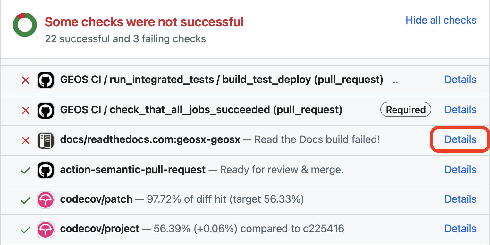
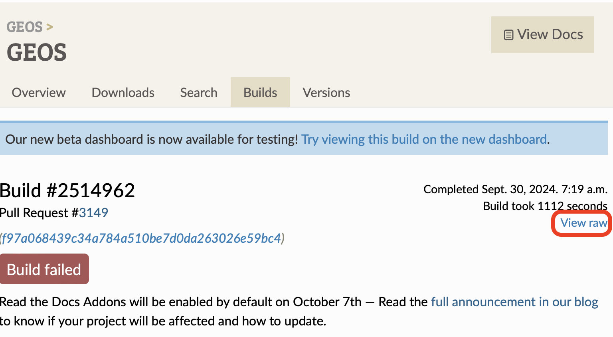

################################################################################
Sphinx Documentation
################################################################################

Generating the documentation
====================================

- To generate the documentation files, you will need to install Sphinx using

  .. code-block:: sh

   sudo apt install python-sphinx

  Then you can generate the documentation files with the following commands

 .. code-block:: sh

  cd GEOS/build-your-platform-release
  make geosx_docs

- That will create a new folder

  .. code-block:: sh

   GEOS/build-your-platform-release/html/docs/sphinx

which contains all the html files generated.

Documenting the code
====================================

The documentation is generated from restructured text files (``.rst``). Most files
can be found in ``src/docs/sphinx``. Files which are specific to parts of the code,
like those describing a specific class, can instead be found in ``docs`` subdirectory
in the folder containing the source code.

Information about how to write ``rst`` files can be found `here <https://www.sphinx-doc.org/en/master/usage/restructuredtext/basics.html>`_ .

Fixing errors the documentation
===============================
As part of the Continuous Integration process, the documentation is built on readthedocs, and any warnings or errors result in a failure test failure. 
What follows is a brief guide on how to fix the most common errors.

#. Navigate to the readthedocs build logs. This can be done by clicking on the failed test in the github test summary.

#. Download the logs from the failed test on readthedocs through the "view raw" button.

#. Perform a case sensitive search for "WARNING:" or "ERROR" to locate the sphinx issues. 
Note that there will be numerous doxygen warnings that should be ignored.