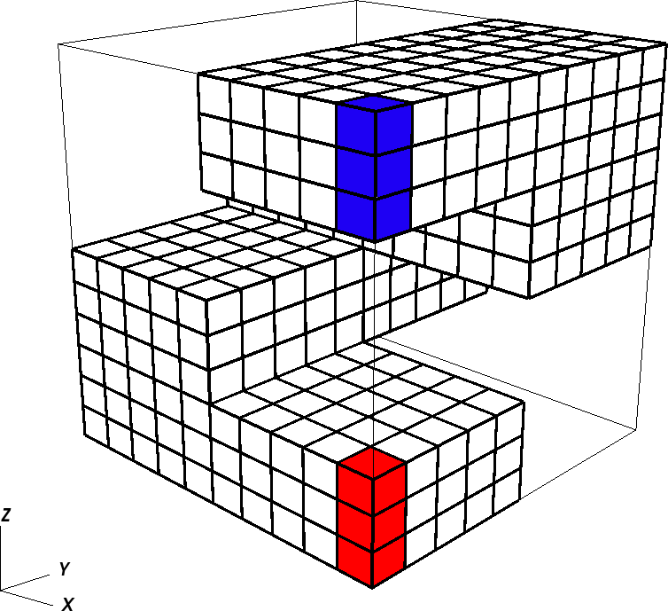

Dead-oil staircase model
=================================
We consider a homogeneous reservoir with the staircase geometry shown in the
following figure.



We will prescribe a pressure Dirichlet boundary condition at the blue (injection)
and at the red (production) cells. Additionally, we will specify the composition
of the injected stream.

Three fluid phases are present, water (w), oil (o) and gas (g) and a dead-oil
fluid model is considered  as described in :ref:`Black oil fluid model <BlackOilFluid>`.

Input file
^^^^^^^^^^^^^^^^^^^^^^^^^^^^^^^^^^^^^
The input file for this tutorial can be found at

.. code-block:: sh

   GEOSX/examples/compositionalFlow/deadoilStaircase.xml

Let us now have a look at each section of the xml input file.


Solvers tag
---------------------------------------
This 3D test case involves gravity so we need to specify the components of the gravity vector.
Then, to run a compositional flow simualtion we add a `CompositionalMultiphaseFlow` solver
to the `Solvers` section.  Here, we need to make sure to specify the
region to which the solver has to be applied and the specific fluid and solid names.
Solver parameters are defined in a separate subsection. A more detailed description
of all fields specific to a compositional solver can be found :ref:`here <CompositionalMultiphaseFlow>`

.. literalinclude:: ../../../../coreComponents/physicsSolvers/fluidFlow/integratedTests/compositionalMultiphaseFlow/deadoil_3ph_staircase_3d.xml
   :language: xml
   :start-after: <!-- START_SPHINX_INCLUDE_SOLVER_BLOCK -->
   :end-before: <!-- END_SPHINX_INCLUDE_SOLVER_BLOCK -->

Geometry and Mesh tag
---------------------------------------
The geometry tag can be used to define the location of source as sink terms. They
are identified by defining two geometrical objects, boxes, with specific extensions.

.. literalinclude:: ../../../../coreComponents/physicsSolvers/fluidFlow/integratedTests/compositionalMultiphaseFlow/deadoil_3ph_staircase_3d.xml
   :language: xml
   :start-after: <!-- START_SPHINX_INCLUDE_GEOM_BLOCK -->
   :end-before: <!-- END_SPHINX_INCLUDE_GEOM_BLOCK -->

In this test case we construct an internal mesh formed by 16 cell blocks each one containing
5 x 5 x 3 cells. A detailed explanation of how the internal mesh is specified
is provided :ref:`here <Meshes>`.

.. literalinclude:: ../../../../coreComponents/physicsSolvers/fluidFlow/integratedTests/compositionalMultiphaseFlow/deadoil_3ph_staircase_3d.xml
    :language: xml
    :start-after: <!-- START_SPHINX_INCLUDE_MESH_BLOCK -->
    :end-before: <!-- END_SPHINX_INCLUDE_MESH_BLOCK -->

Element regions tag
----------------------------------------
The cell blocks defined in the previous tag have to be assigned to a specific region.
Here, we consider two regions, one identifying the high permeability channel in
which the flow occurs and one identifying the flow barriers.

.. literalinclude:: ../../../../coreComponents/physicsSolvers/fluidFlow/integratedTests/compositionalMultiphaseFlow/deadoil_3ph_staircase_3d.xml
   :language: xml
   :start-after: <!-- START_SPHINX_INCLUDE_ELEMREG_BLOCK -->
   :end-before: <!-- END_SPHINX_INCLUDE_ELEMREG_BLOCK -->

Events tag
---------------------------------------

In the events tag we will define the maximum time of the simulation along
with several periodic events (subtags) to specify solver applications,
frequency of the output and restart files. Here, we define three solver applications
events with different fixed time-step sizes. This is done to ensure that smaller
time-steps are used at the beginning of the simulation when convergence is more difficult.

.. literalinclude:: ../../../../coreComponents/physicsSolvers/fluidFlow/integratedTests/compositionalMultiphaseFlow/deadoil_3ph_staircase_3d.xml
   :language: xml
   :start-after: <!-- START_SPHINX_INCLUDE_EVENTS_BLOCK -->
   :end-before: <!-- END_SPHINX_INCLUDE_EVENTS_BLOCK -->

Numerical methods tag
----------------------------------------
We choose a standard two-point flux apporximation of the flux.

.. literalinclude:: ../../../../coreComponents/physicsSolvers/fluidFlow/integratedTests/compositionalMultiphaseFlow/deadoil_3ph_staircase_3d.xml
   :language: xml
   :start-after: <!-- START_SPHINX_INCLUDE_NUMMET_BLOCK -->
   :end-before: <!-- END_SPHINX_INCLUDE_NUMMET_BLOCK -->

Constitutive tag
----------------------------------------
In the section we specify the constitutive relations to be employed.
For the `BlackOilFluid` subtag we have to specify the phases peresent, their densities,
and their molar weights. We also specify the tables defining the thermodynamic behavior

.. literalinclude:: ../../../../coreComponents/physicsSolvers/fluidFlow/integratedTests/compositionalMultiphaseFlow/deadoil_3ph_staircase_3d.xml
    :language: xml
    :start-after: <!-- START_SPHINX_INCLUDE_CONST_BLOCK -->
    :end-before: <!-- END_SPHINX_INCLUDE_CONST_BLOCK -->

Field Specification tag
----------------------------------------
We use the `FieldSpecification` tag to define the properties of the reservoir
(permeability and porosity), the initial conditions (i.e, pressure and composition)
and the boundary conditions.

Permeability and porosity
``````````````````````````````````````````
The permeability in the channel region is homogeneous and isotropic. A uniform porosity
is also considered.

.. literalinclude:: ../../../../coreComponents/physicsSolvers/fluidFlow/integratedTests/compositionalMultiphaseFlow/deadoil_3ph_staircase_3d.xml
    :language: xml
    :start-after: <!-- START_SPHINX_INCLUDE_PERM_BLOCK -->
    :end-before: <!-- END_SPHINX_INCLUDE_PERM_BLOCK -->

Initial conditions
``````````````````````````````````````````
.. literalinclude:: ../../../../coreComponents/physicsSolvers/fluidFlow/integratedTests/compositionalMultiphaseFlow/deadoil_3ph_staircase_3d.xml
    :language: xml
    :start-after: <!-- START_SPHINX_INCLUDE_INIT_BLOCK -->
    :end-before: <!-- END_SPHINX_INCLUDE_INIT_BLOCK -->

Boundary conditions
``````````````````````````````````````````
.. literalinclude:: ../../../../coreComponents/physicsSolvers/fluidFlow/integratedTests/compositionalMultiphaseFlow/deadoil_3ph_staircase_3d.xml
      :language: xml
      :start-after: <!-- START_SPHINX_INCLUDE_BC_BLOCK -->
      :end-before: <!-- END_SPHINX_INCLUDE_BC_BLOCK -->

Output tags
----------------------------------------
Finally, we define the type of output desired.

.. literalinclude:: ../../../../coreComponents/physicsSolvers/fluidFlow/integratedTests/compositionalMultiphaseFlow/deadoil_3ph_staircase_3d.xml
    :language: xml
    :start-after: <!-- START_SPHINX_INCLUDE_OUTPUT_BLOCK -->
    :end-before: <!-- END_SPHINX_INCLUDE_OUTPUT_BLOCK -->

Results
^^^^^^^^^^^^^^^^^^^^^^^^^^^^^^^^^^^^^^^^
To run the model just type

.. code-block:: sh

     path-to-geosx-bin/geosx -i path-to-geosx-folder/GEOSX/examples/compositionalFlow/deadoilStaircase.xml

in the terminal. Then, the ouput can be visualized by opening the SiloFiles in Visit.
Here, for example, we are plotting the pressure (left) and the water saturation
(right) maps at the end of the simulation.

  .. image:: staircaseDeadOil_P.png
     :width: 400px

  .. image:: staircaseDeadOil_Sw.png
     :width: 400px
     :align: right
