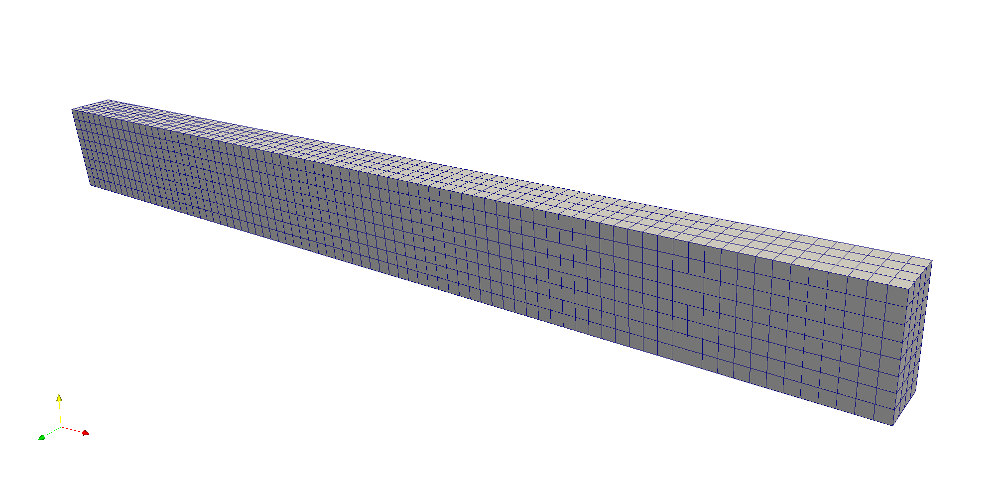

.. _TutorialElasticity:

########################
Tutorial 5: Elasticity
########################

**Context**

In this tutorial, we use a a small strain linear elastic based solid mechanics solver 
(see :ref:`SolidMechanics`) from GEOSX to solve for the bending of a three-dimensional beam. 
The beam is fixed at one end, and subjects to a traction force pointing to the y-positive 
direction on the other end. The beam will be deformed in the x-y plane.

**Objectives**

At the end of this tutorial you will know:

  - how to use the solid mechanics solver to solve a quasistatic problem,
  - how to set up a traction force on a surface,
  - how to use a table function to control time-dependent loading.

**Input file**

This tutorial uses no external input files and everything required is
contained within a single GEOSX input file.
The xml input file for this test case is located at:

.. code-block:: console

  src/coreComponents/physicsSolvers/solidMechanics/integratedTests/SSLE-QS-beamBending.xml

------------------------------------
Discretized computational domain
------------------------------------

The following mesh is used in this tutorial:

This mesh contains 80 x 8 x 4 eight-node brick elements in the x, y and z directions, respectively.
Here, the ``InternalMesh``
is used to generate a structured three-dimensional mesh with ``C3D8`` as 
the ``elementTypes``. This mesh is defined as a cell block with the name
``cb1``.

**Feedback on this tutorial**

**Next tutorial**

**For more details**

