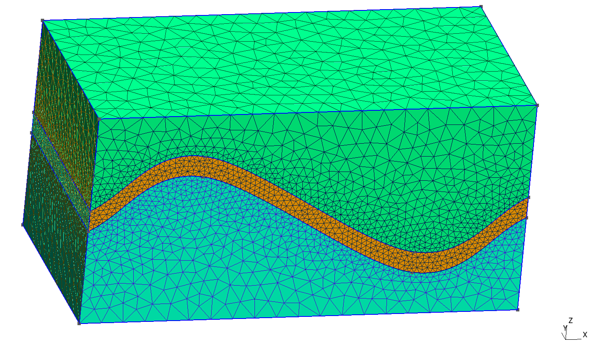
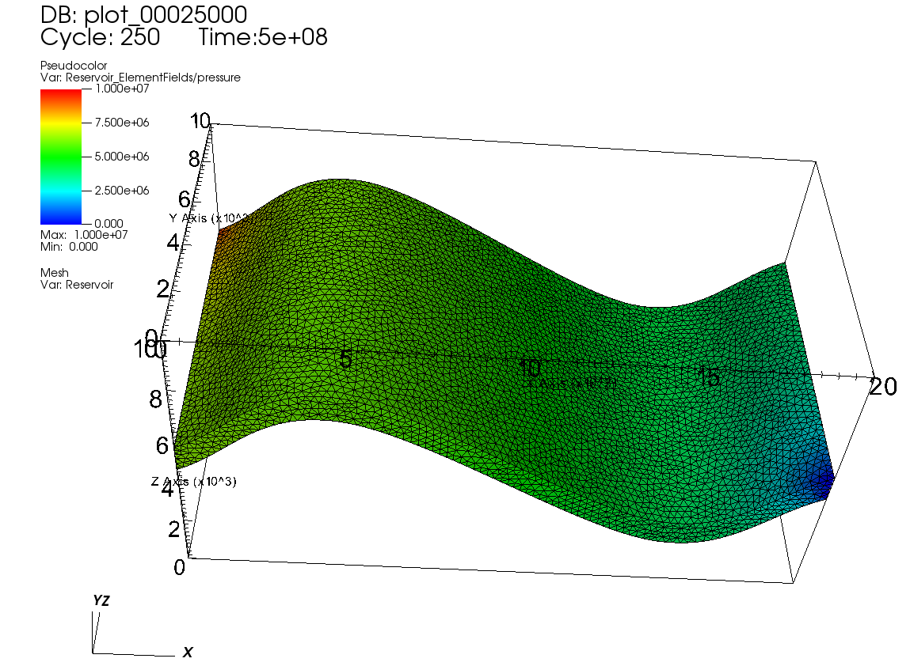

.. _TutorialFieldCase:

#########################################
Tutorial 3: A simple field case
#########################################

**Context**

In this tutorial, we set up a simple field case for single phase flow simulation (see :ref:`SinglePhaseFlow`). We demonstrate how to run a basic flow simulation in the reservoir layer. We do not consider any coupling with wells. Injection and production will be specified by imposing a high pressure in the cells close to the injection area and a low pressure in the cells close to the production area.

**Objectives**

At the end of this tutorial you will know:

  - how to import external mesh information and properties,
  - how to run a specific solver (here, flow) in a specific region only,
  - the basic method of using boxes to set up boundary conditions,
  - how to control output frequency and export results for visualization.

**Input file**

The xml input file for this test case is located at:

.. code-block:: console

  src/coreComponents/physicsSolvers/multiphysics/integratedTests/FieldCaseTutorial1.xml

Domain definition
--------------------

We consider the following mesh as a numerical support to the simulations in this tutorial:

This mesh contains three continuous regions:

  - a Top region (overburden, elementary tag = 1)
  - a Middle region (reservoir layer, elementary tag = 2)
  - a Bottom region (underburden, elementary tag = 3)

The mesh is defined using the GMSH file format (see :ref:`Meshes` for more information on
the supported mesh file format). Each tetrahedron is associated to a unique tag.

.. note::

  The GMSH file format starts numbering tags from 1. In GEOSX, the numbering
  of ``CellElementRegion`` starts from 0. As a consequence, when regions
  are defined in GEOSX, we substract 1 from the GMSH tag to refer
  to the same region. The next sections of this tutorial illustrate this.

------------------------------------
GEOSX input files
------------------------------------

Defining a solver
-----------------
.. 
        Solver settings
        ---------------

Let us inspect the **Solver** XML tags.

.. literalinclude:: ../../../../coreComponents/physicsSolvers/multiphysics/integratedTests/FieldCaseTutorial1.xml
  :language: xml
  :start-after: <!-- SPHINX_FIELD_CASE_SOLVER -->
  :end-before: <!-- SPHINX_FIELD_CASE_SOLVER_END -->

This node gathers all the information previously defined.
We use a classical ``SinglePhaseFVM`` Finite Volume Method,
with the two-points flux approximation
as will be defined in the **NumericalMethod** tag.
The ``targetRegions`` refers only
to the Reservoir region because we only solve for flow in this region.
The ``fluidNames`` and ``solidNames`` refer the materials defined
in the **Constitutive** tag.

The ``NonlinearSolverParameters`` and ``LinearSolverParameters`` are used to set usual
numerical solver parameters such as the linear and nonlinear tolerances, the preconditioner and solver types or the maximum number of nonlinear iterations.

Specifying a computational mesh
----------------------------------
.. 
        ***************************
        Importing the mesh in GEOSX
        ***************************

Here, we use the ``PAMELAMeshGenerator`` to load the mesh (see :ref:`ImportingExternalMesh`).
The syntax to import external meshes is simple : in the XML file,
the mesh ``file`` is included with its relative or absolute path to the location of the geosx XML file and a user-specified ``name`` label for the mesh object.

.. literalinclude:: ../../../../coreComponents/physicsSolvers/multiphysics/integratedTests/FieldCaseTutorial1.xml
  :language: xml
  :start-after: <!-- SPHINX_FIELD_CASE_MESH -->
  :end-before: <!-- SPHINX_FIELD_CASE_MESH_END -->

Geometry tag
-----------------
.. 
        Defining geometry boxes
        -------------------------

        Here, we are using definition of ``source`` and ``sink`` boxes in addition to the ``all`` box in order to flag sets of nodes or cells which will act as injection or production.

.. literalinclude:: ../../../../coreComponents/physicsSolvers/multiphysics/integratedTests/FieldCaseTutorial1.xml
  :language: xml
  :start-after: <!-- SPHINX_FIELD_CASE_GEOMETRY -->
  :end-before: <!-- SPHINX_FIELD_CASE_GEOMETRY_END -->

In order to define a box, the user defines ``xMax`` and ``xMin``, two diagonally opposite nodes of the box.

Specifying events
------------------------
..
        Triggering events
        -----------------

The events are used here to guide the simulation through time,
and specify when outputs must be triggered.

.. literalinclude:: ../../../../coreComponents/physicsSolvers/multiphysics/integratedTests/FieldCaseTutorial1.xml
  :language: xml
  :start-after: <!-- SPHINX_FIELD_CASE_EVENTS -->
  :end-before: <!-- SPHINX_FIELD_CASE_EVENTS_END -->

The **Events** tag is associated with the ``maxTime`` keyword defining the maximum time.
If this time is ever reached or exceeded, the simulation ends.

Two ``PeriodicEvent`` are defined.
- The first one, ``solverApplications``, is associated with the solver. The  ``forceDt`` keyword means that there will always be time-steps of 23 days (2 000 000 seconds).
- The second, ``outputs``, is associated with the output. The ``timeFrequency`` keyword means that it will be executed every 116 days (10 000 000 seconds). The ``targetExactTimestep`` is set to 1, meaning that the Event Manager will impose this event will be triggered exactly every 116 days, constraining schedulde decided by application to match this date.
  

Defining Numerical Methods
----------------------------------
..
        Numerical methods
        --------------------------

Defining the numerical method used in the solver, we will provide information on how to discretize our equations. Here a classical two-point flux approximation (TPFA) scheme is used to discretize water fluxes over faces.

.. literalinclude:: ../../../../coreComponents/physicsSolvers/multiphysics/integratedTests/FieldCaseTutorial1.xml
  :language: xml
  :start-after: <!-- SPHINX_FIELD_CASE_NUMERICAL -->
  :end-before: <!-- SPHINX_FIELD_CASE_NUMERICAL_END -->

The ``TwoPointFluxApproximation`` node should specify
the primary field to solve for as ``fieldName``.
For a flow problem, this field is the pressure. 
Here we specified ``targetRegions`` as we only solve flow for reservoir.
The field under ``coefficientName`` is used during TPFA Transmissibilities construction.

Defining regions in the mesh
-----------------------------------
..
        ************************
        Running flow simulations
        ************************

Assuming that the overburden and the underburden are impermeable,
and flow only happen in the reservoir, we need to define regions.

There are two methods to achieve this regional solve.

- The first solution is to define a unique ``CellElementRegion`` corresponding to the reservoir.

        .. code-block:: xml

                <ElementRegion>
                <CellElementRegion name="ReservoirLayer"
                               cellBlocks="{1_TETRA}"
                                materialList="{water, rock}">
                </ElementRegion>

- The second solution is to define all the ``CellElementRegions`` as they are in the GMSH file, but defining the solvers only on the reservoir layer. In this case, the **ElementRegion** tag is :

        .. literalinclude:: ../../../../coreComponents/physicsSolvers/multiphysics/integratedTests/FieldCaseTutorial1.xml
                :language: xml
                :start-after: <!-- SPHINX_FIELD_CASE_REGION -->
                :end-before: <!-- SPHINX_FIELD_CASE_REGION_END -->

We opt for the latest as it allows to visialize over- and underburdens and to change regions handling in ther tag without needing to amend the **ElementRegion** tag.

.. note::
  The material list here was set for a single phase flow problem. This list is subject
  to change if the problem is not a single phase flow problem.

Defining material properties with constitutive laws
-------------------------------------------------------
..
        Material definition
        -------------------

We simulate a single phase flow in the reservoir layer, hence with two types of materials, a fluid (water) and solid (rock).

.. literalinclude:: ../../../../coreComponents/physicsSolvers/multiphysics/integratedTests/FieldCaseTutorial1.xml
  :language: xml
  :start-after: <!-- SPHINX_FIELD_CASE_CONSTITUTIVE -->
  :end-before: <!-- SPHINX_FIELD_CASE_CONSTITUTIVE_END -->

The constitutive parameters such as the density, the viscosity, and the compressibility are specified in the International System of Units.

.. note::
  To consider an incompressible fluid, the user has to set the compressibility to 0.

Defining properties with the FieldSpecifications
---------------------------------------------------------------------
.. 
        Field specification
        -------------------

The next step is to specify fields, including:

  - The initial value (here, the pressure has to be initialized)
  - The static properties (here, we have to define the permeability tensor and the porosity)
  - The boundary conditions (here, the injection and production pressure have to be set)

.. literalinclude:: ../../../../coreComponents/physicsSolvers/multiphysics/integratedTests/FieldCaseTutorial1.xml
  :language: xml
  :start-after: <!-- SPHINX_FIELD_CASE_FIELD -->
  :end-before: <!-- SPHINX_FIELD_CASE_FIELD_END -->

You may note :

 - All static parameters and initial value fields must have ``initialCondition`` field set to ``1``.
 - The ``objectPath`` refers to the ``ÈlementRegion`` in which the field has his value,
 - The ``setName`` field points to the box previously defined to apply the fields,
 - ``name`` and ``fieldName`` have a different meaning: ``name`` is used to give a name to the XML block. This ``name`` must be unique. ``fieldName`` is the name of the field register in GEOSX. This value has to be set according to the expected input fields of each solver.
 
.. note::
  GEOSX handles permeability as a diagonal matrix, so the three values of the permeability tensor are set individually using the ``component`` field,
 
Specifying the output formats
----------------------------------
..
        Defining output
        ---------------

The **Outputs** XML tag is used to trigger the writing of visualization files.
Here, we write files in a format natively readable by Paraview.

.. literalinclude:: ../../../../coreComponents/physicsSolvers/multiphysics/integratedTests/FieldCaseTutorial1.xml
  :language: xml
  :start-after: <!-- SPHINX_FIELD_CASE_OUTPUT -->
  :end-before: <!-- SPHINX_FIELD_CASE_OUTPUT_END -->

.. note::
  The ``name`` keyword defines the name of the output file.

------------------------------------
Runnning GEOSX
------------------------------------
..
        Launching the simulation
        ---------------------------

The simulation can be launched with:

.. code-block:: console

  geosx -i FieldCaseTutorial1.xml

------------------------------------
Visualization of results
------------------------------------

-----------------------------------
To go further
-----------------------------------
**Feedback on this tutorial**

This concludes the starting field case tutorial.
For any feedback on this tutorial, please submit a `GitHub issue on the project's GitHub page <https://github.com/GEOSX/GEOSX/issues>`_.

**Next tutorial**

In the next tutorial :ref:`TutorialDeadOil`, we learn how to run a dead oil case on a SPE10 channelized layer.

**For more details**

  - More on meshes, please see :ref:`Meshes`.
  - More on events, please see :ref:`EventManager`.

 

