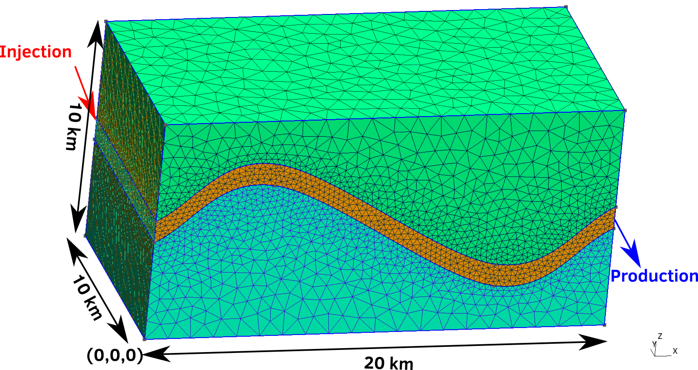

.. _TutorialFieldCase:

#########################################
Running a simple field cases from scratch
#########################################

In this tutorial, we present how to run a field case by incorporating iteratively different
physics, from a simple flow problem in a continuous media to a coupled poromechanics one
in a fractured media.

We will detailed the way the input XML files need to be written in order to run those
simulations.

In GEOSX, all the simulations parameters have to appear in a XML file, between the XML tags

.. code-block:: xml

  <?xml version="1.0" ?>
  <Problem>
   ...
  </Problem>

*****************
Domain definition
*****************

We consider the following mesh that will be the support for the simulations to come.

This mesh is composed of three different continuous regions.

  - Top region (overburden, elementary tag = 1)
  - Middle region (reservoir layer, elementary tag = 2)
  - Bottom region (underburden, elementary tag = 3)

The mesh is defined in the GMSH file format (see :ref:`Meshes` for more information on
the supported mesh file format). Each tetrahedra has an elementary tag associated.

.. note::
  GMSH file format is numbering its tags starting from 1. In GEOSX, the numbering
  of the ``CellElementRegion`` starts from 0. As a consequence, when the regions
  will be defined in GEOSX, we have to substract 1 from the GMSH tag to refer
  to the same region. The next sections of this tutorial will illustrate this.

***************************
Importing the mesh in GEOSX
***************************

The mesh has to be defined using the Mesh tag (see :ref:`Meshes`). For this problem, we
will use the ``PAMELAMeshGenerator`` to load the mesh (see :ref:`ImportingExternalMesh`).
The syntax is very simple : only the file path (that is relative to the location of the
XML file) and the name of the mesh (that can modified to whatever the user want) need to
be set.

.. literalinclude:: ../../../../coreComponents/physicsSolvers/multiphysics/integratedTests/FieldCaseTutorial1.xml
  :language: xml
  :start-after: <!-- SPHINX_FIELD_CASE_MESH -->
  :end-before: <!-- SPHINX_FIELD_CASE_MESH_END -->

.. note::
  We present in this tutorial the XML blocks in a specific order for the sake of clarity of the explainations. Please
  keep in mind that this order can be whatever you want.

************************
Running flow simulations
************************

In this part, we will present how to run simple flow simulations to demonstrate the
GEOSX capabilities to handle reservoir simulations.
To ease the demonstration, we make the assumption that the overburden and the underburden are impermeable, the flow only happen in the reservoir. There is two ways to achieve that.

The first solution is to define a unique ``CellElementRegion`` corresponding to the reservoir.

.. code-block:: xml

  <ElementRegion>
    <CellElementRegion name="ReservoirLayer"
                       cellBlocks="{1_TETRA}"
                       materialList="{water, rock}">
  </ElementRegion>

The second solution is to define all the ``CellElementRegions`` as they are in the GMSH file,
but defining the solvers only on the reservoir layer. In this case, the ``ElementRegion`` tag
is :

.. literalinclude:: ../../../../coreComponents/physicsSolvers/multiphysics/integratedTests/FieldCaseTutorial1.xml
  :language: xml
  :start-after: <!-- SPHINX_FIELD_CASE_REGION -->
  :end-before: <!-- SPHINX_FIELD_CASE_REGION_END -->

We choose the latest in order to keep the burdens for the visualization.

.. note::
  It is possible to define three ``CellElementRegion`` by separating the overburden from
  the underburden

.. note::
  The material list here was set for a single phase flow problem. This list is subject
  to change if the problem is not a single phase flow problem.

Single Phase Flow, no well
==========================

In this first section, we will present how to run a basic flow simulation in the reservoir layer.
We do not consider any coupling with wells. The injection and production will be mimiced by
imposing a high pressure in the cells close to the injection area and a low pressure
in the cells close to the production area.

Material definition
-------------------

We first simulate a single phase flow in the reservoir layer. We define the two materials
involved in the simulation : the only fluid (water) and the solid (rock).

.. literalinclude:: ../../../../coreComponents/physicsSolvers/multiphysics/integratedTests/FieldCaseTutorial1.xml
  :language: xml
  :start-after: <!-- SPHINX_FIELD_CASE_CONSTITUTIVE -->
  :end-before: <!-- SPHINX_FIELD_CASE_CONSTITUTIVE_END -->

The constitutive parameters such as the density, the viscosity, the compressibility etc. can
be modified here using the International System of Units. 

.. note::
  To consider an incompressible fluid, the user has to set the compressibility to 0.

Numerical methods settings
--------------------------

Once the materials are defined, we define the numerical method that will be used in the solver.
We propose to use the classical two-point flux approximation scheme.

.. literalinclude:: ../../../../coreComponents/physicsSolvers/multiphysics/integratedTests/FieldCaseTutorial1.xml
  :language: xml
  :start-after: <!-- SPHINX_FIELD_CASE_NUMERICAL -->
  :end-before: <!-- SPHINX_FIELD_CASE_NUMERICAL_END -->

The ``TwoPointFluxApproximation`` node has to contain the primary field to be solved in
``fieldName``. For a flow problem it is the pressure.

Solver settings
---------------

The ``Solver`` XML tag is then set.

.. literalinclude:: ../../../../coreComponents/physicsSolvers/multiphysics/integratedTests/FieldCaseTutorial1.xml
  :language: xml
  :start-after: <!-- SPHINX_FIELD_CASE_SOLVER -->
  :end-before: <!-- SPHINX_FIELD_CASE_SOLVER_END -->

This node is crucial as it gather all the information previously defined. We use the classical
``SinglePhaseFVM`` (FVM for Finite Volume Method), with the two-points flux approximation
previously defined in the ``NumericalMethod`` tag. The ``targetRegions`` refers only
to the Reservoir, because we just want to solve the flow in this region. The ``fluidNames``
and ``solidNames`` refers to the previously defined materials in the ``Constitutive`` tag.

The ``NonlinearSolverParameters`` and ``LinearSolverParameters`` are then used to set the
numerical solver parameters such as the Newton tolerance and the maximum number of
iterations.

Defining geometry boxes
-----------------------

The geometry boxes are useful in order to flag some cells or nodes within it. We will use it
this GEOSX feature to mimic the injection and production.

.. literalinclude:: ../../../../coreComponents/physicsSolvers/multiphysics/integratedTests/FieldCaseTutorial1.xml
  :language: xml
  :start-after: <!-- SPHINX_FIELD_CASE_GEOMETRY -->
  :end-before: <!-- SPHINX_FIELD_CASE_GEOMETRY_END -->

In order to define a box, the user had to define ``xMax`` and ``xMin`` that are two opposite nodes of the box.

.. note::
  In the previous XML snippet, the box ``all`` includes the whole model. This box has to be defined for every problem
  involving the import of an external mesh

Field specification
-------------------

The next step is to specify fields, including:

  - The initial value (here, the pressure has to be initialized)
  - The static properties (here, we have to define the permeability tensor and the porosity)
  - The boundary conditions (here, the injection and production pressure have to be set)

.. literalinclude:: ../../../../coreComponents/physicsSolvers/multiphysics/integratedTests/FieldCaseTutorial1.xml
  :language: xml
  :start-after: <!-- SPHINX_FIELD_CASE_GEOMETRY -->
  :end-before: <!-- SPHINX_FIELD_CASE_GEOMETRY_END -->

You may note :

 - All static parameters and initial value fields have to present the ``initialCondition`` field set to ``1``.
 - The ``objectPath`` refers to the ``ÈlementRegion`` in which the field value has
 - The ``setName`` field points to the box previously defined to apply the fields. 
 - Tensors values has to be set component by component. GEOSX deals with a diagonal matrix for
   the permeability, so the three values of the permeability tensor are set individually
   using ``component`` field.
 - ``name`` and ``fieldName`` have a different meaning. ``name`` is used to give a name to the XML block. It has
   to be unique. ``fieldName`` is the name of the field register in GEOSX. This value has to be set carefully
   in accordance with the documentation of each solver.

Defining output
---------------

The ``Output`` XML tag is used to trigger the writing of visualization files. Here we propose
to write files natively readable by Paraview.

.. literalinclude:: ../../../../coreComponents/physicsSolvers/multiphysics/integratedTests/FieldCaseTutorial1.xml
  :language: xml
  :start-after: <!-- SPHINX_FIELD_CASE_OUTPUT -->
  :end-before: <!-- SPHINX_FIELD_CASE_OUTPUT_END -->

.. note::
  The ``name`` keyword defines the name of the output file.

Triggering events
-----------------

The final steps is to organize events so the simulation and the outputs can be triggered.

.. literalinclude:: ../../../../coreComponents/physicsSolvers/multiphysics/integratedTests/FieldCaseTutorial1.xml
  :language: xml
  :start-after: <!-- SPHINX_FIELD_CASE_EVENTS -->
  :end-before: <!-- SPHINX_FIELD_CASE_EVENTS_END -->

The ``Events`` tag is associated with the ``maxTime`` keyword defining the maximum time. If this time is
ever reached or exceeded, the simulation will end.

Two ``PeriodicEvent`` are then defined. The first one is associated with the solver. The  ``forceDt`` keyword
means that there will always be time-steps of 20 seconds. The second is associated with the output. The ``timeFrequency``
keyword means that it will be executed every 100 seconds. The ``targetExactTimestep`` is set to 1, meaning that
the Event Manager will impose this event will be triggered exactly every 100 seconds.

Lauching the simulation
-----------------------

The simulation can be launched with:

.. codeblock:: sh

  geosx -i FieldCaseTutorial1.xml

